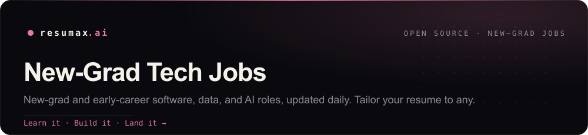

  

# New-Grad Tech Jobs

Open **new-grad** software, data, AI/ML, security, and hardware roles **posted in the last 30 days**, refreshed daily. We filter out senior, staff, and lead postings, dedupe across job boards, and drop anything older than 30 days, so the list stays fresh and actually open. Every role links into [ResuMax](https://resumax.ai/?utm_source=github&utm_medium=repo&utm_campaign=new-grad-tech-jobs&utm_content=intro), where **Atlas**, our AI career copilot, tailors your resume to it and preps you to ace the interview.

  

### A generic resume gets filtered. A tailored one gets the interview.

**[Tailor your resume to any role above &rarr;](https://resumax.ai/?utm_source=github&utm_medium=repo&utm_campaign=new-grad-tech-jobs&utm_content=cta-link)**

Atlas rewrites your resume to match each posting, scores it like a recruiter would, then runs you through the coding, system-design, and behavioral rounds so you walk in ready. Land the offer, not just the application.

**Found a role we're missing or a dead link?** [Open an issue](../../issues/new) and we'll fold it in.

## Open new-grad roles from the last 30 days

**2674** open roles from the last 30 days, newest first. Jump to a category:

**[Software Engineering](#software-engineering)** &nbsp;·&nbsp; 1464 open  
**[Data, AI & ML](#data-ai-and-ml)** &nbsp;·&nbsp; 652 open  
**[Security](#security)** &nbsp;·&nbsp; 100 open  
**[DevOps, Infra & Cloud](#devops-infra-and-cloud)** &nbsp;·&nbsp; 296 open  
**[Mobile](#mobile)** &nbsp;·&nbsp; 57 open  
**[Hardware & Embedded](#hardware-and-embedded)** &nbsp;·&nbsp; 105 open  

🌐 Remote &nbsp;·&nbsp; 🆕 Posted this week

## Software Engineering

| Company | Role | Location | Apply | Tailor | Age |
|---|---|---|:--:|:--:|--:|
| **[Anduril Industries](https://resumax.ai/companies/anduril-industries?utm_source=github&utm_medium=repo&utm_campaign=new-grad-tech-jobs)** 🆕 | EMC Design Engineer, Autonomous Air Vehicles | Costa Mesa, California, United States | [Apply](https://boards.greenhouse.io/andurilindustries/jobs/5155872007?gh_jid=5155872007) |  | 0d |
| **[Eurofins](https://resumax.ai/companies/eurofins?utm_source=github&utm_medium=repo&utm_campaign=new-grad-tech-jobs)** 🆕 | Software Engineer | Bengaluru, KA, in | [Apply](https://jobs.smartrecruiters.com/eurofins/744000134248550) |  | 0d |
| **[Wabcon](https://resumax.ai/companies/wabcon?utm_source=github&utm_medium=repo&utm_campaign=new-grad-tech-jobs)** 🆕 | Softwareexpert:in ROCKET SCIENCE, Python, C, C++ -… | Dresden | [Apply](https://www.arbeitnow.com/jobs/companies/wabcon/softwareexpertin-rocket-science-python-c-c-satellitenkommunikation-hybrid-dresden-60000-80000-495136) |  | 0d |
| **[Sopra Steria](https://resumax.ai/companies/sopra-steria?utm_source=github&utm_medium=repo&utm_campaign=new-grad-tech-jobs)** 🆕 | Backend Developer Java (m/w/d) | bundesweit, de | [Apply](https://jobs.smartrecruiters.com/soprasteria1/744000134237459) |  | 0d |
| **[Bosch Group](https://resumax.ai/companies/bosch-group?utm_source=github&utm_medium=repo&utm_campaign=new-grad-tech-jobs)** 🆕 | Full stack (Angular & C#) | hosur road bangalore, in | [Apply](https://jobs.smartrecruiters.com/boschgroup/744000134223506) |  | 0d |
| **[PA Consulting](https://resumax.ai/companies/pa-consulting?utm_source=github&utm_medium=repo&utm_campaign=new-grad-tech-jobs)** 🆕 | Managing Consultant - Software Engineering | Bristol, England, gb +3 more | [Apply](https://jobs.smartrecruiters.com/paconsulting/744000134222991) |  | 0d |
| **[Western Digital](https://resumax.ai/companies/western-digital?utm_source=github&utm_medium=repo&utm_campaign=new-grad-tech-jobs)** 🆕 | Software & Hardwar Development Engineer (Manufacturing… | BangPa-in, PHRA NAKHON SI AYUTTHAYA, th | [Apply](https://jobs.smartrecruiters.com/westerndigital/744000134217069) |  | 0d |
| **[Point72](https://resumax.ai/companies/point72?utm_source=github&utm_medium=repo&utm_campaign=new-grad-tech-jobs)** 🆕 | Software Engineer, Controllers Technology | Bengaluru, India | [Apply](https://boards.greenhouse.io/point72/jobs/8568265002?gh_jid=8568265002) |  | 0d |
| **[Smiths Group](https://resumax.ai/companies/smiths-group?utm_source=github&utm_medium=repo&utm_campaign=new-grad-tech-jobs)** 🆕 | Engineer - Programmer | Bengaluru, KA, in | [Apply](https://jobs.smartrecruiters.com/smithsgroup2/744000134201899) |  | 0d |
| **[Aircall](https://resumax.ai/companies/aircall?utm_source=github&utm_medium=repo&utm_campaign=new-grad-tech-jobs)** 🆕 | Software Engineer - Outbound Campaigns | Madrid Office | [Apply](https://jobs.lever.co/aircall/0f430b14-c3e0-4b76-ba37-69b103c62ddb/apply) |  | 0d |
| **[Nice](https://resumax.ai/companies/nice?utm_source=github&utm_medium=repo&utm_campaign=new-grad-tech-jobs)** 🆕 | Professional Services Engineer, Actimize(PL/SQL Developer, BFSI) | India - Pune | [Apply](https://boards.eu.greenhouse.io/nice/jobs/4906809101?gh_jid=4906809101) |  | 0d |
| **[Lucidmotors](https://resumax.ai/companies/lucidmotors?utm_source=github&utm_medium=repo&utm_campaign=new-grad-tech-jobs)** 🆕 | Vehicle Software Support Engineer | King Abdullah Economic City, 02 | [Apply](https://job-boards.greenhouse.io/lucidmotors/jobs/5092972007) |  | 0d |
| **[MY Humancapital GmbH](https://resumax.ai/companies/my-humancapital-gmbh?utm_source=github&utm_medium=repo&utm_campaign=new-grad-tech-jobs)** 🆕 | Testmanager Software und Systemtests (m/w/d) | Munich | [Apply](https://www.arbeitnow.com/jobs/companies/my-humancapital-gmbh/testmanager-software-und-systemtests-munich-360351) |  | 0d |
| **[TECOSIM GmbH](https://resumax.ai/companies/tecosim-gmbh?utm_source=github&utm_medium=repo&utm_campaign=new-grad-tech-jobs)** 🆕 | Softwareentwickler für Testsysteme (all genders) | München | [Apply](https://www.arbeitnow.com/jobs/companies/tecosim-gmbh/softwareentwickler-fur-testsysteme-all-genders-munchen-3925) |  | 0d |
| **[Corning](https://resumax.ai/companies/corning?utm_source=github&utm_medium=repo&utm_campaign=new-grad-tech-jobs)** 🆕 | Software Engineer - CMMS Systems | Elmira, NY | [Apply](https://corningjobs.corning.com/job/Corning-Software-Engineer-(CMMS-Systems)-NY-14831/1403127800/?ats=successfactors) |  | 0d |
| **[Crusoe](https://resumax.ai/companies/crusoe?utm_source=github&utm_medium=repo&utm_campaign=new-grad-tech-jobs)** 🆕 | Software Engineer II, Managed Platform Services | San Francisco, CA - US | [Apply](https://jobs.ashbyhq.com/crusoe/d4287b1b-c78b-44fb-bd2b-d2cca26cdc2a/application) |  | 1d |
| **[Valsoft Corporation](https://resumax.ai/companies/valsoft-corporation?utm_source=github&utm_medium=repo&utm_campaign=new-grad-tech-jobs)** 🆕 | Intermediate Software Developer - COTT | — | [Apply](https://apply.workable.com/j/34272254F7/apply) |  | 1d |
| **[Qode](https://resumax.ai/companies/qode?utm_source=github&utm_medium=repo&utm_campaign=new-grad-tech-jobs)** 🆕 | Application Developer | — | [Apply](https://apply.workable.com/j/1C435902A9/apply) |  | 1d |
| **[Anduril Industries](https://resumax.ai/companies/anduril-industries?utm_source=github&utm_medium=repo&utm_campaign=new-grad-tech-jobs)** 🆕 | Software Engineer, Sensor Simulation | Costa Mesa, California, United States · Seattle, Washington, United States | [Apply](https://boards.greenhouse.io/andurilindustries/jobs/5160996007?gh_jid=5160996007) |  | 0d |
| **[Sopra Steria](https://resumax.ai/companies/sopra-steria?utm_source=github&utm_medium=repo&utm_campaign=new-grad-tech-jobs)** 🆕 | Développeur(euse) Expert – Java Fullstack -  Services Publics -… | Courbevoie, IDF, fr | [Apply](https://jobs.smartrecruiters.com/soprasteria1/744000134194416) |  | 0d |
| **[Bosch Group](https://resumax.ai/companies/bosch-group?utm_source=github&utm_medium=repo&utm_campaign=new-grad-tech-jobs)** 🆕 | Backend Entwickler C#/.NET (w/m/div.) | Linz, Oberösterreich, at | [Apply](https://jobs.smartrecruiters.com/boschgroup/744000134221809) |  | 0d |
| **[Western Digital](https://resumax.ai/companies/western-digital?utm_source=github&utm_medium=repo&utm_campaign=new-grad-tech-jobs)** 🆕 | Technologies, Product Design Engineering | George Town, Penang, my | [Apply](https://jobs.smartrecruiters.com/westerndigital/744000134187698) |  | 0d |
| **[Anduril Industries](https://resumax.ai/companies/anduril-industries?utm_source=github&utm_medium=repo&utm_campaign=new-grad-tech-jobs)** 🆕 | Mission Software Engineer | London, England, United Kingdom | [Apply](https://boards.greenhouse.io/andurilindustries/jobs/5168518007?gh_jid=5168518007) |  | 0d |
| **[Bosch Group](https://resumax.ai/companies/bosch-group?utm_source=github&utm_medium=repo&utm_campaign=new-grad-tech-jobs)** 🆕 | Angular Developer | hosur road bangalore, in | [Apply](https://jobs.smartrecruiters.com/boschgroup/744000134217834) |  | 0d |
| **[Western Digital](https://resumax.ai/companies/western-digital?utm_source=github&utm_medium=repo&utm_campaign=new-grad-tech-jobs)** 🆕 | Engineer, Product Design Engineering - PCBA | Petaling Jaya, Selangor, my | [Apply](https://jobs.smartrecruiters.com/westerndigital/744000134042959) |  | 0d |
| **[Anduril Industries](https://resumax.ai/companies/anduril-industries?utm_source=github&utm_medium=repo&utm_campaign=new-grad-tech-jobs)** 🆕 | Software Engineer, Robotics Tracking and Fusion | Washington, District of Columbia, United States +2 more | [Apply](https://boards.greenhouse.io/andurilindustries/jobs/5153784007?gh_jid=5153784007) |  | 0d |
| **[Bosch Group](https://resumax.ai/companies/bosch-group?utm_source=github&utm_medium=repo&utm_campaign=new-grad-tech-jobs)** 🆕 | Full-Stack Entwickler .NET/Angular (w/m/div.) | Linz, Oberösterreich, at | [Apply](https://jobs.smartrecruiters.com/boschgroup/744000134220069) |  | 0d |
| **[Anduril Industries](https://resumax.ai/companies/anduril-industries?utm_source=github&utm_medium=repo&utm_campaign=new-grad-tech-jobs)** 🆕 | Structures Design Engineer, Omen | Costa Mesa, California, United States | [Apply](https://boards.greenhouse.io/andurilindustries/jobs/5147041007?gh_jid=5147041007) |  | 0d |
| **[Bosch Group](https://resumax.ai/companies/bosch-group?utm_source=github&utm_medium=repo&utm_campaign=new-grad-tech-jobs)** 🆕 | VM Brakes BSW Developer Indian OEM | pune, in · coimbatore, in | [Apply](https://jobs.smartrecruiters.com/boschgroup/744000134215159) |  | 0d |
| **[Anduril Industries](https://resumax.ai/companies/anduril-industries?utm_source=github&utm_medium=repo&utm_campaign=new-grad-tech-jobs)** 🆕 | Dev Infra Software Engineer, Air Defense | Irvine, California, United States | [Apply](https://boards.greenhouse.io/andurilindustries/jobs/5150887007?gh_jid=5150887007) |  | 0d |
| **[Bosch Group](https://resumax.ai/companies/bosch-group?utm_source=github&utm_medium=repo&utm_campaign=new-grad-tech-jobs)** 🆕 | Explore Career Opportunities at Bosch Global Software… | Ho Chi Minh city, vn | [Apply](https://jobs.smartrecruiters.com/boschgroup/744000134191949) |  | 0d |
| **[Anduril Industries](https://resumax.ai/companies/anduril-industries?utm_source=github&utm_medium=repo&utm_campaign=new-grad-tech-jobs)** 🆕 | Mission Software Engineer, Intelligence Systems | Reston, Virginia, United States | [Apply](https://boards.greenhouse.io/andurilindustries/jobs/5156713007?gh_jid=5156713007) |  | 0d |
| **[Bosch Group](https://resumax.ai/companies/bosch-group?utm_source=github&utm_medium=repo&utm_campaign=new-grad-tech-jobs)** 🆕 | MS/EBA-VM - Algorithm SW ASW Developer for Braking Systems… | coimbatore, in · bangalore, in | [Apply](https://jobs.smartrecruiters.com/boschgroup/744000134180320) |  | 0d |
| **[Anduril Industries](https://resumax.ai/companies/anduril-industries?utm_source=github&utm_medium=repo&utm_campaign=new-grad-tech-jobs)** 🆕 | Robotics Software Engineer, Behaviors | Costa Mesa, California, United States | [Apply](https://boards.greenhouse.io/andurilindustries/jobs/5134999007?gh_jid=5134999007) |  | 0d |
| **[Bosch Group](https://resumax.ai/companies/bosch-group?utm_source=github&utm_medium=repo&utm_campaign=new-grad-tech-jobs)** 🆕 | MS/EBA-VM - Algorithm SW (ASW) Developer for Braking Systems… | bangalore, in | [Apply](https://jobs.smartrecruiters.com/boschgroup/744000134180689) |  | 0d |
| **[Anduril Industries](https://resumax.ai/companies/anduril-industries?utm_source=github&utm_medium=repo&utm_campaign=new-grad-tech-jobs)** 🆕 | Robotics & Simulation Engineer, Discovery | Costa Mesa, California, United States | [Apply](https://boards.greenhouse.io/andurilindustries/jobs/5136834007?gh_jid=5136834007) |  | 0d |
| **[Bosch Group](https://resumax.ai/companies/bosch-group?utm_source=github&utm_medium=repo&utm_campaign=new-grad-tech-jobs)** 🆕 | VM Brakes BSW CAN Developer Indian OEM | coimbatore, in | [Apply](https://jobs.smartrecruiters.com/boschgroup/744000134179484) |  | 0d |
| **[Anduril Industries](https://resumax.ai/companies/anduril-industries?utm_source=github&utm_medium=repo&utm_campaign=new-grad-tech-jobs)** 🆕 | Developer Experience Engineer | Costa Mesa, California, United States · Seattle, Washington, United States | [Apply](https://boards.greenhouse.io/andurilindustries/jobs/5136434007?gh_jid=5136434007) |  | 0d |
| **[Bosch Group](https://resumax.ai/companies/bosch-group?utm_source=github&utm_medium=repo&utm_campaign=new-grad-tech-jobs)** 🆕 | VM Brakes -  Algorithm Software Developer Indian OEM | pune, in | [Apply](https://jobs.smartrecruiters.com/boschgroup/744000134179509) |  | 0d |
| **[Anduril Industries](https://resumax.ai/companies/anduril-industries?utm_source=github&utm_medium=repo&utm_campaign=new-grad-tech-jobs)** 🆕 | Software Engineer, Tooling | Fort Collins, Colorado, United States | [Apply](https://boards.greenhouse.io/andurilindustries/jobs/5131150007?gh_jid=5131150007) |  | 0d |
| **[Bosch Group](https://resumax.ai/companies/bosch-group?utm_source=github&utm_medium=repo&utm_campaign=new-grad-tech-jobs)** 🆕 | Praktikum Data Analysis & Software-Engineering UX | Stuttgart, BW, de | [Apply](https://jobs.smartrecruiters.com/boschgroup/744000134175009) |  | 0d |
| **[Bosch Group](https://resumax.ai/companies/bosch-group?utm_source=github&utm_medium=repo&utm_campaign=new-grad-tech-jobs)** 🆕 | VM Brakes - ASW Algorithm Software Developer [Indian OEM] | coimbatore, in | [Apply](https://jobs.smartrecruiters.com/boschgroup/744000134173734) |  | 0d |
| **[Woongjin, Inc](https://resumax.ai/companies/woongjin-inc?utm_source=github&utm_medium=repo&utm_campaign=new-grad-tech-jobs)** 🆕 | Java Developer- Bilingual (English/ Korean) | Duluth, GA, us | [Apply](https://jobs.smartrecruiters.com/wjcompany/744000134041629) |  | 1d |
| **[Accenturefederalservices](https://resumax.ai/companies/accenturefederalservices?utm_source=github&utm_medium=repo&utm_campaign=new-grad-tech-jobs)** 🆕 | Software Engineer (Java, OpenFGA) | Arlington, VA | [Apply](https://boards.greenhouse.io/accenturefederalservices/jobs/4670863006?gh_jid=4670863006) |  | 1d |
| **[Matx](https://resumax.ai/companies/matx?utm_source=github&utm_medium=repo&utm_campaign=new-grad-tech-jobs)** 🆕 | Software Engineer - Simulators | Mountain View, CA | [Apply](https://job-boards.greenhouse.io/matx/jobs/4102858008) |  | 1d |
| **[Verkada](https://resumax.ai/companies/verkada?utm_source=github&utm_medium=repo&utm_campaign=new-grad-tech-jobs)** 🆕 | Backend Engineer - Access Control | San Mateo, CA United States | [Apply](https://job-boards.greenhouse.io/verkada/jobs/4915101007) |  | 1d |
| **[Spacex](https://resumax.ai/companies/spacex?utm_source=github&utm_medium=repo&utm_campaign=new-grad-tech-jobs)** 🆕 | Software Engineer, Network Observability (Starlink) | Hawthorne, CA | [Apply](https://boards.greenhouse.io/spacex/jobs/8577262002?gh_jid=8577262002) |  | 1d |
| **[Betterhelpcom](https://resumax.ai/companies/betterhelpcom?utm_source=github&utm_medium=repo&utm_campaign=new-grad-tech-jobs)** 🌐 🆕 | Full Stack Software Engineer | US - Remote | [Apply](https://job-boards.greenhouse.io/betterhelpcom/jobs/5277629008) |  | 1d |
| **[Sonyinteractiveentertainment Global](https://resumax.ai/companies/sonyinteractiveentertainment-global?utm_source=github&utm_medium=repo&utm_campaign=new-grad-tech-jobs)** 🆕 | Software Engineer II | United States, San Mateo, CA | [Apply](https://job-boards.greenhouse.io/sonyinteractiveentertainmentglobal/jobs/6101023004) |  | 1d |
| **[Speechify](https://resumax.ai/companies/speechify?utm_source=github&utm_medium=repo&utm_campaign=new-grad-tech-jobs)** 🆕 | Software Engineer, Platform - Berlin, Germany | Berlin, Berlin, Germany | [Apply](https://www.arbeitnow.com/jobs/companies/speechify/software-engineer-platform-berlin-germany-468519) |  | 1d |
| **[Experian](https://resumax.ai/companies/experian?utm_source=github&utm_medium=repo&utm_campaign=new-grad-tech-jobs)** 🆕 | Analista de Desenvolvimento de Software II | São Paulo, br · Blumenau, br | [Apply](https://jobs.smartrecruiters.com/experian/744000134030549) |  | 1d |
| **[Eurofins](https://resumax.ai/companies/eurofins?utm_source=github&utm_medium=repo&utm_campaign=new-grad-tech-jobs)** 🆕 | Pharmaceutical Data Review Scientist | Portage, MI, us | [Apply](https://jobs.smartrecruiters.com/eurofins/744000134028509) |  | 1d |
| **[AbbVie](https://resumax.ai/companies/abbvie?utm_source=github&utm_medium=repo&utm_campaign=new-grad-tech-jobs)** 🆕 | Software Instrumentation Engineer | Madison, WI, us | [Apply](https://jobs.smartrecruiters.com/abbvie/3743990013776436) |  | 1d |
| **[Imc](https://resumax.ai/companies/imc?utm_source=github&utm_medium=repo&utm_campaign=new-grad-tech-jobs)** 🆕 | Quant Developer CeFi - Digital Assets | Zug, Switzerland | [Apply](https://job-boards.eu.greenhouse.io/imc/jobs/4637268101) |  | 1d |
| **[Instacart](https://resumax.ai/companies/instacart?utm_source=github&utm_medium=repo&utm_campaign=new-grad-tech-jobs)** 🌐 🆕 | Forward Deployed Engineer | United States - Remote · Canada - Remote (ON, AB, BC, or NS Only) | [Apply](https://instacart.careers/job/?gh_jid=7989205) |  | 1d |
| **[J.S. Held LLC](https://resumax.ai/companies/j-s-held-llc?utm_source=github&utm_medium=repo&utm_campaign=new-grad-tech-jobs)** 🆕 | Design Engineer | Toronto, ON, ca | [Apply](https://jobs.smartrecruiters.com/jsheldllc/744000134027132) |  | 1d |
| **[Robinhood](https://resumax.ai/companies/robinhood?utm_source=github&utm_medium=repo&utm_campaign=new-grad-tech-jobs)** 🆕 | Salesforce Applications Developer | Toronto, Canada | [Apply](https://boards.greenhouse.io/robinhood/jobs/7729315?t=gh_src=&gh_jid=7729315) |  | 1d |
| **[Altentechnologyusa](https://resumax.ai/companies/altentechnologyusa?utm_source=github&utm_medium=repo&utm_campaign=new-grad-tech-jobs)** 🆕 | Software Simulation Engineer | North Reading, MA | [Apply](https://job-boards.greenhouse.io/altentechnologyusa/jobs/5130022007) |  | 1d |
| **[Jobsatphamily](https://resumax.ai/companies/jobsatphamily?utm_source=github&utm_medium=repo&utm_campaign=new-grad-tech-jobs)** 🆕 | Software Engineer (Healthcare Cloud & Interoperability) | new york, new york | [Apply](https://job-boards.greenhouse.io/jobsatphamily/jobs/5277116008) |  | 1d |
| **[Flexport](https://resumax.ai/companies/flexport?utm_source=github&utm_medium=repo&utm_campaign=new-grad-tech-jobs)** 🆕 | Software Engineer Ⅰ | Shenzhen, China | [Apply](https://boards.greenhouse.io/flexport/jobs/7978696?gh_jid=7978696) |  | 1d |
| **[3pillar Global](https://resumax.ai/companies/3pillar-global?utm_source=github&utm_medium=repo&utm_campaign=new-grad-tech-jobs)** 🆕 | Python Software Engineer | Mexico +2 more | [Apply](https://jobs.lever.co/3pillarglobal/51578abb-3a88-4632-8927-3604b151d305/apply) |  | 1d |
| **[Dillards](https://resumax.ai/companies/dillards?utm_source=github&utm_medium=repo&utm_campaign=new-grad-tech-jobs)** 🆕 | Full Stack Developer | Little Rock, AR | [Apply](https://job-boards.greenhouse.io/dillards/jobs/5172592007) |  | 1d |
| **[Brex](https://resumax.ai/companies/brex?utm_source=github&utm_medium=repo&utm_campaign=new-grad-tech-jobs)** 🆕 | Software Engineer II, Backend | Seattle, Washington, United States +4 more | [Apply](https://www.brex.com/careers/8606540002?gh_jid=8606540002) |  | 1d |
| **[Genmo](https://resumax.ai/companies/genmo?utm_source=github&utm_medium=repo&utm_campaign=new-grad-tech-jobs)** 🆕 | Research Engineer (New Grad) | San Francisco HQ | [Apply](https://jobs.ashbyhq.com/genmo/9b5477f4-97af-4aaa-b855-910c982ce191/application) |  | 1d |
| **[Thoughtworksreferral](https://resumax.ai/companies/thoughtworksreferral?utm_source=github&utm_medium=repo&utm_campaign=new-grad-tech-jobs)** 🆕 | Software Engineer (Java) | Ho Chi Minh City, Vietnam | [Apply](https://job-boards.greenhouse.io/thoughtworksreferral/jobs/7912304) |  | 1d |
| **[Industrialelectricmanufacturing](https://resumax.ai/companies/industrialelectricmanufacturing?utm_source=github&utm_medium=repo&utm_campaign=new-grad-tech-jobs)** 🆕 | CNC Programmer | Fremont, California, United States | [Apply](https://job-boards.greenhouse.io/industrialelectricmanufacturing/jobs/4295879009) |  | 1d |
| **[Sopra Steria](https://resumax.ai/companies/sopra-steria?utm_source=github&utm_medium=repo&utm_campaign=new-grad-tech-jobs)** 🆕 | (Junior) Teammanager – Automatisierung und Softwareentwicklung… | Hamburg, HH, de | [Apply](https://jobs.smartrecruiters.com/soprasteria1/744000133979189) |  | 1d |
| **[Radius Limited](https://resumax.ai/companies/radius-limited?utm_source=github&utm_medium=repo&utm_campaign=new-grad-tech-jobs)** 🆕 | Software Engineer - Next.js and Laravel | Crewe, England, gb | [Apply](https://jobs.smartrecruiters.com/radiuslimited/744000133977769) |  | 1d |
| **[Netcompany](https://resumax.ai/companies/netcompany?utm_source=github&utm_medium=repo&utm_campaign=new-grad-tech-jobs)** 🆕 | Software Developer (.NET) | Leeds, England, gb · London, England, gb | [Apply](https://jobs.smartrecruiters.com/netcompany1/744000133974293) |  | 1d |
| **[Astronomer](https://resumax.ai/companies/astronomer?utm_source=github&utm_medium=repo&utm_campaign=new-grad-tech-jobs)** 🌐 🆕 | Customer Reliability Engineer, Airflow | Remote (United States) | [Apply](https://jobs.ashbyhq.com/astronomer/ae0513b0-edc7-46da-bfeb-70f098e9cbb3/application) |  | 1d |
| **[Ifs](https://resumax.ai/companies/ifs?utm_source=github&utm_medium=repo&utm_campaign=new-grad-tech-jobs)** 🆕 | Full Stack Engineer - IFS Zero | London, England, gb | [Apply](https://jobs.smartrecruiters.com/ifs1/744000133971439) |  | 1d |
| **[Graphcore](https://resumax.ai/companies/graphcore?utm_source=github&utm_medium=repo&utm_campaign=new-grad-tech-jobs)** 🆕 | Software Engineer in Build Engineering | London, UK +3 more | [Apply](https://job-boards.greenhouse.io/graphcore/jobs/8605755002) |  | 1d |
| **[NielsenIQ](https://resumax.ai/companies/nielseniq?utm_source=github&utm_medium=repo&utm_campaign=new-grad-tech-jobs)** 🆕 | Software Engineer | Ciudad de México, Mexico City, mx +2 more | [Apply](https://jobs.smartrecruiters.com/nielseniq/744000133965819) |  | 1d |
| **[Wyetechllc](https://resumax.ai/companies/wyetechllc?utm_source=github&utm_medium=repo&utm_campaign=new-grad-tech-jobs)** 🆕 | Software Engineer 1 | Laurel, Maryland · Annapolis Junction, Maryland | [Apply](https://jobs.lever.co/wyetechllc/afdaaf60-9a49-4930-beb8-c68be4fd5f16/apply) |  | 1d |
| **[Sentry Insurance](https://resumax.ai/companies/sentry-insurance?utm_source=github&utm_medium=repo&utm_campaign=new-grad-tech-jobs)** 🆕 | Software Developer | Plover, WI | [Apply](https://sentryinsurance.wd1.myworkdayjobs.com/en-US/SentryCareers/job/Stevens-Point-WI/Software-Developer--Hybrid-Work-Model-_JR-142351) |  | 1d |
| **[Wmg](https://resumax.ai/companies/wmg?utm_source=github&utm_medium=repo&utm_campaign=new-grad-tech-jobs)** 🆕 | Frontend Engineer | Bangalore · Toronto, Ontario | [Apply](https://jobs.lever.co/wmg/f2ca2a30-ed0b-4062-a6a5-242198fd207a/apply) |  | 1d |
| **[Torc Robotics](https://resumax.ai/companies/torc-robotics?utm_source=github&utm_medium=repo&utm_campaign=new-grad-tech-jobs)** 🆕 | Software Engineer II - Localization | Ann Arbor, MI | [Apply](https://job-boards.greenhouse.io/torcrobotics/jobs/8597758002) |  | 1d |
| **[Grahamcapitalmanagement](https://resumax.ai/companies/grahamcapitalmanagement?utm_source=github&utm_medium=repo&utm_campaign=new-grad-tech-jobs)** 🆕 | Middle Office Software Developer | Norwalk, Connecticut, United States | [Apply](https://boards.greenhouse.io/grahamcapitalmanagement/jobs/4708819005?gh_jid=4708819005) |  | 1d |
| **[Smiths Group](https://resumax.ai/companies/smiths-group?utm_source=github&utm_medium=repo&utm_campaign=new-grad-tech-jobs)** 🆕 | Reliability Engineer | Falconara Marittima, Marche, it · Sepang, Selangor, my | [Apply](https://jobs.smartrecruiters.com/smithsgroup2/744000133935670) |  | 1d |
| **[Continental](https://resumax.ai/companies/continental?utm_source=github&utm_medium=repo&utm_campaign=new-grad-tech-jobs)** 🆕 | Software Engineer – Data Platform | Bengaluru, KA, in | [Apply](https://jobs.smartrecruiters.com/continental/744000133932799) |  | 1d |
| **[Point72](https://resumax.ai/companies/point72?utm_source=github&utm_medium=repo&utm_campaign=new-grad-tech-jobs)** 🆕 | Software Engineer, Enterprise Systems | Warsaw | [Apply](https://boards.greenhouse.io/point72/jobs/8452387002?gh_jid=8452387002) |  | 1d |
| **[Gitlab](https://resumax.ai/companies/gitlab?utm_source=github&utm_medium=repo&utm_campaign=new-grad-tech-jobs)** 🌐 🆕 | Forward Deployed Engineer - META | Remote, United Arab Emirates | [Apply](https://job-boards.greenhouse.io/gitlab/jobs/8524783002) |  | 1d |
| **[Airbnb](https://resumax.ai/companies/airbnb?utm_source=github&utm_medium=repo&utm_campaign=new-grad-tech-jobs)** 🆕 | Software Engineer, BizTech(Python, LLM, GenAI, MCP) | Bangalore, India | [Apply](https://careers.airbnb.com/positions/7902817?gh_jid=7902817) |  | 1d |
| **[Broeder Ruckh Consulting GmbH](https://resumax.ai/companies/broeder-ruckh-consulting-gmbh?utm_source=github&utm_medium=repo&utm_campaign=new-grad-tech-jobs)** 🆕 | Softwareentwickler (gn) C# und Cloud | Stuttgart | [Apply](https://www.arbeitnow.com/jobs/companies/broeder-ruckh-consulting-gmbh/softwareentwickler-gn-c-und-cloud-stuttgart-388400) |  | 1d |
| **[Posthog](https://resumax.ai/companies/posthog?utm_source=github&utm_medium=repo&utm_campaign=new-grad-tech-jobs)** 🌐 🆕 | Backend Engineer - Europe/UK Timezone | Remote (EMEA) | [Apply](https://jobs.ashbyhq.com/posthog/4bef8fa2-9476-48e4-b7df-1099a571d41c/application) |  | 1d |
| **[Anduril Industries](https://resumax.ai/companies/anduril-industries?utm_source=github&utm_medium=repo&utm_campaign=new-grad-tech-jobs)** 🆕 | Software Engineer, Intelligence Systems | Reston, Virginia, United States | [Apply](https://boards.greenhouse.io/andurilindustries/jobs/5064165007?gh_jid=5064165007) |  | 1d |
| **[Nice](https://resumax.ai/companies/nice?utm_source=github&utm_medium=repo&utm_campaign=new-grad-tech-jobs)** 🆕 | Software Engineer, CX | India - Pune | [Apply](https://boards.eu.greenhouse.io/nice/jobs/4882273101?gh_jid=4882273101) |  | 1d |
| **[The Nielsen Company](https://resumax.ai/companies/the-nielsen-company?utm_source=github&utm_medium=repo&utm_campaign=new-grad-tech-jobs)** 🆕 | Zendesk Developer | Mumbai, in | [Apply](https://jobs.smartrecruiters.com/thenielsencompany/3743990013760146) |  | 1d |
| **[Notion](https://resumax.ai/companies/notion?utm_source=github&utm_medium=repo&utm_campaign=new-grad-tech-jobs)** 🌐 🆕 | Software Engineer, Developer Experience | Hyderabad, India | [Apply](https://jobs.ashbyhq.com/notion/49bdf081-6e20-4323-8c73-6d6b19544ff5/application) |  | 1d |
| **[Affirm](https://resumax.ai/companies/affirm?utm_source=github&utm_medium=repo&utm_campaign=new-grad-tech-jobs)** 🌐 🆕 | Software Engineer II, Back-end (Card Mgmt & Transaction… | Remote US · Remote Canada | [Apply](https://job-boards.greenhouse.io/affirm/jobs/7766277003) |  | 1d |
| **[Jobs for Humanity](https://resumax.ai/companies/jobs-for-humanity?utm_source=github&utm_medium=repo&utm_campaign=new-grad-tech-jobs)** 🆕 | Python Developer - Riyadh | Riyadh, sa | [Apply](https://jobs.smartrecruiters.com/jobsforhumanity/744000133865750) |  | 1d |
| **[vedisys AG](https://resumax.ai/companies/vedisys-ag?utm_source=github&utm_medium=repo&utm_campaign=new-grad-tech-jobs)** 🆕 | Projektmanager für Softwareprodukte im ÖPNV (m/w/d) in Darmstadt | Griesheim | [Apply](https://www.arbeitnow.com/jobs/companies/vedisys-ag/projektmanager-fur-softwareprodukte-im-opnv-in-darmstadt-griesheim-434759) |  | 1d |
| **[TenMedia GmbH](https://resumax.ai/companies/tenmedia-gmbh?utm_source=github&utm_medium=repo&utm_campaign=new-grad-tech-jobs)** 🆕 | Projektkoordination Softwareprojekte (m/w/d) \| Berlin-Mitte \|… | Berlin | [Apply](https://www.arbeitnow.com/jobs/companies/tenmedia-gmbh/projektkoordination-softwareprojekte-berlin-mitte-teilzeit-vollzeit-107802) |  | 1d |
| **[Open AI](https://resumax.ai/companies/open-ai?utm_source=github&utm_medium=repo&utm_campaign=new-grad-tech-jobs)** 🆕 | Prototyping Lab Technician, Robotics | San Francisco | [Apply](https://jobs.ashbyhq.com/openai/9ba938cb-f0c3-4e01-a8ea-1019a8175201/application) |  | 1d |
| **[Mattel](https://resumax.ai/companies/mattel?utm_source=github&utm_medium=repo&utm_campaign=new-grad-tech-jobs)** 🆕 | Software Engineer Veeva | Hyderabad, in | [Apply](https://jobs.smartrecruiters.com/mattelinc/744000133857799) |  | 1d |
| **[Stripe](https://resumax.ai/companies/stripe?utm_source=github&utm_medium=repo&utm_campaign=new-grad-tech-jobs)** 🆕 | Backend Engineer, Privy | NYC-Privy | [Apply](https://stripe.com/jobs/search?gh_jid=7235875) |  | 1d |
| **[Onebrief](https://resumax.ai/companies/onebrief?utm_source=github&utm_medium=repo&utm_campaign=new-grad-tech-jobs)** 🌐 🆕 | Software Development Engineer in Test [Geospatial] | United States \| Remote | [Apply](https://jobs.ashbyhq.com/onebrief/8ee26b8a-97dd-4035-95e2-6ebe657fa59b/application) |  | 1d |
| **[Qualtrics](https://resumax.ai/companies/qualtrics?utm_source=github&utm_medium=repo&utm_campaign=new-grad-tech-jobs)** 🆕 | Software Engineer 1 - Core Topics Platform | Provo, UT | [Apply](https://www.qualtrics.com/careers/us/en/job/8018763?gh_jid=8018763) |  | 1d |
| **[Honeywell](https://resumax.ai/companies/honeywell?utm_source=github&utm_medium=repo&utm_campaign=new-grad-tech-jobs)** 🆕 | Application Engineer 1 | Mason, OH | [Apply](https://ibqbjb.fa.ocs.oraclecloud.com/hcmUI/CandidateExperience/en/sites/Honeywell/job/151139) |  | 1d |
| **[Mlabs](https://resumax.ai/companies/mlabs?utm_source=github&utm_medium=repo&utm_campaign=new-grad-tech-jobs)** 🆕 | Quant Developer Relations Engineer | — | [Apply](https://apply.workable.com/j/F0FEBB234B/apply) |  | 2d |
| **[Sigma Defense](https://resumax.ai/companies/sigma-defense?utm_source=github&utm_medium=repo&utm_campaign=new-grad-tech-jobs)** 🆕 | 1655 - Software Developer | — | [Apply](https://apply.workable.com/j/0ECC18E5C5/apply) |  | 2d |
| **[Qode](https://resumax.ai/companies/qode?utm_source=github&utm_medium=repo&utm_campaign=new-grad-tech-jobs)** 🆕 | Power BI Developer | — | [Apply](https://apply.workable.com/j/94C0ADA4D7/apply) |  | 2d |
| **[Valsoft Corporation](https://resumax.ai/companies/valsoft-corporation?utm_source=github&utm_medium=repo&utm_campaign=new-grad-tech-jobs)** 🌐 🆕 | Software Developer II | Remote | [Apply](https://apply.workable.com/j/CF94E6A072/apply) |  | 2d |
| **[OptiTrack](https://resumax.ai/companies/optitrack?utm_source=github&utm_medium=repo&utm_campaign=new-grad-tech-jobs)** 🆕 | Associate Software Engineer | — | [Apply](https://apply.workable.com/j/8350BCB8F9/apply) |  | 2d |
| **[Woongjin, Inc](https://resumax.ai/companies/woongjin-inc?utm_source=github&utm_medium=repo&utm_campaign=new-grad-tech-jobs)** 🆕 | Mid Java Developer | Austin, TX, us | [Apply](https://jobs.smartrecruiters.com/wjcompany/744000134041469) |  | 1d |
| **[Accenturefederalservices](https://resumax.ai/companies/accenturefederalservices?utm_source=github&utm_medium=repo&utm_campaign=new-grad-tech-jobs)** 🆕 | Full Stack Developer | Chantilly, VA +2 more | [Apply](https://boards.greenhouse.io/accenturefederalservices/jobs/4691822006?gh_jid=4691822006) |  | 1d |
| **[Matx](https://resumax.ai/companies/matx?utm_source=github&utm_medium=repo&utm_campaign=new-grad-tech-jobs)** 🆕 | Software Engineer - Compiler | Mountain View, CA | [Apply](https://job-boards.greenhouse.io/matx/jobs/4003260008) |  | 1d |
| **[Verkada](https://resumax.ai/companies/verkada?utm_source=github&utm_medium=repo&utm_campaign=new-grad-tech-jobs)** 🆕 | Go Software Engineer | Poland | [Apply](https://job-boards.greenhouse.io/verkada/jobs/4702541007) |  | 1d |
| **[Spacex](https://resumax.ai/companies/spacex?utm_source=github&utm_medium=repo&utm_campaign=new-grad-tech-jobs)** 🆕 | Software Engineer, Telemetry (Starlink) | Redmond, WA · Hawthorne, CA | [Apply](https://boards.greenhouse.io/spacex/jobs/8606724002?gh_jid=8606724002) |  | 1d |
| **[Sonyinteractiveentertainment Global](https://resumax.ai/companies/sonyinteractiveentertainment-global?utm_source=github&utm_medium=repo&utm_campaign=new-grad-tech-jobs)** 🆕 | Software Engineer - C#/Windows | United Kingdom, London | [Apply](https://job-boards.greenhouse.io/sonyinteractiveentertainmentglobal/jobs/5969132004) |  | 1d |
| **[Experian](https://resumax.ai/companies/experian?utm_source=github&utm_medium=repo&utm_campaign=new-grad-tech-jobs)** 🆕 | Especialista de Desenvolvimento de Software I | São Paulo, SP, br · São Paulo, br | [Apply](https://jobs.smartrecruiters.com/experian/744000133935234) |  | 1d |
| **[Imc](https://resumax.ai/companies/imc?utm_source=github&utm_medium=repo&utm_campaign=new-grad-tech-jobs)** 🆕 | C++ Software Engineer | Amsterdam, Netherlands +3 more | [Apply](https://job-boards.eu.greenhouse.io/imc/jobs/4634204101) |  | 1d |
| **[Robinhood](https://resumax.ai/companies/robinhood?utm_source=github&utm_medium=repo&utm_campaign=new-grad-tech-jobs)** 🆕 | Full Stack Software Engineer, Credit Cards & Banking | Bellevue, WA; Menlo Park, CA; New York, NY | [Apply](https://boards.greenhouse.io/robinhood/jobs/8008723?t=gh_src=&gh_jid=8008723) |  | 1d |
| **[Flexport](https://resumax.ai/companies/flexport?utm_source=github&utm_medium=repo&utm_campaign=new-grad-tech-jobs)** 🆕 | Software Engineer II | Shenzhen, China +2 more | [Apply](https://boards.greenhouse.io/flexport/jobs/7906161?gh_jid=7906161) |  | 1d |
| **[Thoughtworksreferral](https://resumax.ai/companies/thoughtworksreferral?utm_source=github&utm_medium=repo&utm_campaign=new-grad-tech-jobs)** 🆕 | Fullstack Software Engineer (Node.js, React) | Ho Chi Minh City, Vietnam | [Apply](https://job-boards.greenhouse.io/thoughtworksreferral/jobs/7920281) |  | 1d |
| **[Sopra Steria](https://resumax.ai/companies/sopra-steria?utm_source=github&utm_medium=repo&utm_campaign=new-grad-tech-jobs)** 🆕 | Développeur Fullstack - Services Financiers - Angers | Angers, Pays de la Loire, fr | [Apply](https://jobs.smartrecruiters.com/soprasteria1/744000133967739) |  | 1d |
| **[Netcompany](https://resumax.ai/companies/netcompany?utm_source=github&utm_medium=repo&utm_campaign=new-grad-tech-jobs)** 🆕 | Java Software Developer | London, England, gb | [Apply](https://jobs.smartrecruiters.com/netcompany1/744000133976648) |  | 1d |
| **[Graphcore](https://resumax.ai/companies/graphcore?utm_source=github&utm_medium=repo&utm_campaign=new-grad-tech-jobs)** 🆕 | Graduate Software Engineer - Triton | Bristol, UK | [Apply](https://job-boards.greenhouse.io/graphcore/jobs/8605372002) |  | 1d |
| **[NielsenIQ](https://resumax.ai/companies/nielseniq?utm_source=github&utm_medium=repo&utm_campaign=new-grad-tech-jobs)** 🆕 | Account Developer - Secteur grande consommation - Equipe… | Bezons, 95, fr | [Apply](https://jobs.smartrecruiters.com/nielseniq/744000133890339) |  | 1d |
| **[Gitlab](https://resumax.ai/companies/gitlab?utm_source=github&utm_medium=repo&utm_campaign=new-grad-tech-jobs)** 🌐 🆕 | Forward Deployed Engineer - UK | Remote, United Kingdom | [Apply](https://job-boards.greenhouse.io/gitlab/jobs/8522265002) |  | 1d |
| **[Airbnb](https://resumax.ai/companies/airbnb?utm_source=github&utm_medium=repo&utm_campaign=new-grad-tech-jobs)** 🆕 | Software Engineer, Reliability Engineering Team | Brazil | [Apply](https://careers.airbnb.com/positions/8025193?gh_jid=8025193) |  | 1d |
| **[Posthog](https://resumax.ai/companies/posthog?utm_source=github&utm_medium=repo&utm_campaign=new-grad-tech-jobs)** 🌐 🆕 | Backend Engineer (EST timezone) | Remote | [Apply](https://jobs.ashbyhq.com/posthog/af00b414-fdb3-41b5-8843-828b4a0e373a/application) |  | 1d |
| **[Anduril Industries](https://resumax.ai/companies/anduril-industries?utm_source=github&utm_medium=repo&utm_campaign=new-grad-tech-jobs)** 🆕 | Software Engineer, Modelling & Simulation, Advanced Capabilities | London, England, United Kingdom | [Apply](https://boards.greenhouse.io/andurilindustries/jobs/4981877007?gh_jid=4981877007) |  | 1d |
| **[Onebrief](https://resumax.ai/companies/onebrief?utm_source=github&utm_medium=repo&utm_campaign=new-grad-tech-jobs)** 🌐 🆕 | Software Development Engineer in Test | United States \| Remote | [Apply](https://jobs.ashbyhq.com/onebrief/fbd0fd12-5aed-4428-9373-55ec2c5076f3/application) |  | 1d |
| **[Mlabs](https://resumax.ai/companies/mlabs?utm_source=github&utm_medium=repo&utm_campaign=new-grad-tech-jobs)** 🆕 | Backend Engineer | — | [Apply](https://apply.workable.com/j/0842FE8919/apply) |  | 2d |
| **[Sigma Defense](https://resumax.ai/companies/sigma-defense?utm_source=github&utm_medium=repo&utm_campaign=new-grad-tech-jobs)** 🆕 | 1675 - Software Engineer | — | [Apply](https://apply.workable.com/j/785D3594D6/apply) |  | 2d |
| **[Qode](https://resumax.ai/companies/qode?utm_source=github&utm_medium=repo&utm_campaign=new-grad-tech-jobs)** 🆕 | Full Stack Developer (UI) | — | [Apply](https://apply.workable.com/j/842CA40C27/apply) |  | 2d |
| **[Valsoft Corporation](https://resumax.ai/companies/valsoft-corporation?utm_source=github&utm_medium=repo&utm_campaign=new-grad-tech-jobs)** 🆕 | Software Engineer, Go (Mid-Level) - Payments Platform | — | [Apply](https://apply.workable.com/j/12BC53FD62/apply) |  | 2d |
| **[Accenturefederalservices](https://resumax.ai/companies/accenturefederalservices?utm_source=github&utm_medium=repo&utm_campaign=new-grad-tech-jobs)** 🆕 | Cleared C# / .NET Developer | Washington, DC | [Apply](https://boards.greenhouse.io/accenturefederalservices/jobs/4691609006?gh_jid=4691609006) |  | 1d |
| **[Verkada](https://resumax.ai/companies/verkada?utm_source=github&utm_medium=repo&utm_campaign=new-grad-tech-jobs)** 🆕 | Full Stack Engineer, Go-to-Market Systems | San Mateo, CA United States | [Apply](https://job-boards.greenhouse.io/verkada/jobs/5101666007) |  | 1d |
| **[Spacex](https://resumax.ai/companies/spacex?utm_source=github&utm_medium=repo&utm_campaign=new-grad-tech-jobs)** 🆕 | Mechanical Design Engineer (Starship Components) | Hawthorne, CA | [Apply](https://boards.greenhouse.io/spacex/jobs/8604794002?gh_jid=8604794002) |  | 1d |
| **[Sonyinteractiveentertainment Global](https://resumax.ai/companies/sonyinteractiveentertainment-global?utm_source=github&utm_medium=repo&utm_campaign=new-grad-tech-jobs)** 🆕 | Audio Programmer | United Kingdom, London | [Apply](https://job-boards.greenhouse.io/sonyinteractiveentertainmentglobal/jobs/5824107004) |  | 1d |
| **[Imc](https://resumax.ai/companies/imc?utm_source=github&utm_medium=repo&utm_campaign=new-grad-tech-jobs)** 🆕 | Quantitative Python Developer | Mumbai, India | [Apply](https://job-boards.eu.greenhouse.io/imc/jobs/4629428101) |  | 1d |
| **[Flexport](https://resumax.ai/companies/flexport?utm_source=github&utm_medium=repo&utm_campaign=new-grad-tech-jobs)** 🆕 | Software Engineer I | Beijing, China · Shanghai, China | [Apply](https://boards.greenhouse.io/flexport/jobs/7994960?gh_jid=7994960) |  | 1d |
| **[Thoughtworksreferral](https://resumax.ai/companies/thoughtworksreferral?utm_source=github&utm_medium=repo&utm_campaign=new-grad-tech-jobs)** 🆕 | Consultant: Frontend Developer (Raect.JS) | Bangalore, India | [Apply](https://job-boards.greenhouse.io/thoughtworksreferral/jobs/7953536) |  | 1d |
| **[Sopra Steria](https://resumax.ai/companies/sopra-steria?utm_source=github&utm_medium=repo&utm_campaign=new-grad-tech-jobs)** 🆕 | Développeur/se full stack confirmé/e - Java et Angular - Nantes | Nantes, Pays de la Loire, fr | [Apply](https://jobs.smartrecruiters.com/soprasteria1/744000133932737) |  | 1d |
| **[Graphcore](https://resumax.ai/companies/graphcore?utm_source=github&utm_medium=repo&utm_campaign=new-grad-tech-jobs)** 🆕 | 2026 Graduate Software Engineer - Triton | Bristol, UK | [Apply](https://job-boards.greenhouse.io/graphcore/jobs/8605372002) |  | 1d |
| **[Gitlab](https://resumax.ai/companies/gitlab?utm_source=github&utm_medium=repo&utm_campaign=new-grad-tech-jobs)** 🌐 🆕 | Forward Deployed Engineer - Germany | Remote, Austria; Remote, Germany; Remote, Switzerland | [Apply](https://job-boards.greenhouse.io/gitlab/jobs/8522408002) |  | 1d |
| **[Airbnb](https://resumax.ai/companies/airbnb?utm_source=github&utm_medium=repo&utm_campaign=new-grad-tech-jobs)** 🆕 | Software Engineer, Unified Data Store | Brazil | [Apply](https://careers.airbnb.com/positions/8024426?gh_jid=8024426) |  | 1d |
| **[Anduril Industries](https://resumax.ai/companies/anduril-industries?utm_source=github&utm_medium=repo&utm_campaign=new-grad-tech-jobs)** 🆕 | Software Engineer, Game Development | Costa Mesa, California, United States | [Apply](https://boards.greenhouse.io/andurilindustries/jobs/4975955007?gh_jid=4975955007) |  | 1d |
| **[Sigma Defense](https://resumax.ai/companies/sigma-defense?utm_source=github&utm_medium=repo&utm_campaign=new-grad-tech-jobs)** 🆕 | 1650 - Software Developer | — | [Apply](https://apply.workable.com/j/14C56E007C/apply) |  | 2d |
| **[Accenturefederalservices](https://resumax.ai/companies/accenturefederalservices?utm_source=github&utm_medium=repo&utm_campaign=new-grad-tech-jobs)** 🆕 | Software Engineering Analyst | Washington, DC | [Apply](https://boards.greenhouse.io/accenturefederalservices/jobs/4599640006?gh_jid=4599640006) |  | 1d |
| **[Verkada](https://resumax.ai/companies/verkada?utm_source=github&utm_medium=repo&utm_campaign=new-grad-tech-jobs)** 🆕 | Backend Engineer - Alerts and Operations | San Mateo, CA United States | [Apply](https://job-boards.greenhouse.io/verkada/jobs/4128767007) |  | 1d |
| **[Imc](https://resumax.ai/companies/imc?utm_source=github&utm_medium=repo&utm_campaign=new-grad-tech-jobs)** 🆕 | Quantitative Developer - Python | Chicago, United States | [Apply](https://job-boards.eu.greenhouse.io/imc/jobs/4874399101) |  | 1d |
| **[Flexport](https://resumax.ai/companies/flexport?utm_source=github&utm_medium=repo&utm_campaign=new-grad-tech-jobs)** 🆕 | Software Engineer II, Autonomous Freight Systems | San Francisco, California, United States | [Apply](https://boards.greenhouse.io/flexport/jobs/7839346?gh_jid=7839346) |  | 1d |
| **[Sopra Steria](https://resumax.ai/companies/sopra-steria?utm_source=github&utm_medium=repo&utm_campaign=new-grad-tech-jobs)** 🆕 | Développeur(se) Fullstack - Energie & Telecom - Nantes | Nantes, Pays de la Loire, fr | [Apply](https://jobs.smartrecruiters.com/soprasteria1/744000133928823) |  | 1d |
| **[Anduril Industries](https://resumax.ai/companies/anduril-industries?utm_source=github&utm_medium=repo&utm_campaign=new-grad-tech-jobs)** 🆕 | Software Engineer (Network), Intelligence Systems | Reston, Virginia, United States | [Apply](https://boards.greenhouse.io/andurilindustries/jobs/4961005007?gh_jid=4961005007) |  | 1d |
| **[Sigma Defense](https://resumax.ai/companies/sigma-defense?utm_source=github&utm_medium=repo&utm_campaign=new-grad-tech-jobs)** 🌐 🆕 | 1504 - Software Systems Engineer | Remote | [Apply](https://apply.workable.com/j/A23BFA5142/apply) |  | 2d |
| **[Imc](https://resumax.ai/companies/imc?utm_source=github&utm_medium=repo&utm_campaign=new-grad-tech-jobs)** 🆕 | Quantitative Developer - Derivatives | Chicago, United States | [Apply](https://job-boards.eu.greenhouse.io/imc/jobs/4656957101) |  | 1d |
| **[Sopra Steria](https://resumax.ai/companies/sopra-steria?utm_source=github&utm_medium=repo&utm_campaign=new-grad-tech-jobs)** 🆕 | Développeur/euse Fullstack - .NET - Développement Régional -… | Clermont-Ferrand, Auvergne-Rhône-Alpes, fr | [Apply](https://jobs.smartrecruiters.com/soprasteria1/744000133909108) |  | 1d |

Showing 150 of 1464 Software Engineering roles &middot; <a href="https://resumax.ai/discovery?utm_source=github&utm_medium=repo&utm_campaign=new-grad-tech-jobs">see them all on ResuMax &rarr;</a>

## Data, AI & ML

| Company | Role | Location | Apply | Tailor | Age |
|---|---|---|:--:|:--:|--:|
| **[Sandisk](https://resumax.ai/companies/sandisk?utm_source=github&utm_medium=repo&utm_campaign=new-grad-tech-jobs)** 🆕 | Experienced AI Engineer - Data Analytics & Business Use Cases | Kfar Saba, il | [Apply](https://jobs.smartrecruiters.com/sandisk/744000134257705) |  | 0d |
| **[Moloco](https://resumax.ai/companies/moloco?utm_source=github&utm_medium=repo&utm_campaign=new-grad-tech-jobs)** 🆕 | Machine Learning Engineer-Technical Research Personnel (머신러닝… | Seoul, Korea | [Apply](https://job-boards.greenhouse.io/moloco/jobs/6245366003) |  | 0d |
| **[Reddit](https://resumax.ai/companies/reddit?utm_source=github&utm_medium=repo&utm_campaign=new-grad-tech-jobs)** 🌐 🆕 | Machine Learning Systems Engineer, Ads ML Platform | Remote - The Netherlands · Remote - United Kingdom | [Apply](https://job-boards.greenhouse.io/reddit/jobs/8022942) |  | 0d |
| **[Anduril Industries](https://resumax.ai/companies/anduril-industries?utm_source=github&utm_medium=repo&utm_campaign=new-grad-tech-jobs)** 🆕 | Analytics Engineer, Talent Aquisition | Costa Mesa, California, United States +2 more | [Apply](https://boards.greenhouse.io/andurilindustries/jobs/5171883007?gh_jid=5171883007) |  | 0d |
| **[The Nielsen Company](https://resumax.ai/companies/the-nielsen-company?utm_source=github&utm_medium=repo&utm_campaign=new-grad-tech-jobs)** 🆕 | ML Engineer - AI Governance | Bengaluru, in | [Apply](https://jobs.smartrecruiters.com/thenielsencompany/3743990013784426) |  | 0d |
| **[Louis Dreyfus Company](https://resumax.ai/companies/louis-dreyfus-company?utm_source=github&utm_medium=repo&utm_campaign=new-grad-tech-jobs)** 🆕 | Data & Analytics Engineer - Finance Systems | Budapest, hu · Sofia, Sofia City Province, bg | [Apply](https://jobs.smartrecruiters.com/louisdreyfuscompany/744000134229555) |  | 0d |
| **[jemix GmbH](https://resumax.ai/companies/jemix-gmbh?utm_source=github&utm_medium=repo&utm_campaign=new-grad-tech-jobs)** 🆕 | Werkstudent (m/w/d) – AI Engineer | Berlin | [Apply](https://www.arbeitnow.com/jobs/companies/jemix-gmbh/werkstudent-ai-engineer-berlin-434296) |  | 0d |
| **[Amplitude](https://resumax.ai/companies/amplitude?utm_source=github&utm_medium=repo&utm_campaign=new-grad-tech-jobs)** 🌐 🆕 | Customer Data Scientist (Statsig) | Singapore · Remote - USA | [Apply](https://job-boards.greenhouse.io/amplitude/jobs/8607588002) |  | 0d |
| **[Sia](https://resumax.ai/companies/sia?utm_source=github&utm_medium=repo&utm_campaign=new-grad-tech-jobs)** 🆕 | Consultant Data Engineer | Antwerp, be · Brussels, be | [Apply](https://jobs.smartrecruiters.com/sia/744000134216377) |  | 0d |
| **[Wppmedia](https://resumax.ai/companies/wppmedia?utm_source=github&utm_medium=repo&utm_campaign=new-grad-tech-jobs)** 🆕 | AI Product Scientist | Manila, Philippines | [Apply](https://job-boards.greenhouse.io/wppmedia/jobs/5239988008) |  | 0d |
| **[Open AI](https://resumax.ai/companies/open-ai?utm_source=github&utm_medium=repo&utm_campaign=new-grad-tech-jobs)** 🌐 🆕 | Research Engineer / Research Scientist -Personal AGI,… | San Francisco | [Apply](https://jobs.ashbyhq.com/openai/e57d196b-4fa0-4463-bd33-d8189f0d3541/application) |  | 0d |
| **[Imc](https://resumax.ai/companies/imc?utm_source=github&utm_medium=repo&utm_campaign=new-grad-tech-jobs)** 🆕 | Machine Learning Engineer | Chicago, United States · Amsterdam, Netherlands; London, United Kingdom | [Apply](https://job-boards.eu.greenhouse.io/imc/jobs/4570309101) |  | 0d |
| **[Valsoft Corporation](https://resumax.ai/companies/valsoft-corporation?utm_source=github&utm_medium=repo&utm_campaign=new-grad-tech-jobs)** 🆕 | AI Developer - BARS | — | [Apply](https://apply.workable.com/j/2C80E33CC1/apply) |  | 1d |
| **[Moloco](https://resumax.ai/companies/moloco?utm_source=github&utm_medium=repo&utm_campaign=new-grad-tech-jobs)** 🆕 | Machine Learning Engineer (머신러닝 엔지니어) | Seoul, Korea | [Apply](https://job-boards.greenhouse.io/moloco/jobs/5820201003) |  | 0d |
| **[Reddit](https://resumax.ai/companies/reddit?utm_source=github&utm_medium=repo&utm_campaign=new-grad-tech-jobs)** 🌐 🆕 | Analytics Engineer | Toronto, Canada · Remote - United States | [Apply](https://job-boards.greenhouse.io/reddit/jobs/7958385) |  | 0d |
| **[Anduril Industries](https://resumax.ai/companies/anduril-industries?utm_source=github&utm_medium=repo&utm_campaign=new-grad-tech-jobs)** 🆕 | Data Scientist, Air Dominance & Strike | Costa Mesa, California, United States; Seattle, Washington, United States; Washington, District of Columbia, United States | [Apply](https://boards.greenhouse.io/andurilindustries/jobs/5158247007?gh_jid=5158247007) |  | 0d |
| **[Sia](https://resumax.ai/companies/sia?utm_source=github&utm_medium=repo&utm_campaign=new-grad-tech-jobs)** 🆕 | Machine Learning Engineer | Brussel, be +2 more | [Apply](https://jobs.smartrecruiters.com/sia/744000134219077) |  | 0d |
| **[Open AI](https://resumax.ai/companies/open-ai?utm_source=github&utm_medium=repo&utm_campaign=new-grad-tech-jobs)** 🌐 🆕 | Research Engineer/Research Scientist - Personal AGI, North Stars | San Francisco | [Apply](https://jobs.ashbyhq.com/openai/171ebca6-de53-4d6e-a312-30332f353957/application) |  | 0d |
| **[Anduril Industries](https://resumax.ai/companies/anduril-industries?utm_source=github&utm_medium=repo&utm_campaign=new-grad-tech-jobs)** 🆕 | Perception Engineer, Machine Learning | Seattle, Washington, United States | [Apply](https://boards.greenhouse.io/andurilindustries/jobs/5151287007?gh_jid=5151287007) |  | 0d |
| **[Sia](https://resumax.ai/companies/sia?utm_source=github&utm_medium=repo&utm_campaign=new-grad-tech-jobs)** 🆕 | Consultant in Data Science | Brussels, be · Antwerp, be | [Apply](https://jobs.smartrecruiters.com/sia/744000134218804) |  | 0d |
| **[Newsbreak](https://resumax.ai/companies/newsbreak?utm_source=github&utm_medium=repo&utm_campaign=new-grad-tech-jobs)** 🆕 | AI Engineer, Agentic Ad Creative (Multimodal) | Mountain View, California, United States | [Apply](https://job-boards.greenhouse.io/newsbreak/jobs/4691989006) |  | 1d |
| **[Zoox](https://resumax.ai/companies/zoox?utm_source=github&utm_medium=repo&utm_campaign=new-grad-tech-jobs)** 🆕 | Machine Learning Engineer - Simulation Framework | Foster City, CA | [Apply](https://jobs.lever.co/zoox/00694777-4083-426f-8382-3d0073c34787/apply) |  | 1d |
| **[Bpcs](https://resumax.ai/companies/bpcs?utm_source=github&utm_medium=repo&utm_campaign=new-grad-tech-jobs)** 🆕 | Machine Learning Data Scientist – Research Translation &… | Redmond, WA | [Apply](https://job-boards.greenhouse.io/bpcs/jobs/8027381) |  | 1d |
| **[Brex](https://resumax.ai/companies/brex?utm_source=github&utm_medium=repo&utm_campaign=new-grad-tech-jobs)** 🆕 | AI Engineer, Ecosystem | San Francisco, California, United States · Seattle, Washington, United States | [Apply](https://www.brex.com/careers/8606890002?gh_jid=8606890002) |  | 1d |
| **[Snowflake](https://resumax.ai/companies/snowflake?utm_source=github&utm_medium=repo&utm_campaign=new-grad-tech-jobs)** 🆕 | Prinicpal Software Engineer - Data Engineering & Streaming… | US-WA-Bellevue | [Apply](https://jobs.ashbyhq.com/snowflake/dd0b29a3-6bc8-4d6c-8fa6-79da445c70bd/application) |  | 1d |
| **[Avery Dennison](https://resumax.ai/companies/avery-dennison?utm_source=github&utm_medium=repo&utm_campaign=new-grad-tech-jobs)** 🆕 | Data Scientist | Mentor, OH, us | [Apply](https://jobs.smartrecruiters.com/averydennison/744000134032838) |  | 1d |
| **[ServiceNow](https://resumax.ai/companies/servicenow?utm_source=github&utm_medium=repo&utm_campaign=new-grad-tech-jobs)** 🆕 | Machine Learning Engineer, Agentic AI Systems - Moveworks | Mountain View, CALIFORNIA, us | [Apply](https://jobs.smartrecruiters.com/servicenow/744000134027173) |  | 1d |
| **[Imc](https://resumax.ai/companies/imc?utm_source=github&utm_medium=repo&utm_campaign=new-grad-tech-jobs)** 🆕 | Software Engineer – AI Powered Engineering | Chicago, United States | [Apply](https://job-boards.eu.greenhouse.io/imc/jobs/4682071101) |  | 1d |
| **[Robinhood](https://resumax.ai/companies/robinhood?utm_source=github&utm_medium=repo&utm_campaign=new-grad-tech-jobs)** 🆕 | Machine Learning Engineer | Bellevue, WA | [Apply](https://boards.greenhouse.io/robinhood/jobs/7960680?t=gh_src=&gh_jid=7960680) |  | 1d |
| **[Asana](https://resumax.ai/companies/asana?utm_source=github&utm_medium=repo&utm_campaign=new-grad-tech-jobs)** 🆕 | AI Engineer | Warsaw | [Apply](https://www.asana.com/jobs/apply/7818833?gh_jid=7818833) |  | 1d |
| **[Sonyinteractiveentertainment Global](https://resumax.ai/companies/sonyinteractiveentertainment-global?utm_source=github&utm_medium=repo&utm_campaign=new-grad-tech-jobs)** 🆕 | AI Engineer | United States, San Diego, CA +2 more | [Apply](https://job-boards.greenhouse.io/sonyinteractiveentertainmentglobal/jobs/6007946004) |  | 1d |
| **[Woven By Toyota](https://resumax.ai/companies/woven-by-toyota?utm_source=github&utm_medium=repo&utm_campaign=new-grad-tech-jobs)** 🆕 | Systems Engineer II, AI Solutions & IT Operations | Palo Alto, CA | [Apply](https://jobs.lever.co/woven-by-toyota/d1371e79-10d9-4553-9d90-2611ee53e1e2/apply) |  | 1d |
| **[Genmo](https://resumax.ai/companies/genmo?utm_source=github&utm_medium=repo&utm_campaign=new-grad-tech-jobs)** 🆕 | Research Scientist (post-training) | San Francisco HQ | [Apply](https://jobs.ashbyhq.com/genmo/f09286ef-c08d-49c4-8635-c1d952440865/application) |  | 1d |
| **[Talan](https://resumax.ai/companies/talan?utm_source=github&utm_medium=repo&utm_campaign=new-grad-tech-jobs)** 🆕 | Data Engineer DBT (F/H) - Niort | Niort, Nouvelle-Aquitaine, fr | [Apply](https://jobs.smartrecruiters.com/talan/744000133990374) |  | 1d |
| **[Point72](https://resumax.ai/companies/point72?utm_source=github&utm_medium=repo&utm_campaign=new-grad-tech-jobs)** 🆕 | Machine Learning Engineer, Knowledge Graph Intelligence | New York, NY | [Apply](https://boards.greenhouse.io/point72/jobs/8531773002?gh_jid=8531773002) |  | 1d |
| **[Knowbe4](https://resumax.ai/companies/knowbe4?utm_source=github&utm_medium=repo&utm_campaign=new-grad-tech-jobs)** 🆕 | Data Scientist - Cybersecurity Analyst (Position located in… | Cheltenham, United Kingdom | [Apply](https://job-boards.greenhouse.io/knowbe4/jobs/7795595002) |  | 1d |
| **[Rxsense](https://resumax.ai/companies/rxsense?utm_source=github&utm_medium=repo&utm_campaign=new-grad-tech-jobs)** 🆕 | Software Engineer, AI-First | Dublin | [Apply](https://job-boards.greenhouse.io/rxsense/jobs/4708919005) |  | 1d |
| **[Lyft](https://resumax.ai/companies/lyft?utm_source=github&utm_medium=repo&utm_campaign=new-grad-tech-jobs)** 🆕 | Data Engineer, Pricing | Toronto, Canada | [Apply](https://app.careerpuck.com/job-board/lyft/job/8605842002?gh_jid=8605842002) |  | 1d |
| **[Wppmedia](https://resumax.ai/companies/wppmedia?utm_source=github&utm_medium=repo&utm_campaign=new-grad-tech-jobs)** 🆕 | Junior Data Engineer - GCP | London, United Kingdom | [Apply](https://job-boards.greenhouse.io/wppmedia/jobs/5226095008) |  | 1d |
| **[Ramp](https://resumax.ai/companies/ramp?utm_source=github&utm_medium=repo&utm_campaign=new-grad-tech-jobs)** 🌐 🆕 | Applied AI Engineer, Fullstack | New York, NY (HQ) | [Apply](https://jobs.ashbyhq.com/ramp/6a7e382f-240a-4952-b9e5-7fe2b3856bc9/application) |  | 1d |
| **[Wyetechllc](https://resumax.ai/companies/wyetechllc?utm_source=github&utm_medium=repo&utm_campaign=new-grad-tech-jobs)** 🆕 | Research Scientist 2 (50% Telework) | Laurel, Maryland | [Apply](https://jobs.lever.co/wyetechllc/1695559b-19fd-4a37-9ca7-d2e7f85f2098/apply) |  | 1d |
| **[Allica Bank](https://resumax.ai/companies/allica-bank?utm_source=github&utm_medium=repo&utm_campaign=new-grad-tech-jobs)** 🆕 | Graduate AI Engineer | Milton Keynes, UK | [Apply](https://jobs.ashbyhq.com/allica-bank/e73d2e2f-4fcb-4fbf-8216-665a0a4a6c9d/application) |  | 1d |
| **[Accenturefederalservices](https://resumax.ai/companies/accenturefederalservices?utm_source=github&utm_medium=repo&utm_campaign=new-grad-tech-jobs)** 🆕 | Generative AI Platform Engineer | Washington, DC | [Apply](https://boards.greenhouse.io/accenturefederalservices/jobs/4668930006?gh_jid=4668930006) |  | 1d |
| **[Assystem](https://resumax.ai/companies/assystem?utm_source=github&utm_medium=repo&utm_campaign=new-grad-tech-jobs)** 🆕 | Data Scientist IA H/F | Tours, Centre-Val de Loire, fr | [Apply](https://jobs.smartrecruiters.com/assystem/744000133940379) |  | 1d |
| **[Sopra Steria](https://resumax.ai/companies/sopra-steria?utm_source=github&utm_medium=repo&utm_campaign=new-grad-tech-jobs)** 🆕 | Data Engineer GCP - Services Financiers - Ile-de-France | Paris, IDF, fr | [Apply](https://jobs.smartrecruiters.com/soprasteria1/744000133917474) |  | 1d |
| **[Celonis](https://resumax.ai/companies/celonis?utm_source=github&utm_medium=repo&utm_campaign=new-grad-tech-jobs)** 🆕 | Associate Applied AI Engineer (Scale EMEA/German-Speaking) -… | Madrid, Spain | [Apply](https://job-boards.greenhouse.io/celonis/jobs/7762505003?gh_jid=7762505003) |  | 1d |
| **[Anduril Industries](https://resumax.ai/companies/anduril-industries?utm_source=github&utm_medium=repo&utm_campaign=new-grad-tech-jobs)** 🆕 | Software Engineer, Data Engineering | Costa Mesa, California, United States | [Apply](https://boards.greenhouse.io/andurilindustries/jobs/4991618007?gh_jid=4991618007) |  | 1d |
| **[Klarity](https://resumax.ai/companies/klarity?utm_source=github&utm_medium=repo&utm_campaign=new-grad-tech-jobs)** 🆕 | AI Backend Engineer | SF | [Apply](https://jobs.ashbyhq.com/klarity-ai/99de9d9b-d0c6-42a6-9e4d-2df097dae008/application) |  | 1d |
| **[The Nielsen Company](https://resumax.ai/companies/the-nielsen-company?utm_source=github&utm_medium=repo&utm_campaign=new-grad-tech-jobs)** 🆕 | Full Stack Developer (AI & Data Visualization Focus) | Bengaluru, in | [Apply](https://jobs.smartrecruiters.com/thenielsencompany/3743990013760181) |  | 1d |
| **[Ifs](https://resumax.ai/companies/ifs?utm_source=github&utm_medium=repo&utm_campaign=new-grad-tech-jobs)** 🆕 | Backend Software Engineer – AI-Enabled Development | Colombo, Western Province, lk | [Apply](https://jobs.smartrecruiters.com/ifs1/744000133856599) |  | 1d |
| **[Moloco](https://resumax.ai/companies/moloco?utm_source=github&utm_medium=repo&utm_campaign=new-grad-tech-jobs)** 🆕 | Applied Scientist (응용 과학자) | Seoul, Korea | [Apply](https://job-boards.greenhouse.io/moloco/jobs/7452525003) |  | 1d |
| **[The Federal Reserve System](https://resumax.ai/companies/the-federal-reserve-system?utm_source=github&utm_medium=repo&utm_campaign=new-grad-tech-jobs)** 🆕 | Machine Learning Research Assistant | Philadelphia, PA | [Apply](https://rb.wd5.myworkdayjobs.com/en-US/FRS/job/Philadelphia-PA/Machine-Learning-Research-Assistant_R-0000032486) |  | 1d |
| **[Valsoft Corporation](https://resumax.ai/companies/valsoft-corporation?utm_source=github&utm_medium=repo&utm_campaign=new-grad-tech-jobs)** 🆕 | Développeur(se) Produit IA / AI Product Developer | — | [Apply](https://apply.workable.com/j/5EED7B6DD4/apply) |  | 2d |
| **[Qode](https://resumax.ai/companies/qode?utm_source=github&utm_medium=repo&utm_campaign=new-grad-tech-jobs)** 🆕 | Jr .Net Developer with AI | — | [Apply](https://apply.workable.com/j/F2AB12392E/apply) |  | 2d |
| **[Sigma Defense](https://resumax.ai/companies/sigma-defense?utm_source=github&utm_medium=repo&utm_campaign=new-grad-tech-jobs)** 🆕 | 1698 - Data Scientist | — | [Apply](https://apply.workable.com/j/B7E1DBADF2/apply) |  | 2d |
| **[Brex](https://resumax.ai/companies/brex?utm_source=github&utm_medium=repo&utm_campaign=new-grad-tech-jobs)** 🆕 | AI Engineer, Product | San Francisco, California, United States | [Apply](https://www.brex.com/careers/8606845002?gh_jid=8606845002) |  | 1d |
| **[Snowflake](https://resumax.ai/companies/snowflake?utm_source=github&utm_medium=repo&utm_campaign=new-grad-tech-jobs)** 🆕 | Forward Deployed Analytics Engineer & AI Specialist | US-CA-Menlo Park | [Apply](https://jobs.ashbyhq.com/snowflake/44ca2f15-1af0-49e3-92f1-1f96a9f6a616/application) |  | 1d |
| **[Imc](https://resumax.ai/companies/imc?utm_source=github&utm_medium=repo&utm_campaign=new-grad-tech-jobs)** 🆕 | Talent Sourcer – Machine Learning & Quantitative Research | Chicago, United States | [Apply](https://job-boards.eu.greenhouse.io/imc/jobs/4885477101) |  | 1d |
| **[Robinhood](https://resumax.ai/companies/robinhood?utm_source=github&utm_medium=repo&utm_campaign=new-grad-tech-jobs)** 🆕 | Security Engineer, AI Vulnerability Management | Menlo Park, CA | [Apply](https://boards.greenhouse.io/robinhood/jobs/7939818?t=gh_src=&gh_jid=7939818) |  | 1d |
| **[Sonyinteractiveentertainment Global](https://resumax.ai/companies/sonyinteractiveentertainment-global?utm_source=github&utm_medium=repo&utm_campaign=new-grad-tech-jobs)** 🆕 | Data Engineer (12 month Fixed term Contract) | United Kingdom, London | [Apply](https://job-boards.greenhouse.io/sonyinteractiveentertainmentglobal/jobs/5823360004) |  | 1d |
| **[Genmo](https://resumax.ai/companies/genmo?utm_source=github&utm_medium=repo&utm_campaign=new-grad-tech-jobs)** 🆕 | Research Scientist (diffusion) | San Francisco HQ | [Apply](https://jobs.ashbyhq.com/genmo/0f8462cc-c351-41b0-a794-3558c63646e2/application) |  | 1d |
| **[Talan](https://resumax.ai/companies/talan?utm_source=github&utm_medium=repo&utm_campaign=new-grad-tech-jobs)** 🆕 | SAS Data Engineering Consultant | United Kingdom, Any Region , gb | [Apply](https://jobs.smartrecruiters.com/talan/744000133972382) |  | 1d |
| **[Point72](https://resumax.ai/companies/point72?utm_source=github&utm_medium=repo&utm_campaign=new-grad-tech-jobs)** 🆕 | Software Engineer, Middle Office Systems - AI/ML | Bengaluru, India | [Apply](https://boards.greenhouse.io/point72/jobs/8377036002?gh_jid=8377036002) |  | 1d |
| **[Accenturefederalservices](https://resumax.ai/companies/accenturefederalservices?utm_source=github&utm_medium=repo&utm_campaign=new-grad-tech-jobs)** 🆕 | Data Science Practitioner | Suitland, MD · Annapolis Junction, MD | [Apply](https://boards.greenhouse.io/accenturefederalservices/jobs/4691592006?gh_jid=4691592006) |  | 1d |
| **[Sopra Steria](https://resumax.ai/companies/sopra-steria?utm_source=github&utm_medium=repo&utm_campaign=new-grad-tech-jobs)** 🆕 | Ingénieur(e) Data Scientist confirmé(e) - Industrie - Le… | Le Plessis-Robinson, IDF, fr | [Apply](https://jobs.smartrecruiters.com/soprasteria1/744000133874862) |  | 1d |
| **[Qode](https://resumax.ai/companies/qode?utm_source=github&utm_medium=repo&utm_campaign=new-grad-tech-jobs)** 🆕 | Data Engineer (Python) | — | [Apply](https://apply.workable.com/j/724399117A/apply) |  | 2d |
| **[Imc](https://resumax.ai/companies/imc?utm_source=github&utm_medium=repo&utm_campaign=new-grad-tech-jobs)** 🆕 | Machine Learning Researcher | Chicago, United States; New York, United States | [Apply](https://job-boards.eu.greenhouse.io/imc/jobs/4699252101) |  | 1d |
| **[Sonyinteractiveentertainment Global](https://resumax.ai/companies/sonyinteractiveentertainment-global?utm_source=github&utm_medium=repo&utm_campaign=new-grad-tech-jobs)** 🆕 | Data Scientist – CLV & Next Best Action | United Kingdom, London | [Apply](https://job-boards.greenhouse.io/sonyinteractiveentertainmentglobal/jobs/5556342004) |  | 1d |
| **[Imc](https://resumax.ai/companies/imc?utm_source=github&utm_medium=repo&utm_campaign=new-grad-tech-jobs)** 🆕 | Data Engineer | Chicago, United States | [Apply](https://job-boards.eu.greenhouse.io/imc/jobs/4439297101) |  | 1d |
| **[Imc](https://resumax.ai/companies/imc?utm_source=github&utm_medium=repo&utm_campaign=new-grad-tech-jobs)** 🆕 | Hardware Machine Learning Engineer | Chicago, United States; New York, United States | [Apply](https://job-boards.eu.greenhouse.io/imc/jobs/4713602101) |  | 1d |
| **[Imc](https://resumax.ai/companies/imc?utm_source=github&utm_medium=repo&utm_campaign=new-grad-tech-jobs)** 🆕 | Data Engineer - Digital Assets | Zug, Switzerland | [Apply](https://job-boards.eu.greenhouse.io/imc/jobs/4756922101) |  | 1d |
| **[Betterhelpcom](https://resumax.ai/companies/betterhelpcom?utm_source=github&utm_medium=repo&utm_campaign=new-grad-tech-jobs)** 🌐 🆕 | Machine Learning Engineer | US - Remote | [Apply](https://job-boards.greenhouse.io/betterhelpcom/jobs/5254449008) |  | 2d |
| **[Asana](https://resumax.ai/companies/asana?utm_source=github&utm_medium=repo&utm_campaign=new-grad-tech-jobs)** 🆕 | Data Engineer | Warsaw | [Apply](https://www.asana.com/jobs/apply/6749982?gh_jid=6749982) |  | 2d |
| **[Newsela](https://resumax.ai/companies/newsela?utm_source=github&utm_medium=repo&utm_campaign=new-grad-tech-jobs)** 🌐 🆕 | Data Engineer | Remote - US | [Apply](https://job-boards.greenhouse.io/newsela/jobs/7985789) |  | 2d |
| **[Accenturefederalservices](https://resumax.ai/companies/accenturefederalservices?utm_source=github&utm_medium=repo&utm_campaign=new-grad-tech-jobs)** 🆕 | Cleared AI/ML Engineer | Tampa, FL · Washington, DC | [Apply](https://boards.greenhouse.io/accenturefederalservices/jobs/4681293006?gh_jid=4681293006) |  | 2d |
| **[Airbnb](https://resumax.ai/companies/airbnb?utm_source=github&utm_medium=repo&utm_campaign=new-grad-tech-jobs)** 🆕 | Machine Learning Engineer, Community Support Engineering | San Francisco, CA | [Apply](https://careers.airbnb.com/positions/8024267?gh_jid=8024267) |  | 2d |
| **[Stripe](https://resumax.ai/companies/stripe?utm_source=github&utm_medium=repo&utm_campaign=new-grad-tech-jobs)** 🆕 | Machine Learning Engineer, Payment Intelligence | Seattle | [Apply](https://stripe.com/jobs/search?gh_jid=7983456) |  | 2d |
| **[Talan](https://resumax.ai/companies/talan?utm_source=github&utm_medium=repo&utm_campaign=new-grad-tech-jobs)** 🆕 | AI Engineer H/F - CDI | Paris, IDF, fr | [Apply](https://jobs.smartrecruiters.com/talan/744000133643470) |  | 2d |
| **[Ifs](https://resumax.ai/companies/ifs?utm_source=github&utm_medium=repo&utm_campaign=new-grad-tech-jobs)** 🆕 | Applied AI Engineer - IFS Loops | Colombo, Western Province, lk | [Apply](https://jobs.smartrecruiters.com/ifs1/744000133623902) |  | 2d |
| **[Sopra Steria](https://resumax.ai/companies/sopra-steria?utm_source=github&utm_medium=repo&utm_campaign=new-grad-tech-jobs)** 🆕 | Data Engineer - Aeroline - Aix-en-Provence | Aix-en-Provence, Provence-Alpes-Côte d'Azur, fr | [Apply](https://jobs.smartrecruiters.com/soprasteria1/744000133601803) |  | 2d |
| **[Snowflake](https://resumax.ai/companies/snowflake?utm_source=github&utm_medium=repo&utm_campaign=new-grad-tech-jobs)** 🆕 | Forward Deployed Engineer – Data Engineer | US-CA-Menlo Park | [Apply](https://jobs.ashbyhq.com/snowflake/9bbafaf2-240d-4cfb-8e95-b289f0350be5/application) |  | 2d |
| **[Rocketsciencegg](https://resumax.ai/companies/rocketsciencegg?utm_source=github&utm_medium=repo&utm_campaign=new-grad-tech-jobs)** 🆕 | Platform Data Engineer - Cardiff | Cardiff, Wales, UK | [Apply](https://jobs.ashbyhq.com/rocketsciencegg/5022bfee-d8a2-41df-adac-6656364d106c/application) |  | 2d |
| **[NielsenIQ](https://resumax.ai/companies/nielseniq?utm_source=github&utm_medium=repo&utm_campaign=new-grad-tech-jobs)** 🆕 | Data Scientist | Gurgaon, HR, in · Shanghai, SH, cn | [Apply](https://jobs.smartrecruiters.com/nielseniq/744000133536239) |  | 2d |
| **[Woven By Toyota](https://resumax.ai/companies/woven-by-toyota?utm_source=github&utm_medium=repo&utm_campaign=new-grad-tech-jobs)** 🆕 | Software Engineer, Generative AI Engineering | Tokyo | [Apply](https://jobs.lever.co/woven-by-toyota/096e6073-b05a-44bf-9ea4-6de7c5fdd630/apply) |  | 2d |
| **[Sia](https://resumax.ai/companies/sia?utm_source=github&utm_medium=repo&utm_campaign=new-grad-tech-jobs)** 🆕 | Marketing Data Scientist Consultant | Paris, IDF, fr | [Apply](https://jobs.smartrecruiters.com/sia/744000133513225) |  | 2d |
| **[The Nielsen Company](https://resumax.ai/companies/the-nielsen-company?utm_source=github&utm_medium=repo&utm_campaign=new-grad-tech-jobs)** 🆕 | AI / ML Data Scientist II | Bengaluru, in | [Apply](https://jobs.smartrecruiters.com/thenielsencompany/3743990013737086) |  | 2d |
| **[Dnb](https://resumax.ai/companies/dnb?utm_source=github&utm_medium=repo&utm_campaign=new-grad-tech-jobs)** 🆕 | Analyst II, Data Science (R-19484) | Chennai - India | [Apply](https://jobs.lever.co/dnb/65d7f4ba-beda-4af8-9455-6d3232fd15f9/apply) |  | 2d |
| **[Opengov](https://resumax.ai/companies/opengov?utm_source=github&utm_medium=repo&utm_campaign=new-grad-tech-jobs)** 🆕 | AI Developer II | India \| Pune | [Apply](https://jobs.ashbyhq.com/opengov/b5e28ec9-c212-4e7c-a1b8-72c42c915ced/application) |  | 2d |
| **[Microsoft](https://resumax.ai/companies/microsoft?utm_source=github&utm_medium=repo&utm_campaign=new-grad-tech-jobs)** 🆕 | Software Engineer: AI Development Acceleration Program | Redmond, WA | [Apply](https://apply.careers.microsoft.com/careers/job/1970393556899565) |  | 2d |
| **[GlobalFoundries](https://resumax.ai/companies/globalfoundries?utm_source=github&utm_medium=repo&utm_campaign=new-grad-tech-jobs)** 🆕 | AI/ML Systems Engineer – New College Graduate | Richardson, TX | [Apply](https://globalfoundries.wd1.myworkdayjobs.com/External/job/USA---Texas---Richardson/AI-ML-Systems-Engineer---2026-New-College-Graduate-_JR-2602829) |  | 2d |
| **[Mlabs](https://resumax.ai/companies/mlabs?utm_source=github&utm_medium=repo&utm_campaign=new-grad-tech-jobs)** 🆕 | AI Engineer | — | [Apply](https://apply.workable.com/j/D80711B901/apply) |  | 3d |
| **[Valsoft Corporation](https://resumax.ai/companies/valsoft-corporation?utm_source=github&utm_medium=repo&utm_campaign=new-grad-tech-jobs)** 🆕 | AI Engineer - COC | — | [Apply](https://apply.workable.com/j/230C8F63C2/apply) |  | 3d |
| **[Talan](https://resumax.ai/companies/talan?utm_source=github&utm_medium=repo&utm_campaign=new-grad-tech-jobs)** 🆕 | Data Engineer - H/F | Rennes, Brittany, fr | [Apply](https://jobs.smartrecruiters.com/talan/744000133636286) |  | 2d |
| **[Sopra Steria](https://resumax.ai/companies/sopra-steria?utm_source=github&utm_medium=repo&utm_campaign=new-grad-tech-jobs)** 🆕 | Data Engineer | Stavanger, no | [Apply](https://jobs.smartrecruiters.com/soprasteria1/744000133572844) |  | 2d |
| **[Sopra Steria](https://resumax.ai/companies/sopra-steria?utm_source=github&utm_medium=repo&utm_campaign=new-grad-tech-jobs)** 🆕 | Data Scientist | Stavanger, no | [Apply](https://jobs.smartrecruiters.com/soprasteria1/744000133570950) |  | 2d |
| **[Sopra Steria](https://resumax.ai/companies/sopra-steria?utm_source=github&utm_medium=repo&utm_campaign=new-grad-tech-jobs)** 🆕 | Ingénieur(e) Data Scientist confirmé(e) - Industrie - Toulouse | Toulouse, Occitanie, fr | [Apply](https://jobs.smartrecruiters.com/soprasteria1/744000133545459) |  | 2d |
| **[Open AI](https://resumax.ai/companies/open-ai?utm_source=github&utm_medium=repo&utm_campaign=new-grad-tech-jobs)** 🆕 | Data Scientist, Identity | San Francisco | [Apply](https://jobs.ashbyhq.com/openai/1f9c3666-82c8-45a7-8d4b-633a265ce996/application) |  | 3d |
| **[Quantcast](https://resumax.ai/companies/quantcast?utm_source=github&utm_medium=repo&utm_campaign=new-grad-tech-jobs)** 🆕 | Machine Learning Engineer | SF · San Francisco, CA | [Apply](https://jobs.lever.co/quantcast/85c49bea-f862-4972-a334-a8e24d47fec7/apply) |  | 3d |
| **[Captivation](https://resumax.ai/companies/captivation?utm_source=github&utm_medium=repo&utm_campaign=new-grad-tech-jobs)** 🆕 | Software Engineer 1 - AI/ML/Terraform/C++/AWS/GPU | Annapolis Junction, MD | [Apply](https://job-boards.greenhouse.io/captivation/jobs/5265696008) |  | 3d |
| **[Meridianlink](https://resumax.ai/companies/meridianlink?utm_source=github&utm_medium=repo&utm_campaign=new-grad-tech-jobs)** 🌐 🆕 | Data Engineer | US Remote | [Apply](https://jobs.ashbyhq.com/meridianlink/4e22e211-3413-40d6-9379-73bae4e96d80/application) |  | 3d |
| **[Arrivelogistics](https://resumax.ai/companies/arrivelogistics?utm_source=github&utm_medium=repo&utm_campaign=new-grad-tech-jobs)** 🆕 | Data Scientist II | Chicago, IL | [Apply](https://jobs.lever.co/arrivelogistics/2765d8a2-0e24-4f3f-9d38-08cc4202275d/apply) |  | 3d |
| **[Xometry](https://resumax.ai/companies/xometry?utm_source=github&utm_medium=repo&utm_campaign=new-grad-tech-jobs)** 🆕 | Machine Learning Engineer II | Sao Paulo, Brazil · Buenos Aires, Argentina | [Apply](https://job-boards.greenhouse.io/xometry/jobs/5040179007) |  | 3d |
| **[Canadian Bank Note Company](https://resumax.ai/companies/canadian-bank-note-company?utm_source=github&utm_medium=repo&utm_campaign=new-grad-tech-jobs)** 🌐 🆕 | Data Analytics Engineer - Corporate Data Analytics Group | Ottawa, ON, ca | [Apply](https://jobs.smartrecruiters.com/canadianbanknotecompany/744000133441049) |  | 3d |
| **[Sonyinteractiveentertainment Global](https://resumax.ai/companies/sonyinteractiveentertainment-global?utm_source=github&utm_medium=repo&utm_campaign=new-grad-tech-jobs)** 🆕 | Machine Learning Engineer | United Kingdom, London | [Apply](https://job-boards.greenhouse.io/sonyinteractiveentertainmentglobal/jobs/5976946004) |  | 3d |
| **[Faculty](https://resumax.ai/companies/faculty?utm_source=github&utm_medium=repo&utm_campaign=new-grad-tech-jobs)** 🌐 🆕 | Machine learning Engineer | UK - London | [Apply](https://jobs.ashbyhq.com/faculty/27dee06f-ffaa-462e-9b91-888272ba5989/application) |  | 3d |
| **[Eqbank](https://resumax.ai/companies/eqbank?utm_source=github&utm_medium=repo&utm_campaign=new-grad-tech-jobs)** 🆕 | Forward Deployed AI Engineer | Toronto | [Apply](https://jobs.lever.co/eqbank/ec09420e-fdd5-4c37-be7e-035ded7dfcb3/apply) |  | 3d |
| **[Spotify](https://resumax.ai/companies/spotify?utm_source=github&utm_medium=repo&utm_campaign=new-grad-tech-jobs)** 🆕 | Data Scientist - Discovery Mode | New York, NY | [Apply](https://jobs.lever.co/spotify/1bbaf909-5ff3-4ed6-87ca-f7ff007a169c/apply) |  | 3d |
| **[Bridgewater89](https://resumax.ai/companies/bridgewater89?utm_source=github&utm_medium=repo&utm_campaign=new-grad-tech-jobs)** 🆕 | Research Associate, Data Engineer | Singapore or New York City | [Apply](https://job-boards.greenhouse.io/bridgewater89/jobs/8419121002) |  | 3d |
| **[Bwaltpostings](https://resumax.ai/companies/bwaltpostings?utm_source=github&utm_medium=repo&utm_campaign=new-grad-tech-jobs)** 🆕 | Research Associate, Data Engineer | Singapore or New York City | [Apply](https://job-boards.greenhouse.io/bwaltpostings/jobs/8419120002) |  | 3d |
| **[Jerry. AI](https://resumax.ai/companies/jerry-ai?utm_source=github&utm_medium=repo&utm_campaign=new-grad-tech-jobs)** 🌐 🆕 | Associate Data Scientist | New York, New York +3 more | [Apply](https://jobs.ashbyhq.com/jerry.ai/1cc70caa-efb5-454c-b387-066bcc47fe40/application) |  | 3d |
| **[Intuitive](https://resumax.ai/companies/intuitive?utm_source=github&utm_medium=repo&utm_campaign=new-grad-tech-jobs)** 🆕 | Machine Learning Engineer | San Francisco, CA, us | [Apply](https://jobs.smartrecruiters.com/intuitive/744000133419509) |  | 3d |
| **[Blend360](https://resumax.ai/companies/blend360?utm_source=github&utm_medium=repo&utm_campaign=new-grad-tech-jobs)** 🌐 🆕 | Fullstack AI Engineer | Montevideo, URUGUAY, uy | [Apply](https://jobs.smartrecruiters.com/blend360/744000133419379) |  | 3d |
| **[Neuralink](https://resumax.ai/companies/neuralink?utm_source=github&utm_medium=repo&utm_campaign=new-grad-tech-jobs)** 🆕 | Machine Learning Engineer | Austin, Texas, United States; South San Francisco, California, United States | [Apply](https://boards.greenhouse.io/neuralink/jobs/5663271003?gh_jid=5663271003) |  | 3d |
| **[PrizePicks](https://resumax.ai/companies/prizepicks?utm_source=github&utm_medium=repo&utm_campaign=new-grad-tech-jobs)** 🆕 | Data Engineer | Atlanta, GA | [Apply](http://prizepicks.com/position?gh_jid=7777284003) |  | 3d |
| **[Reddit](https://resumax.ai/companies/reddit?utm_source=github&utm_medium=repo&utm_campaign=new-grad-tech-jobs)** 🆕 | Machine Learning Engineer | New York City, NY · San Francisco, CA | [Apply](https://job-boards.greenhouse.io/reddit/jobs/8014401) |  | 3d |
| **[WeSort.AI GmbH](https://resumax.ai/companies/wesort-ai-gmbh?utm_source=github&utm_medium=repo&utm_campaign=new-grad-tech-jobs)** 🆕 | Machine Learning Engineer (m/w/d) - Foundation Models | Würzburg | [Apply](https://www.arbeitnow.com/jobs/companies/wesortai-gmbh/machine-learning-engineer-foundation-models-wurzburg-413681) |  | 3d |
| **[Posthog](https://resumax.ai/companies/posthog?utm_source=github&utm_medium=repo&utm_campaign=new-grad-tech-jobs)** 🌐 🆕 | AI Research Engineer | Hybrid (UK) | [Apply](https://jobs.ashbyhq.com/posthog/8dc3f33a-b930-4c54-b4c4-3e6bd2ff28d3/application) |  | 3d |
| **[SciTec](https://resumax.ai/companies/scitec?utm_source=github&utm_medium=repo&utm_campaign=new-grad-tech-jobs)** 🆕 | Data Engineer | — | [Apply](https://apply.workable.com/j/21B9C5BB99/apply) |  | 4d |
| **[Innovaccer Analytics](https://resumax.ai/companies/innovaccer-analytics?utm_source=github&utm_medium=repo&utm_campaign=new-grad-tech-jobs)** 🆕 | 4261- Data Engineer | — | [Apply](https://apply.workable.com/j/DA0152E264/apply) |  | 4d |
| **[Captivation](https://resumax.ai/companies/captivation?utm_source=github&utm_medium=repo&utm_campaign=new-grad-tech-jobs)** 🆕 | Artificial Intelligence Machine Learning Engineer 3 - NLP/MLOPS | Annapolis Junction, MD | [Apply](https://job-boards.greenhouse.io/captivation/jobs/5265808008) |  | 3d |
| **[Sonyinteractiveentertainment Global](https://resumax.ai/companies/sonyinteractiveentertainment-global?utm_source=github&utm_medium=repo&utm_campaign=new-grad-tech-jobs)** 🆕 | Data Scientist, D2C Data Science | United States, San Diego, CA | [Apply](https://job-boards.greenhouse.io/sonyinteractiveentertainmentglobal/jobs/6006539004) |  | 3d |
| **[Jerry. AI](https://resumax.ai/companies/jerry-ai?utm_source=github&utm_medium=repo&utm_campaign=new-grad-tech-jobs)** 🌐 🆕 | Data Scientist | New York, New York +2 more | [Apply](https://jobs.ashbyhq.com/jerry.ai/672d535a-8d00-43d5-8a10-2e317f8e236c/application) |  | 3d |
| **[Blend360](https://resumax.ai/companies/blend360?utm_source=github&utm_medium=repo&utm_campaign=new-grad-tech-jobs)** 🌐 🆕 | AI Engineer | Montevideo, URUGUAY, uy · Hyderabad, TS, in | [Apply](https://jobs.smartrecruiters.com/blend360/744000133418959) |  | 3d |
| **[Etched](https://resumax.ai/companies/etched?utm_source=github&utm_medium=repo&utm_campaign=new-grad-tech-jobs)** 🆕 | Applied AI Engineer, Silicon Engineering | San Jose | [Apply](https://jobs.ashbyhq.com/etched/831bfa22-d883-450b-9b10-2a16421525a0/application) |  | 4d |
| **[Snowflake](https://resumax.ai/companies/snowflake?utm_source=github&utm_medium=repo&utm_campaign=new-grad-tech-jobs)** 🌐 🆕 | Forward Deployed Engineer - Finance Analytics & AI Specialist | US-CA-Menlo Park | [Apply](https://jobs.ashbyhq.com/snowflake/9cf335c9-f99d-4ddb-b307-0dcd3a162a09/application) |  | 4d |
| **[CVS Health](https://resumax.ai/companies/cvs-health?utm_source=github&utm_medium=repo&utm_campaign=new-grad-tech-jobs)** 🆕 | Associate Data Engineer | Smithfield, RI | [Apply](https://cvshealth.wd1.myworkdayjobs.com/CVS_Health_Careers/job/RI---Woonsocket/Associate-Data-Engineer_R0942229) |  | 5d |
| **[Mirage](https://resumax.ai/companies/mirage?utm_source=github&utm_medium=repo&utm_campaign=new-grad-tech-jobs)** 🆕 | ML Engineer, Agentic Systems | Union Square, New York City | [Apply](https://jobs.ashbyhq.com/mirage/dc97e719-f69a-47bb-812e-1ea9e7693662/application) |  | 5d |
| **[Anduril Industries](https://resumax.ai/companies/anduril-industries?utm_source=github&utm_medium=repo&utm_campaign=new-grad-tech-jobs)** 🆕 | Data Engineer, Quality Intelligence | Costa Mesa, California, United States | [Apply](https://boards.greenhouse.io/andurilindustries/jobs/5167749007?gh_jid=5167749007) |  | 5d |
| **[CVS Health](https://resumax.ai/companies/cvs-health?utm_source=github&utm_medium=repo&utm_campaign=new-grad-tech-jobs)** 🆕 | Data Scientist | Smithfield, RI | [Apply](https://cvshealth.wd1.myworkdayjobs.com/CVS_Health_Careers/job/RI---Woonsocket/Data-Scientist_R0942340) |  | 5d |
| **[Mirage](https://resumax.ai/companies/mirage?utm_source=github&utm_medium=repo&utm_campaign=new-grad-tech-jobs)** 🆕 | ML Engineer, Generative Video | Union Square, New York City | [Apply](https://jobs.ashbyhq.com/mirage/d8b43e0a-3a1a-462a-a845-6ed888c08b57/application) |  | 5d |
| **[CVS Health](https://resumax.ai/companies/cvs-health?utm_source=github&utm_medium=repo&utm_campaign=new-grad-tech-jobs)** 🆕 | Data Engineer | Irving, TX +4 more | [Apply](https://cvshealth.wd1.myworkdayjobs.com/CVS_Health_Careers/job/TX---Irving/Data-Engineer_R0942279) |  | 5d |
| **[Vanasse Hangen Brustlin (VHB)](https://resumax.ai/companies/vanasse-hangen-brustlin-vhb?utm_source=github&utm_medium=repo&utm_campaign=new-grad-tech-jobs)** 🆕 | Data Scientist | Washington, DC; Vienna, VA | [Apply](https://careers-vhb.icims.com/jobs/6107/job?mobile=true&needsRedirect=false) |  | 6d |
| **[Mars](https://resumax.ai/companies/mars?utm_source=github&utm_medium=repo&utm_campaign=new-grad-tech-jobs)** 🆕 | Industrial Data Engineer | Sioux City, IA | [Apply](https://mars.wd3.myworkdayjobs.com/external/job/USA-South-Dakota-North-Sioux-City/Site-Industrial-Data-Engineer_R158037) |  | 6d |
| **[Quantum- Systems GmbH](https://resumax.ai/companies/quantum-systems-gmbh?utm_source=github&utm_medium=repo&utm_campaign=new-grad-tech-jobs)** 🆕 | Computer Vision & AI Engineer - N3XT Interceptor C‑UAS (m/f/d) | Gilching | [Apply](https://www.arbeitnow.com/jobs/companies/quantum-systems-gmbh/computer-vision-ai-engineer-n3xt-interceptor-cuas-gilching-191952) |  | 6d |
| **[Anduril Industries](https://resumax.ai/companies/anduril-industries?utm_source=github&utm_medium=repo&utm_campaign=new-grad-tech-jobs)** 🆕 | Space Special Projects, Research Scientist | Reston, Virginia, United States | [Apply](https://boards.greenhouse.io/andurilindustries/jobs/5169881007?gh_jid=5169881007) |  | 6d |
| **[Lgelectronics](https://resumax.ai/companies/lgelectronics?utm_source=github&utm_medium=repo&utm_campaign=new-grad-tech-jobs)** 🆕 | Cryptography Research Scientist, FHE | Santa Clara, CA | [Apply](https://job-boards.greenhouse.io/lgelectronics/jobs/5226811008) |  | 6d |
| **[NielsenIQ](https://resumax.ai/companies/nielseniq?utm_source=github&utm_medium=repo&utm_campaign=new-grad-tech-jobs)** 🆕 | Data Engineer | Mexico City, MEX, mx | [Apply](https://jobs.smartrecruiters.com/nielseniq/744000133118639) |  | 6d |
| **[Stripe](https://resumax.ai/companies/stripe?utm_source=github&utm_medium=repo&utm_campaign=new-grad-tech-jobs)** 🆕 | Data Scientist, Economic Insights & Research | US | [Apply](https://stripe.com/jobs/search?gh_jid=7980402) |  | 6d |
| **[Neweratech](https://resumax.ai/companies/neweratech?utm_source=github&utm_medium=repo&utm_campaign=new-grad-tech-jobs)** 🆕 | AI Collaborator/Developer | Cincinnati,OH | [Apply](https://job-boards.greenhouse.io/neweratech/jobs/8541684002) |  | 6d |
| **[Sika AG](https://resumax.ai/companies/sika-ag?utm_source=github&utm_medium=repo&utm_campaign=new-grad-tech-jobs)** 🆕 | Data Engineer - HR Data & Analytics | Zürich, ZH, ch | [Apply](https://jobs.smartrecruiters.com/sikaag/744000133088691) |  | 6d |
| **[Estateanfrage](https://resumax.ai/companies/estateanfrage?utm_source=github&utm_medium=repo&utm_campaign=new-grad-tech-jobs)** 🆕 | AI Engineer Trainee (m/w/d) | Munich | [Apply](https://www.arbeitnow.com/jobs/companies/estateanfrage/ai-engineer-trainee-munich-272130) |  | 6d |
| **[Smiths Detection Group](https://resumax.ai/companies/smiths-detection-group?utm_source=github&utm_medium=repo&utm_campaign=new-grad-tech-jobs)** 🆕 | Graduate Software Engineer - Data - Analytics - Automation & AI… | Birmingham, UK | [Apply](https://jobs.smartrecruiters.com/SmithsGroup2/744000132141649) |  | 6d |
| **[Sikia. AI](https://resumax.ai/companies/sikia-ai?utm_source=github&utm_medium=repo&utm_campaign=new-grad-tech-jobs)** 🆕 | Founding Engineer Applied AI Engineering & Full-Stack (d/f/m) | Berlin | [Apply](https://www.arbeitnow.com/jobs/companies/sikiaai/founding-engineer-applied-ai-engineering-full-stack-berlin-351958) |  | 6d |
| **[Vmlenterprise Solutions](https://resumax.ai/companies/vmlenterprise-solutions?utm_source=github&utm_medium=repo&utm_campaign=new-grad-tech-jobs)** 🆕 | Data Engineer GCP | New Delhi, Delhi, India | [Apply](https://job-boards.greenhouse.io/vmlenterprisesolutions/jobs/8294765002) |  | 6d |
| **[Sopra Steria](https://resumax.ai/companies/sopra-steria?utm_source=github&utm_medium=repo&utm_campaign=new-grad-tech-jobs)** 🆕 | DevOps Engineer (AI) | Katowice, pl | [Apply](https://jobs.smartrecruiters.com/soprasteria1/744000133062071) |  | 6d |
| **[Sia](https://resumax.ai/companies/sia?utm_source=github&utm_medium=repo&utm_campaign=new-grad-tech-jobs)** 🆕 | Applied AI Engineer | Paris, IDF, fr | [Apply](https://jobs.smartrecruiters.com/sia/744000133060231) |  | 6d |
| **[Sportradar](https://resumax.ai/companies/sportradar?utm_source=github&utm_medium=repo&utm_campaign=new-grad-tech-jobs)** 🆕 | Machine Learning Engineer (m/f/d) | Ljubljana, si | [Apply](https://jobs.smartrecruiters.com/sportradar/744000133054919) |  | 6d |
| **[Modeln](https://resumax.ai/companies/modeln?utm_source=github&utm_medium=repo&utm_campaign=new-grad-tech-jobs)** 🆕 | Business Intelligence Data Analytics Engineer | Hyderabad India | [Apply](https://jobs.lever.co/modeln/40368ab4-ba53-479b-a3ee-ac8459e5d167/apply) |  | 6d |
| **[Systemstechnologyresearch](https://resumax.ai/companies/systemstechnologyresearch?utm_source=github&utm_medium=repo&utm_campaign=new-grad-tech-jobs)** 🆕 | Data Scientist (CLEARANCE REQUIRED) | Woburn, MA | [Apply](https://job-boards.greenhouse.io/systemstechnologyresearch/jobs/4689023006) |  | 6d |
| **[Western Digital](https://resumax.ai/companies/western-digital?utm_source=github&utm_medium=repo&utm_campaign=new-grad-tech-jobs)** 🆕 | Manufacturing Engineer – Data Science | Pasir Gudang, my | [Apply](https://jobs.smartrecruiters.com/westerndigital/744000132983484) |  | 6d |

Showing 150 of 652 Data, AI & ML roles &middot; <a href="https://resumax.ai/discovery?utm_source=github&utm_medium=repo&utm_campaign=new-grad-tech-jobs">see them all on ResuMax &rarr;</a>

## Security

| Company | Role | Location | Apply | Tailor | Age |
|---|---|---|:--:|:--:|--:|
| **[citema systems GmbH](https://resumax.ai/companies/citema-systems-gmbh?utm_source=github&utm_medium=repo&utm_campaign=new-grad-tech-jobs)** 🆕 | Security Engineer (m/w/d) | Kiel | [Apply](https://www.arbeitnow.com/jobs/companies/citema-systems-gmbh/security-engineer-kiel-316864) |  | 0d |
| **[Sopra Steria](https://resumax.ai/companies/sopra-steria?utm_source=github&utm_medium=repo&utm_campaign=new-grad-tech-jobs)** 🆕 | HK Network Security Engineer (Firewall) | All Cities, hk | [Apply](https://jobs.smartrecruiters.com/soprasteria1/744000134187650) |  | 0d |
| **[Verkada](https://resumax.ai/companies/verkada?utm_source=github&utm_medium=repo&utm_campaign=new-grad-tech-jobs)** 🆕 | Security Engineer, Core Command | San Mateo, CA United States | [Apply](https://job-boards.greenhouse.io/verkada/jobs/5167601007) |  | 1d |
| **[Talan](https://resumax.ai/companies/talan?utm_source=github&utm_medium=repo&utm_campaign=new-grad-tech-jobs)** 🆕 | Network Security Engineer | New York, us | [Apply](https://jobs.smartrecruiters.com/talan/744000134030217) |  | 1d |
| **[Cpisecurity](https://resumax.ai/companies/cpisecurity?utm_source=github&utm_medium=repo&utm_campaign=new-grad-tech-jobs)** 🆕 | Cybersecurity Engineer | Charlotte, North Carolina, United States | [Apply](https://job-boards.greenhouse.io/cpisecurity/jobs/4691824006) |  | 1d |
| **[Imc](https://resumax.ai/companies/imc?utm_source=github&utm_medium=repo&utm_campaign=new-grad-tech-jobs)** 🆕 | Information Security Engineer | Sydney,  Australia | [Apply](https://job-boards.eu.greenhouse.io/imc/jobs/4884398101) |  | 1d |
| **[Robinhood](https://resumax.ai/companies/robinhood?utm_source=github&utm_medium=repo&utm_campaign=new-grad-tech-jobs)** 🆕 | Security Engineer, Detection & Response | Menlo Park, CA +2 more | [Apply](https://boards.greenhouse.io/robinhood/jobs/7697725?t=gh_src=&gh_jid=7697725) |  | 1d |
| **[Pinterest](https://resumax.ai/companies/pinterest?utm_source=github&utm_medium=repo&utm_campaign=new-grad-tech-jobs)** 🌐 🆕 | Security Software Engineer II, Corporate Security | San Francisco, CA, US; Remote, US | [Apply](https://www.pinterestcareers.com/jobs/?gh_jid=7494666) |  | 1d |
| **[Stripe](https://resumax.ai/companies/stripe?utm_source=github&utm_medium=repo&utm_campaign=new-grad-tech-jobs)** 🆕 | Security Engineer, Mobile | New York, New York | [Apply](https://stripe.com/jobs/search?gh_jid=7982720) |  | 1d |
| **[Anduril Industries](https://resumax.ai/companies/anduril-industries?utm_source=github&utm_medium=repo&utm_campaign=new-grad-tech-jobs)** 🆕 | Security Software Engineer - Endpoint Security | Seattle, Washington, United States +5 more | [Apply](https://boards.greenhouse.io/andurilindustries/jobs/5086958007?gh_jid=5086958007) |  | 1d |
| **[Tekion](https://resumax.ai/companies/tekion?utm_source=github&utm_medium=repo&utm_campaign=new-grad-tech-jobs)** 🆕 | Security Engineer II | Bengaluru, Karnataka, India | [Apply](https://job-boards.greenhouse.io/tekion/jobs/7762563003) |  | 1d |
| **[Verkada](https://resumax.ai/companies/verkada?utm_source=github&utm_medium=repo&utm_campaign=new-grad-tech-jobs)** 🆕 | Embedded Linux Security Engineer | San Mateo, CA United States | [Apply](https://job-boards.greenhouse.io/verkada/jobs/4129347007) |  | 1d |
| **[Imc](https://resumax.ai/companies/imc?utm_source=github&utm_medium=repo&utm_campaign=new-grad-tech-jobs)** 🆕 | Site Reliability Engineer - Security | Sydney,  Australia | [Apply](https://job-boards.eu.greenhouse.io/imc/jobs/4865413101) |  | 1d |
| **[Imc](https://resumax.ai/companies/imc?utm_source=github&utm_medium=repo&utm_campaign=new-grad-tech-jobs)** 🆕 | Site Reliability Engineer (SRE) - Security | Amsterdam, Netherlands | [Apply](https://job-boards.eu.greenhouse.io/imc/jobs/4861474101) |  | 1d |
| **[Asana](https://resumax.ai/companies/asana?utm_source=github&utm_medium=repo&utm_campaign=new-grad-tech-jobs)** 🆕 | Security Engineer, Threat Response | Warsaw +2 more | [Apply](https://www.asana.com/jobs/apply/7964484?gh_jid=7964484) |  | 2d |
| **[Vanguard](https://resumax.ai/companies/vanguard?utm_source=github&utm_medium=repo&utm_campaign=new-grad-tech-jobs)** 🆕 | SaaS Security Posture Management Associate Developer | Dallas, TX; Malvern, PA; Charlotte, NC | [Apply](https://vanguard.wd5.myworkdayjobs.com/en-US/contractors_restricted/job/Malvern-PA/SaaS-Security-Posture-Management-Associate-Developer_178462-2) |  | 2d |
| **[Accenturefederalservices](https://resumax.ai/companies/accenturefederalservices?utm_source=github&utm_medium=repo&utm_campaign=new-grad-tech-jobs)** 🆕 | Cybersecurity Engineer | Arlington, VA · San Diego, CA | [Apply](https://boards.greenhouse.io/accenturefederalservices/jobs/4677559006?gh_jid=4677559006) |  | 2d |
| **[Trace3](https://resumax.ai/companies/trace3?utm_source=github&utm_medium=repo&utm_campaign=new-grad-tech-jobs)** 🆕 | Network Security Engineer (26-212) | Colorado Springs, CO | [Apply](https://job-boards.greenhouse.io/trace3/jobs/8016438) |  | 2d |
| **[Open AI](https://resumax.ai/companies/open-ai?utm_source=github&utm_medium=repo&utm_campaign=new-grad-tech-jobs)** 🌐 🆕 | Data Center Physical Security Systems Engineer | Remote - US | [Apply](https://jobs.ashbyhq.com/openai/f69f75f5-439f-4044-8ae1-8fd810e0402d/application) |  | 2d |
| **[MoPla Solutions GmbH](https://resumax.ai/companies/mopla-solutions-gmbh?utm_source=github&utm_medium=repo&utm_campaign=new-grad-tech-jobs)** 🌐 🆕 | DevOps Engineer - Security Focus (m/w/d) | Gersthofen | [Apply](https://www.arbeitnow.com/jobs/companies/mopla-solutions-gmbh/devops-engineer-security-focus-gersthofen-368940) |  | 2d |
| **[Entain](https://resumax.ai/companies/entain?utm_source=github&utm_medium=repo&utm_campaign=new-grad-tech-jobs)** 🆕 | Application Security Specialist | Hyderabad, Telangana, in | [Apply](https://jobs.smartrecruiters.com/entain/744000133515976) |  | 2d |
| **[Asana](https://resumax.ai/companies/asana?utm_source=github&utm_medium=repo&utm_campaign=new-grad-tech-jobs)** 🆕 | Security Engineer, Red Team | Warsaw | [Apply](https://www.asana.com/jobs/apply/7192729?gh_jid=7192729) |  | 3d |
| **[Asana](https://resumax.ai/companies/asana?utm_source=github&utm_medium=repo&utm_campaign=new-grad-tech-jobs)** 🆕 | Security Engineer, Detection Engineering | Warsaw | [Apply](https://www.asana.com/jobs/apply/7350641?gh_jid=7350641) |  | 3d |
| **[Etched](https://resumax.ai/companies/etched?utm_source=github&utm_medium=repo&utm_campaign=new-grad-tech-jobs)** 🌐 🆕 | Security Engineer (Remote) | Remote | [Apply](https://jobs.ashbyhq.com/etched/56400dde-55ea-43c8-862c-cb0b14eb063c/application) |  | 3d |
| **[Sandisk](https://resumax.ai/companies/sandisk?utm_source=github&utm_medium=repo&utm_campaign=new-grad-tech-jobs)** 🆕 | Product Security Engineer - Hardware/Firmware | Milpitas, CA, us | [Apply](https://jobs.smartrecruiters.com/sandisk/744000133420384) |  | 3d |
| **[Quantum- Systems GmbH](https://resumax.ai/companies/quantum-systems-gmbh?utm_source=github&utm_medium=repo&utm_campaign=new-grad-tech-jobs)** 🆕 | IT Security Engineer (m/f/d) | Gilching | [Apply](https://www.arbeitnow.com/jobs/companies/quantum-systems-gmbh/it-security-engineer-gilching-70127) |  | 3d |
| **[Ifs](https://resumax.ai/companies/ifs?utm_source=github&utm_medium=repo&utm_campaign=new-grad-tech-jobs)** 🆕 | Application Security Engineer (IGT1) | Colombo, Western Province, lk | [Apply](https://jobs.smartrecruiters.com/ifs1/744000133260810) |  | 3d |
| **[Figure AI](https://resumax.ai/companies/figure-ai?utm_source=github&utm_medium=repo&utm_campaign=new-grad-tech-jobs)** 🆕 | Security Engineer, Application Security | San Jose, CA | [Apply](https://job-boards.greenhouse.io/figureai/jobs/4620050006) |  | 4d |
| **[Lucidmotors](https://resumax.ai/companies/lucidmotors?utm_source=github&utm_medium=repo&utm_campaign=new-grad-tech-jobs)** 🆕 | Purple Teaming Engineer - Embedded Security | Riyadh, Saudi Arabia | [Apply](https://job-boards.greenhouse.io/lucidmotors/jobs/4975699007) |  | 4d |
| **[Figure AI](https://resumax.ai/companies/figure-ai?utm_source=github&utm_medium=repo&utm_campaign=new-grad-tech-jobs)** 🆕 | Security Engineer, Vulnerability Management and Automation | San Jose, CA | [Apply](https://job-boards.greenhouse.io/figureai/jobs/4690870006) |  | 4d |
| **[Stripe](https://resumax.ai/companies/stripe?utm_source=github&utm_medium=repo&utm_campaign=new-grad-tech-jobs)** 🆕 | Cloud Security Engineer | Seattle | [Apply](https://stripe.com/jobs/search?gh_jid=7867389) |  | 6d |
| **[Stcu](https://resumax.ai/companies/stcu?utm_source=github&utm_medium=repo&utm_campaign=new-grad-tech-jobs)** | Cybersecurity Engineer | Liberty Lake, WA, us | [Apply](https://jobs.smartrecruiters.com/stcu1/744000132946329) |  | 7d |
| **[Perforce](https://resumax.ai/companies/perforce?utm_source=github&utm_medium=repo&utm_campaign=new-grad-tech-jobs)** | Security Engineer  (AP) | Pune, Maharashtra | [Apply](https://jobs.lever.co/perforce/e9bd5445-3ded-4787-afab-fadeb9546e59/apply) |  | 7d |
| **[Polarstern Experts](https://resumax.ai/companies/polarstern-experts?utm_source=github&utm_medium=repo&utm_campaign=new-grad-tech-jobs)** | Inhouse Netzwerk Security Engineer (m/w/d) für Firewalls in der… | Cologne | [Apply](https://www.arbeitnow.com/jobs/companies/polarstern-experts/inhouse-netzwerk-security-engineer-fur-firewalls-in-der-aws-cloud-cologne-197554) |  | 7d |
| **[Netcompany](https://resumax.ai/companies/netcompany?utm_source=github&utm_medium=repo&utm_campaign=new-grad-tech-jobs)** | Purple Security Engineer | Copenhagen, dk | [Apply](https://jobs.smartrecruiters.com/netcompany1/744000132852722) |  | 7d |
| **[Aecom](https://resumax.ai/companies/aecom?utm_source=github&utm_medium=repo&utm_campaign=new-grad-tech-jobs)** | Communications and Security Engineer | Fortitude Valley, QLD, au | [Apply](https://jobs.smartrecruiters.com/aecom2/744000132776749) |  | 7d |
| **[ServiceNow](https://resumax.ai/companies/servicenow?utm_source=github&utm_medium=repo&utm_campaign=new-grad-tech-jobs)** | Product Security Engineer | Hyderabad, Telangana, in | [Apply](https://jobs.smartrecruiters.com/servicenow/744000132771224) |  | 7d |
| **[Trueanomalyinc](https://resumax.ai/companies/trueanomalyinc?utm_source=github&utm_medium=repo&utm_campaign=new-grad-tech-jobs)** | Mission Security Engineer II | Denver, CO | [Apply](https://job-boards.greenhouse.io/trueanomalyinc/jobs/5167404007) |  | 8d |
| **[Janestreet](https://resumax.ai/companies/janestreet?utm_source=github&utm_medium=repo&utm_campaign=new-grad-tech-jobs)** | Cybersecurity Engineer - Vulnerability Management | New York, New York, United States | [Apply](https://job-boards.greenhouse.io/janestreet/jobs/8596433002) |  | 8d |
| **[Perforce](https://resumax.ai/companies/perforce?utm_source=github&utm_medium=repo&utm_campaign=new-grad-tech-jobs)** | Product Security Engineer | Pune, Maharashtra | [Apply](https://jobs.lever.co/perforce/b46852c0-360e-42fd-9c85-814f64aa3588/apply) |  | 8d |
| **[Accenturefederalservices](https://resumax.ai/companies/accenturefederalservices?utm_source=github&utm_medium=repo&utm_campaign=new-grad-tech-jobs)** | Information System Security Engineer | Fort Meade, MD | [Apply](https://boards.greenhouse.io/accenturefederalservices/jobs/4680141006?gh_jid=4680141006) |  | 8d |
| **[Wabtec](https://resumax.ai/companies/wabtec?utm_source=github&utm_medium=repo&utm_campaign=new-grad-tech-jobs)** | Product Security Analyst | Contagem, MG, br | [Apply](https://jobs.smartrecruiters.com/wabtec/3743990013660136) |  | 8d |
| **[Agecareers](https://resumax.ai/companies/agecareers?utm_source=github&utm_medium=repo&utm_campaign=new-grad-tech-jobs)** | Cybersecurity Engineer | Columbus, OH | [Apply](https://job-boards.greenhouse.io/agecareers/jobs/5219311008) |  | 8d |
| **[Agecareers](https://resumax.ai/companies/agecareers?utm_source=github&utm_medium=repo&utm_campaign=new-grad-tech-jobs)** | Cybersecurity Engineer – Mid Cross Domain Support (CDS) | FT. Meade | [Apply](https://job-boards.greenhouse.io/agecareers/jobs/5194272008) |  | 8d |
| **[Stripe](https://resumax.ai/companies/stripe?utm_source=github&utm_medium=repo&utm_campaign=new-grad-tech-jobs)** 🌐 | Security Engineer | Seattle, WA · South San Francisco, CA and US-Remote | [Apply](https://stripe.com/jobs/search?gh_jid=7923209) |  | 9d |
| **[Rocketlab](https://resumax.ai/companies/rocketlab?utm_source=github&utm_medium=repo&utm_campaign=new-grad-tech-jobs)** | Cybersecurity Engineer II | Long Beach, CA | [Apply](https://job-boards.greenhouse.io/rocketlab/jobs/7742153003) |  | 9d |
| **[AccorCorpo](https://resumax.ai/companies/accorcorpo?utm_source=github&utm_medium=repo&utm_campaign=new-grad-tech-jobs)** | Digital Workplace Security Engineer (F/M/X) | Issy-les-Moulineaux, IDF, fr | [Apply](https://jobs.smartrecruiters.com/accorcorpo/744000132412979) |  | 9d |
| **[NielsenIQ](https://resumax.ai/companies/nielseniq?utm_source=github&utm_medium=repo&utm_campaign=new-grad-tech-jobs)** 🌐 | Cybersecurity Engineer - Ethical Hacking (CTF, Reverse… | Madrid, Barcelona, Valladolid , es | [Apply](https://jobs.smartrecruiters.com/nielseniq/744000132370514) |  | 9d |
| **[Spacex](https://resumax.ai/companies/spacex?utm_source=github&utm_medium=repo&utm_campaign=new-grad-tech-jobs)** | Security Engineer (Embedded & Networking) | Cape Canaveral, FL · Hawthorne, CA | [Apply](https://boards.greenhouse.io/spacex/jobs/8593385002?gh_jid=8593385002) |  | 9d |
| **[Stripe](https://resumax.ai/companies/stripe?utm_source=github&utm_medium=repo&utm_campaign=new-grad-tech-jobs)** | Security Engineer - Offensive Security | Ireland | [Apply](https://stripe.com/jobs/search?gh_jid=7820898) |  | 9d |
| **[Spacex](https://resumax.ai/companies/spacex?utm_source=github&utm_medium=repo&utm_campaign=new-grad-tech-jobs)** | Security Engineer (Embedded OT) | Cape Canaveral, FL · Hawthorne, CA | [Apply](https://boards.greenhouse.io/spacex/jobs/8593389002?gh_jid=8593389002) |  | 9d |
| **[Spacex](https://resumax.ai/companies/spacex?utm_source=github&utm_medium=repo&utm_campaign=new-grad-tech-jobs)** | Security Engineer | Hawthorne, CA | [Apply](https://boards.greenhouse.io/spacex/jobs/8567571002?gh_jid=8567571002) |  | 9d |
| **[IDKOM Networks GmbH](https://resumax.ai/companies/idkom-networks-gmbh?utm_source=github&utm_medium=repo&utm_campaign=new-grad-tech-jobs)** | Network Security Engineer (m/w/d) | Kempten | [Apply](https://www.arbeitnow.com/jobs/companies/idkom-networks-gmbh/network-security-engineer-kempten-245467) |  | 10d |
| **[Astranis](https://resumax.ai/companies/astranis?utm_source=github&utm_medium=repo&utm_campaign=new-grad-tech-jobs)** | Product Security Engineer | San Francisco | [Apply](https://job-boards.greenhouse.io/astranis/jobs/4667335006) |  | 13d |
| **[Stripe](https://resumax.ai/companies/stripe?utm_source=github&utm_medium=repo&utm_campaign=new-grad-tech-jobs)** | Security Engineer, Bridge | SF, New York, Seattle, Dublin | [Apply](https://stripe.com/jobs/search?gh_jid=7776179) |  | 13d |
| **[Point72](https://resumax.ai/companies/point72?utm_source=github&utm_medium=repo&utm_campaign=new-grad-tech-jobs)** | GenAI Security Engineer | New York, NY | [Apply](https://boards.greenhouse.io/point72/jobs/8399360002?gh_jid=8399360002) |  | 13d |
| **[Sopra Steria](https://resumax.ai/companies/sopra-steria?utm_source=github&utm_medium=repo&utm_campaign=new-grad-tech-jobs)** | Security Engineer - IAM Analyst | Leudelange, Esch-sur-Alzette, lu | [Apply](https://jobs.smartrecruiters.com/soprasteria1/744000131852549) |  | 13d |
| **[Astranis](https://resumax.ai/companies/astranis?utm_source=github&utm_medium=repo&utm_campaign=new-grad-tech-jobs)** | Red Team Security Engineer | San Francisco | [Apply](https://job-boards.greenhouse.io/astranis/jobs/4667338006) |  | 13d |
| **[Sopra Steria](https://resumax.ai/companies/sopra-steria?utm_source=github&utm_medium=repo&utm_campaign=new-grad-tech-jobs)** | Security Engineer Expert | Redu, Luxemburg, be | [Apply](https://jobs.smartrecruiters.com/soprasteria1/744000131830146) |  | 13d |
| **[Nice](https://resumax.ai/companies/nice?utm_source=github&utm_medium=repo&utm_campaign=new-grad-tech-jobs)** | Specialist Cloud Information Security Engineer | India - Pune | [Apply](https://boards.eu.greenhouse.io/nice/jobs/4740158101?gh_jid=4740158101) |  | 14d |
| **[Horizon3 AI](https://resumax.ai/companies/horizon3-ai?utm_source=github&utm_medium=repo&utm_campaign=new-grad-tech-jobs)** 🌐 | WebApp Offensive Security Engineer | US, Remote | [Apply](https://jobs.ashbyhq.com/horizon3ai/169d3dde-b8e7-4545-a5a4-cd5cc882c101/application) |  | 14d |
| **[Sgs](https://resumax.ai/companies/sgs?utm_source=github&utm_medium=repo&utm_campaign=new-grad-tech-jobs)** | Software Developer – Security Attack Test Benches | Barcelona, CT, es | [Apply](https://jobs.smartrecruiters.com/sgs/744000131651474) |  | 14d |
| **[Opengov](https://resumax.ai/companies/opengov?utm_source=github&utm_medium=repo&utm_campaign=new-grad-tech-jobs)** | Application Security Engineer | India \| Pune | [Apply](https://jobs.ashbyhq.com/opengov/dcb78ba1-727a-4dbf-8e88-43a09d580523/application) |  | 14d |
| **[Qode](https://resumax.ai/companies/qode?utm_source=github&utm_medium=repo&utm_campaign=new-grad-tech-jobs)** 🌐 | Microsoft 365 Security Engineer | Remote | [Apply](https://apply.workable.com/j/E3106BE855/apply) |  | 15d |
| **[Wabtec](https://resumax.ai/companies/wabtec?utm_source=github&utm_medium=repo&utm_campaign=new-grad-tech-jobs)** | Cybersecurity Design Engineer | Turin, TO, it | [Apply](https://jobs.smartrecruiters.com/wabtec/3743990013558826) |  | 15d |
| **[Fullscript](https://resumax.ai/companies/fullscript?utm_source=github&utm_medium=repo&utm_campaign=new-grad-tech-jobs)** | Cloud Security Engineer | Ottawa, ON | [Apply](https://jobs.lever.co/fullscript/47f27287-e1fe-49b0-b3fd-d5ae14a46bf1/apply) |  | 15d |
| **[Notion](https://resumax.ai/companies/notion?utm_source=github&utm_medium=repo&utm_campaign=new-grad-tech-jobs)** 🌐 | Security Engineer, Detection and Response | San Francisco, California | [Apply](https://jobs.ashbyhq.com/notion/c0fcf37b-e00f-4aae-a2e0-b008f9939a7e/application) |  | 15d |
| **[Mattel](https://resumax.ai/companies/mattel?utm_source=github&utm_medium=repo&utm_campaign=new-grad-tech-jobs)** | Security Engineer – Device Management | Hyderabad, in | [Apply](https://jobs.smartrecruiters.com/mattelinc/744000131414439) |  | 15d |
| **[Nice](https://resumax.ai/companies/nice?utm_source=github&utm_medium=repo&utm_campaign=new-grad-tech-jobs)** 🌐 | Information Security Engineer(12:00 Pm - 8:00 PM) | United Kingdom - Remote | [Apply](https://boards.eu.greenhouse.io/nice/jobs/4874274101?gh_jid=4874274101) |  | 15d |
| **[Spotify](https://resumax.ai/companies/spotify?utm_source=github&utm_medium=repo&utm_campaign=new-grad-tech-jobs)** | Security Engineer- Product Security | London | [Apply](https://jobs.lever.co/spotify/bb9867e6-4b35-4250-a7c4-918198c038e4/apply) |  | 15d |
| **[Mlabs](https://resumax.ai/companies/mlabs?utm_source=github&utm_medium=repo&utm_campaign=new-grad-tech-jobs)** 🌐 | Product Security Engineer | Remote | [Apply](https://apply.workable.com/j/35DA460EEE/apply) |  | 16d |
| **[Mattel](https://resumax.ai/companies/mattel?utm_source=github&utm_medium=repo&utm_campaign=new-grad-tech-jobs)** | Security Engineer - Insider threat DAP | Hyderabad, in | [Apply](https://jobs.smartrecruiters.com/mattelinc/744000131413469) |  | 15d |
| **[Nice](https://resumax.ai/companies/nice?utm_source=github&utm_medium=repo&utm_campaign=new-grad-tech-jobs)** | Information Security Engineer | United Kingdom - London; United Kingdom - Southampton | [Apply](https://boards.eu.greenhouse.io/nice/jobs/4874272101?gh_jid=4874272101) |  | 15d |
| **[Accenturefederalservices](https://resumax.ai/companies/accenturefederalservices?utm_source=github&utm_medium=repo&utm_campaign=new-grad-tech-jobs)** | Information System Security Engineer (ISSE) | Los Angeles, CA | [Apply](https://boards.greenhouse.io/accenturefederalservices/jobs/4671899006?gh_jid=4671899006) |  | 16d |
| **[Notion](https://resumax.ai/companies/notion?utm_source=github&utm_medium=repo&utm_campaign=new-grad-tech-jobs)** 🌐 | Software Engineer, Security | San Francisco, California | [Apply](https://jobs.ashbyhq.com/notion/def3f337-5593-491c-b34d-e0b53f2a5cac/application) |  | 16d |
| **[Open AI](https://resumax.ai/companies/open-ai?utm_source=github&utm_medium=repo&utm_campaign=new-grad-tech-jobs)** 🌐 | Systems Software Engineer, Security, First Party Hardware | San Francisco | [Apply](https://jobs.ashbyhq.com/openai/1c48f39f-60ea-4636-87ed-8b4b4f5243e5/application) |  | 17d |
| **[Notion](https://resumax.ai/companies/notion?utm_source=github&utm_medium=repo&utm_campaign=new-grad-tech-jobs)** 🌐 | Security Engineer, Corporate Security | San Francisco, California | [Apply](https://jobs.ashbyhq.com/notion/477768e1-37af-49bc-a4de-6564e0a4ec54/application) |  | 17d |
| **[Stripe](https://resumax.ai/companies/stripe?utm_source=github&utm_medium=repo&utm_campaign=new-grad-tech-jobs)** | Security Engineer - Threat Detection | Ireland | [Apply](https://stripe.com/jobs/search?gh_jid=7827230) |  | 20d |
| **[Neros Technologies](https://resumax.ai/companies/neros-technologies?utm_source=github&utm_medium=repo&utm_campaign=new-grad-tech-jobs)** | Cyber Security Engineer | Torrance, California, United States | [Apply](https://job-boards.greenhouse.io/nerostechnologies/jobs/5144916007) |  | 20d |
| **[Decagon](https://resumax.ai/companies/decagon?utm_source=github&utm_medium=repo&utm_campaign=new-grad-tech-jobs)** | Platform Engineer, Security | San Francisco | [Apply](https://jobs.ashbyhq.com/decagon/3a68de82-c874-4cd2-b639-17948748e212/application) |  | 20d |
| **[Eversana](https://resumax.ai/companies/eversana?utm_source=github&utm_medium=repo&utm_campaign=new-grad-tech-jobs)** | IT Security Engineer I (Splunk admin + SentineOne) | Pune, MH, in | [Apply](https://jobs.smartrecruiters.com/eversana1/744000130500145) |  | 20d |
| **[Vitol](https://resumax.ai/companies/vitol?utm_source=github&utm_medium=repo&utm_campaign=new-grad-tech-jobs)** | Cyber Security Engineer | Geneva, GE, ch | [Apply](https://jobs.smartrecruiters.com/vitol/744000130404029) |  | 20d |
| **[Open AI](https://resumax.ai/companies/open-ai?utm_source=github&utm_medium=repo&utm_campaign=new-grad-tech-jobs)** 🌐 | Software Engineer, Full Stack - Cybersecurity Products | San Francisco | [Apply](https://jobs.ashbyhq.com/openai/88654e7f-4e23-4e75-8e54-18c10d09b093/application) |  | 21d |
| **[Pinterest](https://resumax.ai/companies/pinterest?utm_source=github&utm_medium=repo&utm_campaign=new-grad-tech-jobs)** 🌐 | Security Software Engineer II, Security Operations | Chicago, IL, US; Remote, US | [Apply](https://www.pinterestcareers.com/jobs/?gh_jid=7816431) |  | 21d |
| **[Benchling](https://resumax.ai/companies/benchling?utm_source=github&utm_medium=repo&utm_campaign=new-grad-tech-jobs)** 🌐 | Enterprise Security Engineer | San Francisco, CA | [Apply](https://jobs.ashbyhq.com/benchling/b1828d61-38fe-4a28-9631-add78cacc4dd/application) |  | 21d |
| **[Saviynt](https://resumax.ai/companies/saviynt?utm_source=github&utm_medium=repo&utm_campaign=new-grad-tech-jobs)** | Vice President, Application Security | Bengaluru | [Apply](https://jobs.lever.co/saviynt/556cb1a4-c1e2-49a5-a4b4-1029e132edb8/apply) |  | 21d |
| **[Pinterest](https://resumax.ai/companies/pinterest?utm_source=github&utm_medium=repo&utm_campaign=new-grad-tech-jobs)** 🌐 | Security Software Engineer II, Detection and Response | San Francisco, CA, US; Remote, US | [Apply](https://www.pinterestcareers.com/jobs/?gh_jid=7770914) |  | 21d |
| **[Perforce](https://resumax.ai/companies/perforce?utm_source=github&utm_medium=repo&utm_campaign=new-grad-tech-jobs)** | Security Engineer | Pune, Maharashtra | [Apply](https://jobs.lever.co/perforce/51224b8e-200b-4896-9f7e-7195eaffcba7/apply) |  | 22d |
| **[Plaid](https://resumax.ai/companies/plaid?utm_source=github&utm_medium=repo&utm_campaign=new-grad-tech-jobs)** 🌐 | Software Engineer - Security Engineering | New York City Office | [Apply](https://jobs.ashbyhq.com/plaid/f214bf6c-2008-4eab-8943-03f5d03088c2/application) |  | 22d |
| **[Cresta](https://resumax.ai/companies/cresta?utm_source=github&utm_medium=repo&utm_campaign=new-grad-tech-jobs)** | Software Security Engineer | Berlin, Germany (Hybird) | [Apply](https://job-boards.greenhouse.io/cresta/jobs/4146569008) |  | 23d |
| **[Truveta](https://resumax.ai/companies/truveta?utm_source=github&utm_medium=repo&utm_campaign=new-grad-tech-jobs)** | Security Engineer - Microsoft 365 Security Administration | Hyderabad, India | [Apply](https://job-boards.greenhouse.io/truveta/jobs/6009890004) |  | 24d |
| **[Persona](https://resumax.ai/companies/persona?utm_source=github&utm_medium=repo&utm_campaign=new-grad-tech-jobs)** 🌐 | Security Engineer, Corporate Security | San Francisco | [Apply](https://jobs.ashbyhq.com/persona/d2356d47-66a2-48ca-b635-d2bba251b9e6/application) |  | 27d |
| **[Sonarsource](https://resumax.ai/companies/sonarsource?utm_source=github&utm_medium=repo&utm_campaign=new-grad-tech-jobs)** | Application Security Researcher (f/m/d) | Bochum | [Apply](https://jobs.lever.co/sonarsource/cf55029a-d144-475f-9eaa-7046dc15d9ce/apply) |  | 27d |
| **[Persona](https://resumax.ai/companies/persona?utm_source=github&utm_medium=repo&utm_campaign=new-grad-tech-jobs)** 🌐 | Security Engineer, Enterprise | San Francisco | [Apply](https://jobs.ashbyhq.com/persona/afcc4761-d005-4301-9a78-d2570790f88b/application) |  | 27d |
| **[Pokemoncareers](https://resumax.ai/companies/pokemoncareers?utm_source=github&utm_medium=repo&utm_campaign=new-grad-tech-jobs)** | Application Security Engineer | London, England, United Kingdom | [Apply](https://job-boards.greenhouse.io/pokemoncareers/jobs/7657434003) |  | 29d |
| **[Supabase](https://resumax.ai/companies/supabase?utm_source=github&utm_medium=repo&utm_campaign=new-grad-tech-jobs)** 🌐 | Product Security Engineer | Remote | [Apply](https://jobs.ashbyhq.com/supabase/8d05bc85-53f3-4ebf-b5b4-c88cdb922673/application) |  | 29d |
| **[Cohere](https://resumax.ai/companies/cohere?utm_source=github&utm_medium=repo&utm_campaign=new-grad-tech-jobs)** 🌐 | Infrastructure Security Engineer (Secret + Clearance) | Toronto | [Apply](https://jobs.ashbyhq.com/cohere/e48c5456-6ff5-4d4b-a632-df0a3dc497ab/application) |  | 29d |
| **[Replit](https://resumax.ai/companies/replit?utm_source=github&utm_medium=repo&utm_campaign=new-grad-tech-jobs)** 🌐 | Security Engineer - Vuln Management (Infra) | Foster City, CA | [Apply](https://jobs.ashbyhq.com/replit/4b290489-9ce6-45f9-bbc8-e1baa4bd8b6f/application) |  | 30d |
| **[Field Ai](https://resumax.ai/companies/field-ai?utm_source=github&utm_medium=repo&utm_campaign=new-grad-tech-jobs)** | Infrastructure Security Engineer | Irvine, CA | [Apply](https://jobs.lever.co/field-ai/d2255c03-51f3-4efe-b27b-d8921e965153/apply) |  | 30d |
| **[Field Ai](https://resumax.ai/companies/field-ai?utm_source=github&utm_medium=repo&utm_campaign=new-grad-tech-jobs)** | Robotics Product Security Engineer | Irvine, CA | [Apply](https://jobs.lever.co/field-ai/9362f647-988e-4cf0-a8de-924dcbf0e5d0/apply) |  | 30d |

## DevOps, Infra & Cloud

| Company | Role | Location | Apply | Tailor | Age |
|---|---|---|:--:|:--:|--:|
| **[Anduril Industries](https://resumax.ai/companies/anduril-industries?utm_source=github&utm_medium=repo&utm_campaign=new-grad-tech-jobs)** 🆕 | DevOps Engineer | Reston, Virginia, United States | [Apply](https://boards.greenhouse.io/andurilindustries/jobs/5151916007?gh_jid=5151916007) |  | 0d |
| **[Entain](https://resumax.ai/companies/entain?utm_source=github&utm_medium=repo&utm_campaign=new-grad-tech-jobs)** 🆕 | Platform Engineer II | London, England, gb | [Apply](https://jobs.smartrecruiters.com/entain/744000134244485) |  | 0d |
| **[Aecom](https://resumax.ai/companies/aecom?utm_source=github&utm_medium=repo&utm_campaign=new-grad-tech-jobs)** 🆕 | CAD Modeler - Linear Infrastructures | Madrid, es | [Apply](https://jobs.smartrecruiters.com/aecom2/744000134224780) |  | 0d |
| **[Bosch Group](https://resumax.ai/companies/bosch-group?utm_source=github&utm_medium=repo&utm_campaign=new-grad-tech-jobs)** 🆕 | DevOps Team Leader | Timișoara, TM, ro | [Apply](https://jobs.smartrecruiters.com/boschgroup/744000134201369) |  | 0d |
| **[Sopra Steria](https://resumax.ai/companies/sopra-steria?utm_source=github&utm_medium=repo&utm_campaign=new-grad-tech-jobs)** 🆕 | Infrastructure Engineer with French (public sector) | Katowice, pl | [Apply](https://jobs.smartrecruiters.com/soprasteria1/744000134179300) |  | 0d |
| **[Genomics England](https://resumax.ai/companies/genomics-england?utm_source=github&utm_medium=repo&utm_campaign=new-grad-tech-jobs)** 🆕 | Platform Engineer  (we have office locations in Cambridge,… | London, England, gb | [Apply](https://jobs.smartrecruiters.com/genomicsengland/744000134043300) |  | 0d |
| **[Anduril Industries](https://resumax.ai/companies/anduril-industries?utm_source=github&utm_medium=repo&utm_campaign=new-grad-tech-jobs)** 🆕 | Mission Software Infrastructure Engineer, Active Clearance | Costa Mesa, California, United States; Seattle, Washington, United States; Washington, District of Columbia, United States | [Apply](https://boards.greenhouse.io/andurilindustries/jobs/5158245007?gh_jid=5158245007) |  | 0d |
| **[Anduril Industries](https://resumax.ai/companies/anduril-industries?utm_source=github&utm_medium=repo&utm_campaign=new-grad-tech-jobs)** 🆕 | Infrastructure Software Engineer, Active Clearance | Costa Mesa, California, United States; Seattle, Washington, United States; Washington, District of Columbia, United States | [Apply](https://boards.greenhouse.io/andurilindustries/jobs/5160667007?gh_jid=5160667007) |  | 0d |
| **[Speechify](https://resumax.ai/companies/speechify?utm_source=github&utm_medium=repo&utm_campaign=new-grad-tech-jobs)** 🆕 | Software Engineer, Data Infrastructure & Acquisition - Cologne,… | Cologne, North Rhine-Westphalia, Germany | [Apply](https://www.arbeitnow.com/jobs/companies/speechify/software-engineer-data-infrastructure-acquisition-cologne-germany-461835) |  | 1d |
| **[Accenturefederalservices](https://resumax.ai/companies/accenturefederalservices?utm_source=github&utm_medium=repo&utm_campaign=new-grad-tech-jobs)** 🆕 | Azure Cloud Engineer | Lorton, VA | [Apply](https://boards.greenhouse.io/accenturefederalservices/jobs/4671749006?gh_jid=4671749006) |  | 1d |
| **[Sonyinteractiveentertainment Global](https://resumax.ai/companies/sonyinteractiveentertainment-global?utm_source=github&utm_medium=repo&utm_campaign=new-grad-tech-jobs)** 🆕 | IT / DevOps Support Engineer | United Kingdom, Bristol | [Apply](https://job-boards.greenhouse.io/sonyinteractiveentertainmentglobal/jobs/5985237004) |  | 1d |
| **[Mthreerecruitingportal](https://resumax.ai/companies/mthreerecruitingportal?utm_source=github&utm_medium=repo&utm_campaign=new-grad-tech-jobs)** 🆕 | Junior Production Support/SRE Analyst | Halifax, Nova Scotia, Canada · Toronto, Ontario, Canada | [Apply](https://job-boards.greenhouse.io/mthreerecruitingportal/jobs/4455218006) |  | 1d |
| **[Astronomer](https://resumax.ai/companies/astronomer?utm_source=github&utm_medium=repo&utm_campaign=new-grad-tech-jobs)** 🌐 🆕 | Customer Reliability Engineer - Infrastructure | Remote (United States) | [Apply](https://jobs.ashbyhq.com/astronomer/0ec38426-ed92-4a59-bb91-7aa65ea3e3b2/application) |  | 1d |
| **[Graphcore](https://resumax.ai/companies/graphcore?utm_source=github&utm_medium=repo&utm_campaign=new-grad-tech-jobs)** 🆕 | Software Infrastructure Kubernetes Engineer | London, UK +3 more | [Apply](https://job-boards.greenhouse.io/graphcore/jobs/8605734002) |  | 1d |
| **[Necsws](https://resumax.ai/companies/necsws?utm_source=github&utm_medium=repo&utm_campaign=new-grad-tech-jobs)** 🆕 | Cloud Platform Engineer | Hybrid, Hartlepool, England, gb | [Apply](https://jobs.smartrecruiters.com/necsws/744000133957379) |  | 1d |
| **[Sopra Steria](https://resumax.ai/companies/sopra-steria?utm_source=github&utm_medium=repo&utm_campaign=new-grad-tech-jobs)** 🆕 | Cloud Engineer (m/w/d) | bundesweit, de | [Apply](https://jobs.smartrecruiters.com/soprasteria1/744000133945519) |  | 1d |
| **[Egis Group](https://resumax.ai/companies/egis-group?utm_source=github&utm_medium=repo&utm_campaign=new-grad-tech-jobs)** 🆕 | Visualization Designer - Infrastructure | Amman, Amman Governorate, jo | [Apply](https://jobs.smartrecruiters.com/egisgroup/744000133935738) |  | 1d |
| **[Netcompany](https://resumax.ai/companies/netcompany?utm_source=github&utm_medium=repo&utm_campaign=new-grad-tech-jobs)** 🆕 | DevOps Engineer (Python) | London, England, gb | [Apply](https://jobs.smartrecruiters.com/netcompany1/744000133933509) |  | 1d |
| **[Turner & Townsend](https://resumax.ai/companies/turner-and-townsend?utm_source=github&utm_medium=repo&utm_campaign=new-grad-tech-jobs)** 🆕 | Quantity Surveyor - Infrastructure | London, United Kingdom, gb | [Apply](https://jobs.smartrecruiters.com/turnertownsend/744000133916579) |  | 1d |
| **[United Launch Alliance](https://resumax.ai/companies/united-launch-alliance?utm_source=github&utm_medium=repo&utm_campaign=new-grad-tech-jobs)** 🆕 | CI/CD Infrastructure Software Engineer 1 | Centennial, CO; Denver, CO | [Apply](https://jobs.ulalaunch.com/job/Centennial-CICD-Infrastructure-Software-Engineer-1-CO-80112/1402696200/?ats=successfactors) |  | 1d |
| **[Accenturefederalservices](https://resumax.ai/companies/accenturefederalservices?utm_source=github&utm_medium=repo&utm_campaign=new-grad-tech-jobs)** 🆕 | GenAI Platform Engineer | Seattle, WA | [Apply](https://boards.greenhouse.io/accenturefederalservices/jobs/4668945006?gh_jid=4668945006) |  | 1d |
| **[Sonyinteractiveentertainment Global](https://resumax.ai/companies/sonyinteractiveentertainment-global?utm_source=github&utm_medium=repo&utm_campaign=new-grad-tech-jobs)** 🆕 | Site Reliability Engineer | Germany, Berlin | [Apply](https://job-boards.greenhouse.io/sonyinteractiveentertainmentglobal/jobs/5976696004) |  | 1d |
| **[Graphcore](https://resumax.ai/companies/graphcore?utm_source=github&utm_medium=repo&utm_campaign=new-grad-tech-jobs)** 🆕 | Infrastructure and MLOps Engineer | London, UK +3 more | [Apply](https://job-boards.greenhouse.io/graphcore/jobs/8605704002) |  | 1d |
| **[Sopra Steria](https://resumax.ai/companies/sopra-steria?utm_source=github&utm_medium=repo&utm_campaign=new-grad-tech-jobs)** 🆕 | Ingénieur(e) Devops - Strasbourg | Schiltigheim, Grand Est, fr | [Apply](https://jobs.smartrecruiters.com/soprasteria1/744000133928840) |  | 1d |
| **[Egis Group](https://resumax.ai/companies/egis-group?utm_source=github&utm_medium=repo&utm_campaign=new-grad-tech-jobs)** 🆕 | BIM Coordinator - Infrastructure | Amman, Amman Governorate, jo | [Apply](https://jobs.smartrecruiters.com/egisgroup/744000133897939) |  | 1d |
| **[Accenturefederalservices](https://resumax.ai/companies/accenturefederalservices?utm_source=github&utm_medium=repo&utm_campaign=new-grad-tech-jobs)** 🆕 | Cloud / DevOps Engineer | Washington, DC | [Apply](https://boards.greenhouse.io/accenturefederalservices/jobs/4689805006?gh_jid=4689805006) |  | 1d |
| **[Graphcore](https://resumax.ai/companies/graphcore?utm_source=github&utm_medium=repo&utm_campaign=new-grad-tech-jobs)** 🆕 | 2026 Graduate IT Infrastructure Engineer | Bristol, UK | [Apply](https://job-boards.greenhouse.io/graphcore/jobs/8605368002) |  | 1d |
| **[Base Power](https://resumax.ai/companies/base-power?utm_source=github&utm_medium=repo&utm_campaign=new-grad-tech-jobs)** 🌐 🆕 | Infrastructure Engineer, Distributed Compute | Austin, TX | [Apply](https://jobs.ashbyhq.com/base-power/074434ca-1e44-4902-878b-d045e74b3e31/application) |  | 2d |
| **[Synergyecp](https://resumax.ai/companies/synergyecp?utm_source=github&utm_medium=repo&utm_campaign=new-grad-tech-jobs)** 🆕 | Atlassian Platform Engineer | Washington, DC | [Apply](https://jobs.lever.co/synergyecp/5c179579-b165-405b-be71-6834f0694866/apply) |  | 2d |
| **[Accenturefederalservices](https://resumax.ai/companies/accenturefederalservices?utm_source=github&utm_medium=repo&utm_campaign=new-grad-tech-jobs)** 🆕 | Data Platform Engineer | Hill AFB, UT | [Apply](https://boards.greenhouse.io/accenturefederalservices/jobs/4671678006?gh_jid=4671678006) |  | 2d |
| **[ServiceNow](https://resumax.ai/companies/servicenow?utm_source=github&utm_medium=repo&utm_campaign=new-grad-tech-jobs)** 🆕 | Software Engineer, Core Infrastructure - Moveworks | Mountain View, CALIFORNIA, us | [Apply](https://jobs.smartrecruiters.com/servicenow/744000133688694) |  | 2d |
| **[Instagrid](https://resumax.ai/companies/instagrid?utm_source=github&utm_medium=repo&utm_campaign=new-grad-tech-jobs)** 🆕 | Working Student (f/m/d) - IT Infrastructure | Ludwigsburg | [Apply](https://www.arbeitnow.com/jobs/companies/instagrid/working-student-it-infrastructure-ludwigsburg-102098) |  | 2d |
| **[Smiths Group](https://resumax.ai/companies/smiths-group?utm_source=github&utm_medium=repo&utm_campaign=new-grad-tech-jobs)** 🆕 | Cloud Engineer | Bengaluru, KA, in | [Apply](https://jobs.smartrecruiters.com/smithsgroup2/744000133670069) |  | 2d |
| **[Trace3](https://resumax.ai/companies/trace3?utm_source=github&utm_medium=repo&utm_campaign=new-grad-tech-jobs)** 🆕 | DevOps | United States | [Apply](https://job-boards.greenhouse.io/trace3/jobs/596239) |  | 2d |
| **[Vitol](https://resumax.ai/companies/vitol?utm_source=github&utm_medium=repo&utm_campaign=new-grad-tech-jobs)** 🆕 | Platform Engineer | Singapore, sg | [Apply](https://jobs.smartrecruiters.com/vitol/744000133666057) |  | 2d |
| **[Affirm](https://resumax.ai/companies/affirm?utm_source=github&utm_medium=repo&utm_campaign=new-grad-tech-jobs)** 🌐 🆕 | Software Engineer II, Backend (Infrastructure Platform) | Remote Canada · Remote US | [Apply](https://job-boards.greenhouse.io/affirm/jobs/7764836003) |  | 2d |
| **[Sierra](https://resumax.ai/companies/sierra?utm_source=github&utm_medium=repo&utm_campaign=new-grad-tech-jobs)** 🆕 | Forward Deployed Infrastructure Engineer | London · San Francisco, CA | [Apply](https://jobs.ashbyhq.com/sierra/61bb1eca-b416-4e6d-a0ac-5f418b35a8f3/application) |  | 2d |
| **[Experian](https://resumax.ai/companies/experian?utm_source=github&utm_medium=repo&utm_campaign=new-grad-tech-jobs)** 🌐 🆕 | Especialista de SRE I | São Paulo, br · São Carlos, br | [Apply](https://jobs.smartrecruiters.com/experian/744000133591129) |  | 2d |
| **[Arista Networks](https://resumax.ai/companies/arista-networks?utm_source=github&utm_medium=repo&utm_campaign=new-grad-tech-jobs)** 🌐 🆕 | Golang Engineer - SRE Engineering Productivity | Dublin, County Dublin, ie | [Apply](https://jobs.smartrecruiters.com/aristanetworks/744000133565197) |  | 2d |
| **[spotixx GmbH](https://resumax.ai/companies/spotixx-gmbh?utm_source=github&utm_medium=repo&utm_campaign=new-grad-tech-jobs)** 🆕 | Backend / DevOps Engineer (f/x/m) | Frankfurt am Main | [Apply](https://www.arbeitnow.com/jobs/companies/spotixx-gmbh/backend-devops-engineer-frankfurt-am-main-50979) |  | 2d |
| **[Entain](https://resumax.ai/companies/entain?utm_source=github&utm_medium=repo&utm_campaign=new-grad-tech-jobs)** 🆕 | Platform Engineer I | London, England, gb | [Apply](https://jobs.smartrecruiters.com/entain/744000133551599) |  | 2d |
| **[Ifs](https://resumax.ai/companies/ifs?utm_source=github&utm_medium=repo&utm_campaign=new-grad-tech-jobs)** 🆕 | DevOps Engineer | Pune, Maharashtra, in · Tokyo, Tokyo, jp | [Apply](https://jobs.smartrecruiters.com/ifs1/744000133509884) |  | 2d |
| **[Mattel](https://resumax.ai/companies/mattel?utm_source=github&utm_medium=repo&utm_campaign=new-grad-tech-jobs)** 🆕 | ISeries Infrastructure Admin IT Analyst | Hyderabad, in | [Apply](https://jobs.smartrecruiters.com/mattelinc/744000133480525) |  | 2d |
| **[Asana](https://resumax.ai/companies/asana?utm_source=github&utm_medium=repo&utm_campaign=new-grad-tech-jobs)** 🆕 | Software Engineer, Data Infrastructure | Warsaw | [Apply](https://www.asana.com/jobs/apply/7367282?gh_jid=7367282) |  | 3d |
| **[Accenturefederalservices](https://resumax.ai/companies/accenturefederalservices?utm_source=github&utm_medium=repo&utm_campaign=new-grad-tech-jobs)** 🆕 | Cloud Engineer | Arlington, VA +2 more | [Apply](https://boards.greenhouse.io/accenturefederalservices/jobs/4678454006?gh_jid=4678454006) |  | 2d |
| **[Arista Networks](https://resumax.ai/companies/arista-networks?utm_source=github&utm_medium=repo&utm_campaign=new-grad-tech-jobs)** 🌐 🆕 | Site Reliability Engineer (SRE/ DevOps) - Engineering… | Dublin, County Dublin, ie | [Apply](https://jobs.smartrecruiters.com/aristanetworks/744000133565079) |  | 2d |
| **[Accenturefederalservices](https://resumax.ai/companies/accenturefederalservices?utm_source=github&utm_medium=repo&utm_campaign=new-grad-tech-jobs)** 🆕 | DevOps / Platform Engineer | Hill AFB, UT | [Apply](https://boards.greenhouse.io/accenturefederalservices/jobs/4671061006?gh_jid=4671061006) |  | 2d |
| **[Accenturefederalservices](https://resumax.ai/companies/accenturefederalservices?utm_source=github&utm_medium=repo&utm_campaign=new-grad-tech-jobs)** 🆕 | Site Reliability Engineer | Arlington, VA | [Apply](https://boards.greenhouse.io/accenturefederalservices/jobs/4683281006?gh_jid=4683281006) |  | 2d |
| **[Bpcs](https://resumax.ai/companies/bpcs?utm_source=github&utm_medium=repo&utm_campaign=new-grad-tech-jobs)** 🆕 | Commissioning Platform Engineer | Atlanta, GA | [Apply](https://job-boards.greenhouse.io/bpcs/jobs/8022473) |  | 3d |
| **[Clear](https://resumax.ai/companies/clear?utm_source=github&utm_medium=repo&utm_campaign=new-grad-tech-jobs)** 🆕 | Software Engineer, Infrastructure | New York, New York, United States | [Apply](https://job-boards.greenhouse.io/clear/jobs/7901600) |  | 3d |
| **[Captivation](https://resumax.ai/companies/captivation?utm_source=github&utm_medium=repo&utm_campaign=new-grad-tech-jobs)** 🆕 | Platform Engineer (Hybrid) - Python/Java/AWS/Linux | Columbia, MD - Hybrid | [Apply](https://job-boards.greenhouse.io/captivation/jobs/4694196008) |  | 3d |
| **[Cresta](https://resumax.ai/companies/cresta?utm_source=github&utm_medium=repo&utm_campaign=new-grad-tech-jobs)** 🌐 🆕 | Infrastructure Engineer/SRE | Canada (Remote) +2 more | [Apply](https://job-boards.greenhouse.io/cresta/jobs/4929391008) |  | 3d |
| **[Sonyinteractiveentertainment Global](https://resumax.ai/companies/sonyinteractiveentertainment-global?utm_source=github&utm_medium=repo&utm_campaign=new-grad-tech-jobs)** 🆕 | Platform Engineer - Application Networking | United States, San Diego, CA · United States, Aliso Viejo, CA | [Apply](https://job-boards.greenhouse.io/sonyinteractiveentertainmentglobal/jobs/5818262004) |  | 3d |
| **[Sandisk](https://resumax.ai/companies/sandisk?utm_source=github&utm_medium=repo&utm_campaign=new-grad-tech-jobs)** 🆕 | HPC & Cloud Engineer | Bengaluru, KA, in | [Apply](https://jobs.smartrecruiters.com/sandisk/744000133406100) |  | 3d |
| **[MSX International](https://resumax.ai/companies/msx-international?utm_source=github&utm_medium=repo&utm_campaign=new-grad-tech-jobs)** 🆕 | Analista de DevOps Pleno | Sao Caetano do Sul, br | [Apply](https://jobs.smartrecruiters.com/msxinternational/3743990013724625) |  | 3d |
| **[Lynk](https://resumax.ai/companies/lynk?utm_source=github&utm_medium=repo&utm_campaign=new-grad-tech-jobs)** 🌐 🆕 | DevOps Engineer-AWS & Infrastructure | Chevy Chase, MD | [Apply](https://jobs.ashbyhq.com/lynk/5d8fa227-5cdf-4b9d-9847-0e33ff4c251b/application) |  | 3d |
| **[Nice](https://resumax.ai/companies/nice?utm_source=github&utm_medium=repo&utm_campaign=new-grad-tech-jobs)** 🆕 | Cloud Site Reliability Engineer | India - Pune | [Apply](https://boards.eu.greenhouse.io/nice/jobs/4904846101?gh_jid=4904846101) |  | 3d |
| **[Assystem](https://resumax.ai/companies/assystem?utm_source=github&utm_medium=repo&utm_campaign=new-grad-tech-jobs)** 🆕 | Chef de Projet GC et infrastructures – Chantier EPR2 PENLY H/F | Dieppe, Normandy, fr | [Apply](https://jobs.smartrecruiters.com/assystem/744000133364459) |  | 3d |
| **[Cohere](https://resumax.ai/companies/cohere?utm_source=github&utm_medium=repo&utm_campaign=new-grad-tech-jobs)** 🌐 🆕 | Forward Deployed Engineer, Infrastructure Specialist | Tokyo | [Apply](https://jobs.ashbyhq.com/cohere/38f75a48-199c-4325-a7f8-2af6ed6a1b3b/application) |  | 3d |
| **[Ramboll](https://resumax.ai/companies/ramboll?utm_source=github&utm_medium=repo&utm_campaign=new-grad-tech-jobs)** 🆕 | Installationskonsulter - Industry & Infrastructure Facilities | Gävle, se · Falun, se | [Apply](https://jobs.smartrecruiters.com/ramboll3/744000133300455) |  | 3d |
| **[Stripe](https://resumax.ai/companies/stripe?utm_source=github&utm_medium=repo&utm_campaign=new-grad-tech-jobs)** 🆕 | Software Engineer, Core Infrastructure | Sydney, Australia | [Apply](https://stripe.com/jobs/search?gh_jid=7975725) |  | 3d |
| **[Mlabs](https://resumax.ai/companies/mlabs?utm_source=github&utm_medium=repo&utm_campaign=new-grad-tech-jobs)** 🆕 | Infrastructure/Backend Engineer | — | [Apply](https://apply.workable.com/j/38B05E705D/apply) |  | 4d |
| **[Qode](https://resumax.ai/companies/qode?utm_source=github&utm_medium=repo&utm_campaign=new-grad-tech-jobs)** 🆕 | Salesforce Marketing Cloud Engineer | — | [Apply](https://apply.workable.com/j/1D6CA45313/apply) |  | 4d |
| **[Captivation](https://resumax.ai/companies/captivation?utm_source=github&utm_medium=repo&utm_campaign=new-grad-tech-jobs)** 🆕 | DevOps Engineer - AWS/Ansible/Linux/Python | Augusta, GA +2 more | [Apply](https://job-boards.greenhouse.io/captivation/jobs/4694190008) |  | 3d |
| **[Sonyinteractiveentertainment Global](https://resumax.ai/companies/sonyinteractiveentertainment-global?utm_source=github&utm_medium=repo&utm_campaign=new-grad-tech-jobs)** 🆕 | People Technology Platform Engineer (Workday) | Ireland, Dublin | [Apply](https://job-boards.greenhouse.io/sonyinteractiveentertainmentglobal/jobs/5981435004) |  | 3d |
| **[Captivation](https://resumax.ai/companies/captivation?utm_source=github&utm_medium=repo&utm_campaign=new-grad-tech-jobs)** 🆕 | Software Engineer 2 - DevOps | Annapolis Junction, MD | [Apply](https://job-boards.greenhouse.io/captivation/jobs/5275712008) |  | 3d |
| **[Captivation](https://resumax.ai/companies/captivation?utm_source=github&utm_medium=repo&utm_campaign=new-grad-tech-jobs)** 🆕 | Platform Engineer - Python/Java/AWS/Linux | Columbia, MD - Hybrid | [Apply](https://job-boards.greenhouse.io/captivation/jobs/4694077008) |  | 3d |
| **[Captivation](https://resumax.ai/companies/captivation?utm_source=github&utm_medium=repo&utm_campaign=new-grad-tech-jobs)** 🆕 | DevOps Engineer (Hybrid) - AWS/Ansible/Linux/Python | Columbia, MD - Hybrid | [Apply](https://job-boards.greenhouse.io/captivation/jobs/4694018008) |  | 3d |
| **[Captivation](https://resumax.ai/companies/captivation?utm_source=github&utm_medium=repo&utm_campaign=new-grad-tech-jobs)** 🆕 | DevOps Engineer (On-Call/Hybrid) - Linux/AWS/Docker/Terraform/An… | Annapolis Junction, MD | [Apply](https://job-boards.greenhouse.io/captivation/jobs/5265618008) |  | 3d |
| **[Anduril Industries](https://resumax.ai/companies/anduril-industries?utm_source=github&utm_medium=repo&utm_campaign=new-grad-tech-jobs)** 🆕 | Propulsion Test Infrastructure Engineer | Santa Ana, California, United States | [Apply](https://boards.greenhouse.io/andurilindustries/jobs/5030310007?gh_jid=5030310007) |  | 4d |
| **[Spacex](https://resumax.ai/companies/spacex?utm_source=github&utm_medium=repo&utm_campaign=new-grad-tech-jobs)** 🆕 | Site Reliability Engineer (Top Secret Clearance) | Hawthorne, CA | [Apply](https://boards.greenhouse.io/spacex/jobs/8601223002?gh_jid=8601223002) |  | 6d |
| **[Neweratech](https://resumax.ai/companies/neweratech?utm_source=github&utm_medium=repo&utm_campaign=new-grad-tech-jobs)** 🆕 | Site Reliability Engineer (SRE) | India | [Apply](https://job-boards.greenhouse.io/neweratech/jobs/8464181002) |  | 6d |
| **[Dropbox](https://resumax.ai/companies/dropbox?utm_source=github&utm_medium=repo&utm_campaign=new-grad-tech-jobs)** 🌐 🆕 | Site Reliability Engineer | Remote - Poland · Remote - Mexico | [Apply](https://jobs.dropbox.com/listing/7539814?gh_jid=7539814) |  | 6d |
| **[Ifs](https://resumax.ai/companies/ifs?utm_source=github&utm_medium=repo&utm_campaign=new-grad-tech-jobs)** 🆕 | Cloud Engineer I - Softeon | Reston, Virginia, us | [Apply](https://jobs.smartrecruiters.com/ifs1/744000133082970) |  | 6d |
| **[Gitlab](https://resumax.ai/companies/gitlab?utm_source=github&utm_medium=repo&utm_campaign=new-grad-tech-jobs)** 🌐 🆕 | Site Reliability Engineer, Cloud Cost Utilization | Remote, US | [Apply](https://job-boards.greenhouse.io/gitlab/jobs/8515080002) |  | 6d |
| **[Sopra Steria](https://resumax.ai/companies/sopra-steria?utm_source=github&utm_medium=repo&utm_campaign=new-grad-tech-jobs)** 🆕 | Infrastructure Engineer with French (Network) | Katowice, Województwo Śląskie, pl | [Apply](https://jobs.smartrecruiters.com/soprasteria1/744000133071540) |  | 6d |
| **[Sia](https://resumax.ai/companies/sia?utm_source=github&utm_medium=repo&utm_campaign=new-grad-tech-jobs)** 🆕 | DevOps / Platform Engineer | Paris, IDF, fr | [Apply](https://jobs.smartrecruiters.com/sia/744000133061262) |  | 6d |
| **[Muxon](https://resumax.ai/companies/muxon?utm_source=github&utm_medium=repo&utm_campaign=new-grad-tech-jobs)** 🆕 | Platform Engineer - Identity & Access Management (Azure/Entra… | Hamburg | [Apply](https://www.arbeitnow.com/jobs/companies/muxon/platform-engineer-identity-access-management-azure-entra-id-hamburg-375002) |  | 6d |
| **[Turner & Townsend](https://resumax.ai/companies/turner-and-townsend?utm_source=github&utm_medium=repo&utm_campaign=new-grad-tech-jobs)** 🆕 | Project Controls Engineer - Infrastructure | London, United Kingdom, gb | [Apply](https://jobs.smartrecruiters.com/turnertownsend/744000133044689) |  | 6d |
| **[NielsenIQ](https://resumax.ai/companies/nielseniq?utm_source=github&utm_medium=repo&utm_campaign=new-grad-tech-jobs)** 🆕 | DevOps Deployment Engineer with experience in Azure & Github… | Mumbai, MH, in | [Apply](https://jobs.smartrecruiters.com/nielseniq/744000133042560) |  | 6d |
| **[Supabase](https://resumax.ai/companies/supabase?utm_source=github&utm_medium=repo&utm_campaign=new-grad-tech-jobs)** 🌐 🆕 | Site Reliability Engineer | Remote | [Apply](https://jobs.ashbyhq.com/supabase/ed6cedb1-b9bf-4609-ac5c-c75c33b31bf3/application) |  | 6d |
| **[Qode](https://resumax.ai/companies/qode?utm_source=github&utm_medium=repo&utm_campaign=new-grad-tech-jobs)** | DevOps Engineer (AWS) | — | [Apply](https://apply.workable.com/j/B0C909CB17/apply) |  | 7d |
| **[Sopra Steria](https://resumax.ai/companies/sopra-steria?utm_source=github&utm_medium=repo&utm_campaign=new-grad-tech-jobs)** 🆕 | Infrastructure Engineer with French | Katowice, Województwo Śląskie, pl | [Apply](https://jobs.smartrecruiters.com/soprasteria1/744000133072045) |  | 6d |
| **[Turner & Townsend](https://resumax.ai/companies/turner-and-townsend?utm_source=github&utm_medium=repo&utm_campaign=new-grad-tech-jobs)** 🆕 | Cost Intelligence, Data & Benchmarking - Infrastructure | Newcastle Upon Tyne, United Kingdom, gb · Leeds, gb | [Apply](https://jobs.smartrecruiters.com/turnertownsend/744000133040404) |  | 6d |
| **[Sopra Steria](https://resumax.ai/companies/sopra-steria?utm_source=github&utm_medium=repo&utm_campaign=new-grad-tech-jobs)** 🆕 | DevOps Engineer (GitLab CI/CD) | Katowice, pl | [Apply](https://jobs.smartrecruiters.com/soprasteria1/744000133061185) |  | 6d |
| **[Turner & Townsend](https://resumax.ai/companies/turner-and-townsend?utm_source=github&utm_medium=repo&utm_campaign=new-grad-tech-jobs)** 🆕 | Estimators – Infrastructure – Midlands | Birmingham, United Kingdom, gb | [Apply](https://jobs.smartrecruiters.com/turnertownsend/744000133040769) |  | 6d |
| **[Turner & Townsend](https://resumax.ai/companies/turner-and-townsend?utm_source=github&utm_medium=repo&utm_campaign=new-grad-tech-jobs)** 🆕 | Estimator - Infrastructure | Bristol, United Kingdom, gb +2 more | [Apply](https://jobs.smartrecruiters.com/turnertownsend/744000133040729) |  | 6d |
| **[Turner & Townsend](https://resumax.ai/companies/turner-and-townsend?utm_source=github&utm_medium=repo&utm_campaign=new-grad-tech-jobs)** 🆕 | Estimators – Infrastructure – North East & Yorkshire | Newcastle Upon Tyne, United Kingdom, gb | [Apply](https://jobs.smartrecruiters.com/turnertownsend/744000133040109) |  | 6d |
| **[Tesla](https://resumax.ai/companies/tesla?utm_source=github&utm_medium=repo&utm_campaign=new-grad-tech-jobs)** | Frontend Software Engineer - Infrastructure | Fremont, CA | [Apply](https://www.tesla.com/careers/search/job/274330) |  | 7d |
| **[Allegiantair](https://resumax.ai/companies/allegiantair?utm_source=github&utm_medium=repo&utm_campaign=new-grad-tech-jobs)** | Site Reliability Engineer | Las Vegas, NV | [Apply](https://jobs.lever.co/allegiantair/d373daf3-798e-427d-a6f4-c112633e5697/apply) |  | 7d |
| **[Wmg](https://resumax.ai/companies/wmg?utm_source=github&utm_medium=repo&utm_campaign=new-grad-tech-jobs)** | Infrastructure Engineer - Oracle DBA | Bangalore | [Apply](https://jobs.lever.co/wmg/cc5124f5-1380-474e-95a5-611dad0654fe/apply) |  | 7d |
| **[Spacex](https://resumax.ai/companies/spacex?utm_source=github&utm_medium=repo&utm_campaign=new-grad-tech-jobs)** | Structural Engineer (Critical Infrastructure) | Hawthorne, CA | [Apply](https://boards.greenhouse.io/spacex/jobs/8595083002?gh_jid=8595083002) |  | 7d |
| **[Horizonsurgical Systems](https://resumax.ai/companies/horizonsurgical-systems?utm_source=github&utm_medium=repo&utm_campaign=new-grad-tech-jobs)** | C++ Build and Infrastructure Engineer | Los Angeles, California | [Apply](https://job-boards.greenhouse.io/horizonsurgicalsystems/jobs/5166532007) |  | 7d |
| **[Accenturefederalservices](https://resumax.ai/companies/accenturefederalservices?utm_source=github&utm_medium=repo&utm_campaign=new-grad-tech-jobs)** | DevOps Engineer | Chantilly, VA · Annapolis Junction, MD | [Apply](https://boards.greenhouse.io/accenturefederalservices/jobs/4688445006?gh_jid=4688445006) |  | 7d |
| **[Wppmedia](https://resumax.ai/companies/wppmedia?utm_source=github&utm_medium=repo&utm_campaign=new-grad-tech-jobs)** | GOC \|  Junior Cloud Engineer | Warsaw, Poland | [Apply](https://job-boards.greenhouse.io/wppmedia/jobs/5116841008) |  | 7d |
| **[Pinterest](https://resumax.ai/companies/pinterest?utm_source=github&utm_medium=repo&utm_campaign=new-grad-tech-jobs)** 🌐 | Site Reliability Engineer II, tvScientific | San Francisco, CA, US; Remote, US | [Apply](https://www.pinterestcareers.com/jobs/?gh_jid=7782538) |  | 7d |
| **[Nbcuniversal](https://resumax.ai/companies/nbcuniversal?utm_source=github&utm_medium=repo&utm_campaign=new-grad-tech-jobs)** 🌐 | SRE Production Support | London, gb | [Apply](https://jobs.smartrecruiters.com/nbcuniversal3/744000132909830) |  | 7d |
| **[Feverup](https://resumax.ai/companies/feverup?utm_source=github&utm_medium=repo&utm_campaign=new-grad-tech-jobs)** | SRE / Devops Engineer | Spain | [Apply](https://job-boards.eu.greenhouse.io/feverup/jobs/4093752101) |  | 7d |
| **[Egis Group](https://resumax.ai/companies/egis-group?utm_source=github&utm_medium=repo&utm_campaign=new-grad-tech-jobs)** | Estimator - Infrastructure | Abu Dhabi, Abu Dhabi, ae | [Apply](https://jobs.smartrecruiters.com/egisgroup/744000132861145) |  | 7d |
| **[Sopra Steria](https://resumax.ai/companies/sopra-steria?utm_source=github&utm_medium=repo&utm_campaign=new-grad-tech-jobs)** | DevOps cloud - Industrie - Le Plessis-Robinson | Le Plessis-Robinson, IDF, fr | [Apply](https://jobs.smartrecruiters.com/soprasteria1/744000132859430) |  | 7d |
| **[interface projects GmbH](https://resumax.ai/companies/interface-projects-gmbh?utm_source=github&utm_medium=repo&utm_campaign=new-grad-tech-jobs)** | Kubernetes Platform Engineer (m/w/d) | Dresden | [Apply](https://www.arbeitnow.com/jobs/companies/interface-projects-gmbh/kubernetes-platform-engineer-dresden-82567) |  | 7d |
| **[Netcompany](https://resumax.ai/companies/netcompany?utm_source=github&utm_medium=repo&utm_campaign=new-grad-tech-jobs)** | Operations Engineer, Infrastructure | Copenhagen, dk | [Apply](https://jobs.smartrecruiters.com/netcompany1/744000132852963) |  | 7d |
| **[Experian](https://resumax.ai/companies/experian?utm_source=github&utm_medium=repo&utm_campaign=new-grad-tech-jobs)** | Site Reliability Engineer | Cyberjaya, Selangor, my | [Apply](https://jobs.smartrecruiters.com/experian/744000132841079) |  | 7d |
| **[Anduril Industries](https://resumax.ai/companies/anduril-industries?utm_source=github&utm_medium=repo&utm_campaign=new-grad-tech-jobs)** | Multinational Digital Infrastructure - Full Stack SW Eng. (US) | Costa Mesa, California, United States +3 more | [Apply](https://boards.greenhouse.io/andurilindustries/jobs/5050511007?gh_jid=5050511007) |  | 7d |
| **[Continental](https://resumax.ai/companies/continental?utm_source=github&utm_medium=repo&utm_campaign=new-grad-tech-jobs)** | IT Consultant M365 Collaboration & Infrastructure Applications… | Timișoara, TM, ro | [Apply](https://jobs.smartrecruiters.com/continental/744000132798900) |  | 7d |
| **[NielsenIQ](https://resumax.ai/companies/nielseniq?utm_source=github&utm_medium=repo&utm_campaign=new-grad-tech-jobs)** | Specialist, Infrastructure Delivery | Chennai, TN, in | [Apply](https://jobs.smartrecruiters.com/nielseniq/744000132793623) |  | 7d |
| **[Bosch Group](https://resumax.ai/companies/bosch-group?utm_source=github&utm_medium=repo&utm_campaign=new-grad-tech-jobs)** | ETS_DevOps & Python_AWSEngineer | bengaluru, in | [Apply](https://jobs.smartrecruiters.com/boschgroup/744000132775310) |  | 7d |
| **[Qode](https://resumax.ai/companies/qode?utm_source=github&utm_medium=repo&utm_campaign=new-grad-tech-jobs)** | DevOps & Tools Engineer | — | [Apply](https://apply.workable.com/j/2EFF2612FC/apply) |  | 8d |
| **[Wppmedia](https://resumax.ai/companies/wppmedia?utm_source=github&utm_medium=repo&utm_campaign=new-grad-tech-jobs)** | GOC \| Cloud Engineer | Warsaw, Poland | [Apply](https://job-boards.greenhouse.io/wppmedia/jobs/5116833008) |  | 7d |
| **[Nbcuniversal](https://resumax.ai/companies/nbcuniversal?utm_source=github&utm_medium=repo&utm_campaign=new-grad-tech-jobs)** 🌐 | Site Reliability Engineer (Application Support) | London, gb | [Apply](https://jobs.smartrecruiters.com/nbcuniversal3/744000132908402) |  | 7d |
| **[Sopra Steria](https://resumax.ai/companies/sopra-steria?utm_source=github&utm_medium=repo&utm_campaign=new-grad-tech-jobs)** | Ingeniero/a DevOps con francés | València, VC, es | [Apply](https://jobs.smartrecruiters.com/soprasteria1/744000132826889) |  | 7d |
| **[Sopra Steria](https://resumax.ai/companies/sopra-steria?utm_source=github&utm_medium=repo&utm_campaign=new-grad-tech-jobs)** | Alternance Ingénieur(e) Cloud & DevOps - Cesson-Sévigné | Cesson-Sévigné, Bretagne, fr | [Apply](https://jobs.smartrecruiters.com/soprasteria1/744000132821359) |  | 7d |
| **[Spacex](https://resumax.ai/companies/spacex?utm_source=github&utm_medium=repo&utm_campaign=new-grad-tech-jobs)** | Site Reliability Engineer, Kubernetes Platform (Starshield) | Redmond, WA · Hawthorne, CA | [Apply](https://boards.greenhouse.io/spacex/jobs/8597472002?gh_jid=8597472002) |  | 8d |
| **[ServiceNow](https://resumax.ai/companies/servicenow?utm_source=github&utm_medium=repo&utm_campaign=new-grad-tech-jobs)** | Software Engineer, DevOps - Moveworks | Mountain View, CALIFORNIA, us | [Apply](https://jobs.smartrecruiters.com/servicenow/744000132715119) |  | 8d |
| **[Bpcs](https://resumax.ai/companies/bpcs?utm_source=github&utm_medium=repo&utm_campaign=new-grad-tech-jobs)** | Service Engineer - Cloud Infrastructure | Redmond, WA | [Apply](https://job-boards.greenhouse.io/bpcs/jobs/8014043) |  | 8d |
| **[AbbVie](https://resumax.ai/companies/abbvie?utm_source=github&utm_medium=repo&utm_campaign=new-grad-tech-jobs)** | Specialist, IT Infrastructure | North Chicago, IL, us | [Apply](https://jobs.smartrecruiters.com/abbvie/3743990013671726) |  | 8d |
| **[Man Group](https://resumax.ai/companies/man-group?utm_source=github&utm_medium=repo&utm_campaign=new-grad-tech-jobs)** | 2026 Technology Graduate Programme – Platform Engineer | London | [Apply](https://job-boards.eu.greenhouse.io/mangroup/jobs/4682393101) |  | 8d |
| **[3pillar Global](https://resumax.ai/companies/3pillar-global?utm_source=github&utm_medium=repo&utm_campaign=new-grad-tech-jobs)** | DevOps Engineer - AWS | Guatemala +2 more | [Apply](https://jobs.lever.co/3pillarglobal/05663772-64d1-4c12-80bb-844c70b8c28b/apply) |  | 8d |
| **[Netcompany](https://resumax.ai/companies/netcompany?utm_source=github&utm_medium=repo&utm_campaign=new-grad-tech-jobs)** | Virtual Desktop Infrastructure Specialist | Luxembourg, Luxembourg, lu | [Apply](https://jobs.smartrecruiters.com/netcompany1/744000132652589) |  | 8d |
| **[Louco Event Media GmbH](https://resumax.ai/companies/louco-event-media-gmbh?utm_source=github&utm_medium=repo&utm_campaign=new-grad-tech-jobs)** 🌐 | DevOps Engineer (Part-Time, Remote) | Offenbach | [Apply](https://www.arbeitnow.com/jobs/companies/louco-event-media-gmbh/devops-engineer-part-time-remote-offenbach-176013) |  | 8d |
| **[Axon](https://resumax.ai/companies/axon?utm_source=github&utm_medium=repo&utm_campaign=new-grad-tech-jobs)** | Site Reliability Engineer II | Canada · Washington, United States | [Apply](https://job-boards.greenhouse.io/axon/jobs/7631376003) |  | 8d |
| **[Agecareers](https://resumax.ai/companies/agecareers?utm_source=github&utm_medium=repo&utm_campaign=new-grad-tech-jobs)** | JSP ETM (Future Opportunity) - Fiber Infrastructure &… | Arlington, VA | [Apply](https://job-boards.greenhouse.io/agecareers/jobs/4877863008) |  | 8d |
| **[Sopra Steria](https://resumax.ai/companies/sopra-steria?utm_source=github&utm_medium=repo&utm_campaign=new-grad-tech-jobs)** | Alternance - Ingénieur(e) Système & Réseau - Infrastructure -… | Cesson-Sévigné, Bretagne, fr | [Apply](https://jobs.smartrecruiters.com/soprasteria1/744000132617763) |  | 8d |
| **[Eurofins](https://resumax.ai/companies/eurofins?utm_source=github&utm_medium=repo&utm_campaign=new-grad-tech-jobs)** | IT Infrastructure System Engineer - Windows | Coimbatore, TN, in | [Apply](https://jobs.smartrecruiters.com/eurofins/744000132612809) |  | 8d |
| **[Bosch Group](https://resumax.ai/companies/bosch-group?utm_source=github&utm_medium=repo&utm_campaign=new-grad-tech-jobs)** | Devops Expert | bengaluru, in | [Apply](https://jobs.smartrecruiters.com/boschgroup/744000132553071) |  | 8d |
| **[Anduril Industries](https://resumax.ai/companies/anduril-industries?utm_source=github&utm_medium=repo&utm_campaign=new-grad-tech-jobs)** | Data Platform Engineer, Air Dominance & Strike | Costa Mesa, California, United States | [Apply](https://boards.greenhouse.io/andurilindustries/jobs/5111264007?gh_jid=5111264007) |  | 8d |
| **[Valsoft Corporation](https://resumax.ai/companies/valsoft-corporation?utm_source=github&utm_medium=repo&utm_campaign=new-grad-tech-jobs)** | DevOps Engineer- QMTC | — | [Apply](https://apply.workable.com/j/D01EDE84EA/apply) |  | 9d |
| **[SciTec](https://resumax.ai/companies/scitec?utm_source=github&utm_medium=repo&utm_campaign=new-grad-tech-jobs)** | AWS Infrastructure Administrator | — | [Apply](https://apply.workable.com/j/3173F77249/apply) |  | 9d |
| **[ServiceNow](https://resumax.ai/companies/servicenow?utm_source=github&utm_medium=repo&utm_campaign=new-grad-tech-jobs)** | Associate Software Engineer, Core Infrastructure - Moveworks | Mountain View, CALIFORNIA, us · Mountain View, CA | [Apply](https://jobs.smartrecruiters.com/servicenow/744000132714939) |  | 8d |
| **[Man Group](https://resumax.ai/companies/man-group?utm_source=github&utm_medium=repo&utm_campaign=new-grad-tech-jobs)** | Site Reliability Engineer | Sofia | [Apply](https://job-boards.eu.greenhouse.io/mangroup/jobs/4714467101) |  | 8d |
| **[Agecareers](https://resumax.ai/companies/agecareers?utm_source=github&utm_medium=repo&utm_campaign=new-grad-tech-jobs)** | JSP ETM (Future Opportunity) - Program & Infrastructure… | Arlington, VA | [Apply](https://job-boards.greenhouse.io/agecareers/jobs/4877519008) |  | 8d |
| **[Anduril Industries](https://resumax.ai/companies/anduril-industries?utm_source=github&utm_medium=repo&utm_campaign=new-grad-tech-jobs)** | Cloud Infrastructure Engineer – Multinational Digital… | Sydney, New South Wales, Australia | [Apply](https://boards.greenhouse.io/andurilindustries/jobs/5147323007?gh_jid=5147323007) |  | 8d |
| **[Stripe](https://resumax.ai/companies/stripe?utm_source=github&utm_medium=repo&utm_campaign=new-grad-tech-jobs)** | People Systems Platform Engineer (Salesforce) | NY, CHI, US-REM | [Apply](https://stripe.com/jobs/search?gh_jid=7930153) |  | 9d |
| **[Google](https://resumax.ai/companies/google?utm_source=github&utm_medium=repo&utm_campaign=new-grad-tech-jobs)** | Software Engineer 3 - Infrastructure - Google Cloud Business… | Irvine, CA | [Apply](https://www.google.com/about/careers/applications/jobs/results/125291585569989318) |  | 9d |
| **[Accenturefederalservices](https://resumax.ai/companies/accenturefederalservices?utm_source=github&utm_medium=repo&utm_campaign=new-grad-tech-jobs)** | Azure DevOps Server (ADS) Business Analyst (Winchester, VA) | Chantilly, VA | [Apply](https://boards.greenhouse.io/accenturefederalservices/jobs/4667350006?gh_jid=4667350006) |  | 9d |
| **[LegalAndGeneral](https://resumax.ai/companies/legalandgeneral?utm_source=github&utm_medium=repo&utm_campaign=new-grad-tech-jobs)** | Investment Associate - Digital Infrastructure | London, England, gb | [Apply](https://jobs.smartrecruiters.com/legalandgeneral/744000132463976) |  | 9d |
| **[1komma5˚](https://resumax.ai/companies/1komma5?utm_source=github&utm_medium=repo&utm_campaign=new-grad-tech-jobs)** 🌐 | Software Engineer - Financial Infrastructure & Payments (m/f/d) | Berlin | [Apply](https://www.arbeitnow.com/jobs/companies/1komma50/senior-full-stack-software-engineer-financial-infrastructure-payments-berlin-26845) |  | 9d |
| **[Nice](https://resumax.ai/companies/nice?utm_source=github&utm_medium=repo&utm_campaign=new-grad-tech-jobs)** 🌐 | DevOps Engineer- Night Shift(10:00 PM - 6:00 AM) | United Kingdom - Remote | [Apply](https://boards.eu.greenhouse.io/nice/jobs/4887612101?gh_jid=4887612101) |  | 9d |
| **[Assystem](https://resumax.ai/companies/assystem?utm_source=github&utm_medium=repo&utm_campaign=new-grad-tech-jobs)** | Ingénieur Projet Infrastructures Ferroviaires Confirmé H/F | Marseille, Provence-Alpes-Côte d'Azur, fr · Lyon, Auvergne-Rhône-Alpes, fr | [Apply](https://jobs.smartrecruiters.com/assystem/744000132367309) |  | 9d |
| **[Sopra Steria](https://resumax.ai/companies/sopra-steria?utm_source=github&utm_medium=repo&utm_campaign=new-grad-tech-jobs)** | Ingénieur/e Intégrateur/trice Système DevOps - Défense &… | Le Plessis-Robinson, IDF, fr | [Apply](https://jobs.smartrecruiters.com/soprasteria1/744000132360369) |  | 9d |
| **[Sia](https://resumax.ai/companies/sia?utm_source=github&utm_medium=repo&utm_campaign=new-grad-tech-jobs)** | DevOps Engineer | Mumbai, Maharashtra, in | [Apply](https://jobs.smartrecruiters.com/sia/744000132351870) |  | 9d |
| **[Egis Group](https://resumax.ai/companies/egis-group?utm_source=github&utm_medium=repo&utm_campaign=new-grad-tech-jobs)** | Juriste contrat d'ingénierie et infrastructure internationale… | Montreuil, IDF, fr | [Apply](https://jobs.smartrecruiters.com/egisgroup/744000132344379) |  | 9d |
| **[Reply](https://resumax.ai/companies/reply?utm_source=github&utm_medium=repo&utm_campaign=new-grad-tech-jobs)** | Consultant 2 – Cloud Engineer (Azure) | Kochi, Kerala | [Apply](https://jobs.lever.co/reply/760fe808-6638-4ab3-87f7-305d53253535/apply) |  | 9d |
| **[Qode](https://resumax.ai/companies/qode?utm_source=github&utm_medium=repo&utm_campaign=new-grad-tech-jobs)** | DevOps Engineer with Java | — | [Apply](https://apply.workable.com/j/0C8F43CA8F/apply) |  | 10d |
| **[Accenturefederalservices](https://resumax.ai/companies/accenturefederalservices?utm_source=github&utm_medium=repo&utm_campaign=new-grad-tech-jobs)** | DevOps Engineer (Winchester, VA) | Chantilly, VA | [Apply](https://boards.greenhouse.io/accenturefederalservices/jobs/4672558006?gh_jid=4672558006) |  | 9d |
| **[Egis Group](https://resumax.ai/companies/egis-group?utm_source=github&utm_medium=repo&utm_campaign=new-grad-tech-jobs)** | Project Quantity Surveyor - Infrastructure Maintenance | Dubai, Dubai, ae | [Apply](https://jobs.smartrecruiters.com/egisgroup/744000132341971) |  | 9d |
| **[Experian](https://resumax.ai/companies/experian?utm_source=github&utm_medium=repo&utm_campaign=new-grad-tech-jobs)** | Especialista SRE | São Paulo, br | [Apply](https://jobs.smartrecruiters.com/experian/744000132293479) |  | 10d |
| **[Axon](https://resumax.ai/companies/axon?utm_source=github&utm_medium=repo&utm_campaign=new-grad-tech-jobs)** | Software Engineer II, Cloud Engineering | Seattle, Washington, United States · Sterling, Virginia, United States | [Apply](https://job-boards.greenhouse.io/axon/jobs/7773853003) |  | 10d |
| **[Spacex](https://resumax.ai/companies/spacex?utm_source=github&utm_medium=repo&utm_campaign=new-grad-tech-jobs)** | SCADA & Controls Engineer, Infrastructure & Utility (Starship) | Starbase, TX | [Apply](https://boards.greenhouse.io/spacex/jobs/8592882002?gh_jid=8592882002) |  | 10d |
| **[Crusoe](https://resumax.ai/companies/crusoe?utm_source=github&utm_medium=repo&utm_campaign=new-grad-tech-jobs)** | Infrastructure Deployment Engineer | Sunnyvale, CA - US | [Apply](https://jobs.ashbyhq.com/crusoe/3dffdca3-5f70-4857-aa5f-225c89fae144/application) |  | 10d |

Showing 150 of 296 DevOps, Infra & Cloud roles &middot; <a href="https://resumax.ai/discovery?utm_source=github&utm_medium=repo&utm_campaign=new-grad-tech-jobs">see them all on ResuMax &rarr;</a>

## Mobile

| Company | Role | Location | Apply | Tailor | Age |
|---|---|---|:--:|:--:|--:|
| **[Bosch Group](https://resumax.ai/companies/bosch-group?utm_source=github&utm_medium=repo&utm_campaign=new-grad-tech-jobs)** 🆕 | Embedded-Softwareentwickler*in für die Automatisierung mobiler… | Elchingen, BY, de | [Apply](https://jobs.smartrecruiters.com/boschgroup/744000134254569) |  | 0d |
| **[Applovin](https://resumax.ai/companies/applovin?utm_source=github&utm_medium=repo&utm_campaign=new-grad-tech-jobs)** 🆕 | Android Engineer | Singapore | [Apply](https://boards.greenhouse.io/applovin/jobs/4682938006?gh_jid=4682938006) |  | 0d |
| **[Experian](https://resumax.ai/companies/experian?utm_source=github&utm_medium=repo&utm_campaign=new-grad-tech-jobs)** 🆕 | Android Developer | Heredia, Heredia, cr | [Apply](https://jobs.smartrecruiters.com/experian/744000134043179) |  | 0d |
| **[Bosch Group](https://resumax.ai/companies/bosch-group?utm_source=github&utm_medium=repo&utm_campaign=new-grad-tech-jobs)** 🆕 | Embedded Software Developer for the Automation of Mobile Work… | Elchingen, BY, de | [Apply](https://jobs.smartrecruiters.com/boschgroup/744000134254342) |  | 0d |
| **[Bosch Group](https://resumax.ai/companies/bosch-group?utm_source=github&utm_medium=repo&utm_campaign=new-grad-tech-jobs)** 🆕 | Embedded Softwareentwickler für die Automatisierung mobiler… | Elchingen, BY, de | [Apply](https://jobs.smartrecruiters.com/boschgroup/744000134252909) |  | 0d |
| **[Bpcs](https://resumax.ai/companies/bpcs?utm_source=github&utm_medium=repo&utm_campaign=new-grad-tech-jobs)** 🆕 | Android Test Automation Engineer - C++ or Kotlin | Redmond, WA | [Apply](https://job-boards.greenhouse.io/bpcs/jobs/8027561) |  | 1d |
| **[Speechify](https://resumax.ai/companies/speechify?utm_source=github&utm_medium=repo&utm_campaign=new-grad-tech-jobs)** 🆕 | Software Engineer, iOS Core Product - Stuttgart, Germany | Stuttgart, Baden-Württemberg, Germany | [Apply](https://www.arbeitnow.com/jobs/companies/speechify/software-engineer-ios-core-product-stuttgart-germany-484459) |  | 1d |
| **[Robinhood](https://resumax.ai/companies/robinhood?utm_source=github&utm_medium=repo&utm_campaign=new-grad-tech-jobs)** 🆕 | Android Engineer | New York, NY · Menlo Park, CA | [Apply](https://boards.greenhouse.io/robinhood/jobs/6669758?t=gh_src=&gh_jid=6669758) |  | 1d |
| **[Asana](https://resumax.ai/companies/asana?utm_source=github&utm_medium=repo&utm_campaign=new-grad-tech-jobs)** 🆕 | Software Engineer, Android | Warsaw | [Apply](https://www.asana.com/jobs/apply/6200340?gh_jid=6200340) |  | 1d |
| **[Starling](https://resumax.ai/companies/starling?utm_source=github&utm_medium=repo&utm_campaign=new-grad-tech-jobs)** 🆕 | Android Engineer | — | [Apply](https://apply.workable.com/j/0DA49B0B28/apply) |  | 2d |
| **[Bpcs](https://resumax.ai/companies/bpcs?utm_source=github&utm_medium=repo&utm_campaign=new-grad-tech-jobs)** 🆕 | Android Test Automation Engineer | Redmond, WA | [Apply](https://job-boards.greenhouse.io/bpcs/jobs/8027158) |  | 1d |
| **[Robinhood](https://resumax.ai/companies/robinhood?utm_source=github&utm_medium=repo&utm_campaign=new-grad-tech-jobs)** 🆕 | iOS Engineer | Menlo Park, CA · New York, NY | [Apply](https://boards.greenhouse.io/robinhood/jobs/7980523?t=gh_src=&gh_jid=7980523) |  | 1d |
| **[Robinhood](https://resumax.ai/companies/robinhood?utm_source=github&utm_medium=repo&utm_campaign=new-grad-tech-jobs)** 🆕 | Quality Engineer, iOS/Android | Toronto, Canada | [Apply](https://boards.greenhouse.io/robinhood/jobs/7739588?t=gh_src=&gh_jid=7739588) |  | 1d |
| **[Spotify](https://resumax.ai/companies/spotify?utm_source=github&utm_medium=repo&utm_campaign=new-grad-tech-jobs)** 🆕 | Android Engineer - Experience | London | [Apply](https://jobs.lever.co/spotify/2193db3f-77c5-43b8-b030-8f92c9882bf1/apply) |  | 2d |
| **[Speechify](https://resumax.ai/companies/speechify?utm_source=github&utm_medium=repo&utm_campaign=new-grad-tech-jobs)** 🆕 | Software Engineer, iOS Core Product - Frankfurt, Germany | Frankfurt, Hesse, Germany | [Apply](https://www.arbeitnow.com/jobs/companies/speechify/software-engineer-ios-core-product-frankfurt-germany-58805) |  | 4d |
| **[Mirage](https://resumax.ai/companies/mirage?utm_source=github&utm_medium=repo&utm_campaign=new-grad-tech-jobs)** 🆕 | Software Engineer, iOS | Union Square, New York City | [Apply](https://jobs.ashbyhq.com/mirage/7dca065e-c70d-453d-b0d4-5c75b283d136/application) |  | 5d |
| **[Stripe](https://resumax.ai/companies/stripe?utm_source=github&utm_medium=repo&utm_campaign=new-grad-tech-jobs)** 🆕 | Android Engineer, Terminal | Toronto | [Apply](https://stripe.com/jobs/search?gh_jid=7543559) |  | 6d |
| **[Stripe](https://resumax.ai/companies/stripe?utm_source=github&utm_medium=repo&utm_campaign=new-grad-tech-jobs)** 🆕 | Android Engineer, Terminal OS Platform | San Francisco, Seattle | [Apply](https://stripe.com/jobs/search?gh_jid=7557403) |  | 6d |
| **[LEANNOVA GmbH](https://resumax.ai/companies/leannova-gmbh?utm_source=github&utm_medium=repo&utm_campaign=new-grad-tech-jobs)** | Full-Stack Entwickler Flutter oder Django REST Framework (m/w/d) | Lingen | [Apply](https://www.arbeitnow.com/jobs/companies/leannova-gmbh/full-stack-entwickler-flutter-oder-django-rest-framework-lingen-93209) |  | 7d |
| **[Lyft](https://resumax.ai/companies/lyft?utm_source=github&utm_medium=repo&utm_campaign=new-grad-tech-jobs)** | iOS Tooling Engineer | Toronto, Canada | [Apply](https://app.careerpuck.com/job-board/lyft/job/8297733002?gh_jid=8297733002) |  | 7d |
| **[Autodesk](https://resumax.ai/companies/autodesk?utm_source=github&utm_medium=repo&utm_campaign=new-grad-tech-jobs)** | Mobile Software Developer | Vancouver, BC, Canada | [Apply](https://autodesk.wd1.myworkdayjobs.com/uni/job/AMER---Canada---British-Columbia---Vancouver---Bentall-Centre/Mobile-Software-Developer_26WD97481-2) |  | 8d |
| **[Open AI](https://resumax.ai/companies/open-ai?utm_source=github&utm_medium=repo&utm_campaign=new-grad-tech-jobs)** 🌐 | Android Engineer, Growth | San Francisco | [Apply](https://jobs.ashbyhq.com/openai/57bbaedc-30c1-4f1d-b194-e32a6adf874c/application) |  | 8d |
| **[Stripe](https://resumax.ai/companies/stripe?utm_source=github&utm_medium=repo&utm_campaign=new-grad-tech-jobs)** | Mobile Engineer, Treasury | United Kingdom | [Apply](https://stripe.com/jobs/search?gh_jid=7978915) |  | 9d |
| **[Captivation](https://resumax.ai/companies/captivation?utm_source=github&utm_medium=repo&utm_campaign=new-grad-tech-jobs)** | Software Engineer 3- Python/Kotlin/Java/Terraform/ElasticSearch/… | Annapolis Junction, MD | [Apply](https://job-boards.greenhouse.io/captivation/jobs/5265711008) |  | 9d |
| **[NielsenIQ](https://resumax.ai/companies/nielseniq?utm_source=github&utm_medium=repo&utm_campaign=new-grad-tech-jobs)** | Software Engineer (Mobile developement: .Net, Android native,… | Pune, MH, in | [Apply](https://jobs.smartrecruiters.com/nielseniq/744000132431419) |  | 9d |
| **[Memodio](https://resumax.ai/companies/memodio?utm_source=github&utm_medium=repo&utm_campaign=new-grad-tech-jobs)** 🌐 | Fullstack / Product Engineer (f/m/d) for Flutter & Node.js… | Potsdam | [Apply](https://www.arbeitnow.com/jobs/companies/memodio/fullstack-product-engineer-for-flutter-nodejs-100-homeoffice-potsdam-257179) |  | 9d |
| **[Wyetechllc](https://resumax.ai/companies/wyetechllc?utm_source=github&utm_medium=repo&utm_campaign=new-grad-tech-jobs)** | Android-Savvy CNO Developer | Ft. Meade, Maryland | [Apply](https://jobs.lever.co/wyetechllc/777f1458-f600-4279-987c-6515067bad56/apply) |  | 10d |
| **[Pinterest](https://resumax.ai/companies/pinterest?utm_source=github&utm_medium=repo&utm_campaign=new-grad-tech-jobs)** | Software Engineer, iOS | Toronto, ON, CA | [Apply](https://www.pinterestcareers.com/jobs/?gh_jid=6922682) |  | 10d |
| **[Speechify](https://resumax.ai/companies/speechify?utm_source=github&utm_medium=repo&utm_campaign=new-grad-tech-jobs)** | Software Engineer, iOS Core Product - Hamburg, Germany | Hamburg, Hamburg, Germany | [Apply](https://www.arbeitnow.com/jobs/companies/speechify/software-engineer-ios-core-product-hamburg-germany-151559) |  | 10d |
| **[Wyetechllc](https://resumax.ai/companies/wyetechllc?utm_source=github&utm_medium=repo&utm_campaign=new-grad-tech-jobs)** | iOS-Savvy CNO Developer | Ft. Meade, Maryland | [Apply](https://jobs.lever.co/wyetechllc/b0e6680b-e99c-495e-b452-cd4c1d37da2e/apply) |  | 10d |
| **[Speechify](https://resumax.ai/companies/speechify?utm_source=github&utm_medium=repo&utm_campaign=new-grad-tech-jobs)** | Software Engineer, iOS Core Product - Munich, Germany | Munich, Bavaria, Germany | [Apply](https://www.arbeitnow.com/jobs/companies/speechify/software-engineer-ios-core-product-munich-germany-270823) |  | 10d |
| **[Speechify](https://resumax.ai/companies/speechify?utm_source=github&utm_medium=repo&utm_campaign=new-grad-tech-jobs)** | Software Engineer, iOS Core Product - Berlin, Germany | Berlin, Berlin, Germany | [Apply](https://www.arbeitnow.com/jobs/companies/speechify/software-engineer-ios-core-product-berlin-germany-366026) |  | 10d |
| **[Speechify](https://resumax.ai/companies/speechify?utm_source=github&utm_medium=repo&utm_campaign=new-grad-tech-jobs)** | Software Engineer, iOS Core Product - Cologne, Germany | Cologne, North Rhine-Westphalia, Germany | [Apply](https://www.arbeitnow.com/jobs/companies/speechify/software-engineer-ios-core-product-cologne-germany-359653) |  | 10d |
| **[Speechify](https://resumax.ai/companies/speechify?utm_source=github&utm_medium=repo&utm_campaign=new-grad-tech-jobs)** | Software Engineer, iOS Core Product - Düsseldorf, Germany | Dusseldorf, North Rhine-Westphalia, Germany | [Apply](https://www.arbeitnow.com/jobs/companies/speechify/software-engineer-ios-core-product-dusseldorf-germany-dusseldorf-213333) |  | 10d |
| **[Jobs for Humanity](https://resumax.ai/companies/jobs-for-humanity?utm_source=github&utm_medium=repo&utm_campaign=new-grad-tech-jobs)** | React Native Mobile Developer - Riyadh | Riyadh, sa | [Apply](https://jobs.smartrecruiters.com/jobsforhumanity/744000132070029) |  | 11d |
| **[Point72](https://resumax.ai/companies/point72?utm_source=github&utm_medium=repo&utm_campaign=new-grad-tech-jobs)** | IOS Developer | New York, NY | [Apply](https://boards.greenhouse.io/point72/jobs/8367894002?gh_jid=8367894002) |  | 13d |
| **[Google](https://resumax.ai/companies/google?utm_source=github&utm_medium=repo&utm_campaign=new-grad-tech-jobs)** | Artificial Intelligence Software Developer - Android XR -… | San Jose, CA; Kitchener, ON, Canada | [Apply](https://www.google.com/about/careers/applications/jobs/results/87682526201422534) |  | 13d |
| **[Adyen](https://resumax.ai/companies/adyen?utm_source=github&utm_medium=repo&utm_campaign=new-grad-tech-jobs)** | Android CI/CD Engineer | Amsterdam | [Apply](https://job-boards.greenhouse.io/adyen/jobs/7601742) |  | 14d |
| **[Speechify](https://resumax.ai/companies/speechify?utm_source=github&utm_medium=repo&utm_campaign=new-grad-tech-jobs)** | Software Engineer, iOS Core Product | Germany | [Apply](https://www.arbeitnow.com/jobs/companies/speechify/software-engineer-ios-core-product-germany-349277) |  | 14d |
| **[Adyen](https://resumax.ai/companies/adyen?utm_source=github&utm_medium=repo&utm_campaign=new-grad-tech-jobs)** | Software Engineer II (iOS) | Chicago | [Apply](https://job-boards.greenhouse.io/adyen/jobs/7010192) |  | 14d |
| **[Experian](https://resumax.ai/companies/experian?utm_source=github&utm_medium=repo&utm_campaign=new-grad-tech-jobs)** | Analista de Desenvolvimento de Software Flutter Pleno | Blumenau, SC, br | [Apply](https://jobs.smartrecruiters.com/experian/744000131529639) |  | 15d |
| **[Axon](https://resumax.ai/companies/axon?utm_source=github&utm_medium=repo&utm_campaign=new-grad-tech-jobs)** | iOS Engineer I | Ho Chi Minh City, Ho Chi Minh City, Vietnam | [Apply](https://job-boards.greenhouse.io/axon/jobs/7576742003) |  | 15d |
| **[Pinterest](https://resumax.ai/companies/pinterest?utm_source=github&utm_medium=repo&utm_campaign=new-grad-tech-jobs)** | Software Engineer II, Android | Toronto, ON, CA | [Apply](https://www.pinterestcareers.com/jobs/?gh_jid=7987854) |  | 15d |
| **[Experian](https://resumax.ai/companies/experian?utm_source=github&utm_medium=repo&utm_campaign=new-grad-tech-jobs)** | Analista de Desenvolvimento de Software Flutter Sênior | Blumenau, SC, br | [Apply](https://jobs.smartrecruiters.com/experian/744000131524006) |  | 15d |
| **[Nooro](https://resumax.ai/companies/nooro?utm_source=github&utm_medium=repo&utm_campaign=new-grad-tech-jobs)** 🌐 | iOS Developer | USA | [Apply](https://remotive.com/remote-jobs/software-development/ios-developer-1956455) |  | 16d |
| **[Yuvenda](https://resumax.ai/companies/yuvenda?utm_source=github&utm_medium=repo&utm_campaign=new-grad-tech-jobs)** | Mitarbeiter im Flutter Frontend Dev Team (m/w/d) | Leipzig | [Apply](https://www.arbeitnow.com/jobs/companies/yuvenda/mitarbeiter-im-flutter-frontend-dev-team-leipzig-181127) |  | 16d |
| **[Open AI](https://resumax.ai/companies/open-ai?utm_source=github&utm_medium=repo&utm_campaign=new-grad-tech-jobs)** 🌐 | Android Engineer, ChatGPT ImageGen | San Francisco | [Apply](https://jobs.ashbyhq.com/openai/b15442c5-8e3c-4370-9abf-4b9c63f56de0/application) |  | 16d |
| **[Maintainx](https://resumax.ai/companies/maintainx?utm_source=github&utm_medium=repo&utm_campaign=new-grad-tech-jobs)** | Software Developer, Mobile Platform | Toronto, Ontario | [Apply](https://job-boards.greenhouse.io/maintainx/jobs/4999456007) |  | 16d |
| **[Google](https://resumax.ai/companies/google?utm_source=github&utm_medium=repo&utm_campaign=new-grad-tech-jobs)** | Software Engineer - Translation Mobile - Extended Reality | Seattle, WA | [Apply](https://www.google.com/about/careers/applications/jobs/results/81260991748154054) |  | 17d |
| **[Patreon](https://resumax.ai/companies/patreon?utm_source=github&utm_medium=repo&utm_campaign=new-grad-tech-jobs)** 🌐 | Android Engineer | San Francisco | [Apply](https://jobs.ashbyhq.com/patreon/53b98cc4-6e4f-4cf3-a128-cd06a06b9d9a/application) |  | 20d |
| **[2020 Companies](https://resumax.ai/companies/2020-companies?utm_source=github&utm_medium=repo&utm_campaign=new-grad-tech-jobs)** | Android Sales Expert | Denton, TX | [Apply](https://2020companies.wd1.myworkdayjobs.com/external_careers/job/Denton-TX/Android-Sales-Expert_REQ_105834) |  | 20d |
| **[Lyft](https://resumax.ai/companies/lyft?utm_source=github&utm_medium=repo&utm_campaign=new-grad-tech-jobs)** | Android Engineer, Global Growth | Mexico City, Mexico | [Apply](https://app.careerpuck.com/job-board/lyft/job/8505163002?gh_jid=8505163002) |  | 21d |
| **[Bevel](https://resumax.ai/companies/bevel?utm_source=github&utm_medium=repo&utm_campaign=new-grad-tech-jobs)** | iOS Engineer | New York | [Apply](https://jobs.ashbyhq.com/bevel/c5d023d7-02f3-4473-9e8c-bbdac3db608b/application) |  | 23d |
| **[Cottinghambutlerinsuranceservicesinc](https://resumax.ai/companies/cottinghambutlerinsuranceservicesinc?utm_source=github&utm_medium=repo&utm_campaign=new-grad-tech-jobs)** | Mobile Engineer | Dubuque, Iowa, United States | [Apply](https://boards.greenhouse.io/cottinghambutlerinsuranceservicesinc/jobs/5215487008?gh_jid=5215487008) |  | 23d |
| **[Clear](https://resumax.ai/companies/clear?utm_source=github&utm_medium=repo&utm_campaign=new-grad-tech-jobs)** | Mobile Engineer, iOS | New York, New York, United States | [Apply](https://job-boards.greenhouse.io/clear/jobs/7971703) |  | 24d |
| **[Thenewyorktimes](https://resumax.ai/companies/thenewyorktimes?utm_source=github&utm_medium=repo&utm_campaign=new-grad-tech-jobs)** | iOS Engineer | New York, NY | [Apply](https://job-boards.greenhouse.io/thenewyorktimes/jobs/4680153005) |  | 29d |
| **[Thenewyorktimes](https://resumax.ai/companies/thenewyorktimes?utm_source=github&utm_medium=repo&utm_campaign=new-grad-tech-jobs)** | Associate Android Engineer | New York, NY | [Apply](https://job-boards.greenhouse.io/thenewyorktimes/jobs/4636765005) |  | 29d |

## Hardware & Embedded

| Company | Role | Location | Apply | Tailor | Age |
|---|---|---|:--:|:--:|--:|
| **[Bosch Group](https://resumax.ai/companies/bosch-group?utm_source=github&utm_medium=repo&utm_campaign=new-grad-tech-jobs)** 🆕 | EBH1_Embedded Test Development (Component & Integration level)… | bangalore, in | [Apply](https://jobs.smartrecruiters.com/boschgroup/744000134251579) |  | 0d |
| **[Wabtec](https://resumax.ai/companies/wabtec?utm_source=github&utm_medium=repo&utm_campaign=new-grad-tech-jobs)** 🆕 | Ingeniería de Firmware de Comunicaciones y Ciberseguridad | Derio, BZ, es | [Apply](https://jobs.smartrecruiters.com/wabtec/3743990013783027) |  | 0d |
| **[Bosch Group](https://resumax.ai/companies/bosch-group?utm_source=github&utm_medium=repo&utm_campaign=new-grad-tech-jobs)** 🆕 | Embedded Software Developer - Automotive Sensors (f/m/div.) | Braga, Braga, pt | [Apply](https://jobs.smartrecruiters.com/boschgroup/744000134243349) |  | 0d |
| **[Astranis](https://resumax.ai/companies/astranis?utm_source=github&utm_medium=repo&utm_campaign=new-grad-tech-jobs)** 🆕 | Hardware Design Associate, Software Defined Radio Team (Fall… | San Francisco | [Apply](https://job-boards.greenhouse.io/astranis/jobs/4691172006) |  | 1d |
| **[Verkada](https://resumax.ai/companies/verkada?utm_source=github&utm_medium=repo&utm_campaign=new-grad-tech-jobs)** 🆕 | Linux Embedded Software Engineer | Poland | [Apply](https://job-boards.greenhouse.io/verkada/jobs/4134153007) |  | 1d |
| **[Western Digital](https://resumax.ai/companies/western-digital?utm_source=github&utm_medium=repo&utm_campaign=new-grad-tech-jobs)** 🆕 | Software Engineer (Apps & Firmware) | San Jose, CA, us | [Apply](https://jobs.smartrecruiters.com/westerndigital/744000134025669) |  | 1d |
| **[Graphcore](https://resumax.ai/companies/graphcore?utm_source=github&utm_medium=repo&utm_campaign=new-grad-tech-jobs)** 🆕 | Graduate Firmware Engineer | Bristol, UK | [Apply](https://job-boards.greenhouse.io/graphcore/jobs/8605363002) |  | 1d |
| **[Verkada](https://resumax.ai/companies/verkada?utm_source=github&utm_medium=repo&utm_campaign=new-grad-tech-jobs)** 🆕 | Embedded Automated Test & Test System Engineer | Poland | [Apply](https://job-boards.greenhouse.io/verkada/jobs/4134166007) |  | 1d |
| **[Graphcore](https://resumax.ai/companies/graphcore?utm_source=github&utm_medium=repo&utm_campaign=new-grad-tech-jobs)** 🆕 | 2026 Graduate Firmware Engineer | Bristol, UK | [Apply](https://job-boards.greenhouse.io/graphcore/jobs/8605363002) |  | 1d |
| **[Spacex](https://resumax.ai/companies/spacex?utm_source=github&utm_medium=repo&utm_campaign=new-grad-tech-jobs)** 🆕 | Embedded Software Engineer, Satellite Antenna (Starlink) | Redmond, WA | [Apply](https://boards.greenhouse.io/spacex/jobs/8603628002?gh_jid=8603628002) |  | 2d |
| **[Altentechnologyusa](https://resumax.ai/companies/altentechnologyusa?utm_source=github&utm_medium=repo&utm_campaign=new-grad-tech-jobs)** 🆕 | R &D Embedded Software Engineer | Bartlesville, Oklahoma | [Apply](https://job-boards.greenhouse.io/altentechnologyusa/jobs/5116044007) |  | 2d |
| **[Freeformfuturecorp](https://resumax.ai/companies/freeformfuturecorp?utm_source=github&utm_medium=repo&utm_campaign=new-grad-tech-jobs)** 🆕 | Software Engineer (Embedded) | Los Angeles, CA (On-site) | [Apply](https://job-boards.greenhouse.io/freeformfuturecorp/jobs/7770777003) |  | 2d |
| **[Sopra Steria](https://resumax.ai/companies/sopra-steria?utm_source=github&utm_medium=repo&utm_campaign=new-grad-tech-jobs)** 🆕 | Embedded Software Developer – Model-Based Design | Montréal, QC, ca | [Apply](https://jobs.smartrecruiters.com/soprasteria1/744000133618249) |  | 2d |
| **[Neuralink](https://resumax.ai/companies/neuralink?utm_source=github&utm_medium=repo&utm_campaign=new-grad-tech-jobs)** 🆕 | Hardware/ Software Co-Design Engineer | Austin, Texas, United States; Fremont, California, United States | [Apply](https://boards.greenhouse.io/neuralink/jobs/7637700003?gh_jid=7637700003) |  | 3d |
| **[Neuralink](https://resumax.ai/companies/neuralink?utm_source=github&utm_medium=repo&utm_campaign=new-grad-tech-jobs)** 🆕 | Electrical Engineer, Implant Embedded Systems | Austin, Texas, United States; South San Francisco, California, United States | [Apply](https://boards.greenhouse.io/neuralink/jobs/7702524003?gh_jid=7702524003) |  | 3d |
| **[Neuralink](https://resumax.ai/companies/neuralink?utm_source=github&utm_medium=repo&utm_campaign=new-grad-tech-jobs)** 🆕 | Embedded Software Engineer, Implant Embedded Systems | Austin, Texas, United States; South San Francisco, California, United States | [Apply](https://boards.greenhouse.io/neuralink/jobs/6550259003?gh_jid=6550259003) |  | 3d |
| **[Neuralink](https://resumax.ai/companies/neuralink?utm_source=github&utm_medium=repo&utm_campaign=new-grad-tech-jobs)** 🆕 | Firmware Engineer, Robotics and Surgery Engineering | Austin, Texas, United States; South San Francisco, California, United States | [Apply](https://boards.greenhouse.io/neuralink/jobs/6021322003?gh_jid=6021322003) |  | 3d |
| **[Neuralink](https://resumax.ai/companies/neuralink?utm_source=github&utm_medium=repo&utm_campaign=new-grad-tech-jobs)** 🆕 | Software Engineer, ASIC | South San Francisco, California, United States | [Apply](https://boards.greenhouse.io/neuralink/jobs/7743087003?gh_jid=7743087003) |  | 3d |
| **[NBB Controls + Components GmbH](https://resumax.ai/companies/nbb-controls-components-gmbh?utm_source=github&utm_medium=repo&utm_campaign=new-grad-tech-jobs)** 🆕 | Embedded Software Engineer für innovative Funklösungen in der… | Ölbronn-Dürrn | [Apply](https://www.arbeitnow.com/jobs/companies/nbb-controls-components-gmbh/embedded-software-engineer-fur-innovative-funklosungen-in-der-maschinensteuerung-olbronn-durrn-343131) |  | 4d |
| **[Altentechnologyusa](https://resumax.ai/companies/altentechnologyusa?utm_source=github&utm_medium=repo&utm_campaign=new-grad-tech-jobs)** 🆕 | Embedded Software Engineer | Lafayette, CO | [Apply](https://job-boards.greenhouse.io/altentechnologyusa/jobs/5169765007) |  | 6d |
| **[Blissway](https://resumax.ai/companies/blissway?utm_source=github&utm_medium=repo&utm_campaign=new-grad-tech-jobs)** 🌐 🆕 | Embedded Systems Engineer | Denver, Colorado | [Apply](https://jobs.ashbyhq.com/blissway/dce89ec8-220a-4c65-8e4c-c2bc1032c0d9/application) |  | 6d |
| **[Bosch Group](https://resumax.ai/companies/bosch-group?utm_source=github&utm_medium=repo&utm_campaign=new-grad-tech-jobs)** 🆕 | [EAA] Embedded System Test Coordinator | Ho Chi Minh, vn | [Apply](https://jobs.smartrecruiters.com/boschgroup/744000133001594) |  | 6d |
| **[Systemstechnologyresearch](https://resumax.ai/companies/systemstechnologyresearch?utm_source=github&utm_medium=repo&utm_campaign=new-grad-tech-jobs)** 🆕 | Embedded Systems Emulation Engineer | San Diego, CA +3 more | [Apply](https://job-boards.greenhouse.io/systemstechnologyresearch/jobs/4683266006) |  | 6d |
| **[Wabtec](https://resumax.ai/companies/wabtec?utm_source=github&utm_medium=repo&utm_campaign=new-grad-tech-jobs)** | Embedded Software Engineer | West Melbourne, FL, us | [Apply](https://jobs.smartrecruiters.com/wabtec/3743990013691486) |  | 7d |
| **[Lyft](https://resumax.ai/companies/lyft?utm_source=github&utm_medium=repo&utm_campaign=new-grad-tech-jobs)** | Firmware Test Engineer | San Francisco, CA | [Apply](https://app.careerpuck.com/job-board/lyft/job/8559583002?gh_jid=8559583002) |  | 7d |
| **[Bosch Group](https://resumax.ai/companies/bosch-group?utm_source=github&utm_medium=repo&utm_campaign=new-grad-tech-jobs)** | [EMC] Japanese-Speaking Embedded SW Developer (C/C++/Linux) | Ho Chi Minh, vn | [Apply](https://jobs.smartrecruiters.com/boschgroup/744000132784639) |  | 7d |
| **[Wabtec](https://resumax.ai/companies/wabtec?utm_source=github&utm_medium=repo&utm_campaign=new-grad-tech-jobs)** | Ingeniero/a de Firmware de Comunicaciones y Ciberseguridad | Derio, BZ, es | [Apply](https://jobs.smartrecruiters.com/wabtec/3743990013679806) |  | 7d |
| **[Bosch Group](https://resumax.ai/companies/bosch-group?utm_source=github&utm_medium=repo&utm_campaign=new-grad-tech-jobs)** | [ETA] Embedded Firmware Engineer (Linux) | Ho Chi Minh City, vn | [Apply](https://jobs.smartrecruiters.com/boschgroup/744000132780509) |  | 7d |
| **[Hewlett Packard (HP)](https://resumax.ai/companies/hewlett-packard-hp?utm_source=github&utm_medium=repo&utm_campaign=new-grad-tech-jobs)** | Embedded Software Engineer | Vancouver, WA | [Apply](https://hp.wd5.myworkdayjobs.com/EXTEU-AC-CareerSite/job/Vancouver-Washington-United-States-of-America/Embedded-Software-Engineer_3162790) |  | 8d |
| **[Northrop Grumman](https://resumax.ai/companies/northrop-grumman?utm_source=github&utm_medium=repo&utm_campaign=new-grad-tech-jobs)** | Associate Embedded Software Engineer | Palatine, IL · Annapolis, MD | [Apply](https://ngc.wd1.myworkdayjobs.com/Northrop_Grumman_External_Site/job/United-States-Illinois-Rolling-Meadows/XMLNAME-2026-Associate-Embedded-Software-Engineer---Rolling-Meadows-IL_R10236717) |  | 8d |
| **[Freeformfuturecorp](https://resumax.ai/companies/freeformfuturecorp?utm_source=github&utm_medium=repo&utm_campaign=new-grad-tech-jobs)** | Design Engineer (Semiconductor Machinery Hardware) | Los Angeles, CA (On-site) | [Apply](https://job-boards.greenhouse.io/freeformfuturecorp/jobs/7766591003) |  | 8d |
| **[Spacex](https://resumax.ai/companies/spacex?utm_source=github&utm_medium=repo&utm_campaign=new-grad-tech-jobs)** | RF Silicon Software Engineer (RFIC Engineering) | Redmond, WA | [Apply](https://boards.greenhouse.io/spacex/jobs/8439627002?gh_jid=8439627002) |  | 8d |
| **[Anduril Industries](https://resumax.ai/companies/anduril-industries?utm_source=github&utm_medium=repo&utm_campaign=new-grad-tech-jobs)** | Embedded Software Engineer | Lexington, Massachusetts, United States | [Apply](https://boards.greenhouse.io/andurilindustries/jobs/5145245007?gh_jid=5145245007) |  | 8d |
| **[Freeformfuturecorp](https://resumax.ai/companies/freeformfuturecorp?utm_source=github&utm_medium=repo&utm_campaign=new-grad-tech-jobs)** | Design Engineer (Advanced Energy Hardware) | Los Angeles, CA (On-site) | [Apply](https://job-boards.greenhouse.io/freeformfuturecorp/jobs/7766596003) |  | 8d |
| **[Spacex](https://resumax.ai/companies/spacex?utm_source=github&utm_medium=repo&utm_campaign=new-grad-tech-jobs)** | Physical Design Engineer II (Silicon Engineering) | Sunnyvale, CA · Irvine, CA | [Apply](https://boards.greenhouse.io/spacex/jobs/8533679002?gh_jid=8533679002) |  | 8d |
| **[Anduril Industries](https://resumax.ai/companies/anduril-industries?utm_source=github&utm_medium=repo&utm_campaign=new-grad-tech-jobs)** | Embedded Haskell Engineer, EW | Costa Mesa, California, United States | [Apply](https://boards.greenhouse.io/andurilindustries/jobs/5095380007?gh_jid=5095380007) |  | 8d |
| **[Freeformfuturecorp](https://resumax.ai/companies/freeformfuturecorp?utm_source=github&utm_medium=repo&utm_campaign=new-grad-tech-jobs)** | Design Engineer (Aerospace and Defense Hardware) | Los Angeles, CA (On-site) | [Apply](https://job-boards.greenhouse.io/freeformfuturecorp/jobs/7770303003) |  | 8d |
| **[Spacex](https://resumax.ai/companies/spacex?utm_source=github&utm_medium=repo&utm_campaign=new-grad-tech-jobs)** | RTL Design Engineer (Silicon Engineering) | Irvine, CA | [Apply](https://boards.greenhouse.io/spacex/jobs/8466346002?gh_jid=8466346002) |  | 8d |
| **[Anduril Industries](https://resumax.ai/companies/anduril-industries?utm_source=github&utm_medium=repo&utm_campaign=new-grad-tech-jobs)** | Embedded Systems Software Engineer | Costa Mesa, California, United States | [Apply](https://boards.greenhouse.io/andurilindustries/jobs/5129670007?gh_jid=5129670007) |  | 8d |
| **[Spacex](https://resumax.ai/companies/spacex?utm_source=github&utm_medium=repo&utm_campaign=new-grad-tech-jobs)** | FPGA/ASIC Design Engineer (Silicon Engineering) | Redmond, WA | [Apply](https://boards.greenhouse.io/spacex/jobs/8560022002?gh_jid=8560022002) |  | 8d |
| **[Anduril Industries](https://resumax.ai/companies/anduril-industries?utm_source=github&utm_medium=repo&utm_campaign=new-grad-tech-jobs)** | Embedded NixOS Engineer | Costa Mesa, California, United States | [Apply](https://boards.greenhouse.io/andurilindustries/jobs/5043618007?gh_jid=5043618007) |  | 8d |
| **[Anduril Industries](https://resumax.ai/companies/anduril-industries?utm_source=github&utm_medium=repo&utm_campaign=new-grad-tech-jobs)** | Embedded Linux Engineer | Costa Mesa, California, United States | [Apply](https://boards.greenhouse.io/andurilindustries/jobs/5100784007?gh_jid=5100784007) |  | 8d |
| **[Captivation](https://resumax.ai/companies/captivation?utm_source=github&utm_medium=repo&utm_campaign=new-grad-tech-jobs)** | Software Engineer 3 - Python/C/C++/RF/Bash/Hardware | Annapolis Junction, MD | [Apply](https://job-boards.greenhouse.io/captivation/jobs/5265836008) |  | 9d |
| **[Rtx](https://resumax.ai/companies/rtx?utm_source=github&utm_medium=repo&utm_campaign=new-grad-tech-jobs)** | Embedded Software Engineer - Sensors - Software Engineer I | McKinney, TX | [Apply](https://globalhr.wd5.myworkdayjobs.com/fr-CA/Private_Posting_No_TMP/job/US-TX-MCKINNEY-513PW--2501-W-University-Dr--PW-BLDG/XMLNAME-2027-Raytheon-Full-Time---Sensors---Software-Engineer-I---McKinney--TX--Onsite-_01849891-1) |  | 9d |
| **[GE Healthcare](https://resumax.ai/companies/ge-healthcare?utm_source=github&utm_medium=repo&utm_campaign=new-grad-tech-jobs)** | Firmware Engineer | Waukesha, WI | [Apply](https://gehc.wd5.myworkdayjobs.com/GEHC_ExternalSite/job/Waukesha/Firmware-Engineer_R4042432-1) |  | 9d |
| **[Cisco](https://resumax.ai/companies/cisco?utm_source=github&utm_medium=repo&utm_campaign=new-grad-tech-jobs)** | Software Engineer Embedded/Network Systems 1 | Boston, MA; Knoxville, TN; Milpitas, CA; Austin, TX; San Jose, CA; Fulton, MD; Dallas, TX; Hillsboro, OR; Alpharetta, GA; NYC; Acton, MA; Research Triangle, Durham, NC; Atlanta, GA | [Apply](https://cisco.wd5.myworkdayjobs.com/cisco_careers/job/San-Jose-California-US/Software-Engineer-Embedded-Network-Systems-I--Full-Time----United-States_2000081) |  | 9d |
| **[Arista Networks](https://resumax.ai/companies/arista-networks?utm_source=github&utm_medium=repo&utm_campaign=new-grad-tech-jobs)** | FPGA Design Engineer - Ireland | Dublin, County Dublin, ie | [Apply](https://jobs.smartrecruiters.com/aristanetworks/744000132393410) |  | 9d |
| **[Graphcore](https://resumax.ai/companies/graphcore?utm_source=github&utm_medium=repo&utm_campaign=new-grad-tech-jobs)** | Hardware Reliability Engineer | Hsinchu City, Hsinchu City, Taiwan; 臺北市, Taipei, Taiwan | [Apply](https://job-boards.greenhouse.io/graphcore/jobs/8549336002) |  | 9d |
| **[Silvus](https://resumax.ai/companies/silvus?utm_source=github&utm_medium=repo&utm_campaign=new-grad-tech-jobs)** | Embedded Software Engineer - Research And Development (R&D) | Los Angeles | [Apply](https://job-boards.greenhouse.io/silvus/jobs/5263735008) |  | 9d |
| **[Arista Networks](https://resumax.ai/companies/arista-networks?utm_source=github&utm_medium=repo&utm_campaign=new-grad-tech-jobs)** | Software Engineer (Wifi/ Embedded) | Chennai, TN, in +2 more | [Apply](https://jobs.smartrecruiters.com/aristanetworks/744000132384890) |  | 9d |
| **[Silvus](https://resumax.ai/companies/silvus?utm_source=github&utm_medium=repo&utm_campaign=new-grad-tech-jobs)** | Embedded Software Engineer | Los Angeles · Irvine CA | [Apply](https://job-boards.greenhouse.io/silvus/jobs/5263661008) |  | 10d |
| **[Neros Technologies](https://resumax.ai/companies/neros-technologies?utm_source=github&utm_medium=repo&utm_campaign=new-grad-tech-jobs)** | Firmware Test Engineer | Torrance, California, United States | [Apply](https://job-boards.greenhouse.io/nerostechnologies/jobs/4941340007) |  | 10d |
| **[Open AI](https://resumax.ai/companies/open-ai?utm_source=github&utm_medium=repo&utm_campaign=new-grad-tech-jobs)** 🌐 | TLM, Embedded Experiences | San Francisco | [Apply](https://jobs.ashbyhq.com/openai/967d3ad7-bd2c-40e3-ba1f-f1140a116999/application) |  | 10d |
| **[Janitza electronics GmbH](https://resumax.ai/companies/janitza-electronics-gmbh?utm_source=github&utm_medium=repo&utm_campaign=new-grad-tech-jobs)** | Messtechnikentwickler (m/w/d) Firmware | Lahnau | [Apply](https://www.arbeitnow.com/jobs/companies/janitza-electronics-gmbh/messtechnikentwickler-firmware-lahnau-438104) |  | 10d |
| **[Sambatv](https://resumax.ai/companies/sambatv?utm_source=github&utm_medium=repo&utm_campaign=new-grad-tech-jobs)** | Integration Embedded Engineer | Taipei | [Apply](https://jobs.lever.co/sambatv/3b089b01-0e46-4ca8-85ed-fb6366e3c97b/apply) |  | 10d |
| **[Axon](https://resumax.ai/companies/axon?utm_source=github&utm_medium=repo&utm_campaign=new-grad-tech-jobs)** | Embedded Software Engineer I | Ho Chi Minh City, Ho Chi Minh City, Vietnam · Seattle, Washington, United States | [Apply](https://job-boards.greenhouse.io/axon/jobs/4958517003) |  | 10d |
| **[Motorola](https://resumax.ai/companies/motorola?utm_source=github&utm_medium=repo&utm_campaign=new-grad-tech-jobs)** | Embedded Software Engineer - Modern C++ - Linux | Allen, TX | [Apply](https://motorolasolutions.wd5.myworkdayjobs.com/Careers/job/Allen-TX-TX139/Embedded-Software-Engineer---Modern-C-----Linux_R64714) |  | 12d |
| **[Jobs for Humanity](https://resumax.ai/companies/jobs-for-humanity?utm_source=github&utm_medium=repo&utm_campaign=new-grad-tech-jobs)** | Embedded Hardware & Power electronics Engineer  (Only for Women) | Bengaluru, KA, in | [Apply](https://jobs.smartrecruiters.com/jobsforhumanity/744000132030265) |  | 12d |
| **[Astranis](https://resumax.ai/companies/astranis?utm_source=github&utm_medium=repo&utm_campaign=new-grad-tech-jobs)** | Hardware Design Associate, Software Defined Radio Team (Summer… | San Francisco | [Apply](https://job-boards.greenhouse.io/astranis/jobs/4646906006) |  | 13d |
| **[Quantum- Systems GmbH](https://resumax.ai/companies/quantum-systems-gmbh?utm_source=github&utm_medium=repo&utm_campaign=new-grad-tech-jobs)** | Embedded Software Engineer – Production Engineering (m/f/d) | Gilching | [Apply](https://www.arbeitnow.com/jobs/companies/quantum-systems-gmbh/embedded-software-engineer-production-engineering-gilching-161094) |  | 13d |
| **[Astranis](https://resumax.ai/companies/astranis?utm_source=github&utm_medium=repo&utm_campaign=new-grad-tech-jobs)** | Embedded Software Engineer - Network Software | San Francisco | [Apply](https://job-boards.greenhouse.io/astranis/jobs/4363202006) |  | 13d |
| **[Anduril Industries](https://resumax.ai/companies/anduril-industries?utm_source=github&utm_medium=repo&utm_campaign=new-grad-tech-jobs)** | Firmware Engineer | Lexington, Massachusetts, United States · Costa Mesa, California, United States | [Apply](https://boards.greenhouse.io/andurilindustries/jobs/5100716007?gh_jid=5100716007) |  | 14d |
| **[Tsc](https://resumax.ai/companies/tsc?utm_source=github&utm_medium=repo&utm_campaign=new-grad-tech-jobs)** | Embedded Software Engineer | Aurora, CO; Huntsville, AL | [Apply](https://tsc.wd12.myworkdayjobs.com/en-US/TSC-Careers/job/Aurora-CO/Embedded-Software-Engineer_JR2627-1) |  | 14d |
| **[Apple](https://resumax.ai/companies/apple?utm_source=github&utm_medium=repo&utm_campaign=new-grad-tech-jobs)** | Silicon Validation Software Engineer: Embedded and Low-level… | Austin, TX | [Apply](https://jobs.apple.com/en-us/details/200667651) |  | 14d |
| **[Bosch Group](https://resumax.ai/companies/bosch-group?utm_source=github&utm_medium=repo&utm_campaign=new-grad-tech-jobs)** | Embedded SW Engineer - Computer Enhanced | Guadalajara, Jal., mx | [Apply](https://jobs.smartrecruiters.com/boschgroup/744000131755384) |  | 14d |
| **[Anduril Industries](https://resumax.ai/companies/anduril-industries?utm_source=github&utm_medium=repo&utm_campaign=new-grad-tech-jobs)** | Flight Software Engineer, Embedded C/C++, Air Dominance & Strike | Costa Mesa, California, United States | [Apply](https://boards.greenhouse.io/andurilindustries/jobs/4164476007?gh_jid=4164476007) |  | 14d |
| **[Anduril Industries](https://resumax.ai/companies/anduril-industries?utm_source=github&utm_medium=repo&utm_campaign=new-grad-tech-jobs)** | Flight Software Engineer, Embedded C/C++, Air Dominance &… | Costa Mesa, California, United States | [Apply](https://boards.greenhouse.io/andurilindustries/jobs/5035788007?gh_jid=5035788007) |  | 14d |
| **[Anduril Industries](https://resumax.ai/companies/anduril-industries?utm_source=github&utm_medium=repo&utm_campaign=new-grad-tech-jobs)** | Firmware Engineer, Embedded Systems | Costa Mesa, California, United States | [Apply](https://boards.greenhouse.io/andurilindustries/jobs/5118039007?gh_jid=5118039007) |  | 14d |
| **[Wabtec](https://resumax.ai/companies/wabtec?utm_source=github&utm_medium=repo&utm_campaign=new-grad-tech-jobs)** | 電気設計エンジニア（Electrical Hardware Design Engineer） | Tokyo, Tokyo, jp | [Apply](https://jobs.smartrecruiters.com/wabtec/3743990013571886) |  | 15d |
| **[Aptiv](https://resumax.ai/companies/aptiv?utm_source=github&utm_medium=repo&utm_campaign=new-grad-tech-jobs)** | Embedded Software Engineer - Next RTOS | Kanata, Ottawa, ON, Canada | [Apply](https://aptiv.wd5.myworkdayjobs.com/aptiv_careers/job/CAN-Kanata-2-ON---WR/Embedded-Software-Engineer---Wind-River-Next-RTOS_J000699519) |  | 15d |
| **[SpaceX](https://resumax.ai/companies/spacex?utm_source=github&utm_medium=repo&utm_campaign=new-grad-tech-jobs)** | Software Engineer - Hardware-in-the-Loop - Starlink | Redmond, WA | [Apply](https://boards.greenhouse.io/spacex/jobs/8583074002) |  | 15d |
| **[Zoox](https://resumax.ai/companies/zoox?utm_source=github&utm_medium=repo&utm_campaign=new-grad-tech-jobs)** | Embedded Software Engineer | San Diego, CA | [Apply](https://jobs.lever.co/zoox/0dd5de4b-4e98-4808-85fd-e739e7fc5bba/apply) |  | 15d |
| **[Brex](https://resumax.ai/companies/brex?utm_source=github&utm_medium=repo&utm_campaign=new-grad-tech-jobs)** | Enterprise Account Executive I, Embedded Finance | New York, New York, United States | [Apply](https://www.brex.com/careers/8502529002?gh_jid=8502529002) |  | 15d |
| **[Spacex](https://resumax.ai/companies/spacex?utm_source=github&utm_medium=repo&utm_campaign=new-grad-tech-jobs)** | Software Engineer, Hardware-in-the-Loop (Starlink) | Redmond, WA | [Apply](https://boards.greenhouse.io/spacex/jobs/8583074002?gh_jid=8583074002) |  | 15d |
| **[Smartmicro](https://resumax.ai/companies/smartmicro?utm_source=github&utm_medium=repo&utm_campaign=new-grad-tech-jobs)** | Embedded Softwareentwickler Automotive Radar(m/w/d) | Braunschweig | [Apply](https://www.arbeitnow.com/jobs/companies/smartmicro/embedded-softwareentwickler-automotive-radar-braunschweig-29960) |  | 15d |
| **[Arista Networks](https://resumax.ai/companies/arista-networks?utm_source=github&utm_medium=repo&utm_campaign=new-grad-tech-jobs)** | Hardware Design Engineer, Ethernet Switching | Bengaluru, KA, in | [Apply](https://jobs.smartrecruiters.com/aristanetworks/744000131397849) |  | 15d |
| **[KLA Corporation](https://resumax.ai/companies/kla-corporation?utm_source=github&utm_medium=repo&utm_campaign=new-grad-tech-jobs)** | Software Engineer - Embedded Software/Firmware Development -… | Ann Arbor, MI | [Apply](https://kla.wd1.myworkdayjobs.com/search/job/Ann-Arbor-MI/Software-Engineer---Embedded-Software-Firmware-Development---Embedded-Image-Processing--_2636711-1) |  | 15d |
| **[Aptiv](https://resumax.ai/companies/aptiv?utm_source=github&utm_medium=repo&utm_campaign=new-grad-tech-jobs)** | Embedded Software Engineer - Wind River Next RTOS | Kanata, Ottawa, ON, Canada | [Apply](https://aptiv.wd5.myworkdayjobs.com/aptiv_careers/job/CAN-Kanata-2-ON---WR/Embedded-Software-Engineer---Wind-River-Next-RTOS_J000699512-1) |  | 15d |
| **[Smartmicro](https://resumax.ai/companies/smartmicro?utm_source=github&utm_medium=repo&utm_campaign=new-grad-tech-jobs)** | Embedded Software Developer Automotive Radar (m/f/d) | Braunschweig | [Apply](https://www.arbeitnow.com/jobs/companies/smartmicro/embedded-software-developer-automotive-radar-braunschweig-172353) |  | 15d |
| **[Spacex](https://resumax.ai/companies/spacex?utm_source=github&utm_medium=repo&utm_campaign=new-grad-tech-jobs)** | Embedded Software Engineer, Laser Mesh Routing (Starlink) | Redmond, WA · Palo Alto, CA | [Apply](https://boards.greenhouse.io/spacex/jobs/8578936002?gh_jid=8578936002) |  | 16d |
| **[Havoc AI](https://resumax.ai/companies/havoc-ai?utm_source=github&utm_medium=repo&utm_campaign=new-grad-tech-jobs)** | Embedded Electronics Engineer | San Diego | [Apply](https://jobs.ashbyhq.com/havocai/87134691-2bd5-4023-820c-2721b70a4f37/application) |  | 16d |
| **[Brunswick](https://resumax.ai/companies/brunswick?utm_source=github&utm_medium=repo&utm_campaign=new-grad-tech-jobs)** | Embedded Software Engineer | Oshkosh, WI | [Apply](https://brunswick.wd1.myworkdayjobs.com/en-US/search/job/Oshkosh-WI/Embedded-Software-Engineer_JR-050448) |  | 20d |
| **[Impulse Space](https://resumax.ai/companies/impulse-space?utm_source=github&utm_medium=repo&utm_campaign=new-grad-tech-jobs)** | Embedded Software Engineer - Camera Systems | El Segundo, CA | [Apply](https://impulsespace.pinpointhq.com/en/postings/53615b51-6458-4464-894d-f48d8b91711b?ats=pinpointhq) |  | 20d |
| **[Field Ai](https://resumax.ai/companies/field-ai?utm_source=github&utm_medium=repo&utm_campaign=new-grad-tech-jobs)** | Electrical Engineer, Robotics Hardware | Boston, MA | [Apply](https://jobs.lever.co/field-ai/93042d45-ffe3-46a1-8eaf-e229ea228b06/apply) |  | 20d |
| **[Neros Technologies](https://resumax.ai/companies/neros-technologies?utm_source=github&utm_medium=repo&utm_campaign=new-grad-tech-jobs)** | Firmware Engineer - Tennessee Office | Tennessee, United States | [Apply](https://job-boards.greenhouse.io/nerostechnologies/jobs/5095368007) |  | 20d |
| **[Pivotal](https://resumax.ai/companies/pivotal?utm_source=github&utm_medium=repo&utm_campaign=new-grad-tech-jobs)** | Firmware Engineer II | Palo Alto, CA | [Apply](https://jobs.lever.co/pivotal/e38dc745-b5cf-4baa-82e0-60a6782a00f7/apply) |  | 20d |
| **[Arista Networks](https://resumax.ai/companies/arista-networks?utm_source=github&utm_medium=repo&utm_campaign=new-grad-tech-jobs)** | FPGA Design Engineer, Sydney | Sydney, NSW, au | [Apply](https://jobs.smartrecruiters.com/aristanetworks/744000130430009) |  | 20d |
| **[Mattel](https://resumax.ai/companies/mattel?utm_source=github&utm_medium=repo&utm_campaign=new-grad-tech-jobs)** | Firmware Engineer I | Shenzhen, Guangdong, cn | [Apply](https://jobs.smartrecruiters.com/mattelinc/744000130351829) |  | 20d |
| **[Sensata](https://resumax.ai/companies/sensata?utm_source=github&utm_medium=repo&utm_campaign=new-grad-tech-jobs)** | Graduate ASIC Software Engineer | Belfast, UK | [Apply](https://sensata.wd1.myworkdayjobs.com/en-US/Sensata-Careers/job/Newtownabbey-United-Kingdom/Graduate-ASIC-Software-Engineer_IRC97484) |  | 21d |
| **[42dot](https://resumax.ai/companies/42dot?utm_source=github&utm_medium=repo&utm_campaign=new-grad-tech-jobs)** | Embedded SW Engineer | Sunnyvale, United States | [Apply](https://jobs.ashbyhq.com/42dot/be911f50-1c25-4598-bc12-ef502a27f165/application) |  | 21d |
| **[PA Consulting](https://resumax.ai/companies/pa-consulting?utm_source=github&utm_medium=repo&utm_campaign=new-grad-tech-jobs)** | Embedded Software Engineer | Melbourn, gb | [Apply](https://jobs.smartrecruiters.com/paconsulting/744000130218831) |  | 21d |
| **[Nvidia](https://resumax.ai/companies/nvidia?utm_source=github&utm_medium=repo&utm_campaign=new-grad-tech-jobs)** | ASIC Clocks Design Engineer New College Grad | Austin, TX; Santa Clara, CA | [Apply](https://nvidia.wd5.myworkdayjobs.com/NVIDIAExternalCareerSite/job/US-CA-Santa-Clara/ASIC-Clocks-Design-Engineer---New-College-Grad-2026_JR2019229-1) |  | 21d |
| **[Matx](https://resumax.ai/companies/matx?utm_source=github&utm_medium=repo&utm_campaign=new-grad-tech-jobs)** | ASIC/SOC Silicon Physical Design Engineer | Mountain View, CA | [Apply](https://job-boards.greenhouse.io/matx/jobs/4002907008) |  | 22d |
| **[General Dynamics](https://resumax.ai/companies/general-dynamics?utm_source=github&utm_medium=repo&utm_campaign=new-grad-tech-jobs)** | Embedded Software Engineer | Groton, CT | [Apply](https://careers-gdeb.icims.com/jobs/17731/job?mobile=true&needsRedirect=false) |  | 22d |
| **[Sonyinteractiveentertainment Global](https://resumax.ai/companies/sonyinteractiveentertainment-global?utm_source=github&utm_medium=repo&utm_campaign=new-grad-tech-jobs)** | Software Development Engineer in Test (Peripheral Driver,… | United States, San Mateo, CA | [Apply](https://job-boards.greenhouse.io/sonyinteractiveentertainmentglobal/jobs/5969889004) |  | 22d |
| **[Nokia](https://resumax.ai/companies/nokia?utm_source=github&utm_medium=repo&utm_campaign=new-grad-tech-jobs)** | Firmware Engineer | Canada | [Apply](https://fa-evmr-saasfaprod1.fa.ocs.oraclecloud.com/hcmUI/CandidateExperience/en/sites/CX_1/job/30015) |  | 22d |
| **[42dot](https://resumax.ai/companies/42dot?utm_source=github&utm_medium=repo&utm_campaign=new-grad-tech-jobs)** | Embedded Firmware Engineer | Sunnyvale, United States | [Apply](https://jobs.ashbyhq.com/42dot/d385f322-90cd-40bb-bd94-a2b24d72c2b3/application) |  | 24d |
| **[Relay](https://resumax.ai/companies/relay?utm_source=github&utm_medium=repo&utm_campaign=new-grad-tech-jobs)** | Software Engineer Associate - Embedded Development | Raleigh, NC | [Apply](https://job-boards.greenhouse.io/relaypro/jobs/7968124) |  | 26d |
| **[OnLogic](https://resumax.ai/companies/onlogic?utm_source=github&utm_medium=repo&utm_campaign=new-grad-tech-jobs)** | Firmware Engineer | — | [Apply](https://apply.workable.com/j/6DAC016590/apply) |  | 28d |
| **[Open AI](https://resumax.ai/companies/open-ai?utm_source=github&utm_medium=repo&utm_campaign=new-grad-tech-jobs)** | Electrical Engineer, Robotics | San Francisco | [Apply](https://jobs.ashbyhq.com/openai/8eaa92fb-b908-4624-9b34-1ec7b5aa03d6/application) |  | 28d |
| **[Shield AI](https://resumax.ai/companies/shield-ai?utm_source=github&utm_medium=repo&utm_campaign=new-grad-tech-jobs)** | Engineer II, Software Embedded Applications (R5069) | United States | [Apply](https://jobs.lever.co/shieldai/eb40936b-c469-4b30-9805-b83ad6dd3191/apply) |  | 28d |
| **[SpaceX](https://resumax.ai/companies/spacex?utm_source=github&utm_medium=repo&utm_campaign=new-grad-tech-jobs)** | Software Engineer - Hardware Test & Automation - Starlink | Redmond, WA | [Apply](https://boards.greenhouse.io/spacex/jobs/8565155002) |  | 29d |
| **[Altentechnologyusa](https://resumax.ai/companies/altentechnologyusa?utm_source=github&utm_medium=repo&utm_campaign=new-grad-tech-jobs)** | Embedded Systems Engineer II | Huntsville, Alabama, United States | [Apply](https://job-boards.greenhouse.io/altentechnologyusa/jobs/5144860007) |  | 29d |
| **[Altentechnologyusa](https://resumax.ai/companies/altentechnologyusa?utm_source=github&utm_medium=repo&utm_campaign=new-grad-tech-jobs)** | Embedded Systems Engineer I | Huntsville, Alabama, United States | [Apply](https://job-boards.greenhouse.io/altentechnologyusa/jobs/5144853007) |  | 29d |
| **[Stratolaunch](https://resumax.ai/companies/stratolaunch?utm_source=github&utm_medium=repo&utm_campaign=new-grad-tech-jobs)** | Embedded Software Engineer | Mojave, CA | [Apply](https://job-boards.greenhouse.io/stratolaunch/jobs/5226893008) |  | 30d |

---

### Don't just apply. Get the offer.

**[ResuMax](https://resumax.ai/?utm_source=github&utm_medium=repo&utm_campaign=new-grad-tech-jobs&utm_content=footer)** is the AI copilot for landing your tech job: tailor your resume to any role, run unlimited mock interviews, and walk into every round, recruiter screen, coding, and behavioral, knowing exactly what to say.

**[Get started free &rarr;](https://resumax.ai/?utm_source=github&utm_medium=repo&utm_campaign=new-grad-tech-jobs&utm_content=footer-cta)**

Generated automatically from open postings and refreshed daily. Spot something off? Open an issue or PR.
