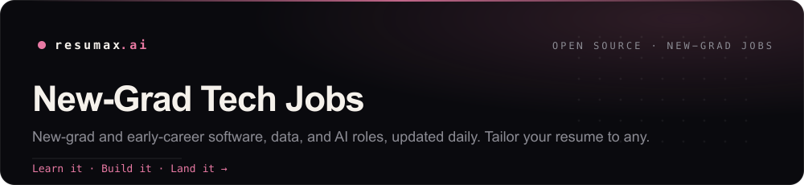

  

# New-Grad Tech Jobs

Open **new-grad** software, data, AI/ML, security, and hardware roles **posted in the last 30 days**, refreshed daily. We filter out senior, staff, and lead postings, dedupe across job boards, and drop anything older than 30 days, so the list stays fresh and actually open. Every role links into [ResuMax](https://resumax.ai/?utm_source=github&utm_medium=repo&utm_campaign=new-grad-tech-jobs&utm_content=intro), where **Atlas**, our AI career copilot, tailors your resume to it and preps you to ace the interview.

  

### A generic resume gets filtered. A tailored one gets the interview.

**[Tailor your resume to any role above &rarr;](https://resumax.ai/?utm_source=github&utm_medium=repo&utm_campaign=new-grad-tech-jobs&utm_content=cta-link)**

Atlas rewrites your resume to match each posting, scores it like a recruiter would, then runs you through the coding, system-design, and behavioral rounds so you walk in ready. Land the offer, not just the application.

**Found a role we're missing or a dead link?** [Open an issue](../../issues/new) and we'll fold it in.

## Open new-grad roles from the last 30 days

**3849** open roles from the last 30 days, newest first. Jump to a category:

**[Software Engineering](#software-engineering)** &nbsp;·&nbsp; 2148 open  
**[Data, AI & ML](#data-ai-and-ml)** &nbsp;·&nbsp; 948 open  
**[Security](#security)** &nbsp;·&nbsp; 106 open  
**[DevOps, Infra & Cloud](#devops-infra-and-cloud)** &nbsp;·&nbsp; 401 open  
**[Mobile](#mobile)** &nbsp;·&nbsp; 81 open  
**[Hardware & Embedded](#hardware-and-embedded)** &nbsp;·&nbsp; 165 open  

🌐 Remote &nbsp;·&nbsp; 🆕 Posted this week

## Software Engineering

| Company | Role | Location | Apply | Tailor | Age |
|---|---|---|:--:|:--:|--:|
| **[GitLab](https://resumax.ai/companies/gitlab?utm_source=github&utm_medium=repo&utm_campaign=new-grad-tech-jobs)** 🆕 | Intermediate Backend Engineer | Bangalore, India | [Apply](https://job-boards.greenhouse.io/gitlab/jobs/8686962002) |  | 0d |
| **[Affirm](https://resumax.ai/companies/affirm?utm_source=github&utm_medium=repo&utm_campaign=new-grad-tech-jobs)** 🌐 🆕 | Software Engineer II (Money Movement & Card Ledger) | Remote Canada | [Apply](https://job-boards.greenhouse.io/affirm/jobs/7779962003) |  | 0d |
| **[Robinhood](https://resumax.ai/companies/robinhood?utm_source=github&utm_medium=repo&utm_campaign=new-grad-tech-jobs)** 🆕 | Software Engineer, Proactive Capabilities | Bellevue, WA; Menlo Park, CA | [Apply](https://boards.greenhouse.io/robinhood/jobs/8067604?t=gh_src=&gh_jid=8067604) |  | 0d |
| **[Foxglove](https://resumax.ai/companies/foxglove?utm_source=github&utm_medium=repo&utm_campaign=new-grad-tech-jobs)** 🌐 🆕 | Full-Stack Engineer, Forward Deployed | Remote | [Apply](https://jobs.ashbyhq.com/foxglove/ca210832-25dc-466f-b45f-1f2ae81600c5/application) |  | 0d |
| **[Appian Corporation](https://resumax.ai/companies/appian-corporation?utm_source=github&utm_medium=repo&utm_campaign=new-grad-tech-jobs)** 🆕 | Database Engineer II | McLean, Virginia | [Apply](https://job-boards.greenhouse.io/appian/jobs/8088282) |  | 0d |
| **[Stripe](https://resumax.ai/companies/stripe?utm_source=github&utm_medium=repo&utm_campaign=new-grad-tech-jobs)** 🆕 | Backend Engineer, Payments Experiences | N/A | [Apply](https://stripe.com/jobs/search?gh_jid=7895287) |  | 0d |
| **[GitLab](https://resumax.ai/companies/gitlab?utm_source=github&utm_medium=repo&utm_campaign=new-grad-tech-jobs)** 🌐 🆕 | Backend Engineer, Source Code Experience (Ruby) | Remote, Canada | [Apply](https://job-boards.greenhouse.io/gitlab/jobs/8687926002) |  | 0d |
| **[Synergyecp](https://resumax.ai/companies/synergyecp?utm_source=github&utm_medium=repo&utm_campaign=new-grad-tech-jobs)** 🆕 | Mid-Level Full Stack Developer | Washington, DC · Suitland, MD | [Apply](https://jobs.lever.co/synergyecp/ed5bebd6-0a6f-461f-905c-bf92ca2bcff5/apply) |  | 0d |
| **[Cribl](https://resumax.ai/companies/cribl?utm_source=github&utm_medium=repo&utm_campaign=new-grad-tech-jobs)** 🌐 🆕 | Software Engineer, Core Platform | Remote - United States | [Apply](https://cribl.io/job-detail/?gh_jid=6143413004) |  | 0d |
| **[Accenture Federal Services](https://resumax.ai/companies/accenture-federal-services?utm_source=github&utm_medium=repo&utm_campaign=new-grad-tech-jobs)** 🆕 | Full Stack Developer | Suitland, MD +3 more | [Apply](https://boards.greenhouse.io/accenturefederalservices/jobs/4695324006?gh_jid=4695324006) |  | 0d |
| **[PatientPoint](https://resumax.ai/companies/patientpoint?utm_source=github&utm_medium=repo&utm_campaign=new-grad-tech-jobs)** 🆕 | Software Engineer in Test | Cincinnati, Ohio, United States | [Apply](https://job-boards.greenhouse.io/patientpoint/jobs/4722426005) |  | 0d |
| **[FourKites](https://resumax.ai/companies/fourkites?utm_source=github&utm_medium=repo&utm_campaign=new-grad-tech-jobs)** 🆕 | Forward Deployed Engineer | Chicago, IL | [Apply](https://job-boards.greenhouse.io/fourkites/jobs/8110181) |  | 0d |
| **[Astranis](https://resumax.ai/companies/astranis?utm_source=github&utm_medium=repo&utm_campaign=new-grad-tech-jobs)** 🆕 | Flight Software Engineer | San Francisco | [Apply](https://job-boards.greenhouse.io/astranis/jobs/4015622006) |  | 0d |
| **[Anduril Industries](https://resumax.ai/companies/anduril-industries?utm_source=github&utm_medium=repo&utm_campaign=new-grad-tech-jobs)** 🆕 | Robotics Software Engineer | Boston, Massachusetts, United States +2 more | [Apply](https://boards.greenhouse.io/andurilindustries/jobs/5179580007?gh_jid=5179580007) |  | 0d |
| **[Airtable](https://resumax.ai/companies/airtable?utm_source=github&utm_medium=repo&utm_campaign=new-grad-tech-jobs)** 🆕 | Software Engineer, Product Backend (4-8 YOE) | San Francisco, CA; New York, NY | [Apply](https://job-boards.greenhouse.io/airtable/jobs/8397515002) |  | 0d |
| **[Heron Power](https://resumax.ai/companies/heron-power?utm_source=github&utm_medium=repo&utm_campaign=new-grad-tech-jobs)** 🆕 | Software Engineer | Scotts Valley | [Apply](https://jobs.ashbyhq.com/heron-power/a898379d-aaeb-488a-81ea-58eb3d0ad9ab/application) |  | 0d |
| **[Sierra](https://resumax.ai/companies/sierra?utm_source=github&utm_medium=repo&utm_campaign=new-grad-tech-jobs)** 🆕 | Web Developer, Marketing Site | San Francisco, CA | [Apply](https://jobs.ashbyhq.com/sierra/c8778377-3ee8-42b1-89ec-4565da53abeb/application) |  | 0d |
| **[Benchling](https://resumax.ai/companies/benchling?utm_source=github&utm_medium=repo&utm_campaign=new-grad-tech-jobs)** 🌐 🆕 | Software Engineer, Full Stack (Document Canvas) | San Francisco, CA | [Apply](https://jobs.ashbyhq.com/benchling/d627fcc2-2e34-4bde-9be2-242c89c19436/application) |  | 0d |
| **[Awetomaton](https://resumax.ai/companies/awetomaton?utm_source=github&utm_medium=repo&utm_campaign=new-grad-tech-jobs)** 🆕 | Research Engineer – EO/IR Image Processing | Boulder, CO | [Apply](https://job-boards.greenhouse.io/awetomaton/jobs/5385921008) |  | 0d |
| **[Snowflake](https://resumax.ai/companies/snowflake?utm_source=github&utm_medium=repo&utm_campaign=new-grad-tech-jobs)** 🌐 🆕 | Fullstack Software Engineer | CA-Ontario-Toronto | [Apply](https://jobs.ashbyhq.com/snowflake/5d522a45-5aa4-440d-a5dc-7a4434d8038e/application) |  | 0d |
| **[Airbnb](https://resumax.ai/companies/airbnb?utm_source=github&utm_medium=repo&utm_campaign=new-grad-tech-jobs)** 🆕 | Software Engineer, Secure Development Engineering | United States | [Apply](https://careers.airbnb.com/positions/8127075?gh_jid=8127075) |  | 0d |
| **[American Institutes for Research](https://resumax.ai/companies/american-institutes-for-research?utm_source=github&utm_medium=repo&utm_campaign=new-grad-tech-jobs)** 🌐 🆕 | Healthcare Programmer, Medicaid and Pharmacy | US-Remote \| US-VA-Arlington \| US-NC-Chapel Hill \| US-IL-Chicago \| US-CA-Sacramento \| US-TX-Austin | [Apply](https://job-boards.greenhouse.io/americaninstitutesforresearch/jobs/5382048008) |  | 0d |
| **[SpaceX](https://resumax.ai/companies/spacex?utm_source=github&utm_medium=repo&utm_campaign=new-grad-tech-jobs)** 🆕 | Full Stack Software Engineer (Components) | Hawthorne, CA | [Apply](https://boards.greenhouse.io/spacex/jobs/8706459002?gh_jid=8706459002) |  | 0d |
| **[Open AI](https://resumax.ai/companies/open-ai?utm_source=github&utm_medium=repo&utm_campaign=new-grad-tech-jobs)** 🌐 🆕 | Full Stack Software Engineer - Codex for Finance | San Francisco | [Apply](https://jobs.ashbyhq.com/openai/099dd6af-b017-4a60-85d5-4c79da3a9ead/application) |  | 0d |
| **[SpaceXAI](https://resumax.ai/companies/spacexai?utm_source=github&utm_medium=repo&utm_campaign=new-grad-tech-jobs)** 🆕 | Backend Engineer - Enterprise | Tokyo, Japan | [Apply](https://job-boards.greenhouse.io/xai/jobs/5006477007) |  | 0d |
| **[Asana](https://resumax.ai/companies/asana?utm_source=github&utm_medium=repo&utm_campaign=new-grad-tech-jobs)** 🆕 | Forward Deployed Engineer, Command by Asana | New York City · San Francisco | [Apply](https://www.asana.com/jobs/apply/8044789?gh_jid=8044789) |  | 0d |
| **[Sonarsource](https://resumax.ai/companies/sonarsource?utm_source=github&utm_medium=repo&utm_campaign=new-grad-tech-jobs)** 🆕 | Agentic Software Engineer | Bochum | [Apply](https://jobs.lever.co/sonarsource/12c480e4-2fd1-46fe-9a5b-0192f6513f67/apply) |  | 0d |
| **[Base Power](https://resumax.ai/companies/base-power?utm_source=github&utm_medium=repo&utm_campaign=new-grad-tech-jobs)** 🆕 | Field Reliability Engineer | Austin, TX | [Apply](https://jobs.ashbyhq.com/base-power/01d90134-1fc2-4a24-89b9-e79fe5b001ad/application) |  | 0d |
| **[Gusto, Inc.](https://resumax.ai/companies/gusto-inc?utm_source=github&utm_medium=repo&utm_campaign=new-grad-tech-jobs)** 🆕 | Workday Developer - People Tech | Denver, CO, United States; New York, New York, United States; San Francisco, CA, United States | [Apply](https://job-boards.greenhouse.io/gusto/jobs/8075975) |  | 1d |
| **[Pinterest](https://resumax.ai/companies/pinterest?utm_source=github&utm_medium=repo&utm_campaign=new-grad-tech-jobs)** 🆕 | Software Engineer II | Dublin, IE · Palo Alto, CA, US | [Apply](https://www.pinterestcareers.com/jobs/?gh_jid=7786418) |  | 1d |
| **[Voyager Technologies, Inc.](https://resumax.ai/companies/voyager-technologies-inc?utm_source=github&utm_medium=repo&utm_campaign=new-grad-tech-jobs)** 🆕 | Software Engineer | San Diego, CA · El Segundo, CA | [Apply](https://job-boards.greenhouse.io/voyagertechnologiesinc/jobs/4355026009) |  | 1d |
| **[Axon](https://resumax.ai/companies/axon?utm_source=github&utm_medium=repo&utm_campaign=new-grad-tech-jobs)** 🆕 | Software Engineer II | Kassel, Hesse, Germany | [Apply](https://job-boards.greenhouse.io/axon/jobs/7576983003) |  | 1d |
| **[Affirm](https://resumax.ai/companies/affirm?utm_source=github&utm_medium=repo&utm_campaign=new-grad-tech-jobs)** 🌐 🆕 | Software Engineer II, Fullstack (International) | Remote UK | [Apply](https://job-boards.greenhouse.io/affirm/jobs/7854835003) |  | 1d |
| **[Scout Motors](https://resumax.ai/companies/scout-motors?utm_source=github&utm_medium=repo&utm_campaign=new-grad-tech-jobs)** 🆕 | Design Release Engineer, Secondary Controller and SW Release | Novi, Michigan, United States | [Apply](https://job-boards.greenhouse.io/scoutmotors/jobs/5184719007) |  | 1d |
| **[iCapital](https://resumax.ai/companies/icapital?utm_source=github&utm_medium=repo&utm_campaign=new-grad-tech-jobs)** 🆕 | Software Engineer in Test | IN - Jaipur | [Apply](https://job-boards.greenhouse.io/icapitalnetwork/jobs/8636563002) |  | 1d |
| **[Chime Financial, Inc](https://resumax.ai/companies/chime-financial-inc?utm_source=github&utm_medium=repo&utm_campaign=new-grad-tech-jobs)** 🆕 | Software Engineer, Support Foundations | San Francisco, CA, USA | [Apply](https://boards.greenhouse.io/chime/jobs/8607195002?gh_jid=8607195002) |  | 1d |
| **[Per Scholas](https://resumax.ai/companies/per-scholas?utm_source=github&utm_medium=repo&utm_campaign=new-grad-tech-jobs)** 🆕 | Software Engineering Instructor (Continuous) | Columbus, Ohio, United States · Silver Spring, Maryland, United States | [Apply](https://job-boards.greenhouse.io/perscholashires/jobs/4266645006) |  | 1d |
| **[Imc](https://resumax.ai/companies/imc?utm_source=github&utm_medium=repo&utm_campaign=new-grad-tech-jobs)** 🆕 | Graduate Software Engineer (2026) | Aarhus, Central Denmark Region, Denmark · Amsterdam, Netherlands | [Apply](https://job-boards.eu.greenhouse.io/imc/jobs/4635938101) |  | 1d |
| **[Appian Corporation](https://resumax.ai/companies/appian-corporation?utm_source=github&utm_medium=repo&utm_campaign=new-grad-tech-jobs)** 🆕 | Associate Application Engineer (2027 Graduates) | McLean, Virginia | [Apply](https://job-boards.greenhouse.io/appian/jobs/8035372) |  | 0d |
| **[GitLab](https://resumax.ai/companies/gitlab?utm_source=github&utm_medium=repo&utm_campaign=new-grad-tech-jobs)** 🌐 🆕 | Backend Engineer, Create: Repository Management (Ruby) | Remote, United Kingdom | [Apply](https://job-boards.greenhouse.io/gitlab/jobs/8687932002) |  | 0d |
| **[Accenture Federal Services](https://resumax.ai/companies/accenture-federal-services?utm_source=github&utm_medium=repo&utm_campaign=new-grad-tech-jobs)** 🆕 | Cleared C# / .NET Developer | Washington, DC | [Apply](https://boards.greenhouse.io/accenturefederalservices/jobs/4691609006?gh_jid=4691609006) |  | 0d |
| **[Astranis](https://resumax.ai/companies/astranis?utm_source=github&utm_medium=repo&utm_campaign=new-grad-tech-jobs)** 🆕 | Machinist/Programmer | San Francisco | [Apply](https://job-boards.greenhouse.io/astranis/jobs/4596812006) |  | 0d |
| **[Anduril Industries](https://resumax.ai/companies/anduril-industries?utm_source=github&utm_medium=repo&utm_campaign=new-grad-tech-jobs)** 🆕 | Applied LLM Systems Engineer | Costa Mesa, California, United States | [Apply](https://boards.greenhouse.io/andurilindustries/jobs/5197253007?gh_jid=5197253007) |  | 0d |
| **[Awetomaton](https://resumax.ai/companies/awetomaton?utm_source=github&utm_medium=repo&utm_campaign=new-grad-tech-jobs)** 🆕 | Software Engineer – Python & Kubernetes Integration | Boulder, CO | [Apply](https://job-boards.greenhouse.io/awetomaton/jobs/5385876008) |  | 0d |
| **[SpaceX](https://resumax.ai/companies/spacex?utm_source=github&utm_medium=repo&utm_campaign=new-grad-tech-jobs)** 🆕 | Software Engineer (Starlink) | Hawthorne, CA · Redmond, WA | [Apply](https://boards.greenhouse.io/spacex/jobs/8706510002?gh_jid=8706510002) |  | 0d |
| **[Open AI](https://resumax.ai/companies/open-ai?utm_source=github&utm_medium=repo&utm_campaign=new-grad-tech-jobs)** 🌐 🆕 | Forward Deployed Engineer - Sydney | Sydney, Australia | [Apply](https://jobs.ashbyhq.com/openai/9e39d642-6c78-4c21-bc86-49b1773c933c/application) |  | 1d |
| **[SpaceXAI](https://resumax.ai/companies/spacexai?utm_source=github&utm_medium=repo&utm_campaign=new-grad-tech-jobs)** 🆕 | Exceptional Software Engineer | Palo Alto, California | [Apply](https://job-boards.greenhouse.io/xai/jobs/4956028007) |  | 0d |
| **[Base Power](https://resumax.ai/companies/base-power?utm_source=github&utm_medium=repo&utm_campaign=new-grad-tech-jobs)** 🆕 | Electronics Design Engineer | Austin, TX | [Apply](https://jobs.ashbyhq.com/base-power/617e05a6-a617-4223-9e50-1fc12a12c95d/application) |  | 0d |
| **[Voyager Technologies, Inc.](https://resumax.ai/companies/voyager-technologies-inc?utm_source=github&utm_medium=repo&utm_campaign=new-grad-tech-jobs)** 🆕 | Software and Integration Test Engineer | Pittsburgh, PA | [Apply](https://job-boards.greenhouse.io/voyagertechnologiesinc/jobs/4337311009) |  | 1d |
| **[Scout Motors](https://resumax.ai/companies/scout-motors?utm_source=github&utm_medium=repo&utm_campaign=new-grad-tech-jobs)** 🆕 | REEV Function Integration & Software Planning, Specialist | Novi, Michigan, United States | [Apply](https://job-boards.greenhouse.io/scoutmotors/jobs/5181680007) |  | 1d |
| **[Imc](https://resumax.ai/companies/imc?utm_source=github&utm_medium=repo&utm_campaign=new-grad-tech-jobs)** 🆕 | Graduate Software Engineer | Aarhus, Central Denmark Region, Denmark · Chicago, United States | [Apply](https://job-boards.eu.greenhouse.io/imc/jobs/4917773101) |  | 1d |
| **[Appian Corporation](https://resumax.ai/companies/appian-corporation?utm_source=github&utm_medium=repo&utm_campaign=new-grad-tech-jobs)** 🆕 | Software Engineer (2027 Graduates) | McLean, Virginia | [Apply](https://job-boards.greenhouse.io/appian/jobs/8041241) |  | 0d |
| **[Accenture Federal Services](https://resumax.ai/companies/accenture-federal-services?utm_source=github&utm_medium=repo&utm_campaign=new-grad-tech-jobs)** 🆕 | Software System Tester/Business Analyst | Springfield, VA | [Apply](https://boards.greenhouse.io/accenturefederalservices/jobs/4683623006?gh_jid=4683623006) |  | 0d |
| **[Astranis](https://resumax.ai/companies/astranis?utm_source=github&utm_medium=repo&utm_campaign=new-grad-tech-jobs)** 🆕 | Full Stack Engineer - Enterprise Systems | San Francisco | [Apply](https://job-boards.greenhouse.io/astranis/jobs/4597153006) |  | 0d |
| **[Anduril Industries](https://resumax.ai/companies/anduril-industries?utm_source=github&utm_medium=repo&utm_campaign=new-grad-tech-jobs)** 🆕 | Software Engineer, Developer Platform | Boston, Massachusetts, United States | [Apply](https://boards.greenhouse.io/andurilindustries/jobs/5210930007?gh_jid=5210930007) |  | 0d |
| **[SpaceX](https://resumax.ai/companies/spacex?utm_source=github&utm_medium=repo&utm_campaign=new-grad-tech-jobs)** 🆕 | Build Reliability Engineer (Starship) | Westminster, MD · Starbase, TX | [Apply](https://boards.greenhouse.io/spacex/jobs/8535055002?gh_jid=8535055002) |  | 0d |
| **[SpaceXAI](https://resumax.ai/companies/spacexai?utm_source=github&utm_medium=repo&utm_campaign=new-grad-tech-jobs)** 🆕 | Backend Engineer - API | London, England, United Kingdom | [Apply](https://job-boards.greenhouse.io/xai/jobs/5120536007) |  | 0d |
| **[Scout Motors](https://resumax.ai/companies/scout-motors?utm_source=github&utm_medium=repo&utm_campaign=new-grad-tech-jobs)** 🆕 | Function Integration and Software Planning | Novi, Michigan, United States | [Apply](https://job-boards.greenhouse.io/scoutmotors/jobs/5160766007) |  | 1d |
| **[Imc](https://resumax.ai/companies/imc?utm_source=github&utm_medium=repo&utm_campaign=new-grad-tech-jobs)** 🆕 | Graduate Software Engineer (2027) | Amsterdam, Netherlands | [Apply](https://job-boards.eu.greenhouse.io/imc/jobs/4667814101) |  | 1d |
| **[Appian Corporation](https://resumax.ai/companies/appian-corporation?utm_source=github&utm_medium=repo&utm_campaign=new-grad-tech-jobs)** 🆕 | Software Engineer II | Chennai, India | [Apply](https://job-boards.greenhouse.io/appian/jobs/7947868) |  | 0d |
| **[Accenture Federal Services](https://resumax.ai/companies/accenture-federal-services?utm_source=github&utm_medium=repo&utm_campaign=new-grad-tech-jobs)** 🆕 | Java Developer | Washington, DC · Colorado Springs, CO | [Apply](https://boards.greenhouse.io/accenturefederalservices/jobs/4651087006?gh_jid=4651087006) |  | 0d |
| **[Astranis](https://resumax.ai/companies/astranis?utm_source=github&utm_medium=repo&utm_campaign=new-grad-tech-jobs)** 🆕 | Flight Software Associate (Fall 2026) | San Francisco | [Apply](https://job-boards.greenhouse.io/astranis/jobs/4619289006) |  | 0d |
| **[Anduril Industries](https://resumax.ai/companies/anduril-industries?utm_source=github&utm_medium=repo&utm_campaign=new-grad-tech-jobs)** 🆕 | Robotics Software Engineer, Omen | Costa Mesa, California, United States | [Apply](https://boards.greenhouse.io/andurilindustries/jobs/5183150007?gh_jid=5183150007) |  | 0d |
| **[SpaceX](https://resumax.ai/companies/spacex?utm_source=github&utm_medium=repo&utm_campaign=new-grad-tech-jobs)** 🆕 | Full Stack Software Engineer, Manufacturing Systems | Hawthorne, CA · Bastrop, TX | [Apply](https://boards.greenhouse.io/spacex/jobs/8703540002?gh_jid=8703540002) |  | 1d |
| **[Scout Motors](https://resumax.ai/companies/scout-motors?utm_source=github&utm_medium=repo&utm_campaign=new-grad-tech-jobs)** 🆕 | Specialist, Software Update and Validation | Blythewood, South Carolina, United States | [Apply](https://job-boards.greenhouse.io/scoutmotors/jobs/5135032007) |  | 1d |
| **[Anduril Industries](https://resumax.ai/companies/anduril-industries?utm_source=github&utm_medium=repo&utm_campaign=new-grad-tech-jobs)** 🆕 | Software Engineer - Maritime Integrated Systems | Costa Mesa, California, United States · Quincy, Massachusetts, United States | [Apply](https://boards.greenhouse.io/andurilindustries/jobs/5166602007?gh_jid=5166602007) |  | 0d |
| **[Anduril Industries](https://resumax.ai/companies/anduril-industries?utm_source=github&utm_medium=repo&utm_campaign=new-grad-tech-jobs)** 🆕 | Financial Analyst II, Software Platform | Costa Mesa, California, United States | [Apply](https://boards.greenhouse.io/andurilindustries/jobs/4985488007?gh_jid=4985488007) |  | 0d |
| **[SpaceX](https://resumax.ai/companies/spacex?utm_source=github&utm_medium=repo&utm_campaign=new-grad-tech-jobs)** 🆕 | RCDD / ICT Design Engineer | Hawthorne, CA | [Apply](https://boards.greenhouse.io/spacex/jobs/8570121002?gh_jid=8570121002) |  | 1d |
| **[Stripe](https://resumax.ai/companies/stripe?utm_source=github&utm_medium=repo&utm_campaign=new-grad-tech-jobs)** 🆕 | Full Stack Engineer, Developer & End User Experience Platform | N/A | [Apply](https://stripe.com/jobs/search?gh_jid=6567104) |  | 1d |
| **[Rocket Lab Corporation](https://resumax.ai/companies/rocket-lab-corporation?utm_source=github&utm_medium=repo&utm_campaign=new-grad-tech-jobs)** 🆕 | Flight Software Engineer I | Littleton, CO | [Apply](https://job-boards.greenhouse.io/rocketlab/jobs/7830196003) |  | 1d |
| **[Str](https://resumax.ai/companies/str?utm_source=github&utm_medium=repo&utm_campaign=new-grad-tech-jobs)** 🆕 | Autonomy Algorithms Software Engineer | Woburn, MA · Arlington, VA | [Apply](https://job-boards.greenhouse.io/systemstechnologyresearch/jobs/4704682006) |  | 1d |
| **[Accenture Federal Services](https://resumax.ai/companies/accenture-federal-services?utm_source=github&utm_medium=repo&utm_campaign=new-grad-tech-jobs)** 🆕 | SAP ABAP Developer | Washington, DC · Kansas City, KS | [Apply](https://boards.greenhouse.io/accenturefederalservices/jobs/4704596006?gh_jid=4704596006) |  | 1d |
| **[Bloomreach](https://resumax.ai/companies/bloomreach?utm_source=github&utm_medium=repo&utm_campaign=new-grad-tech-jobs)** 🆕 | Forward Deployed Engineer - Strategic Search Accounts | United States | [Apply](https://job-boards.greenhouse.io/bloomreach/jobs/8126527) |  | 1d |
| **[Torc Robotics](https://resumax.ai/companies/torc-robotics?utm_source=github&utm_medium=repo&utm_campaign=new-grad-tech-jobs)** 🌐 🆕 | Software Engineer II - Build Tools | Remote (US); Ann Arbor, MI | [Apply](https://job-boards.greenhouse.io/torcrobotics/jobs/8654323002) |  | 1d |
| **[Snowflake](https://resumax.ai/companies/snowflake?utm_source=github&utm_medium=repo&utm_campaign=new-grad-tech-jobs)** 🌐 🆕 | Software Engineer | US-CA-Menlo Park | [Apply](https://jobs.ashbyhq.com/snowflake/74466b25-9cc8-4e9b-b60b-234c539c455c/application) |  | 1d |
| **[CaseGuard](https://resumax.ai/companies/caseguard?utm_source=github&utm_medium=repo&utm_campaign=new-grad-tech-jobs)** 🆕 | Software Engineer - Backend | Arlington, VA | [Apply](https://job-boards.greenhouse.io/caseguard/jobs/5387488008) |  | 1d |
| **[Planet](https://resumax.ai/companies/planet?utm_source=github&utm_medium=repo&utm_campaign=new-grad-tech-jobs)** 🆕 | Software Engineer | San Francisco, CA | [Apply](https://job-boards.greenhouse.io/planetlabs/jobs/8096079) |  | 1d |
| **[Treeswift](https://resumax.ai/companies/treeswift?utm_source=github&utm_medium=repo&utm_campaign=new-grad-tech-jobs)** 🌐 🆕 | Robotics Engineer (Perception) | Philadelphia Office · New York Office | [Apply](https://jobs.ashbyhq.com/treeswift/2048138a-8e0f-48f5-b04d-f0159b610c29/application) |  | 1d |
| **[Amplitude](https://resumax.ai/companies/amplitude?utm_source=github&utm_medium=repo&utm_campaign=new-grad-tech-jobs)** 🆕 | Software Engineer II, Growth | San Francisco, CA | [Apply](https://job-boards.greenhouse.io/amplitude/jobs/8700618002) |  | 1d |
| **[Truetandem](https://resumax.ai/companies/truetandem?utm_source=github&utm_medium=repo&utm_campaign=new-grad-tech-jobs)** 🌐 🆕 | Power Platform Developer | Remote | [Apply](https://jobs.lever.co/truetandem/a7450ff0-7005-4d45-80b9-6dc09951f198/apply) |  | 1d |
| **[The New York Times](https://resumax.ai/companies/the-new-york-times?utm_source=github&utm_medium=repo&utm_campaign=new-grad-tech-jobs)** 🆕 | Digital Design Developer, Opinion | New York, NY | [Apply](https://job-boards.greenhouse.io/thenewyorktimes/jobs/4549942005) |  | 1d |
| **[WPP Media](https://resumax.ai/companies/wpp-media?utm_source=github&utm_medium=repo&utm_campaign=new-grad-tech-jobs)** 🆕 | Software Engineer - Web Platform | Manchester, United Kingdom | [Apply](https://job-boards.greenhouse.io/wppmedia/jobs/5217011008) |  | 1d |
| **[Xometry](https://resumax.ai/companies/xometry?utm_source=github&utm_medium=repo&utm_campaign=new-grad-tech-jobs)** 🆕 | Application Engineer, Injection Molding | Waltham, MA +4 more | [Apply](https://job-boards.greenhouse.io/xometry/jobs/5061781007) |  | 1d |
| **[Capco](https://resumax.ai/companies/capco?utm_source=github&utm_medium=repo&utm_campaign=new-grad-tech-jobs)** 🆕 | SAS Developer | India | [Apply](https://job-boards.greenhouse.io/capco/jobs/8002507) |  | 2d |
| **[Greenlight](https://resumax.ai/companies/greenlight?utm_source=github&utm_medium=repo&utm_campaign=new-grad-tech-jobs)** 🌐 🆕 | Software Development Engineer In Test II | Atlanta (Remote Friendly) | [Apply](https://jobs.lever.co/greenlight/1866c773-4cfe-42cf-9224-1f841aec25de/apply) |  | 2d |
| **[Drw](https://resumax.ai/companies/drw?utm_source=github&utm_medium=repo&utm_campaign=new-grad-tech-jobs)** 🆕 | Software Engineer - APEX | Chicago | [Apply](https://job-boards.greenhouse.io/drweng/jobs/8103460) |  | 2d |
| **[Uipath](https://resumax.ai/companies/uipath?utm_source=github&utm_medium=repo&utm_campaign=new-grad-tech-jobs)** 🆕 | Software Engineer II- Routing | Bucharest | [Apply](https://jobs.ashbyhq.com/uipath/945f7235-c2bf-4f25-b13d-dab322bc3b8d/application) |  | 2d |
| **[Scout Motors](https://resumax.ai/companies/scout-motors?utm_source=github&utm_medium=repo&utm_campaign=new-grad-tech-jobs)** 🆕 | Specialist, Software Update and Validation Engineer | Blythewood, South Carolina, United States | [Apply](https://job-boards.greenhouse.io/scoutmotors/jobs/5141668007) |  | 2d |
| **[Sigma Computing](https://resumax.ai/companies/sigma-computing?utm_source=github&utm_medium=repo&utm_campaign=new-grad-tech-jobs)** 🆕 | Forward Deployed Engineer | New York City, NY | [Apply](https://job-boards.greenhouse.io/sigmacomputing/jobs/7776721003) |  | 2d |
| **[Everpure](https://resumax.ai/companies/everpure?utm_source=github&utm_medium=repo&utm_campaign=new-grad-tech-jobs)** 🆕 | GTM Integration Developer - Boomi | Bangalore, India | [Apply](https://job-boards.greenhouse.io/purestorage/jobs/8108426) |  | 2d |
| **[GitLab](https://resumax.ai/companies/gitlab?utm_source=github&utm_medium=repo&utm_campaign=new-grad-tech-jobs)** 🆕 | Backend Engineer, Geo Team | Bangalore, India | [Apply](https://job-boards.greenhouse.io/gitlab/jobs/8695515002) |  | 2d |
| **[Mach](https://resumax.ai/companies/mach?utm_source=github&utm_medium=repo&utm_campaign=new-grad-tech-jobs)** 🆕 | December 2026 New Graduate Engineer, Software / GNC | Huntington Beach, CA | [Apply](https://jobs.ashbyhq.com/mach/43c8b037-c77d-4efb-9379-52a6c3718bdb/application) |  | 2d |
| **[Chime Financial, Inc](https://resumax.ai/companies/chime-financial-inc?utm_source=github&utm_medium=repo&utm_campaign=new-grad-tech-jobs)** 🆕 | Software Engineer, Membership | San Francisco, CA, USA | [Apply](https://boards.greenhouse.io/chime/jobs/8614188002?gh_jid=8614188002) |  | 2d |
| **[SciTec](https://resumax.ai/companies/scitec?utm_source=github&utm_medium=repo&utm_campaign=new-grad-tech-jobs)** 🆕 | Systems Engineer - Compute and Software Systems | — | [Apply](https://apply.workable.com/j/C2E5D847E0/apply) |  | 2d |
| **[Slip Robotics](https://resumax.ai/companies/slip-robotics?utm_source=github&utm_medium=repo&utm_campaign=new-grad-tech-jobs)** 🆕 | Robotics Software Engineering Leader | — | [Apply](https://apply.workable.com/j/3EAB36A16A/apply) |  | 2d |
| **[Valsoft Corporation](https://resumax.ai/companies/valsoft-corporation?utm_source=github&utm_medium=repo&utm_campaign=new-grad-tech-jobs)** 🆕 | Developer | — | [Apply](https://apply.workable.com/j/D1C6018791/apply) |  | 2d |
| **[Genetec](https://resumax.ai/companies/genetec?utm_source=github&utm_medium=repo&utm_campaign=new-grad-tech-jobs)** 🆕 | Go Developer (all genders) | — | [Apply](https://apply.workable.com/j/9646BEFE3D/apply) |  | 2d |
| **[Flexcompute Inc.](https://resumax.ai/companies/flexcompute-inc?utm_source=github&utm_medium=repo&utm_campaign=new-grad-tech-jobs)** 🆕 | CFD Solver Developer | — | [Apply](https://apply.workable.com/j/EF3D90A736/apply) |  | 2d |
| **[SpaceX](https://resumax.ai/companies/spacex?utm_source=github&utm_medium=repo&utm_campaign=new-grad-tech-jobs)** 🆕 | Full Stack Engineer (Application Software) | Redmond, WA +2 more | [Apply](https://boards.greenhouse.io/spacex/jobs/8701392002?gh_jid=8701392002) |  | 1d |
| **[Stripe](https://resumax.ai/companies/stripe?utm_source=github&utm_medium=repo&utm_campaign=new-grad-tech-jobs)** 🆕 | Frontend Engineer, Expansion | N/A | [Apply](https://stripe.com/jobs/search?gh_jid=7644950) |  | 1d |
| **[Accenture Federal Services](https://resumax.ai/companies/accenture-federal-services?utm_source=github&utm_medium=repo&utm_campaign=new-grad-tech-jobs)** 🆕 | SAP S/4HANA BTP Developer - SAP Fiori and UI5 | Washington, DC | [Apply](https://boards.greenhouse.io/accenturefederalservices/jobs/4704556006?gh_jid=4704556006) |  | 1d |
| **[Bloomreach](https://resumax.ai/companies/bloomreach?utm_source=github&utm_medium=repo&utm_campaign=new-grad-tech-jobs)** 🆕 | Software Engineer II (Fullstack) | India | [Apply](https://job-boards.greenhouse.io/bloomreach/jobs/8088545) |  | 2d |
| **[The New York Times](https://resumax.ai/companies/the-new-york-times?utm_source=github&utm_medium=repo&utm_campaign=new-grad-tech-jobs)** 🆕 | Software Engineer, Content Data Products | New York, NY | [Apply](https://job-boards.greenhouse.io/thenewyorktimes/jobs/4713567005) |  | 1d |
| **[Sigma Computing](https://resumax.ai/companies/sigma-computing?utm_source=github&utm_medium=repo&utm_campaign=new-grad-tech-jobs)** 🆕 | Software Engineer - Compiler | New York City, NY · San Francisco, CA | [Apply](https://job-boards.greenhouse.io/sigmacomputing/jobs/7767918003) |  | 2d |
| **[Stripe](https://resumax.ai/companies/stripe?utm_source=github&utm_medium=repo&utm_campaign=new-grad-tech-jobs)** 🆕 | Backend Engineer, Developer SDKs (Golang) | N/A | [Apply](https://stripe.com/jobs/search?gh_jid=7557899) |  | 1d |
| **[Accenture Federal Services](https://resumax.ai/companies/accenture-federal-services?utm_source=github&utm_medium=repo&utm_campaign=new-grad-tech-jobs)** 🆕 | D365 Developer | Washington, DC | [Apply](https://boards.greenhouse.io/accenturefederalservices/jobs/4704532006?gh_jid=4704532006) |  | 1d |
| **[Bloomreach](https://resumax.ai/companies/bloomreach?utm_source=github&utm_medium=repo&utm_campaign=new-grad-tech-jobs)** 🆕 | Software Engineer II (Pulsar Team) | India | [Apply](https://job-boards.greenhouse.io/bloomreach/jobs/7686370) |  | 2d |
| **[The New York Times](https://resumax.ai/companies/the-new-york-times?utm_source=github&utm_medium=repo&utm_campaign=new-grad-tech-jobs)** 🆕 | Software Engineer, News Multimodal | New York, NY | [Apply](https://job-boards.greenhouse.io/thenewyorktimes/jobs/4693057005) |  | 1d |
| **[Stripe](https://resumax.ai/companies/stripe?utm_source=github&utm_medium=repo&utm_campaign=new-grad-tech-jobs)** 🆕 | Backend Engineer, Developer & End-user Experience Platform | SEA, SF | [Apply](https://stripe.com/jobs/search?gh_jid=7476555) |  | 1d |
| **[Accenture Federal Services](https://resumax.ai/companies/accenture-federal-services?utm_source=github&utm_medium=repo&utm_campaign=new-grad-tech-jobs)** 🆕 | Microsoft Developer – Power Platforms | Washington, DC | [Apply](https://boards.greenhouse.io/accenturefederalservices/jobs/4704434006?gh_jid=4704434006) |  | 2d |
| **[The New York Times](https://resumax.ai/companies/the-new-york-times?utm_source=github&utm_medium=repo&utm_campaign=new-grad-tech-jobs)** 🆕 | Software Engineer, Games | New York, NY | [Apply](https://job-boards.greenhouse.io/thenewyorktimes/jobs/4713043005) |  | 1d |
| **[Stripe](https://resumax.ai/companies/stripe?utm_source=github&utm_medium=repo&utm_campaign=new-grad-tech-jobs)** 🆕 | Full Stack Engineer, Startup Products | N/A | [Apply](https://stripe.com/jobs/search?gh_jid=7994887) |  | 1d |
| **[Accenture Federal Services](https://resumax.ai/companies/accenture-federal-services?utm_source=github&utm_medium=repo&utm_campaign=new-grad-tech-jobs)** 🆕 | Dynamics Developer | Washington, DC | [Apply](https://boards.greenhouse.io/accenturefederalservices/jobs/4700481006?gh_jid=4700481006) |  | 2d |
| **[Accenture Federal Services](https://resumax.ai/companies/accenture-federal-services?utm_source=github&utm_medium=repo&utm_campaign=new-grad-tech-jobs)** 🆕 | Pega Application Developer | Washington, DC | [Apply](https://boards.greenhouse.io/accenturefederalservices/jobs/4693259006?gh_jid=4693259006) |  | 2d |
| **[Gusto, Inc.](https://resumax.ai/companies/gusto-inc?utm_source=github&utm_medium=repo&utm_campaign=new-grad-tech-jobs)** 🆕 | Software Engineer, People Technology | San Francisco, CA | [Apply](https://job-boards.greenhouse.io/gusto/jobs/7947424) |  | 2d |
| **[Handshake](https://resumax.ai/companies/handshake?utm_source=github&utm_medium=repo&utm_campaign=new-grad-tech-jobs)** 🆕 | Associate Software Engineer, Operator Experience | San Francisco, CA | [Apply](https://jobs.ashbyhq.com/handshake/fe319ff8-87e1-46d9-b23e-4b78cf6086f8/application) |  | 2d |
| **[Anduril Industries](https://resumax.ai/companies/anduril-industries?utm_source=github&utm_medium=repo&utm_campaign=new-grad-tech-jobs)** 🆕 | Mission Software Engineer | Amsterdam, North Holland, Netherlands +2 more | [Apply](https://boards.greenhouse.io/andurilindustries/jobs/5102993007?gh_jid=5102993007) |  | 2d |
| **[Sierra](https://resumax.ai/companies/sierra?utm_source=github&utm_medium=repo&utm_campaign=new-grad-tech-jobs)** 🆕 | Software Engineer, Agent - Retail | San Francisco, CA | [Apply](https://jobs.ashbyhq.com/sierra/93fea91f-a8a2-4084-8113-1cde73344e33/application) |  | 2d |
| **[Mercor](https://resumax.ai/companies/mercor?utm_source=github&utm_medium=repo&utm_campaign=new-grad-tech-jobs)** 🆕 | Fullstack Software Engineer, Agent Platform | San Francisco | [Apply](https://jobs.ashbyhq.com/mercor/3750ee8a-64d1-46ac-b4f9-6a823f949034/application) |  | 2d |
| **[Baseten](https://resumax.ai/companies/baseten?utm_source=github&utm_medium=repo&utm_campaign=new-grad-tech-jobs)** 🌐 🆕 | Software Engineer - Testing Frameworks | San Francisco | [Apply](https://jobs.ashbyhq.com/baseten/78028a72-2431-4373-aaec-d6e2c9a1cc7d/application) |  | 2d |
| **[Accenture Federal Services](https://resumax.ai/companies/accenture-federal-services?utm_source=github&utm_medium=repo&utm_campaign=new-grad-tech-jobs)** 🆕 | Pega Developer | Washington, DC | [Apply](https://boards.greenhouse.io/accenturefederalservices/jobs/4701648006?gh_jid=4701648006) |  | 2d |
| **[Rockstar Games](https://resumax.ai/companies/rockstar-games?utm_source=github&utm_medium=repo&utm_campaign=new-grad-tech-jobs)** 🆕 | Software Engineer, Java | Dundee, Scotland, United Kingdom | [Apply](https://job-boards.greenhouse.io/rockstargames/jobs/7734376003) |  | 2d |
| **[SpaceX](https://resumax.ai/companies/spacex?utm_source=github&utm_medium=repo&utm_campaign=new-grad-tech-jobs)** 🆕 | Mechanical Design Engineer, Production (Starlink) | Redmond, WA | [Apply](https://boards.greenhouse.io/spacex/jobs/8652488002?gh_jid=8652488002) |  | 2d |
| **[Valon](https://resumax.ai/companies/valon?utm_source=github&utm_medium=repo&utm_campaign=new-grad-tech-jobs)** 🌐 🆕 | Software Engineer II | New York | [Apply](https://jobs.ashbyhq.com/valon/2de94485-130f-4f93-abe7-c21d70401b0b/application) |  | 2d |
| **[Ekho](https://resumax.ai/companies/ekho?utm_source=github&utm_medium=repo&utm_campaign=new-grad-tech-jobs)** 🆕 | Full-stack Engineer | New York City HQ | [Apply](https://jobs.ashbyhq.com/ekho/c8888199-a4aa-4b61-9744-67bd2c92f4d8/application) |  | 2d |
| **[Open AI](https://resumax.ai/companies/open-ai?utm_source=github&utm_medium=repo&utm_campaign=new-grad-tech-jobs)** 🌐 🆕 | Backend Software Engineer - Codex for Finance | San Francisco | [Apply](https://jobs.ashbyhq.com/openai/a23bd45a-e192-460d-bd34-a0f6c4bc6865/application) |  | 2d |
| **[Hadrian Automation](https://resumax.ai/companies/hadrian-automation?utm_source=github&utm_medium=repo&utm_campaign=new-grad-tech-jobs)** 🆕 | CAM Programmer, Execution | Los Angeles, CA | [Apply](https://jobs.ashbyhq.com/hadrian-automation/ca2ab5f8-6a99-458a-9148-eee69122de14/application) |  | 2d |
| **[Databricks](https://resumax.ai/companies/databricks?utm_source=github&utm_medium=repo&utm_campaign=new-grad-tech-jobs)** 🆕 | Software Engineer, Web Products | Mountain View, California | [Apply](https://databricks.com/company/careers/open-positions/job?gh_jid=8635225002) |  | 2d |
| **[Stripe](https://resumax.ai/companies/stripe?utm_source=github&utm_medium=repo&utm_campaign=new-grad-tech-jobs)** 🆕 | Backend Engineer, Payments and Risk | US | [Apply](https://stripe.com/jobs/search?gh_jid=6163230) |  | 2d |
| **[Beacon AI](https://resumax.ai/companies/beacon-ai?utm_source=github&utm_medium=repo&utm_campaign=new-grad-tech-jobs)** 🆕 | Software Engineer, Frontend/Web App | San Carlos  - Hybrid | [Apply](https://jobs.ashbyhq.com/beaconai/2a98b676-fc10-4144-9eb0-c9c4efba7ddf/application) |  | 2d |
| **[True Anomaly](https://resumax.ai/companies/true-anomaly?utm_source=github&utm_medium=repo&utm_campaign=new-grad-tech-jobs)** 🆕 | Software Engineer I, QA | Denver, CO or Long Beach, CA | [Apply](https://job-boards.greenhouse.io/trueanomalyinc/jobs/5152215007) |  | 2d |
| **[Sambatv](https://resumax.ai/companies/sambatv?utm_source=github&utm_medium=repo&utm_campaign=new-grad-tech-jobs)** 🆕 | Fullstack Software Engineer | San Francisco, California | [Apply](https://jobs.lever.co/sambatv/8607b6ab-5488-41f4-a82b-58636df788f6/apply) |  | 2d |
| **[Capco](https://resumax.ai/companies/capco?utm_source=github&utm_medium=repo&utm_campaign=new-grad-tech-jobs)** 🆕 | Contractor - Web Software Developer | US - New York | [Apply](https://job-boards.greenhouse.io/capco/jobs/7762099) |  | 2d |
| **[Onebrief](https://resumax.ai/companies/onebrief?utm_source=github&utm_medium=repo&utm_campaign=new-grad-tech-jobs)** 🌐 🆕 | Software Development Engineer in Test | United States \| Remote | [Apply](https://jobs.ashbyhq.com/onebrief/fbd0fd12-5aed-4428-9373-55ec2c5076f3/application) |  | 2d |
| **[Drw](https://resumax.ai/companies/drw?utm_source=github&utm_medium=repo&utm_campaign=new-grad-tech-jobs)** 🆕 | Systems Software Engineer | Chicago | [Apply](https://job-boards.greenhouse.io/drweng/jobs/8120240) |  | 2d |
| **[Imc](https://resumax.ai/companies/imc?utm_source=github&utm_medium=repo&utm_campaign=new-grad-tech-jobs)** 🆕 | Quantitative Developer | New York, United States | [Apply](https://job-boards.eu.greenhouse.io/imc/jobs/4778139101) |  | 2d |
| **[Rocket Lab Corporation](https://resumax.ai/companies/rocket-lab-corporation?utm_source=github&utm_medium=repo&utm_campaign=new-grad-tech-jobs)** 🆕 | Propulsion Design Engineer II | Long Beach, CA | [Apply](https://job-boards.greenhouse.io/rocketlab/jobs/7850667003) |  | 3d |
| **[Thinkahead](https://resumax.ai/companies/thinkahead?utm_source=github&utm_medium=repo&utm_campaign=new-grad-tech-jobs)** 🆕 | NetSuite Developer | India | [Apply](https://jobs.lever.co/thinkahead/9145a048-dd29-4378-9676-7b82cd89706f/apply) |  | 3d |
| **[Eurofins](https://resumax.ai/companies/eurofins?utm_source=github&utm_medium=repo&utm_campaign=new-grad-tech-jobs)** 🆕 | BMC Helix Developer | Bengaluru, KA, in | [Apply](https://jobs.smartrecruiters.com/eurofins/744000142866299) |  | 3d |
| **[Ubisoft](https://resumax.ai/companies/ubisoft?utm_source=github&utm_medium=repo&utm_campaign=new-grad-tech-jobs)** 🆕 | .Net Full-Stack Developer | Bucharest, Bucharest, ro | [Apply](https://jobs.smartrecruiters.com/ubisoft2/744000142864758) |  | 3d |
| **[Experian](https://resumax.ai/companies/experian?utm_source=github&utm_medium=repo&utm_campaign=new-grad-tech-jobs)** 🌐 🆕 | Mid Data & Software Engineer | São Carlos, SP, br | [Apply](https://jobs.smartrecruiters.com/experian/744000142860926) |  | 3d |
| **[Arista Networks](https://resumax.ai/companies/arista-networks?utm_source=github&utm_medium=repo&utm_campaign=new-grad-tech-jobs)** 🆕 | Software Engineer - Remote Hungary, Romania, Greece & Spain | Budapest, OR, hu | [Apply](https://jobs.smartrecruiters.com/aristanetworks/744000142859345) |  | 3d |
| **[Kayak](https://resumax.ai/companies/kayak?utm_source=github&utm_medium=repo&utm_campaign=new-grad-tech-jobs)** 🆕 | Java Software Engineer, Search team | Kaunas Office | [Apply](https://jobs.ashbyhq.com/kayak/38a23a6c-9c59-4d98-bb8a-a87fde085427/application) |  | 3d |
| **[Isaraerospace](https://resumax.ai/companies/isaraerospace?utm_source=github&utm_medium=repo&utm_campaign=new-grad-tech-jobs)** 🆕 | GNC Engineer - Flight Software Development (C++) (m/f/d) | Ottobrunn, Bavaria; Parsdorf, Bavaria | [Apply](https://www.arbeitnow.com/jobs/companies/isaraerospace/gnc-engineer-flight-software-development-c-ottobrunn-bavaria-parsdorf-bavaria-471936) |  | 3d |
| **[NielsenIQ](https://resumax.ai/companies/nielseniq?utm_source=github&utm_medium=repo&utm_campaign=new-grad-tech-jobs)** 🆕 | Software Engineer - Python Backend Fast API | Pune, MH, in | [Apply](https://jobs.smartrecruiters.com/nielseniq/744000142857849) |  | 3d |
| **[Camunda](https://resumax.ai/companies/camunda?utm_source=github&utm_medium=repo&utm_campaign=new-grad-tech-jobs)** 🌐 🆕 | Software Engineer, Backend - Distributed Systems | Remote | [Apply](https://www.arbeitnow.com/jobs/companies/camunda/remote-software-engineer-backend-distributed-systems-206003) |  | 3d |
| **[Maven](https://resumax.ai/companies/maven?utm_source=github&utm_medium=repo&utm_campaign=new-grad-tech-jobs)** 🆕 | Graduate Developer Programme Chicago 2027 | Chicago | [Apply](https://job-boards.greenhouse.io/mavensecuritiesholdingltd/jobs/8048802) |  | 3d |
| **[mh-software GmbH](https://resumax.ai/companies/mh-software-gmbh?utm_source=github&utm_medium=repo&utm_campaign=new-grad-tech-jobs)** 🆕 | Produkt- und Qualitätsmanager Software (m/w/d) | Karlsruhe | [Apply](https://www.arbeitnow.com/jobs/companies/mh-software-gmbh/produkt-und-qualitatsmanager-software-karlsruhe-77361) |  | 3d |
| **[Sopra Steria](https://resumax.ai/companies/sopra-steria?utm_source=github&utm_medium=repo&utm_campaign=new-grad-tech-jobs)** 🆕 | Uopfordret ansøgning til Software Engineering, Tech. Management… | København, dk | [Apply](https://jobs.smartrecruiters.com/soprasteria1/744000142849244) |  | 3d |
| **[Talan](https://resumax.ai/companies/talan?utm_source=github&utm_medium=repo&utm_campaign=new-grad-tech-jobs)** 🌐 🆕 | Fullstack Developer (Python/React) | Málaga, AN, es | [Apply](https://jobs.smartrecruiters.com/talan/744000142848189) |  | 3d |

Showing 150 of 2148 Software Engineering roles &middot; <a href="https://resumax.ai/discovery?utm_source=github&utm_medium=repo&utm_campaign=new-grad-tech-jobs">see them all on ResuMax &rarr;</a>

## Data, AI & ML

| Company | Role | Location | Apply | Tailor | Age |
|---|---|---|:--:|:--:|--:|
| **[Reddit](https://resumax.ai/companies/reddit?utm_source=github&utm_medium=repo&utm_campaign=new-grad-tech-jobs)** 🌐 🆕 | Machine Learning Engineer, Ads Optimization | Remote - United States | [Apply](https://job-boards.greenhouse.io/reddit/jobs/8029120) |  | 0d |
| **[Reddit](https://resumax.ai/companies/reddit?utm_source=github&utm_medium=repo&utm_campaign=new-grad-tech-jobs)** 🌐 🆕 | Machine Learning Systems Engineer, Ads ML Platform | Remote - The Netherlands · Remote - United Kingdom | [Apply](https://job-boards.greenhouse.io/reddit/jobs/8022942) |  | 0d |
| **[Gusto, Inc.](https://resumax.ai/companies/gusto-inc?utm_source=github&utm_medium=repo&utm_campaign=new-grad-tech-jobs)** 🆕 | Legal & Compliance AI Engineer | San Francisco, CA, United States | [Apply](https://job-boards.greenhouse.io/gusto/jobs/8039574) |  | 0d |
| **[Erg](https://resumax.ai/companies/erg?utm_source=github&utm_medium=repo&utm_campaign=new-grad-tech-jobs)** 🆕 | Transportation Data Scientist | Boston, MA | [Apply](https://jobs.lever.co/erg/60b9ed37-9c37-425d-a8c4-bacb56053cc7/apply) |  | 0d |
| **[Accenture Federal Services](https://resumax.ai/companies/accenture-federal-services?utm_source=github&utm_medium=repo&utm_campaign=new-grad-tech-jobs)** 🆕 | Data Science Practitioner | Suitland, MD | [Apply](https://boards.greenhouse.io/accenturefederalservices/jobs/4671340006?gh_jid=4671340006) |  | 0d |
| **[Garner Health](https://resumax.ai/companies/garner-health?utm_source=github&utm_medium=repo&utm_campaign=new-grad-tech-jobs)** 🆕 | Applied Scientist II | New York City, New York | [Apply](https://job-boards.greenhouse.io/garnerhealth/jobs/6141361004) |  | 0d |
| **[SpaceX](https://resumax.ai/companies/spacex?utm_source=github&utm_medium=repo&utm_campaign=new-grad-tech-jobs)** 🆕 | ML Engineer, Surrogate Modeling (Vehicle Engineering) | Hawthorne, CA | [Apply](https://boards.greenhouse.io/spacex/jobs/8559035002?gh_jid=8559035002) |  | 0d |
| **[OpenSesame](https://resumax.ai/companies/opensesame?utm_source=github&utm_medium=repo&utm_campaign=new-grad-tech-jobs)** 🌐 🆕 | AI Engineer — Workforce Reinvention | Remote | [Apply](https://boards.greenhouse.io/opensesame/jobs/7967740?gh_jid=7967740) |  | 0d |
| **[Anduril Industries](https://resumax.ai/companies/anduril-industries?utm_source=github&utm_medium=repo&utm_campaign=new-grad-tech-jobs)** 🆕 | Software Engineer - ML Infrastructure | Costa Mesa, California, United States | [Apply](https://boards.greenhouse.io/andurilindustries/jobs/5195642007?gh_jid=5195642007) |  | 0d |
| **[SpaceXAI](https://resumax.ai/companies/spacexai?utm_source=github&utm_medium=repo&utm_campaign=new-grad-tech-jobs)** 🌐 🆕 | AI Tutor - Software Engineering Specialist | Remote United States | [Apply](https://job-boards.greenhouse.io/xai/jobs/5063490007) |  | 0d |
| **[Torc Robotics](https://resumax.ai/companies/torc-robotics?utm_source=github&utm_medium=repo&utm_campaign=new-grad-tech-jobs)** 🌐 🆕 | Machine Learning Engineer, II - 3D Perception | Remote, U.S, Ann Arbor, MI, Fort Worth, TX, Blacksburg, VA | [Apply](https://job-boards.greenhouse.io/torcrobotics/jobs/8695202002) |  | 0d |
| **[PitchBook Data](https://resumax.ai/companies/pitchbook-data?utm_source=github&utm_medium=repo&utm_campaign=new-grad-tech-jobs)** 🆕 | Machine Learning Engineer | Seattle, Washington, United States | [Apply](https://job-boards.greenhouse.io/pitchbookdata/jobs/4687505006) |  | 0d |
| **[WPP Media](https://resumax.ai/companies/wpp-media?utm_source=github&utm_medium=repo&utm_campaign=new-grad-tech-jobs)** 🆕 | Data Scientist – Analytics | Bangalore, India; Gurgaon, India | [Apply](https://job-boards.greenhouse.io/wppmedia/jobs/5388862008) |  | 1d |
| **[Scout Motors](https://resumax.ai/companies/scout-motors?utm_source=github&utm_medium=repo&utm_campaign=new-grad-tech-jobs)** 🆕 | AI Infrastructure Engineer | Charlotte, North Carolina, United States | [Apply](https://job-boards.greenhouse.io/scoutmotors/jobs/5201286007) |  | 1d |
| **[Anaplan](https://resumax.ai/companies/anaplan?utm_source=github&utm_medium=repo&utm_campaign=new-grad-tech-jobs)** 🆕 | ML Ops Engineer | London, United Kingdom | [Apply](https://job-boards.greenhouse.io/anaplan/jobs/8650324002) |  | 1d |
| **[Open AI](https://resumax.ai/companies/open-ai?utm_source=github&utm_medium=repo&utm_campaign=new-grad-tech-jobs)** 🆕 | Machine Learning Engineer, API Multicloud | San Francisco | [Apply](https://jobs.ashbyhq.com/openai/5acf4854-1d42-40ca-bff8-4f6f04cdce68/application) |  | 1d |
| **[Per Scholas](https://resumax.ai/companies/per-scholas?utm_source=github&utm_medium=repo&utm_campaign=new-grad-tech-jobs)** 🆕 | Technical Instructor (AWS Machine Learning) | United States | [Apply](https://job-boards.greenhouse.io/perscholashires/jobs/4683174006) |  | 1d |
| **[Sentilink](https://resumax.ai/companies/sentilink?utm_source=github&utm_medium=repo&utm_campaign=new-grad-tech-jobs)** 🌐 🆕 | Applied ML Scientist | United States | [Apply](https://jobs.ashbyhq.com/sentilink/5217d6c6-2140-4956-89c3-640088c29ffe/application) |  | 1d |
| **[Imc](https://resumax.ai/companies/imc?utm_source=github&utm_medium=repo&utm_campaign=new-grad-tech-jobs)** 🆕 | Graduate Machine Learning Researcher - London | London, United Kingdom | [Apply](https://job-boards.eu.greenhouse.io/imc/jobs/4914883101) |  | 1d |
| **[Accenture Federal Services](https://resumax.ai/companies/accenture-federal-services?utm_source=github&utm_medium=repo&utm_campaign=new-grad-tech-jobs)** 🆕 | Data Engineer | Arlington, VA · Washington, DC | [Apply](https://boards.greenhouse.io/accenturefederalservices/jobs/4684028006?gh_jid=4684028006) |  | 0d |
| **[SpaceXAI](https://resumax.ai/companies/spacexai?utm_source=github&utm_medium=repo&utm_campaign=new-grad-tech-jobs)** 🌐 🆕 | Data Science Tutor | Remote International | [Apply](https://job-boards.greenhouse.io/xai/jobs/4925835007) |  | 0d |
| **[Sentilink](https://resumax.ai/companies/sentilink?utm_source=github&utm_medium=repo&utm_campaign=new-grad-tech-jobs)** 🌐 🆕 | Data Scientist, Full Stack | United States | [Apply](https://jobs.ashbyhq.com/sentilink/e099e0c8-71ea-4dc0-9823-f055e0292804/application) |  | 1d |
| **[SpaceXAI](https://resumax.ai/companies/spacexai?utm_source=github&utm_medium=repo&utm_campaign=new-grad-tech-jobs)** 🆕 | Network Engineer - ML Infrastructure (High-Speed Interconnects) | Palo Alto, California | [Apply](https://job-boards.greenhouse.io/xai/jobs/5043570007) |  | 0d |
| **[SpaceXAI](https://resumax.ai/companies/spacexai?utm_source=github&utm_medium=repo&utm_campaign=new-grad-tech-jobs)** 🆕 | Analytics Engineer - X | Palo Alto, California | [Apply](https://job-boards.greenhouse.io/xai/jobs/5210564007) |  | 0d |
| **[SpaceXAI](https://resumax.ai/companies/spacexai?utm_source=github&utm_medium=repo&utm_campaign=new-grad-tech-jobs)** 🆕 | ML Infrastructure Engineer | Palo Alto, California | [Apply](https://job-boards.greenhouse.io/xai/jobs/5193037007) |  | 0d |
| **[Samsara](https://resumax.ai/companies/samsara?utm_source=github&utm_medium=repo&utm_campaign=new-grad-tech-jobs)** 🆕 | Finance & Strategy AI Engineer | San Francisco - SF9 | [Apply](https://www.samsara.com/company/careers/roles/8113356?gh_jid=8113356) |  | 1d |
| **[Trm Labs](https://resumax.ai/companies/trm-labs?utm_source=github&utm_medium=repo&utm_campaign=new-grad-tech-jobs)** 🌐 🆕 | Software Engineer, Data Infrastructure - AI Platform | United States | [Apply](https://jobs.ashbyhq.com/trm-labs/85d748d0-5377-486f-9209-c811704dbdaa/application) |  | 1d |
| **[mthree Recruiting Portal](https://resumax.ai/companies/mthree-recruiting-portal?utm_source=github&utm_medium=repo&utm_campaign=new-grad-tech-jobs)** 🆕 | Ingénieur Data / Data Engineer | Montréal, Quebec, Canada | [Apply](https://job-boards.greenhouse.io/mthreerecruitingportal/jobs/4703461006) |  | 1d |
| **[Snowflake](https://resumax.ai/companies/snowflake?utm_source=github&utm_medium=repo&utm_campaign=new-grad-tech-jobs)** 🆕 | Strategic Finance - Product, AI/ML and Analytics | US-CA-Menlo Park | [Apply](https://jobs.ashbyhq.com/snowflake/86a1f062-74fe-4ee7-95f0-37399f8dac55/application) |  | 1d |
| **[Affirm](https://resumax.ai/companies/affirm?utm_source=github&utm_medium=repo&utm_campaign=new-grad-tech-jobs)** 🌐 🆕 | Analyst II, Full Stack (Revenue Analytics) | Remote Poland | [Apply](https://job-boards.greenhouse.io/affirm/jobs/7813362003) |  | 1d |
| **[Proconex](https://resumax.ai/companies/proconex?utm_source=github&utm_medium=repo&utm_campaign=new-grad-tech-jobs)** 🆕 | Full Stack Developer & AI/ML Engineer - Vision AI | Royersford, Pennsylvania, United States | [Apply](https://job-boards.greenhouse.io/proconex/jobs/5970129004) |  | 1d |
| **[Databricks](https://resumax.ai/companies/databricks?utm_source=github&utm_medium=repo&utm_campaign=new-grad-tech-jobs)** 🆕 | AI Engineer — GTM Analytics | United States | [Apply](https://databricks.com/company/careers/open-positions/job?gh_jid=8638847002) |  | 1d |
| **[Gusto, Inc.](https://resumax.ai/companies/gusto-inc?utm_source=github&utm_medium=repo&utm_campaign=new-grad-tech-jobs)** 🆕 | Enterprise Application AI Engineer | San Francisco, CA, United States | [Apply](https://job-boards.greenhouse.io/gusto/jobs/7369003) |  | 1d |
| **[Open AI](https://resumax.ai/companies/open-ai?utm_source=github&utm_medium=repo&utm_campaign=new-grad-tech-jobs)** 🌐 🆕 | Machine Learning Data Scientist, Forecasting | San Francisco | [Apply](https://jobs.ashbyhq.com/openai/0b57e309-426d-4f5c-a28c-6dd941b84703/application) |  | 1d |
| **[Accenture Federal Services](https://resumax.ai/companies/accenture-federal-services?utm_source=github&utm_medium=repo&utm_campaign=new-grad-tech-jobs)** 🆕 | Consumer Product Data Scientist | Washington, DC | [Apply](https://boards.greenhouse.io/accenturefederalservices/jobs/4698961006?gh_jid=4698961006) |  | 1d |
| **[Everpure](https://resumax.ai/companies/everpure?utm_source=github&utm_medium=repo&utm_campaign=new-grad-tech-jobs)** 🌐 🆕 | Applied AI Engineer | Remote, United States | [Apply](https://job-boards.greenhouse.io/purestorage/jobs/7644129) |  | 1d |
| **[Tenstorrent](https://resumax.ai/companies/tenstorrent?utm_source=github&utm_medium=repo&utm_campaign=new-grad-tech-jobs)** 🆕 | Physical Design Engineer, AI Accelerator IP | Austin, Texas, United States; Belgrade, Serbia; Toronto, Ontario, Canada | [Apply](https://job-boards.greenhouse.io/tenstorrent/jobs/5198590007) |  | 1d |
| **[SpaceX](https://resumax.ai/companies/spacex?utm_source=github&utm_medium=repo&utm_campaign=new-grad-tech-jobs)** 🆕 | AI Engineer, Special Programs - Top Secret Clearance | Palo Alto, CA · Washington, DC | [Apply](https://boards.greenhouse.io/spacex/jobs/8557073002?gh_jid=8557073002) |  | 1d |
| **[The New York Times](https://resumax.ai/companies/the-new-york-times?utm_source=github&utm_medium=repo&utm_campaign=new-grad-tech-jobs)** 🆕 | Machine Learning Scientist, New AI Products and Platforms | New York, NY | [Apply](https://job-boards.greenhouse.io/thenewyorktimes/jobs/4711655005) |  | 1d |
| **[Str](https://resumax.ai/companies/str?utm_source=github&utm_medium=repo&utm_campaign=new-grad-tech-jobs)** 🆕 | Machine Learning Engineer | Woburn, MA · Arlington, VA | [Apply](https://job-boards.greenhouse.io/systemstechnologyresearch/jobs/4700584006) |  | 1d |
| **[US Conec, Ltd.](https://resumax.ai/companies/us-conec-ltd?utm_source=github&utm_medium=repo&utm_campaign=new-grad-tech-jobs)** 🆕 | Data Scientist - Metrology | Hickory, North Carolina, United States | [Apply](https://job-boards.greenhouse.io/usconec/jobs/4308970009) |  | 1d |
| **[PlayStation Global](https://resumax.ai/companies/playstation-global?utm_source=github&utm_medium=repo&utm_campaign=new-grad-tech-jobs)** 🆕 | Data Engineer (12 month Fixed term Contract) | United Kingdom, London | [Apply](https://job-boards.greenhouse.io/sonyinteractiveentertainmentglobal/jobs/5823360004) |  | 2d |
| **[Graphcore](https://resumax.ai/companies/graphcore?utm_source=github&utm_medium=repo&utm_campaign=new-grad-tech-jobs)** 🆕 | Observability, Data Scientist | Gdańsk, Pomeranian Voivodeship, Poland | [Apply](https://job-boards.greenhouse.io/graphcore/jobs/8533046002) |  | 2d |
| **[LinkedIn](https://resumax.ai/companies/linkedin?utm_source=github&utm_medium=repo&utm_campaign=new-grad-tech-jobs)** 🆕 | Software Engineer, Machine Learning | Bengaluru, KA, in | [Apply](https://jobs.smartrecruiters.com/linkedin3/744000143047249) |  | 2d |
| **[Anduril Industries](https://resumax.ai/companies/anduril-industries?utm_source=github&utm_medium=repo&utm_campaign=new-grad-tech-jobs)** 🌐 🆕 | Security Data Engineer | Ashville, Ohio, United States; Atlanta, Georgia, United States; Boston, Massachusetts, United States; Costa Mesa, California, United States; Remote; Seattle, Washington, United States; Washington, District of Columbia, United States | [Apply](https://boards.greenhouse.io/andurilindustries/jobs/5159366007?gh_jid=5159366007) |  | 2d |
| **[Sigma Computing](https://resumax.ai/companies/sigma-computing?utm_source=github&utm_medium=repo&utm_campaign=new-grad-tech-jobs)** 🆕 | Data Engineer | San Francisco, CA · New York City, NY | [Apply](https://job-boards.greenhouse.io/sigmacomputing/jobs/7809973003) |  | 2d |
| **[WPP Media](https://resumax.ai/companies/wpp-media?utm_source=github&utm_medium=repo&utm_campaign=new-grad-tech-jobs)** 🆕 | Associate, Data Engineer | Hong Kong, Hong Kong | [Apply](https://job-boards.greenhouse.io/wppmedia/jobs/5385788008) |  | 2d |
| **[Flexcompute Inc.](https://resumax.ai/companies/flexcompute-inc?utm_source=github&utm_medium=repo&utm_campaign=new-grad-tech-jobs)** 🆕 | Software Engineer - AI & Cloud Engineering (Early to Mid Career) | — | [Apply](https://apply.workable.com/j/D80D89A759/apply) |  | 2d |
| **[Valsoft Corporation](https://resumax.ai/companies/valsoft-corporation?utm_source=github&utm_medium=repo&utm_campaign=new-grad-tech-jobs)** 🆕 | AI Developer - PGR | — | [Apply](https://apply.workable.com/j/B78F6030E2/apply) |  | 2d |
| **[Trm Labs](https://resumax.ai/companies/trm-labs?utm_source=github&utm_medium=repo&utm_campaign=new-grad-tech-jobs)** 🌐 🆕 | Data Platform Engineer - AI Platform | United States | [Apply](https://jobs.ashbyhq.com/trm-labs/2a784630-702d-4b49-a033-5cbd0d9c8a94/application) |  | 1d |
| **[Affirm](https://resumax.ai/companies/affirm?utm_source=github&utm_medium=repo&utm_campaign=new-grad-tech-jobs)** 🌐 🆕 | Machine Learning Engineer II (Underwriting ML) | Remote Canada · Remote US | [Apply](https://job-boards.greenhouse.io/affirm/jobs/7822389003) |  | 1d |
| **[SpaceX](https://resumax.ai/companies/spacex?utm_source=github&utm_medium=repo&utm_campaign=new-grad-tech-jobs)** 🆕 | AI Engineer, Special Programs | Palo Alto, CA · Washington, DC | [Apply](https://boards.greenhouse.io/spacex/jobs/8557038002?gh_jid=8557038002) |  | 1d |
| **[The New York Times](https://resumax.ai/companies/the-new-york-times?utm_source=github&utm_medium=repo&utm_campaign=new-grad-tech-jobs)** 🆕 | Data Engineer, Analytics Data Products | New York, NY | [Apply](https://job-boards.greenhouse.io/thenewyorktimes/jobs/4653104005) |  | 1d |
| **[Affirm](https://resumax.ai/companies/affirm?utm_source=github&utm_medium=repo&utm_campaign=new-grad-tech-jobs)** 🌐 🆕 | Analytics Engineer II | Remote Poland | [Apply](https://job-boards.greenhouse.io/affirm/jobs/7764109003) |  | 1d |
| **[SpaceX](https://resumax.ai/companies/spacex?utm_source=github&utm_medium=repo&utm_campaign=new-grad-tech-jobs)** 🆕 | AI Engineer, Platform Infrastructure, Special Programs | Palo Alto, CA · Washington, DC | [Apply](https://boards.greenhouse.io/spacex/jobs/8557110002?gh_jid=8557110002) |  | 1d |
| **[The New York Times](https://resumax.ai/companies/the-new-york-times?utm_source=github&utm_medium=repo&utm_campaign=new-grad-tech-jobs)** 🆕 | Software Engineer - AI Platforms and Products (Frontend) | New York, NY | [Apply](https://job-boards.greenhouse.io/thenewyorktimes/jobs/4680447005) |  | 1d |
| **[Affirm](https://resumax.ai/companies/affirm?utm_source=github&utm_medium=repo&utm_campaign=new-grad-tech-jobs)** 🌐 🆕 | Machine Learning Engineer II (Servicing ML) | Remote Canada · Remote US | [Apply](https://job-boards.greenhouse.io/affirm/jobs/7719653003) |  | 1d |
| **[The New York Times](https://resumax.ai/companies/the-new-york-times?utm_source=github&utm_medium=repo&utm_campaign=new-grad-tech-jobs)** 🆕 | Software Engineer, Developer Platforms and Generative AI | New York, NY | [Apply](https://job-boards.greenhouse.io/thenewyorktimes/jobs/4704852005) |  | 1d |
| **[The New York Times](https://resumax.ai/companies/the-new-york-times?utm_source=github&utm_medium=repo&utm_campaign=new-grad-tech-jobs)** 🆕 | Machine Learning Scientist, Algorithmic Recommendations (Email… | New York, NY | [Apply](https://job-boards.greenhouse.io/thenewyorktimes/jobs/4699761005) |  | 1d |
| **[The New York Times](https://resumax.ai/companies/the-new-york-times?utm_source=github&utm_medium=repo&utm_campaign=new-grad-tech-jobs)** 🆕 | Graphics/Multimedia Editor, Elections Data Developer (Election… | New York, NY; Washington, DC | [Apply](https://job-boards.greenhouse.io/thenewyorktimes/jobs/4706625005) |  | 1d |
| **[Baseten](https://resumax.ai/companies/baseten?utm_source=github&utm_medium=repo&utm_campaign=new-grad-tech-jobs)** 🌐 🆕 | Software Engineer - AI Developer Productivity | San Francisco | [Apply](https://jobs.ashbyhq.com/baseten/e71e97a8-6367-4050-b6a9-42ce62ec78f1/application) |  | 2d |
| **[Rockstar Games](https://resumax.ai/companies/rockstar-games?utm_source=github&utm_medium=repo&utm_campaign=new-grad-tech-jobs)** 🆕 | Data Engineer | Bengaluru, Karnataka, India | [Apply](https://job-boards.greenhouse.io/rockstargames/jobs/7680265003) |  | 2d |
| **[Imc](https://resumax.ai/companies/imc?utm_source=github&utm_medium=repo&utm_campaign=new-grad-tech-jobs)** 🆕 | Data Engineer - Infrastructure | Chicago, United States | [Apply](https://job-boards.eu.greenhouse.io/imc/jobs/4945646101) |  | 2d |
| **[Voleon](https://resumax.ai/companies/voleon?utm_source=github&utm_medium=repo&utm_campaign=new-grad-tech-jobs)** 🌐 🆕 | Software Engineer, Strategy Research Analytics | Remote, United States | [Apply](https://jobs.ashbyhq.com/voleon/941f1ec0-c9f4-4cea-b629-df12070cf10b/application) |  | 2d |
| **[Lucid Motors](https://resumax.ai/companies/lucid-motors?utm_source=github&utm_medium=repo&utm_campaign=new-grad-tech-jobs)** 🆕 | Perception Machine Learning Engineer – ADAS | Southfield, MI | [Apply](https://job-boards.greenhouse.io/lucidmotors/jobs/5199878007) |  | 2d |
| **[Anduril Industries](https://resumax.ai/companies/anduril-industries?utm_source=github&utm_medium=repo&utm_campaign=new-grad-tech-jobs)** 🆕 | Analytics Engineer, Hardware Test | Costa Mesa, California, United States | [Apply](https://boards.greenhouse.io/andurilindustries/jobs/4768437007?gh_jid=4768437007) |  | 2d |
| **[Trace3](https://resumax.ai/companies/trace3?utm_source=github&utm_medium=repo&utm_campaign=new-grad-tech-jobs)** 🆕 | AI Engineer | United States | [Apply](https://job-boards.greenhouse.io/trace3/jobs/7922971) |  | 2d |
| **[Databricks](https://resumax.ai/companies/databricks?utm_source=github&utm_medium=repo&utm_campaign=new-grad-tech-jobs)** 🌐 🆕 | AI Engineer - FDE (Forward Deployed Engineer) | Amsterdam, Netherlands +14 more | [Apply](https://databricks.com/company/careers/open-positions/job?gh_jid=8648669002) |  | 2d |
| **[Snowflake](https://resumax.ai/companies/snowflake?utm_source=github&utm_medium=repo&utm_campaign=new-grad-tech-jobs)** 🌐 🆕 | Forward Deployed Engineer, Applied AI | US-CA-Menlo Park · PL-Warsaw-Lixa C | [Apply](https://jobs.ashbyhq.com/snowflake/a6a3e9d2-b045-466a-8074-1613c07891fe/application) |  | 2d |
| **[Verkada](https://resumax.ai/companies/verkada?utm_source=github&utm_medium=repo&utm_campaign=new-grad-tech-jobs)** 🆕 | Embedded Engineer - Computer Vision | San Mateo, CA United States | [Apply](https://job-boards.greenhouse.io/verkada/jobs/4134234007) |  | 2d |
| **[Permitflow](https://resumax.ai/companies/permitflow?utm_source=github&utm_medium=repo&utm_campaign=new-grad-tech-jobs)** 🌐 🆕 | Analytics Engineer | New York City, NY | [Apply](https://jobs.ashbyhq.com/permitflow/08035d47-a610-4a5a-92bc-105ae3d18fc8/application) |  | 2d |
| **[Accenture Federal Services](https://resumax.ai/companies/accenture-federal-services?utm_source=github&utm_medium=repo&utm_campaign=new-grad-tech-jobs)** 🆕 | AI/ML Strategist | Arlington, VA | [Apply](https://boards.greenhouse.io/accenturefederalservices/jobs/4674625006?gh_jid=4674625006) |  | 2d |
| **[Ramp](https://resumax.ai/companies/ramp?utm_source=github&utm_medium=repo&utm_campaign=new-grad-tech-jobs)** 🌐 🆕 | Data Scientist, Finance | New York, NY (HQ) | [Apply](https://jobs.ashbyhq.com/ramp/aa5512b1-d973-4d74-9d10-d56446ecf803/application) |  | 2d |
| **[Ifs](https://resumax.ai/companies/ifs?utm_source=github&utm_medium=repo&utm_campaign=new-grad-tech-jobs)** 🆕 | AI Engineer - Scheduling and Optimisation | Staines-upon-Thames, England, gb | [Apply](https://jobs.smartrecruiters.com/ifs1/744000142866659) |  | 3d |
| **[Sopra Steria](https://resumax.ai/companies/sopra-steria?utm_source=github&utm_medium=repo&utm_campaign=new-grad-tech-jobs)** 🆕 | Data Engineer GCP - Services Financiers - Ile-de-France | Paris, IDF, fr | [Apply](https://jobs.smartrecruiters.com/soprasteria1/744000142864978) |  | 3d |
| **[GitLab](https://resumax.ai/companies/gitlab?utm_source=github&utm_medium=repo&utm_campaign=new-grad-tech-jobs)** 🌐 🆕 | AI Engineer | Remote, Bangalore | [Apply](https://job-boards.greenhouse.io/gitlab/jobs/8556658002) |  | 3d |
| **[Maven](https://resumax.ai/companies/maven?utm_source=github&utm_medium=repo&utm_campaign=new-grad-tech-jobs)** 🆕 | Python Developer - Data & Analytics Team - Options Market Making | London | [Apply](https://job-boards.greenhouse.io/mavensecuritiesholdingltd/jobs/7163447) |  | 3d |
| **[Opengov](https://resumax.ai/companies/opengov?utm_source=github&utm_medium=repo&utm_campaign=new-grad-tech-jobs)** 🆕 | Data Engineer ( DevOps Focused) | India \| Pune | [Apply](https://jobs.ashbyhq.com/opengov/e2b3220e-f3ff-4c46-8566-d4243fc05c08/application) |  | 3d |
| **[Astronomer](https://resumax.ai/companies/astronomer?utm_source=github&utm_medium=repo&utm_campaign=new-grad-tech-jobs)** 🌐 🆕 | Solutions Engineer - Data Engineering (Hyderabad) | Hyderabad | [Apply](https://jobs.ashbyhq.com/astronomer/d9dfb547-0a5d-460e-880d-61b414838ff8/application) |  | 3d |
| **[Factory Innovations GmbH](https://resumax.ai/companies/factory-innovations-gmbh?utm_source=github&utm_medium=repo&utm_campaign=new-grad-tech-jobs)** 🆕 | Full-Stack Developer / App / AI (m/w/d) | Berlin | [Apply](https://www.arbeitnow.com/jobs/companies/factory-innovations-gmbh/full-stack-developer-app-ai-berlin-486589) |  | 3d |
| **[Meridial](https://resumax.ai/companies/meridial?utm_source=github&utm_medium=repo&utm_campaign=new-grad-tech-jobs)** 🌐 🆕 | German Language Specialist (Android Device) - Freelance AI… | Egypt +5 more | [Apply](https://job-boards.eu.greenhouse.io/agency/jobs/4805871101) |  | 3d |
| **[Experian](https://resumax.ai/companies/experian?utm_source=github&utm_medium=repo&utm_campaign=new-grad-tech-jobs)** 🆕 | Machine Learning Engineer | Sofia, bg | [Apply](https://jobs.smartrecruiters.com/experian/744000142827047) |  | 3d |
| **[SharkNinja](https://resumax.ai/companies/sharkninja?utm_source=github&utm_medium=repo&utm_campaign=new-grad-tech-jobs)** 🆕 | Machine Learning and AI Opportunities | Needham, MA, United States | [Apply](https://job-boards.greenhouse.io/sharkninjaoperatingllc/jobs/4600175006) |  | 3d |
| **[NielsenIQ](https://resumax.ai/companies/nielseniq?utm_source=github&utm_medium=repo&utm_campaign=new-grad-tech-jobs)** 🆕 | Data Engineer (SSIS, SQL and Azure Data Factory) | Chennai, TN, in | [Apply](https://jobs.smartrecruiters.com/nielseniq/744000142797119) |  | 3d |
| **[Teserac](https://resumax.ai/companies/teserac?utm_source=github&utm_medium=repo&utm_campaign=new-grad-tech-jobs)** 🆕 | AI Engineer | Santa Clara, CA | [Apply](https://apply.workable.com/teserac-inc/j/6DB18627C3/apply) |  | 3d |
| **[Longshot Systems](https://resumax.ai/companies/longshot-systems?utm_source=github&utm_medium=repo&utm_campaign=new-grad-tech-jobs)** 🆕 | Machine Learning Researcher | London, UK | [Apply](https://apply.workable.com/longshot-systems-ltd/j/EA27D81554/apply) |  | 3d |
| **[Linear](https://resumax.ai/companies/linear?utm_source=github&utm_medium=repo&utm_campaign=new-grad-tech-jobs)** 🌐 🆕 | Analytics Engineer | North America | [Apply](https://jobs.ashbyhq.com/linear/f272fc4a-91a7-4dcf-9cb5-3600ebaf14e1/application) |  | 3d |
| **[Anduril Industries](https://resumax.ai/companies/anduril-industries?utm_source=github&utm_medium=repo&utm_campaign=new-grad-tech-jobs)** 🆕 | Computer Vision Engineer | Costa Mesa, California, United States | [Apply](https://boards.greenhouse.io/andurilindustries/jobs/5102920007?gh_jid=5102920007) |  | 2d |
| **[Databricks](https://resumax.ai/companies/databricks?utm_source=github&utm_medium=repo&utm_campaign=new-grad-tech-jobs)** 🆕 | AI Engineer, FDE (Forward Deployed Engineer) | Bengaluru, India; Delhi, India; Mumbai, India; Pune, India | [Apply](https://databricks.com/company/careers/open-positions/job?gh_jid=8015848002) |  | 3d |
| **[Meridial](https://resumax.ai/companies/meridial?utm_source=github&utm_medium=repo&utm_campaign=new-grad-tech-jobs)** 🆕 | French Language Specialist (Android Device) - Freelance AI… | France · Canada | [Apply](https://job-boards.eu.greenhouse.io/agency/jobs/4762602101) |  | 3d |
| **[Meridial](https://resumax.ai/companies/meridial?utm_source=github&utm_medium=repo&utm_campaign=new-grad-tech-jobs)** 🆕 | Korean Language Specialist (Android Device) - Freelance AI… | South Korea | [Apply](https://job-boards.eu.greenhouse.io/agency/jobs/4762606101) |  | 3d |
| **[Meridial](https://resumax.ai/companies/meridial?utm_source=github&utm_medium=repo&utm_campaign=new-grad-tech-jobs)** 🌐 🆕 | SWE Infrastructure Specialist (Java) – Freelance AI Trainer… | World Wide - Remote | [Apply](https://job-boards.eu.greenhouse.io/agency/jobs/4745192101) |  | 3d |
| **[Meridial](https://resumax.ai/companies/meridial?utm_source=github&utm_medium=repo&utm_campaign=new-grad-tech-jobs)** 🌐 🆕 | SWE Infrastructure Specialist (JS/TS/Python) – Freelance AI… | World Wide - Remote | [Apply](https://job-boards.eu.greenhouse.io/agency/jobs/4745191101) |  | 3d |
| **[Meridial](https://resumax.ai/companies/meridial?utm_source=github&utm_medium=repo&utm_campaign=new-grad-tech-jobs)** 🆕 | ML Engineer Specialist - Freelance AI Trainer Project | United States of America | [Apply](https://job-boards.eu.greenhouse.io/agency/jobs/4676592101) |  | 3d |
| **[Meridial](https://resumax.ai/companies/meridial?utm_source=github&utm_medium=repo&utm_campaign=new-grad-tech-jobs)** 🌐 🆕 | AI QA Trainer - LLM Evaluation - Freelance Project | World Wide - Remote | [Apply](https://job-boards.eu.greenhouse.io/agency/jobs/4676601101) |  | 3d |
| **[Meridial](https://resumax.ai/companies/meridial?utm_source=github&utm_medium=repo&utm_campaign=new-grad-tech-jobs)** 🆕 | Computer Vision Specialist - Freelance AI Trainer Project | India +2 more | [Apply](https://job-boards.eu.greenhouse.io/agency/jobs/4666575101) |  | 3d |
| **[Meridial](https://resumax.ai/companies/meridial?utm_source=github&utm_medium=repo&utm_campaign=new-grad-tech-jobs)** 🆕 | Full Stack Engineering Specialist - Freelance AI Trainer Project | United States of America | [Apply](https://job-boards.eu.greenhouse.io/agency/jobs/4661534101) |  | 3d |
| **[Meridial](https://resumax.ai/companies/meridial?utm_source=github&utm_medium=repo&utm_campaign=new-grad-tech-jobs)** 🆕 | Backend Engineering Specialist - Freelance AI Trainer Project | United States of America | [Apply](https://job-boards.eu.greenhouse.io/agency/jobs/4661538101) |  | 3d |
| **[Meridial](https://resumax.ai/companies/meridial?utm_source=github&utm_medium=repo&utm_campaign=new-grad-tech-jobs)** 🆕 | Software Developers & Programming Specialist - Freelance AI… | United States of America | [Apply](https://job-boards.eu.greenhouse.io/agency/jobs/4605458101) |  | 3d |
| **[Meridial](https://resumax.ai/companies/meridial?utm_source=github&utm_medium=repo&utm_campaign=new-grad-tech-jobs)** 🆕 | Data Science Specialist - AI Trainer Project- Freelance AI… | United States of America | [Apply](https://job-boards.eu.greenhouse.io/agency/jobs/4589022101) |  | 3d |
| **[Deloitte](https://resumax.ai/companies/deloitte?utm_source=github&utm_medium=repo&utm_campaign=new-grad-tech-jobs)** 🆕 | Delivery Analyst - Government & Public Services - AI & Data… | Gilbert, AZ | [Apply](https://apply.deloitte.com/en_US/careers/JobDetail/Consultative-Offerings-US-Delivery-Center-Government-Public-Services-Delivery-Analyst-AI-Data-Engineering-Solutions/357022) |  | 3d |
| **[ByteDance](https://resumax.ai/companies/bytedance?utm_source=github&utm_medium=repo&utm_campaign=new-grad-tech-jobs)** 🆕 | Data Lake Infrastructure & Data Analytics Research Engineer… | San Jose, CA | [Apply](https://jobs.bytedance.com/en/position/7671108456554432773/detail) |  | 3d |
| **[Hadrian Automation](https://resumax.ai/companies/hadrian-automation?utm_source=github&utm_medium=repo&utm_campaign=new-grad-tech-jobs)** 🆕 | Data Engineer | Los Angeles, CA | [Apply](https://jobs.ashbyhq.com/hadrian-automation/ece57d19-3718-41d9-8647-3448fcf94849/application) |  | 3d |
| **[Knowledge Services](https://resumax.ai/companies/knowledge-services?utm_source=github&utm_medium=repo&utm_campaign=new-grad-tech-jobs)** 🆕 | Junior Data Engineer | Indianapolis, IN | [Apply](https://careers-knowledgeservices.icims.com/jobs/31209/job?mobile=true&needsRedirect=false) |  | 3d |
| **[Commvault](https://resumax.ai/companies/commvault?utm_source=github&utm_medium=repo&utm_campaign=new-grad-tech-jobs)** 🆕 | Software Engineer - AI/ML | Tinton Falls, NJ | [Apply](https://job-boards.greenhouse.io/commvault/jobs/5233623008) |  | 3d |
| **[PAM Health](https://resumax.ai/companies/pam-health?utm_source=github&utm_medium=repo&utm_campaign=new-grad-tech-jobs)** 🆕 | AI Engineer | Plano, TX | [Apply](https://careers-pamhealth.icims.com/jobs/91855/job?mobile=true&needsRedirect=false) |  | 3d |
| **[Baringa](https://resumax.ai/companies/baringa?utm_source=github&utm_medium=repo&utm_campaign=new-grad-tech-jobs)** 🆕 | Machine Learning Engineer | London | [Apply](https://www.arbeitnow.co.uk/jobs/companies/baringa/machine-learning-engineer-london-86760) |  | 3d |
| **[Asana](https://resumax.ai/companies/asana?utm_source=github&utm_medium=repo&utm_campaign=new-grad-tech-jobs)** 🆕 | Data Scientist | Warsaw · San Francisco | [Apply](https://www.asana.com/jobs/apply/8031867?gh_jid=8031867) |  | 3d |
| **[GitLab](https://resumax.ai/companies/gitlab?utm_source=github&utm_medium=repo&utm_campaign=new-grad-tech-jobs)** 🌐 🆕 | Backend Engineer (Ruby), AI Engineering: Agent Observability | Remote, Canada | [Apply](https://job-boards.greenhouse.io/gitlab/jobs/8620720002) |  | 3d |
| **[Gusto, Inc.](https://resumax.ai/companies/gusto-inc?utm_source=github&utm_medium=repo&utm_campaign=new-grad-tech-jobs)** 🆕 | Software Engineer, ML Platform | Denver, CO, United States; New York, New York, United States; San Francisco, CA, United States | [Apply](https://job-boards.greenhouse.io/gusto/jobs/8073232) |  | 3d |
| **[Telus Digital](https://resumax.ai/companies/telus-digital?utm_source=github&utm_medium=repo&utm_campaign=new-grad-tech-jobs)** 🌐 🆕 | GCP Data Engineer | Remote, Ontario | [Apply](https://jobs.ashbyhq.com/telus-digital/09edcbe7-c05e-422c-af40-4660699f0760/application) |  | 3d |
| **[Spotify](https://resumax.ai/companies/spotify?utm_source=github&utm_medium=repo&utm_campaign=new-grad-tech-jobs)** 🆕 | Data Scientist, Finance Data & Insights | New York, NY | [Apply](https://jobs.lever.co/spotify/73e87af2-1cf9-4aa2-bf3f-032cd2c3b05c/apply) |  | 3d |
| **[Torc Robotics](https://resumax.ai/companies/torc-robotics?utm_source=github&utm_medium=repo&utm_campaign=new-grad-tech-jobs)** 🌐 🆕 | ML Engineer, II - Simulation Enablement | Remote - US, Ann Arbor, MI | [Apply](https://job-boards.greenhouse.io/torcrobotics/jobs/8651349002) |  | 3d |
| **[Dunnhumby](https://resumax.ai/companies/dunnhumby?utm_source=github&utm_medium=repo&utm_campaign=new-grad-tech-jobs)** 🆕 | Applied Data Scientist | Gurgaon · London | [Apply](https://job-boards.greenhouse.io/dunnhumby/jobs/7826830003) |  | 3d |
| **[The Nielsen Company](https://resumax.ai/companies/the-nielsen-company?utm_source=github&utm_medium=repo&utm_campaign=new-grad-tech-jobs)** 🆕 | AI / ML Data Scientist I | Bengaluru, in | [Apply](https://jobs.smartrecruiters.com/thenielsencompany/3743990014517476) |  | 3d |
| **[Harvard University](https://resumax.ai/companies/harvard-university?utm_source=github&utm_medium=repo&utm_campaign=new-grad-tech-jobs)** 🆕 | Research Scientist, The Project on Workforce | Cambridge, MA, us | [Apply](https://jobs.smartrecruiters.com/harvarduniversity/3743990014516796) |  | 3d |
| **[Shyftlabs](https://resumax.ai/companies/shyftlabs?utm_source=github&utm_medium=repo&utm_campaign=new-grad-tech-jobs)** 🆕 | Data Engineer | Coimbatore · Noida, Uttar Pradesh | [Apply](https://jobs.lever.co/shyftlabs/a34ac0d8-9c48-4cd6-9c12-c5a6740b18ac/apply) |  | 3d |
| **[Gore Mutual Insurance](https://resumax.ai/companies/gore-mutual-insurance?utm_source=github&utm_medium=repo&utm_campaign=new-grad-tech-jobs)** 🆕 | Data Engineer | Cambridge, Ontario, Canada · Cambridge, Ontario, Canada; Toronto, Ontario, Canada | [Apply](https://job-boards.greenhouse.io/goremutualinsurance/jobs/4698188006) |  | 3d |
| **[Capco](https://resumax.ai/companies/capco?utm_source=github&utm_medium=repo&utm_campaign=new-grad-tech-jobs)** 🆕 | Data Engineer with Scala and Spark/ Pyspark | India - Bengaluru; India - Chennai ; India - Gurugram; India - Hyderabad; India - Mumbai; India - Pune | [Apply](https://job-boards.greenhouse.io/capco/jobs/8018268) |  | 4d |
| **[Sopra Steria](https://resumax.ai/companies/sopra-steria?utm_source=github&utm_medium=repo&utm_campaign=new-grad-tech-jobs)** 🆕 | Backend Developer mit AI-Fokus (m/w/d) | bundesweit, de | [Apply](https://jobs.smartrecruiters.com/soprasteria1/744000142644590) |  | 4d |
| **[Ifs](https://resumax.ai/companies/ifs?utm_source=github&utm_medium=repo&utm_campaign=new-grad-tech-jobs)** 🆕 | AI Platform Engineer - Agentic Interfaces | Staines-upon-Thames, England, gb | [Apply](https://jobs.smartrecruiters.com/ifs1/744000142638492) |  | 4d |
| **[Aecom](https://resumax.ai/companies/aecom?utm_source=github&utm_medium=repo&utm_campaign=new-grad-tech-jobs)** 🆕 | Data Engineering Specialist | Bucharest, Bucharest, ro | [Apply](https://jobs.smartrecruiters.com/aecom2/744000142628631) |  | 4d |
| **[cigus GmbH](https://resumax.ai/companies/cigus-gmbh?utm_source=github&utm_medium=repo&utm_campaign=new-grad-tech-jobs)** 🆕 | AI & Data Science Engineer (m/w/d) | Oberkochen | [Apply](https://www.arbeitnow.com/jobs/companies/cigus-gmbh/ai-data-science-engineer-oberkochen-124893) |  | 4d |
| **[NotarPartner GmbH](https://resumax.ai/companies/notarpartner-gmbh?utm_source=github&utm_medium=repo&utm_campaign=new-grad-tech-jobs)** 🌐 🆕 | Junior Fullstack Engineer (m/w/d) TS, React, Next.js & AI  100%… | Hamburg | [Apply](https://www.arbeitnow.com/jobs/companies/notarpartner-gmbh/junior-fullstack-engineer-ts-react-nextjs-ai-100-remote-hamburg-425588) |  | 4d |
| **[NielsenIQ](https://resumax.ai/companies/nielseniq?utm_source=github&utm_medium=repo&utm_campaign=new-grad-tech-jobs)** 🆕 | Machine Learning Engineer | Kuala Lumpur, my · Bucharest, B, ro | [Apply](https://jobs.smartrecruiters.com/nielseniq/744000142595527) |  | 4d |
| **[Wise](https://resumax.ai/companies/wise?utm_source=github&utm_medium=repo&utm_campaign=new-grad-tech-jobs)** 🆕 | ML Engineer - Statistical Integrity (Financial Crime) | London, gb | [Apply](https://jobs.smartrecruiters.com/wise/744000142590814) |  | 4d |
| **[PA Consulting](https://resumax.ai/companies/pa-consulting?utm_source=github&utm_medium=repo&utm_campaign=new-grad-tech-jobs)** 🆕 | Data Engineer | Bristol, England, gb · Belfast, gb | [Apply](https://jobs.smartrecruiters.com/paconsulting/744000142590579) |  | 4d |
| **[Imc](https://resumax.ai/companies/imc?utm_source=github&utm_medium=repo&utm_campaign=new-grad-tech-jobs)** 🆕 | Machine Learning Researcher - Modeller | Hong Kong, Hong Kong; Sydney,  Australia | [Apply](https://job-boards.eu.greenhouse.io/imc/jobs/4785804101) |  | 4d |
| **[Experian](https://resumax.ai/companies/experian?utm_source=github&utm_medium=repo&utm_campaign=new-grad-tech-jobs)** 🆕 | Junior AI Developer [12 Months Contract] | Mid  Valley City, KUALA LUMPUR, my | [Apply](https://jobs.smartrecruiters.com/experian/744000142562859) |  | 4d |
| **[Vrey](https://resumax.ai/companies/vrey?utm_source=github&utm_medium=repo&utm_campaign=new-grad-tech-jobs)** 🆕 | (Junior) Energy Data Scientist – Energiedaten & Automatisierung… | Berlin HQ | [Apply](https://www.arbeitnow.com/jobs/companies/vrey/junior-energy-data-scientist-energiedaten-automatisierung-msb-berlin-113278) |  | 4d |
| **[INSIDE M2M GmbH](https://resumax.ai/companies/inside-m2m-gmbh?utm_source=github&utm_medium=repo&utm_campaign=new-grad-tech-jobs)** 🆕 | Software Engineer (M/W/D) – AI-Native Development | Garbsen, Osnabrück, Berlin, Berlin, Deutschland | [Apply](https://www.arbeitnow.com/jobs/companies/inside-m2m-gmbh/software-engineer-ai-native-development-garbsen-osnabruck-berlin-179168) |  | 4d |
| **[Bosch Group](https://resumax.ai/companies/bosch-group?utm_source=github&utm_medium=repo&utm_campaign=new-grad-tech-jobs)** 🆕 | AI平台与MLOps工程师(27届校招)_BCSC | Wuxi, Jiangsu, cn | [Apply](https://jobs.smartrecruiters.com/boschgroup/744000142551579) |  | 4d |
| **[Physicsx](https://resumax.ai/companies/physicsx?utm_source=github&utm_medium=repo&utm_campaign=new-grad-tech-jobs)** 🆕 | Machine Learning Software Engineer, Research | London | [Apply](https://www.arbeitnow.co.uk/jobs/companies/physicsx/machine-learning-software-engineer-research-london-181340) |  | 4d |
| **[The Home Depot](https://resumax.ai/companies/the-home-depot?utm_source=github&utm_medium=repo&utm_campaign=new-grad-tech-jobs)** 🆕 | Associate Data Scientist - Tools & Automation | Atlanta, GA | [Apply](https://homedepot.wd5.myworkdayjobs.com/careerdepot/job/STORE-SUPPORT-CENTER-ATLANTA---9090/Associate-Data-Scientist--Tools---Automation_Req189666) |  | 4d |
| **[Mastercard](https://resumax.ai/companies/mastercard?utm_source=github&utm_medium=repo&utm_campaign=new-grad-tech-jobs)** 🆕 | Software Engineer 1 - AI and Decision Product Enablement | O'Fallon, MO | [Apply](https://mastercard.wd1.myworkdayjobs.com/CorporateCareers/job/OFallon-Missouri/Software-Engineer-I_R-280783) |  | 4d |
| **[LPL Financial Holdings](https://resumax.ai/companies/lpl-financial-holdings?utm_source=github&utm_medium=repo&utm_campaign=new-grad-tech-jobs)** 🆕 | Data Engineering New Grad | Austin, TX; Fort Mill, SC; Charlotte, NC | [Apply](https://lplfinancial.wd1.myworkdayjobs.com/university/job/Fort-MillCharlotte/New-Grad---2027---Data-Engineering_R-052493-1) |  | 4d |
| **[Two Circles](https://resumax.ai/companies/two-circles?utm_source=github&utm_medium=repo&utm_campaign=new-grad-tech-jobs)** 🆕 | Data Engineer (Audience Intelligence) | — | [Apply](https://apply.workable.com/j/D982CAB2D3/apply) |  | 4d |
| **[Guidehouse](https://resumax.ai/companies/guidehouse?utm_source=github&utm_medium=repo&utm_campaign=new-grad-tech-jobs)** 🆕 | Data Engineer 1 | Houston, TX; Charlotte, NC; San Antonio, TX; Beavercreek, OH; Atlanta, GA; Huntsville, AL | [Apply](https://guidehouse.wd1.myworkdayjobs.com/external/job/US---TX-San-Antonio/Data-Engineer_42995) |  | 4d |
| **[ByteDance](https://resumax.ai/companies/bytedance?utm_source=github&utm_medium=repo&utm_campaign=new-grad-tech-jobs)** 🆕 | Machine Learning Engineer Graduate - AML-Engine-Orchestration -… | San Jose, CA | [Apply](https://jobs.bytedance.com/en/position/7671158113903937797/detail) |  | 3d |
| **[Asana](https://resumax.ai/companies/asana?utm_source=github&utm_medium=repo&utm_campaign=new-grad-tech-jobs)** 🆕 | Software Engineer, AI Developer Experience | New York City | [Apply](https://www.asana.com/jobs/apply/7964275?gh_jid=7964275) |  | 3d |
| **[Gusto, Inc.](https://resumax.ai/companies/gusto-inc?utm_source=github&utm_medium=repo&utm_campaign=new-grad-tech-jobs)** 🆕 | Data Scientist, Risk | San Francisco, CA | [Apply](https://job-boards.greenhouse.io/gusto/jobs/7656216) |  | 3d |
| **[Shyftlabs](https://resumax.ai/companies/shyftlabs?utm_source=github&utm_medium=repo&utm_campaign=new-grad-tech-jobs)** 🆕 | Technical Data Engineer (Databricks) | Coimbatore | [Apply](https://jobs.lever.co/shyftlabs/7d46b391-a417-4816-aa96-29d5c7e58330/apply) |  | 4d |
| **[Capco](https://resumax.ai/companies/capco?utm_source=github&utm_medium=repo&utm_campaign=new-grad-tech-jobs)** 🆕 | Big Data Engineer - India | India - Bengaluru; India - Chennai ; India - Gurugram; India - Hyderabad; India - Mumbai; India - Pune | [Apply](https://job-boards.greenhouse.io/capco/jobs/8074272) |  | 4d |
| **[Imc](https://resumax.ai/companies/imc?utm_source=github&utm_medium=repo&utm_campaign=new-grad-tech-jobs)** 🆕 | Machine Learning Engineer | Amsterdam, Netherlands; London, United Kingdom +2 more | [Apply](https://job-boards.eu.greenhouse.io/imc/jobs/4567047101) |  | 4d |
| **[Physicsx](https://resumax.ai/companies/physicsx?utm_source=github&utm_medium=repo&utm_campaign=new-grad-tech-jobs)** 🆕 | Data Scientist | London | [Apply](https://www.arbeitnow.co.uk/jobs/companies/physicsx/data-scientist-london-133809) |  | 4d |
| **[ByteDance](https://resumax.ai/companies/bytedance?utm_source=github&utm_medium=repo&utm_campaign=new-grad-tech-jobs)** 🆕 | Visual Generation & Multimodal Evaluation Researcher Graduate -… | San Jose, CA | [Apply](https://jobs.bytedance.com/en/position/7671103763276663045/detail) |  | 3d |
| **[Imc](https://resumax.ai/companies/imc?utm_source=github&utm_medium=repo&utm_campaign=new-grad-tech-jobs)** 🆕 | Machine Learning Researcher | Chicago, United States; New York, United States | [Apply](https://job-boards.eu.greenhouse.io/imc/jobs/4699252101) |  | 4d |
| **[ByteDance](https://resumax.ai/companies/bytedance?utm_source=github&utm_medium=repo&utm_campaign=new-grad-tech-jobs)** 🆕 | Visual Generation & Multimodal Evaluation Machine Learning… | San Jose, CA | [Apply](https://jobs.bytedance.com/en/position/7671102043532462389/detail) |  | 3d |
| **[Imc](https://resumax.ai/companies/imc?utm_source=github&utm_medium=repo&utm_campaign=new-grad-tech-jobs)** 🆕 | Graduate Machine Learning Researcher - Chicago | Chicago, United States | [Apply](https://job-boards.eu.greenhouse.io/imc/jobs/4907416101) |  | 4d |
| **[ByteDance](https://resumax.ai/companies/bytedance?utm_source=github&utm_medium=repo&utm_campaign=new-grad-tech-jobs)** 🆕 | Agent Evaluation & Evolution Researcher Graduate - Applied… | San Jose, CA | [Apply](https://jobs.bytedance.com/en/position/7671095905295075637/detail) |  | 3d |

Showing 150 of 948 Data, AI & ML roles &middot; <a href="https://resumax.ai/discovery?utm_source=github&utm_medium=repo&utm_campaign=new-grad-tech-jobs">see them all on ResuMax &rarr;</a>

## Security

| Company | Role | Location | Apply | Tailor | Age |
|---|---|---|:--:|:--:|--:|
| **[Appian Corporation](https://resumax.ai/companies/appian-corporation?utm_source=github&utm_medium=repo&utm_campaign=new-grad-tech-jobs)** 🆕 | Information Security Engineer (2027 Graduate) | McLean, Virginia | [Apply](https://job-boards.greenhouse.io/appian/jobs/8035744) |  | 0d |
| **[Robinhood](https://resumax.ai/companies/robinhood?utm_source=github&utm_medium=repo&utm_campaign=new-grad-tech-jobs)** 🆕 | Software Engineer, Cryptography | Bellevue, WA; Menlo Park, CA | [Apply](https://boards.greenhouse.io/robinhood/jobs/8077370?t=gh_src=&gh_jid=8077370) |  | 0d |
| **[Astranis](https://resumax.ai/companies/astranis?utm_source=github&utm_medium=repo&utm_campaign=new-grad-tech-jobs)** 🆕 | Product Security Engineer | San Francisco | [Apply](https://job-boards.greenhouse.io/astranis/jobs/4667335006) |  | 0d |
| **[Stripe](https://resumax.ai/companies/stripe?utm_source=github&utm_medium=repo&utm_campaign=new-grad-tech-jobs)** 🆕 | Client Platform Security Engineer | New York, New York | [Apply](https://stripe.com/jobs/search?gh_jid=7982720) |  | 0d |
| **[Anduril Industries](https://resumax.ai/companies/anduril-industries?utm_source=github&utm_medium=repo&utm_campaign=new-grad-tech-jobs)** 🆕 | Technical Security Application Engineer, Secured Spaces | Washington, District of Columbia, United States · Costa Mesa, California, United States | [Apply](https://boards.greenhouse.io/andurilindustries/jobs/5192487007?gh_jid=5192487007) |  | 0d |
| **[SpaceXAI](https://resumax.ai/companies/spacexai?utm_source=github&utm_medium=repo&utm_campaign=new-grad-tech-jobs)** 🆕 | Application Security Engineer | Palo Alto, California | [Apply](https://job-boards.greenhouse.io/xai/jobs/4559147007) |  | 0d |
| **[StubHub](https://resumax.ai/companies/stubhub?utm_source=github&utm_medium=repo&utm_campaign=new-grad-tech-jobs)** 🆕 | Software Engineer II - Product Security | Los Angeles, California, United States | [Apply](https://job-boards.eu.greenhouse.io/stubhubinc/jobs/4903899101) |  | 0d |
| **[Gallup](https://resumax.ai/companies/gallup?utm_source=github&utm_medium=repo&utm_campaign=new-grad-tech-jobs)** 🆕 | Security Engineer — Platform Security | Berlin | [Apply](https://job-boards.greenhouse.io/gallup/jobs/4357249009) |  | 1d |
| **[Capco](https://resumax.ai/companies/capco?utm_source=github&utm_medium=repo&utm_campaign=new-grad-tech-jobs)** 🆕 | Cryptography & Key Management Security Engineer | Belgium - Brussels | [Apply](https://job-boards.greenhouse.io/capco/jobs/8127447) |  | 1d |
| **[SpaceXAI](https://resumax.ai/companies/spacexai?utm_source=github&utm_medium=repo&utm_campaign=new-grad-tech-jobs)** 🆕 | Network Security Engineer | Austin, Texas; New York, New York; Palo Alto, California; Washington, D.C. | [Apply](https://job-boards.greenhouse.io/xai/jobs/4800712007) |  | 0d |
| **[SpaceXAI](https://resumax.ai/companies/spacexai?utm_source=github&utm_medium=repo&utm_campaign=new-grad-tech-jobs)** 🆕 | Infrastructure Security Engineer | Austin, Texas; London, England, United Kingdom; New York, New York; Palo Alto, California; Washington, D.C. | [Apply](https://job-boards.greenhouse.io/xai/jobs/5090998007) |  | 0d |
| **[Affirm](https://resumax.ai/companies/affirm?utm_source=github&utm_medium=repo&utm_campaign=new-grad-tech-jobs)** 🌐 🆕 | Product Security Engineer II | Remote US · Remote Canada | [Apply](https://job-boards.greenhouse.io/affirm/jobs/7796534003) |  | 1d |
| **[Robinhood](https://resumax.ai/companies/robinhood?utm_source=github&utm_medium=repo&utm_campaign=new-grad-tech-jobs)** 🆕 | Security Engineer, Application Security | Bellevue, WA; Menlo Park, CA | [Apply](https://boards.greenhouse.io/robinhood/jobs/7918258?t=gh_src=&gh_jid=7918258) |  | 1d |
| **[Anduril Industries](https://resumax.ai/companies/anduril-industries?utm_source=github&utm_medium=repo&utm_campaign=new-grad-tech-jobs)** 🆕 | Security Software Engineer | Costa Mesa, California, United States | [Apply](https://boards.greenhouse.io/andurilindustries/jobs/5134986007?gh_jid=5134986007) |  | 2d |
| **[ALTEN Technology USA](https://resumax.ai/companies/alten-technology-usa?utm_source=github&utm_medium=repo&utm_campaign=new-grad-tech-jobs)** 🆕 | Embedded Systems Security Engineer | Foster City, California, United States | [Apply](https://job-boards.greenhouse.io/altentechnologyusa/jobs/5210052007) |  | 2d |
| **[Flexcompute Inc.](https://resumax.ai/companies/flexcompute-inc?utm_source=github&utm_medium=repo&utm_campaign=new-grad-tech-jobs)** 🆕 | Software Engineer in Security | — | [Apply](https://apply.workable.com/j/B4314830C1/apply) |  | 2d |
| **[Meridianlink](https://resumax.ai/companies/meridianlink?utm_source=github&utm_medium=repo&utm_campaign=new-grad-tech-jobs)** 🌐 🆕 | Security Engineer | US Remote | [Apply](https://jobs.ashbyhq.com/meridianlink/c4bd524c-fd5e-4f6e-b927-85cece1d4c51/application) |  | 2d |
| **[Rockstar Games](https://resumax.ai/companies/rockstar-games?utm_source=github&utm_medium=repo&utm_campaign=new-grad-tech-jobs)** 🆕 | Application Security Engineer | Leeds, England, United Kingdom · Dundee, Scotland, United Kingdom | [Apply](https://job-boards.greenhouse.io/rockstargames/jobs/7644896003) |  | 2d |
| **[Sophos](https://resumax.ai/companies/sophos?utm_source=github&utm_medium=repo&utm_campaign=new-grad-tech-jobs)** 🆕 | Software Engineer 1 - Endpoint Security Group (UK) | United Kingdom | [Apply](https://jobs.lever.co/sophos/7b8ef0b2-ef43-4459-8d43-ae492b163287/apply) |  | 3d |
| **[Flo Health](https://resumax.ai/companies/flo-health?utm_source=github&utm_medium=repo&utm_campaign=new-grad-tech-jobs)** 🆕 | HIPAA Security Engineer | London | [Apply](https://www.arbeitnow.co.uk/jobs/companies/flohealth/hipaa-security-engineer-london-264549) |  | 3d |
| **[Asana](https://resumax.ai/companies/asana?utm_source=github&utm_medium=repo&utm_campaign=new-grad-tech-jobs)** 🆕 | Security Engineer, Threat Response | Warsaw +2 more | [Apply](https://www.asana.com/jobs/apply/7964484?gh_jid=7964484) |  | 3d |
| **[Captivation Software](https://resumax.ai/companies/captivation-software?utm_source=github&utm_medium=repo&utm_campaign=new-grad-tech-jobs)** 🆕 | Systems Engineer 3 - Cisco/Juniper/Arista/Windows/Linux/Kubernet… | Annapolis Junction, MD | [Apply](https://job-boards.greenhouse.io/captivation/jobs/5385143008) |  | 3d |
| **[Accenture Federal Services](https://resumax.ai/companies/accenture-federal-services?utm_source=github&utm_medium=repo&utm_campaign=new-grad-tech-jobs)** 🆕 | Cybersecurity Engineer | Arlington, VA · San Diego, CA | [Apply](https://boards.greenhouse.io/accenturefederalservices/jobs/4676474006?gh_jid=4676474006) |  | 3d |
| **[iCapital](https://resumax.ai/companies/icapital?utm_source=github&utm_medium=repo&utm_campaign=new-grad-tech-jobs)** 🆕 | Cyber Cloud Security Engineer - Vice President | Greenwich,  Connecticut, United States; New York, New York, United States | [Apply](https://job-boards.greenhouse.io/icapitalnetwork/jobs/8588763002) |  | 3d |
| **[Asana](https://resumax.ai/companies/asana?utm_source=github&utm_medium=repo&utm_campaign=new-grad-tech-jobs)** 🆕 | Application Security Engineer | Warsaw | [Apply](https://www.asana.com/jobs/apply/7950878?gh_jid=7950878) |  | 3d |
| **[Anduril Industries](https://resumax.ai/companies/anduril-industries?utm_source=github&utm_medium=repo&utm_campaign=new-grad-tech-jobs)** 🆕 | Systems Security Engineer Anti-Tamper | Costa Mesa, California, United States | [Apply](https://boards.greenhouse.io/andurilindustries/jobs/5098387007?gh_jid=5098387007) |  | 5d |
| **[UBDS Group](https://resumax.ai/companies/ubds-group?utm_source=github&utm_medium=repo&utm_campaign=new-grad-tech-jobs)** 🆕 | Security & Infrastructure Operations Centre (SIOC) Engineer | — | [Apply](https://apply.workable.com/j/B6D5A8FAF6/apply) |  | 5d |
| **[PolyTALENT GmbH](https://resumax.ai/companies/polytalent-gmbh?utm_source=github&utm_medium=repo&utm_campaign=new-grad-tech-jobs)** 🌐 🆕 | OT Security Engineer mit Remote-Option (m/w/d) | Berlin, Berlin, Deutschland | [Apply](https://www.arbeitnow.com/jobs/companies/polytalent-gmbh/ot-security-engineer-mit-remote-option-berlin-243096) |  | 5d |
| **[SpaceXAI](https://resumax.ai/companies/spacexai?utm_source=github&utm_medium=repo&utm_campaign=new-grad-tech-jobs)** 🆕 | Security Engineer - Detection & Response (Japan, X Money) | Tokyo, Japan | [Apply](https://job-boards.greenhouse.io/xai/jobs/5143756007) |  | 6d |
| **[Notion](https://resumax.ai/companies/notion?utm_source=github&utm_medium=repo&utm_campaign=new-grad-tech-jobs)** 🌐 🆕 | Software Engineer, Infrastructure Security | San Francisco, California | [Apply](https://jobs.ashbyhq.com/notion/e3d8dc06-da05-4e9d-a143-2e9c51fa3d51/application) |  | 6d |
| **[iCapital](https://resumax.ai/companies/icapital?utm_source=github&utm_medium=repo&utm_campaign=new-grad-tech-jobs)** 🆕 | Cloud Security Engineer - Assistant Vice President | Lisbon, Portugal | [Apply](https://job-boards.greenhouse.io/icapitalnetwork/jobs/8470974002) |  | 6d |
| **[Nexthink](https://resumax.ai/companies/nexthink?utm_source=github&utm_medium=repo&utm_campaign=new-grad-tech-jobs)** 🆕 | IT Infrastructure Security Engineer | Madrid, MD, es | [Apply](https://jobs.smartrecruiters.com/nexthink/744000142160409) |  | 6d |
| **[WPP Media](https://resumax.ai/companies/wpp-media?utm_source=github&utm_medium=repo&utm_campaign=new-grad-tech-jobs)** | Sales Security Engineer | London, United Kingdom | [Apply](https://job-boards.greenhouse.io/wppmedia/jobs/5291479008) |  | 7d |
| **[TikTok](https://resumax.ai/companies/tiktok?utm_source=github&utm_medium=repo&utm_campaign=new-grad-tech-jobs)** | Backend Software Engineer Graduate - Privacy and Security -… | San Jose, CA | [Apply](https://lifeattiktok.com/search/7670387719826786565) |  | 7d |
| **[Lucid Motors](https://resumax.ai/companies/lucid-motors?utm_source=github&utm_medium=repo&utm_campaign=new-grad-tech-jobs)** | Purple Teaming Engineer - Embedded Security | Riyadh, Saudi Arabia | [Apply](https://job-boards.greenhouse.io/lucidmotors/jobs/4975699007) |  | 7d |
| **[Llnl](https://resumax.ai/companies/llnl?utm_source=github&utm_medium=repo&utm_campaign=new-grad-tech-jobs)** | Cyber Security Engineer | Livermore, CA, us | [Apply](https://jobs.smartrecruiters.com/llnl/3743990014479536) |  | 7d |
| **[Entain](https://resumax.ai/companies/entain?utm_source=github&utm_medium=repo&utm_campaign=new-grad-tech-jobs)** | Offensive Security Specialist | Leeds, England, gb | [Apply](https://jobs.smartrecruiters.com/entain/744000141964799) |  | 7d |
| **[Stripe](https://resumax.ai/companies/stripe?utm_source=github&utm_medium=repo&utm_campaign=new-grad-tech-jobs)** | Security Engineer, Privy | NYC-Privy | [Apply](https://stripe.com/jobs/search?gh_jid=8073092) |  | 7d |
| **[Qdrant.tech](https://resumax.ai/companies/qdrant-tech?utm_source=github&utm_medium=repo&utm_campaign=new-grad-tech-jobs)** | Security Engineer | Germany | [Apply](https://www.arbeitnow.com/jobs/companies/qdranttech/security-engineer-berlin-444740) |  | 8d |
| **[The Pokémon Company International](https://resumax.ai/companies/the-pok-mon-company-international?utm_source=github&utm_medium=repo&utm_campaign=new-grad-tech-jobs)** | Cloud Information Security Engineer | Bellevue, Washington, United States | [Apply](https://job-boards.greenhouse.io/pokemoncareers/jobs/7829640003) |  | 8d |
| **[Stripe](https://resumax.ai/companies/stripe?utm_source=github&utm_medium=repo&utm_campaign=new-grad-tech-jobs)** | Software Engineer, Product Security Data Platforms | Seattle | [Apply](https://stripe.com/jobs/search?gh_jid=8039800) |  | 7d |
| **[L3Harris Technologies](https://resumax.ai/companies/l3harris-technologies?utm_source=github&utm_medium=repo&utm_campaign=new-grad-tech-jobs)** | Security Research Engineer Associate | Palm Bay, FL | [Apply](https://jobs.l3harris.com/job/Palm-Bay-Associate,-Security-Research-Engineer-FL-32905/1416195300/?ats=successfactors) |  | 8d |
| **[Zoox](https://resumax.ai/companies/zoox?utm_source=github&utm_medium=repo&utm_campaign=new-grad-tech-jobs)** | Product Security Engineer - QRA | Foster City, CA | [Apply](https://jobs.lever.co/zoox/896f37b9-80b7-4077-a937-e499151ce5f2/apply) |  | 8d |
| **[Rivada Space Networks Gmbh](https://resumax.ai/companies/rivada-space-networks-gmbh?utm_source=github&utm_medium=repo&utm_campaign=new-grad-tech-jobs)** | Information Security Engineer | Munich | [Apply](https://www.arbeitnow.com/jobs/companies/rivada-space-networks-gmbh/information-security-engineer-munich-440298) |  | 8d |
| **[Ubisoft](https://resumax.ai/companies/ubisoft?utm_source=github&utm_medium=repo&utm_campaign=new-grad-tech-jobs)** | Cybersecurity Detection Engineering Specialist | Montreal, QC, ca | [Apply](https://jobs.smartrecruiters.com/ubisoft2/744000141506679) |  | 10d |
| **[Scale AI](https://resumax.ai/companies/scale-ai?utm_source=github&utm_medium=repo&utm_campaign=new-grad-tech-jobs)** | Security Engineer, Public Sector | New York, NY; St. Louis, MO; Washington, DC | [Apply](https://job-boards.greenhouse.io/scaleai/jobs/4718314005) |  | 10d |
| **[Scale AI](https://resumax.ai/companies/scale-ai?utm_source=github&utm_medium=repo&utm_campaign=new-grad-tech-jobs)** | Infrastructure Security Engineer, Public Sector | New York, NY; St. Louis, MO; Washington, DC | [Apply](https://job-boards.greenhouse.io/scaleai/jobs/4718258005) |  | 10d |
| **[ByteDance](https://resumax.ai/companies/bytedance?utm_source=github&utm_medium=repo&utm_campaign=new-grad-tech-jobs)** | Security Engineer New Grad - Threat Detection and Response | San Jose, CA | [Apply](https://jobs.bytedance.com/en/position/7668614787018393909/detail) |  | 11d |
| **[Figure](https://resumax.ai/companies/figure?utm_source=github&utm_medium=repo&utm_campaign=new-grad-tech-jobs)** | Security Engineer, Application Security | San Jose, CA | [Apply](https://job-boards.greenhouse.io/figureai/jobs/4620050006) |  | 11d |
| **[Pokemoncareers](https://resumax.ai/companies/pokemoncareers?utm_source=github&utm_medium=repo&utm_campaign=new-grad-tech-jobs)** | Application Security Engineer | London | [Apply](https://www.arbeitnow.co.uk/jobs/companies/pokemoncareers/application-security-engineer-london-442103) |  | 11d |
| **[Taxfix](https://resumax.ai/companies/taxfix?utm_source=github&utm_medium=repo&utm_campaign=new-grad-tech-jobs)** | Security & Platform Engineer (d/f/m) | Berlin | [Apply](https://www.arbeitnow.com/jobs/companies/taxfix/security-platform-engineer-berlin-485478) |  | 11d |
| **[Figure](https://resumax.ai/companies/figure?utm_source=github&utm_medium=repo&utm_campaign=new-grad-tech-jobs)** | Security Engineer, Product and Device Security | San Jose, CA | [Apply](https://job-boards.greenhouse.io/figureai/jobs/4555450006) |  | 11d |
| **[Figure](https://resumax.ai/companies/figure?utm_source=github&utm_medium=repo&utm_campaign=new-grad-tech-jobs)** | Security Engineer, Vulnerability Management and Automation | San Jose, CA | [Apply](https://job-boards.greenhouse.io/figureai/jobs/4690870006) |  | 11d |
| **[10a Labs](https://resumax.ai/companies/10a-labs?utm_source=github&utm_medium=repo&utm_campaign=new-grad-tech-jobs)** 🌐 | Cybersecurity Engineer | Remote | [Apply](https://job-boards.greenhouse.io/10alabs/jobs/4330885009) |  | 13d |
| **[AbbVie](https://resumax.ai/companies/abbvie?utm_source=github&utm_medium=repo&utm_campaign=new-grad-tech-jobs)** | Splunk / Cribl Engineer - Cybersecurity Engineering (Hybrid) | North Chicago, IL, us | [Apply](https://jobs.smartrecruiters.com/abbvie/3743990014387946) |  | 13d |
| **[Accenture Federal Services](https://resumax.ai/companies/accenture-federal-services?utm_source=github&utm_medium=repo&utm_campaign=new-grad-tech-jobs)** | Cybersecurity Research Engineer | Fort Meade, MD | [Apply](https://boards.greenhouse.io/accenturefederalservices/jobs/4587713006?gh_jid=4587713006) |  | 13d |
| **[Everpure](https://resumax.ai/companies/everpure?utm_source=github&utm_medium=repo&utm_campaign=new-grad-tech-jobs)** | Software Engineer, Security Components | Prague, Czech Republic | [Apply](https://job-boards.greenhouse.io/purestorage/jobs/8098462) |  | 14d |
| **[Sopra Steria](https://resumax.ai/companies/sopra-steria?utm_source=github&utm_medium=repo&utm_campaign=new-grad-tech-jobs)** | Cyber Security Engineer – Security Operations (m/w/d) | München, de | [Apply](https://jobs.smartrecruiters.com/soprasteria1/744000140880771) |  | 14d |
| **[AbbVie](https://resumax.ai/companies/abbvie?utm_source=github&utm_medium=repo&utm_campaign=new-grad-tech-jobs)** | Junior Application Security Engineer | North Chicago, IL, us | [Apply](https://jobs.smartrecruiters.com/abbvie/3743990014385146) |  | 13d |
| **[Meteocontrol](https://resumax.ai/companies/meteocontrol?utm_source=github&utm_medium=repo&utm_campaign=new-grad-tech-jobs)** | Security Engineer (all genders) | Augsburg | [Apply](https://www.arbeitnow.com/jobs/companies/meteocontrol/security-engineer-all-genders-augsburg-346506) |  | 14d |
| **[Starling](https://resumax.ai/companies/starling?utm_source=github&utm_medium=repo&utm_campaign=new-grad-tech-jobs)** | Mobile Security Engineer | — | [Apply](https://apply.workable.com/j/6F47B55F2F/apply) |  | 15d |
| **[Trm Labs](https://resumax.ai/companies/trm-labs?utm_source=github&utm_medium=repo&utm_campaign=new-grad-tech-jobs)** 🌐 | Enterprise Security Engineer | United States | [Apply](https://jobs.ashbyhq.com/trm-labs/1d9e238a-9283-41ca-8d36-5b6024e07d1d/application) |  | 15d |
| **[Pinterest](https://resumax.ai/companies/pinterest?utm_source=github&utm_medium=repo&utm_campaign=new-grad-tech-jobs)** 🌐 | Security Software Engineer II, Detection and Response | San Francisco, CA, US; Remote, US | [Apply](https://www.pinterestcareers.com/jobs/?gh_jid=8015490) |  | 16d |
| **[Airtable](https://resumax.ai/companies/airtable?utm_source=github&utm_medium=repo&utm_campaign=new-grad-tech-jobs)** 🌐 | Product Security Engineer | San Francisco, CA; New York, NY; Remote (Seattle, WA only) | [Apply](https://job-boards.greenhouse.io/airtable/jobs/8533547002) |  | 17d |
| **[Stripe](https://resumax.ai/companies/stripe?utm_source=github&utm_medium=repo&utm_campaign=new-grad-tech-jobs)** | Cloud Security Engineer | Seattle | [Apply](https://stripe.com/jobs/search?gh_jid=7867389) |  | 17d |
| **[SpaceX](https://resumax.ai/companies/spacex?utm_source=github&utm_medium=repo&utm_campaign=new-grad-tech-jobs)** | Security Engineer (Detection Engineering) | Redmond, WA | [Apply](https://boards.greenhouse.io/spacex/jobs/8650242002?gh_jid=8650242002) |  | 20d |
| **[MAXISIQ, Inc.](https://resumax.ai/companies/maxisiq-inc?utm_source=github&utm_medium=repo&utm_campaign=new-grad-tech-jobs)** | Junior Security Engineer - Augusta, GA | Augusta, Georgia, us | [Apply](https://jobs.smartrecruiters.com/iomaxisllc/3743990014280546) |  | 20d |
| **[Northwoodspace](https://resumax.ai/companies/northwoodspace?utm_source=github&utm_medium=repo&utm_campaign=new-grad-tech-jobs)** | Corporate IT Security Engineer | Torrance, CA | [Apply](https://jobs.ashbyhq.com/northwoodspace/8156dd0b-7115-4089-a3e5-4986d72ab594/application) |  | 20d |
| **[Ubisoft](https://resumax.ai/companies/ubisoft?utm_source=github&utm_medium=repo&utm_campaign=new-grad-tech-jobs)** | Game Security Programmer [Game Security] (f/m/d) | Düsseldorf, NRW, de | [Apply](https://jobs.smartrecruiters.com/ubisoft2/744000139566416) |  | 21d |
| **[MAXISIQ, Inc.](https://resumax.ai/companies/maxisiq-inc?utm_source=github&utm_medium=repo&utm_campaign=new-grad-tech-jobs)** | Junior Security Engineer - San Antonio, TX | San Antonio, Texas, us | [Apply](https://jobs.smartrecruiters.com/iomaxisllc/3743990014280496) |  | 20d |
| **[Northwoodspace](https://resumax.ai/companies/northwoodspace?utm_source=github&utm_medium=repo&utm_campaign=new-grad-tech-jobs)** | Identity & Endpoint Security Engineer | Torrance, CA | [Apply](https://jobs.ashbyhq.com/northwoodspace/3f3101bf-b8f3-4a20-9364-90700b869e6a/application) |  | 20d |
| **[Scale AI](https://resumax.ai/companies/scale-ai?utm_source=github&utm_medium=repo&utm_campaign=new-grad-tech-jobs)** | Product Security Engineer, Public Sector | New York, NY; St. Louis, MO; Washington, DC | [Apply](https://job-boards.greenhouse.io/scaleai/jobs/4651559005) |  | 21d |
| **[MAXISIQ, Inc.](https://resumax.ai/companies/maxisiq-inc?utm_source=github&utm_medium=repo&utm_campaign=new-grad-tech-jobs)** 🌐 | Junior Security Engineer | Hanover, Maryland, us | [Apply](https://jobs.smartrecruiters.com/iomaxisllc/3743990014248906) |  | 21d |
| **[Sphinx Defense](https://resumax.ai/companies/sphinx-defense?utm_source=github&utm_medium=repo&utm_campaign=new-grad-tech-jobs)** 🌐 | Infrastructure Security Engineer | Remote | [Apply](https://job-boards.greenhouse.io/sphinxdefense/jobs/5279011008) |  | 22d |
| **[Accenture Federal Services](https://resumax.ai/companies/accenture-federal-services?utm_source=github&utm_medium=repo&utm_campaign=new-grad-tech-jobs)** | Network Security Engineer | Washington, DC | [Apply](https://boards.greenhouse.io/accenturefederalservices/jobs/4660738006?gh_jid=4660738006) |  | 22d |
| **[Scale AI](https://resumax.ai/companies/scale-ai?utm_source=github&utm_medium=repo&utm_campaign=new-grad-tech-jobs)** | Security Engineer, Product Security | New York, NY; San Francisco, CA; Seattle, WA; Washington, DC | [Apply](https://job-boards.greenhouse.io/scaleai/jobs/4643029005) |  | 21d |
| **[Scale AI](https://resumax.ai/companies/scale-ai?utm_source=github&utm_medium=repo&utm_campaign=new-grad-tech-jobs)** | Security Engineer, Detection & Response | New York, NY; San Francisco, CA; Seattle, WA; Washington, DC | [Apply](https://job-boards.greenhouse.io/scaleai/jobs/4684073005) |  | 21d |
| **[Open AI](https://resumax.ai/companies/open-ai?utm_source=github&utm_medium=repo&utm_campaign=new-grad-tech-jobs)** 🌐 | Offensive Security Agent Engineer | US - Remote | [Apply](https://jobs.ashbyhq.com/openai/dd7443fe-a7b8-4794-8dd5-cb7d14c00c64/application) |  | 22d |
| **[Chime Financial, Inc](https://resumax.ai/companies/chime-financial-inc?utm_source=github&utm_medium=repo&utm_campaign=new-grad-tech-jobs)** | Product Security Engineer | San Francisco, CA, USA | [Apply](https://boards.greenhouse.io/chime/jobs/8141068002?gh_jid=8141068002) |  | 22d |
| **[Accenture Federal Services](https://resumax.ai/companies/accenture-federal-services?utm_source=github&utm_medium=repo&utm_campaign=new-grad-tech-jobs)** | Security Engineer | Washington, DC · Hill AFB, UT | [Apply](https://boards.greenhouse.io/accenturefederalservices/jobs/4619940006?gh_jid=4619940006) |  | 23d |
| **[Stripe](https://resumax.ai/companies/stripe?utm_source=github&utm_medium=repo&utm_campaign=new-grad-tech-jobs)** 🌐 | Security Engineer | Seattle, WA · South San Francisco, CA and US-Remote | [Apply](https://stripe.com/jobs/search?gh_jid=7923209) |  | 23d |
| **[City and County of San Francisco](https://resumax.ai/companies/city-and-county-of-san-francisco?utm_source=github&utm_medium=repo&utm_campaign=new-grad-tech-jobs)** | Cybersecurity Engineer– Administration Division – SF Municipal… | San Francisco, CA, us | [Apply](https://jobs.smartrecruiters.com/cityandcountyofsanfrancisco1/3743990014196036) |  | 23d |
| **[Ramboll](https://resumax.ai/companies/ramboll?utm_source=github&utm_medium=repo&utm_campaign=new-grad-tech-jobs)** | OT Security Engineer | Warsaw, pl | [Apply](https://jobs.smartrecruiters.com/ramboll3/744000138854129) |  | 24d |
| **[SpaceX](https://resumax.ai/companies/spacex?utm_source=github&utm_medium=repo&utm_campaign=new-grad-tech-jobs)** | Security Software Engineer (Starlink) | Bastrop, TX | [Apply](https://boards.greenhouse.io/spacex/jobs/8624833002?gh_jid=8624833002) |  | 24d |
| **[Hadrian Automation](https://resumax.ai/companies/hadrian-automation?utm_source=github&utm_medium=repo&utm_campaign=new-grad-tech-jobs)** | Security Engineer, Full Stack | Los Angeles, CA | [Apply](https://jobs.ashbyhq.com/hadrian-automation/2a92e015-66b8-4f1a-b20f-06cd598651c5/application) |  | 25d |
| **[SpaceX](https://resumax.ai/companies/spacex?utm_source=github&utm_medium=repo&utm_campaign=new-grad-tech-jobs)** | Product Security Engineer (Starlink) | Bastrop, TX | [Apply](https://boards.greenhouse.io/spacex/jobs/8624835002?gh_jid=8624835002) |  | 24d |
| **[SpaceX](https://resumax.ai/companies/spacex?utm_source=github&utm_medium=repo&utm_campaign=new-grad-tech-jobs)** | Embedded Security Engineer (Starlink) | Bastrop, TX | [Apply](https://boards.greenhouse.io/spacex/jobs/8624836002?gh_jid=8624836002) |  | 24d |
| **[Anduril Industries](https://resumax.ai/companies/anduril-industries?utm_source=github&utm_medium=repo&utm_campaign=new-grad-tech-jobs)** | Security Software Engineer - Endpoint Security | Seattle, Washington, United States +5 more | [Apply](https://boards.greenhouse.io/andurilindustries/jobs/5086958007?gh_jid=5086958007) |  | 26d |
| **[Persona](https://resumax.ai/companies/persona?utm_source=github&utm_medium=repo&utm_campaign=new-grad-tech-jobs)** 🌐 | Software Engineer, Security | San Francisco | [Apply](https://jobs.ashbyhq.com/persona/06ce6de8-8541-4dfd-9c09-3e467d5f91bb/application) |  | 27d |
| **[Fluidstack](https://resumax.ai/companies/fluidstack?utm_source=github&utm_medium=repo&utm_campaign=new-grad-tech-jobs)** | Physical Security Engineer, R&D | Austin, TX | [Apply](https://jobs.ashbyhq.com/fluidstack/25a88cad-bf8e-43d4-b3b3-1ac1ae9eb5da/application) |  | 27d |
| **[Schmidt Entities](https://resumax.ai/companies/schmidt-entities?utm_source=github&utm_medium=repo&utm_campaign=new-grad-tech-jobs)** | Endpoint Security Engineer | San Francisco, CA | [Apply](https://jobs.lever.co/schmidt-entities/5881958c-c8b0-4f7f-9e5a-933f9b9266c8/apply) |  | 27d |
| **[Collective](https://resumax.ai/companies/collective?utm_source=github&utm_medium=repo&utm_campaign=new-grad-tech-jobs)** 🌐 | Product Security Engineer | San Francisco | [Apply](https://jobs.ashbyhq.com/collective/78299fd8-7ebd-4be8-8a9c-94e049d43343/application) |  | 27d |
| **[Pinterest](https://resumax.ai/companies/pinterest?utm_source=github&utm_medium=repo&utm_campaign=new-grad-tech-jobs)** 🌐 | Security Software Engineer II, Corporate Security | San Francisco, CA, US; Remote, US | [Apply](https://www.pinterestcareers.com/jobs/?gh_jid=7732971) |  | 27d |
| **[Fluidstack](https://resumax.ai/companies/fluidstack?utm_source=github&utm_medium=repo&utm_campaign=new-grad-tech-jobs)** | Security Engineer, Cloud | Austin, TX | [Apply](https://jobs.ashbyhq.com/fluidstack/b762b253-4949-4a93-9df4-6491d12c4881/application) |  | 27d |
| **[Fluidstack](https://resumax.ai/companies/fluidstack?utm_source=github&utm_medium=repo&utm_campaign=new-grad-tech-jobs)** | Security Engineer, Corp IT | Austin, TX | [Apply](https://jobs.ashbyhq.com/fluidstack/7e0c0ca1-c6ea-47f4-987c-bfb71ca88384/application) |  | 27d |
| **[Fluidstack](https://resumax.ai/companies/fluidstack?utm_source=github&utm_medium=repo&utm_campaign=new-grad-tech-jobs)** | Security Engineer, Network | Austin, TX | [Apply](https://jobs.ashbyhq.com/fluidstack/dde1721b-bb8a-47e8-93ef-dab871af4f85/application) |  | 27d |
| **[Fluidstack](https://resumax.ai/companies/fluidstack?utm_source=github&utm_medium=repo&utm_campaign=new-grad-tech-jobs)** | Network Security Engineer | Austin, TX | [Apply](https://jobs.ashbyhq.com/fluidstack/2eef0289-e99f-4559-a1b8-7f2bbac86e30/application) |  | 27d |
| **[Fluidstack](https://resumax.ai/companies/fluidstack?utm_source=github&utm_medium=repo&utm_campaign=new-grad-tech-jobs)** | Security Engineer, Bare Metal | New York, NY | [Apply](https://jobs.ashbyhq.com/fluidstack/4b6f9a68-b97f-4b31-a6db-75af55eb9ca4/application) |  | 28d |
| **[Verkada](https://resumax.ai/companies/verkada?utm_source=github&utm_medium=repo&utm_campaign=new-grad-tech-jobs)** | Embedded Linux Security Engineer | San Mateo, CA United States | [Apply](https://job-boards.greenhouse.io/verkada/jobs/4129347007) |  | 28d |
| **[Polymarket](https://resumax.ai/companies/polymarket?utm_source=github&utm_medium=repo&utm_campaign=new-grad-tech-jobs)** 🌐 | Cloud Security Engineer | Remote | [Apply](https://jobs.ashbyhq.com/polymarket/63670aac-6828-428c-8ddc-dd711d6f0ab2/application) |  | 28d |
| **[Plaid](https://resumax.ai/companies/plaid?utm_source=github&utm_medium=repo&utm_campaign=new-grad-tech-jobs)** 🌐 | Security Engineer, GRC | San Francisco HQ | [Apply](https://jobs.ashbyhq.com/plaid/587e83dd-1d1b-4f31-812a-74fc67d67fbe/application) |  | 29d |
| **[Scale AI](https://resumax.ai/companies/scale-ai?utm_source=github&utm_medium=repo&utm_campaign=new-grad-tech-jobs)** | DevOps Engineer, Infrastructure & Security | Washington, DC | [Apply](https://job-boards.greenhouse.io/scaleai/jobs/4674863005) |  | 29d |
| **[The Pokémon Company International](https://resumax.ai/companies/the-pok-mon-company-international?utm_source=github&utm_medium=repo&utm_campaign=new-grad-tech-jobs)** | Application Security Engineer | London, England, United Kingdom | [Apply](https://job-boards.greenhouse.io/pokemoncareers/jobs/7657434003) |  | 29d |
| **[Ttp](https://resumax.ai/companies/ttp?utm_source=github&utm_medium=repo&utm_campaign=new-grad-tech-jobs)** | Hardware Security Engineer - Consultant | Cambridge, England, gb | [Apply](https://jobs.smartrecruiters.com/ttp1/744000137829368) |  | 30d |
| **[Zoox](https://resumax.ai/companies/zoox?utm_source=github&utm_medium=repo&utm_campaign=new-grad-tech-jobs)** | Network Security Engineer | Foster City, CA | [Apply](https://jobs.lever.co/zoox/8321d00e-9e2b-4947-a37e-fdbad7dcd637/apply) |  | 30d |
| **[Benchling](https://resumax.ai/companies/benchling?utm_source=github&utm_medium=repo&utm_campaign=new-grad-tech-jobs)** 🌐 | Enterprise Security Engineer | San Francisco, CA | [Apply](https://jobs.ashbyhq.com/benchling/b1828d61-38fe-4a28-9631-add78cacc4dd/application) |  | 30d |

## DevOps, Infra & Cloud

| Company | Role | Location | Apply | Tailor | Age |
|---|---|---|:--:|:--:|--:|
| **[Instacart](https://resumax.ai/companies/instacart?utm_source=github&utm_medium=repo&utm_campaign=new-grad-tech-jobs)** 🌐 🆕 | Site Reliability Engineer II | United States - Remote | [Apply](https://instacart.careers/job/?gh_jid=8121910) |  | 0d |
| **[Accenture Federal Services](https://resumax.ai/companies/accenture-federal-services?utm_source=github&utm_medium=repo&utm_campaign=new-grad-tech-jobs)** 🆕 | Cloud Platform Engineer | Chantilly, VA +3 more | [Apply](https://boards.greenhouse.io/accenturefederalservices/jobs/4705176006?gh_jid=4705176006) |  | 0d |
| **[Airtable](https://resumax.ai/companies/airtable?utm_source=github&utm_medium=repo&utm_campaign=new-grad-tech-jobs)** 🆕 | Software Engineer, Infrastructure (4-8 YOE) | San Francisco, CA; New York, NY; Seattle, WA | [Apply](https://job-boards.greenhouse.io/airtable/jobs/8400373002) |  | 0d |
| **[SpaceX](https://resumax.ai/companies/spacex?utm_source=github&utm_medium=repo&utm_campaign=new-grad-tech-jobs)** 🆕 | IT Network Infrastructure Technician | Cape Canaveral, FL | [Apply](https://boards.greenhouse.io/spacex/jobs/8707320002?gh_jid=8707320002) |  | 0d |
| **[SpaceXAI](https://resumax.ai/companies/spacexai?utm_source=github&utm_medium=repo&utm_campaign=new-grad-tech-jobs)** 🆕 | Site Reliability Engineer - Datacenter | Memphis, Tennessee; Southaven, Mississippi | [Apply](https://job-boards.greenhouse.io/xai/jobs/5211587007) |  | 0d |
| **[Skydio](https://resumax.ai/companies/skydio?utm_source=github&utm_medium=repo&utm_campaign=new-grad-tech-jobs)** 🌐 🆕 | Site Reliability Engineer | San Mateo, California, United States | [Apply](https://jobs.ashbyhq.com/skydio/cb958101-ede8-4f50-bf30-b3272d33f25f/application) |  | 0d |
| **[Northwoodspace](https://resumax.ai/companies/northwoodspace?utm_source=github&utm_medium=repo&utm_campaign=new-grad-tech-jobs)** 🆕 | Infrastructure Engineer | Torrance, CA | [Apply](https://jobs.ashbyhq.com/northwoodspace/00955a02-867b-42e2-ba35-3cc41020fc99/application) |  | 0d |
| **[Anduril Industries](https://resumax.ai/companies/anduril-industries?utm_source=github&utm_medium=repo&utm_campaign=new-grad-tech-jobs)** 🆕 | Software Engineer, Fleet Infrastructure | Boston, Massachusetts, United States; Washington, District of Columbia, United States | [Apply](https://boards.greenhouse.io/andurilindustries/jobs/5195644007?gh_jid=5195644007) |  | 0d |
| **[Scout Motors](https://resumax.ai/companies/scout-motors?utm_source=github&utm_medium=repo&utm_campaign=new-grad-tech-jobs)** 🆕 | IT Infrastructure Planning Specialist | Columbia, South Carolina, United States | [Apply](https://job-boards.greenhouse.io/scoutmotors/jobs/5170591007) |  | 1d |
| **[Snowflake](https://resumax.ai/companies/snowflake?utm_source=github&utm_medium=repo&utm_campaign=new-grad-tech-jobs)** 🌐 🆕 | Cloud Infrastructure Engineer | IN-Pune · US-CA-Dublin | [Apply](https://jobs.ashbyhq.com/snowflake/cbc2087c-f5fc-48b7-8d23-114836a42e3e/application) |  | 1d |
| **[Per Scholas](https://resumax.ai/companies/per-scholas?utm_source=github&utm_medium=repo&utm_campaign=new-grad-tech-jobs)** 🆕 | Critical Infrastructure Expert Trainer | Columbus, Ohio, United States | [Apply](https://job-boards.greenhouse.io/perscholashires/jobs/4702677006) |  | 1d |
| **[Accenture Federal Services](https://resumax.ai/companies/accenture-federal-services?utm_source=github&utm_medium=repo&utm_campaign=new-grad-tech-jobs)** 🆕 | Site Reliability Engineer (DevOps) | Reston, VA · Annapolis Junction, MD | [Apply](https://boards.greenhouse.io/accenturefederalservices/jobs/4688013006?gh_jid=4688013006) |  | 0d |
| **[SpaceXAI](https://resumax.ai/companies/spacexai?utm_source=github&utm_medium=repo&utm_campaign=new-grad-tech-jobs)** 🆕 | Electrical Reliability Engineer (Data Center Infrastructure) | Memphis, Tennessee; Southaven, Mississippi | [Apply](https://job-boards.greenhouse.io/xai/jobs/5189148007) |  | 0d |
| **[Anduril Industries](https://resumax.ai/companies/anduril-industries?utm_source=github&utm_medium=repo&utm_campaign=new-grad-tech-jobs)** 🆕 | Infrastructure Deployment Administrator | Costa Mesa, California, United States | [Apply](https://boards.greenhouse.io/andurilindustries/jobs/5173215007?gh_jid=5173215007) |  | 0d |
| **[Scout Motors](https://resumax.ai/companies/scout-motors?utm_source=github&utm_medium=repo&utm_campaign=new-grad-tech-jobs)** 🆕 | DevOps Engineer | Charlotte, North Carolina, United States; Columbia, South Carolina, United States; Fremont, California, United States | [Apply](https://job-boards.greenhouse.io/scoutmotors/jobs/5201280007) |  | 1d |
| **[Per Scholas](https://resumax.ai/companies/per-scholas?utm_source=github&utm_medium=repo&utm_campaign=new-grad-tech-jobs)** 🆕 | Technical Instructor (AWS DevOps) | United States | [Apply](https://job-boards.greenhouse.io/perscholashires/jobs/4683084006) |  | 1d |
| **[SpaceXAI](https://resumax.ai/companies/spacexai?utm_source=github&utm_medium=repo&utm_campaign=new-grad-tech-jobs)** 🆕 | Electrical Engineer (Data Center Infrastructure) | Memphis, Tennessee; Southaven, Mississippi | [Apply](https://job-boards.greenhouse.io/xai/jobs/5182357007) |  | 0d |
| **[Per Scholas](https://resumax.ai/companies/per-scholas?utm_source=github&utm_medium=repo&utm_campaign=new-grad-tech-jobs)** 🆕 | Critical Infrastructure Learning Specialist | Columbus, Ohio, United States | [Apply](https://job-boards.greenhouse.io/perscholashires/jobs/4702682006) |  | 1d |
| **[SpaceXAI](https://resumax.ai/companies/spacexai?utm_source=github&utm_medium=repo&utm_campaign=new-grad-tech-jobs)** 🆕 | Data Analyst - Physical Infrastructure | Memphis, Tennessee | [Apply](https://job-boards.greenhouse.io/xai/jobs/5112514007) |  | 0d |
| **[SpaceXAI](https://resumax.ai/companies/spacexai?utm_source=github&utm_medium=repo&utm_campaign=new-grad-tech-jobs)** 🆕 | Facilities Infrastructure Engineer (Data Center Infrastructure) | Memphis, Tennessee; Southaven, Mississippi | [Apply](https://job-boards.greenhouse.io/xai/jobs/5182374007) |  | 0d |
| **[SpaceXAI](https://resumax.ai/companies/spacexai?utm_source=github&utm_medium=repo&utm_campaign=new-grad-tech-jobs)** 🆕 | Documentation Control Specialist - Infrastructure (Datacenters… | Austin, Texas | [Apply](https://job-boards.greenhouse.io/xai/jobs/5150787007) |  | 0d |
| **[SpaceXAI](https://resumax.ai/companies/spacexai?utm_source=github&utm_medium=repo&utm_campaign=new-grad-tech-jobs)** 🆕 | Mechanical Engineer (Data Center Infrastructure) | Memphis, Tennessee; Southaven, Mississippi | [Apply](https://job-boards.greenhouse.io/xai/jobs/5182046007) |  | 0d |
| **[SpaceXAI](https://resumax.ai/companies/spacexai?utm_source=github&utm_medium=repo&utm_campaign=new-grad-tech-jobs)** 🆕 | Energy & Infrastructure Counsel | Austin, Texas; Memphis, Tennessee; Palo Alto, California; Seattle, Washington | [Apply](https://job-boards.greenhouse.io/xai/jobs/5190139007) |  | 0d |
| **[SpaceX](https://resumax.ai/companies/spacex?utm_source=github&utm_medium=repo&utm_campaign=new-grad-tech-jobs)** 🆕 | IT Network Infrastructure Engineer | Hawthorne, CA | [Apply](https://boards.greenhouse.io/spacex/jobs/8570046002?gh_jid=8570046002) |  | 1d |
| **[Stack AV](https://resumax.ai/companies/stack-av?utm_source=github&utm_medium=repo&utm_campaign=new-grad-tech-jobs)** 🌐 🆕 | Software Engineer, Onboard Infrastructure | Pittsburgh, PA or Remote | [Apply](https://job-boards.greenhouse.io/stackav/jobs/5208820007) |  | 1d |
| **[Open AI](https://resumax.ai/companies/open-ai?utm_source=github&utm_medium=repo&utm_campaign=new-grad-tech-jobs)** 🌐 🆕 | Software Engineer, GPU Infrastructure- ChatGPT Engineering | London, UK | [Apply](https://jobs.ashbyhq.com/openai/f8b84ae5-743b-41c9-8432-02dff9993d6b/application) |  | 1d |
| **[Accenture Federal Services](https://resumax.ai/companies/accenture-federal-services?utm_source=github&utm_medium=repo&utm_campaign=new-grad-tech-jobs)** 🆕 | Cloud Engineer | Arlington, VA · Washington, DC | [Apply](https://boards.greenhouse.io/accenturefederalservices/jobs/4678454006?gh_jid=4678454006) |  | 1d |
| **[Capco](https://resumax.ai/companies/capco?utm_source=github&utm_medium=repo&utm_campaign=new-grad-tech-jobs)** 🆕 | AWS Devops - Production Support | India - Bengaluru | [Apply](https://job-boards.greenhouse.io/capco/jobs/8124218) |  | 1d |
| **[Tenstorrent](https://resumax.ai/companies/tenstorrent?utm_source=github&utm_medium=repo&utm_campaign=new-grad-tech-jobs)** 🆕 | SOC Emulation Engineer - Hardware Emulation Infrastructure | Austin, Texas, United States; Santa Clara, California, United States | [Apply](https://job-boards.greenhouse.io/tenstorrent/jobs/5070207007) |  | 2d |
| **[Cohere](https://resumax.ai/companies/cohere?utm_source=github&utm_medium=repo&utm_campaign=new-grad-tech-jobs)** 🌐 🆕 | Forward Deployed Engineer, Infrastructure Specialist (Singapore) | Singapore | [Apply](https://jobs.ashbyhq.com/cohere/e88931c0-d3fa-4e81-accc-45db823ea616/application) |  | 2d |
| **[Aecom](https://resumax.ai/companies/aecom?utm_source=github&utm_medium=repo&utm_campaign=new-grad-tech-jobs)** 🆕 | Material Engineer (Roads and Infrastructure) | Dubai, UAE, ae | [Apply](https://jobs.smartrecruiters.com/aecom2/744000143054640) |  | 2d |
| **[Qode](https://resumax.ai/companies/qode?utm_source=github&utm_medium=repo&utm_campaign=new-grad-tech-jobs)** 🆕 | IT Infrastructure & Support Engineer | — | [Apply](https://apply.workable.com/j/68370C3764/apply) |  | 2d |
| **[Cwill](https://resumax.ai/companies/cwill?utm_source=github&utm_medium=repo&utm_campaign=new-grad-tech-jobs)** 🌐 🆕 | DevOps/SRE Engineer - Bilingual Mandarin Required | Remote | [Apply](https://apply.workable.com/j/B2199498C1/apply) |  | 2d |
| **[Sierra](https://resumax.ai/companies/sierra?utm_source=github&utm_medium=repo&utm_campaign=new-grad-tech-jobs)** 🆕 | Forward Deployed Infrastructure Engineer (Spanish speaking) | London | [Apply](https://jobs.ashbyhq.com/sierra/2d638355-ee46-44ce-a239-844b9234ba6d/application) |  | 2d |
| **[SpaceXAI](https://resumax.ai/companies/spacexai?utm_source=github&utm_medium=repo&utm_campaign=new-grad-tech-jobs)** 🆕 | Operations Engineer (Physical Infrastructure) | Memphis, Tennessee | [Apply](https://job-boards.greenhouse.io/xai/jobs/5159251007) |  | 2d |
| **[SpaceX](https://resumax.ai/companies/spacex?utm_source=github&utm_medium=repo&utm_campaign=new-grad-tech-jobs)** 🆕 | Software Infrastructure Engineer, Flight Software (Starlink) | Redmond, WA | [Apply](https://boards.greenhouse.io/spacex/jobs/8692270002?gh_jid=8692270002) |  | 2d |
| **[Rockstar Games](https://resumax.ai/companies/rockstar-games?utm_source=github&utm_medium=repo&utm_campaign=new-grad-tech-jobs)** 🆕 | Cloud Platform Engineer | Manhattan, New York, United States | [Apply](https://job-boards.greenhouse.io/rockstargames/jobs/7800927003) |  | 2d |
| **[Trace3](https://resumax.ai/companies/trace3?utm_source=github&utm_medium=repo&utm_campaign=new-grad-tech-jobs)** 🆕 | DevOps Cloud Engineer (26-204) | Colorado Springs, CO | [Apply](https://job-boards.greenhouse.io/trace3/jobs/8030836) |  | 2d |
| **[Anduril Industries](https://resumax.ai/companies/anduril-industries?utm_source=github&utm_medium=repo&utm_campaign=new-grad-tech-jobs)** 🆕 | Business Systems Infrastructure Coordinator | Costa Mesa, California, United States | [Apply](https://boards.greenhouse.io/andurilindustries/jobs/5203778007?gh_jid=5203778007) |  | 2d |
| **[Lucid Motors](https://resumax.ai/companies/lucid-motors?utm_source=github&utm_medium=repo&utm_campaign=new-grad-tech-jobs)** 🆕 | Software Engineer, Data Infrastructure | Southfield, MI | [Apply](https://job-boards.greenhouse.io/lucidmotors/jobs/5199841007) |  | 2d |
| **[Gusto, Inc.](https://resumax.ai/companies/gusto-inc?utm_source=github&utm_medium=repo&utm_campaign=new-grad-tech-jobs)** 🆕 | Software Engineer, Database Infrastructure | San Francisco, CA, United States | [Apply](https://job-boards.greenhouse.io/gusto/jobs/7413644) |  | 2d |
| **[Beacon AI](https://resumax.ai/companies/beacon-ai?utm_source=github&utm_medium=repo&utm_campaign=new-grad-tech-jobs)** 🆕 | Software Engineer, Cloud Infrastructure (Multiple Seniority… | San Carlos  - Hybrid | [Apply](https://jobs.ashbyhq.com/beaconai/704682d9-7a42-481c-bbe2-6f94faf1cae7/application) |  | 2d |
| **[Accenture Federal Services](https://resumax.ai/companies/accenture-federal-services?utm_source=github&utm_medium=repo&utm_campaign=new-grad-tech-jobs)** 🆕 | AWS Cloud Engineer (OpenFGA) | Arlington, VA | [Apply](https://boards.greenhouse.io/accenturefederalservices/jobs/4697794006?gh_jid=4697794006) |  | 2d |
| **[Camunda](https://resumax.ai/companies/camunda?utm_source=github&utm_medium=repo&utm_campaign=new-grad-tech-jobs)** 🌐 🆕 | Software Engineer, Infrastructure | Remote | [Apply](https://www.arbeitnow.com/jobs/companies/camunda/remote-software-engineer-infrastructure-44606) |  | 3d |
| **[Maven](https://resumax.ai/companies/maven?utm_source=github&utm_medium=repo&utm_campaign=new-grad-tech-jobs)** 🆕 | Platform Engineer (Kubernetes on-premises) | London | [Apply](https://job-boards.greenhouse.io/mavensecuritiesholdingltd/jobs/6843715) |  | 3d |
| **[Turner & Townsend](https://resumax.ai/companies/turner-and-townsend?utm_source=github&utm_medium=repo&utm_campaign=new-grad-tech-jobs)** 🆕 | Cost Assurance Consultant- Infrastructure South West- Bristol,… | Bristol, United Kingdom, gb +2 more | [Apply](https://jobs.smartrecruiters.com/turnertownsend/744000142850599) |  | 3d |
| **[Sopra Steria](https://resumax.ai/companies/sopra-steria?utm_source=github&utm_medium=repo&utm_campaign=new-grad-tech-jobs)** 🆕 | Ingénieur(e) DevOps / IVVQ - Spatial - Toulouse | Toulouse, Occitanie, fr | [Apply](https://jobs.smartrecruiters.com/soprasteria1/744000142846789) |  | 3d |
| **[Continental](https://resumax.ai/companies/continental?utm_source=github&utm_medium=repo&utm_campaign=new-grad-tech-jobs)** 🆕 | NPM Purchasing EMEA Category Buyer - Infrastructure… | Hannover, NDS, de +4 more | [Apply](https://jobs.smartrecruiters.com/continental/744000142815039) |  | 3d |
| **[Experian](https://resumax.ai/companies/experian?utm_source=github&utm_medium=repo&utm_campaign=new-grad-tech-jobs)** 🆕 | Platform Engineer | Nottingham, gb | [Apply](https://jobs.smartrecruiters.com/experian/744000142806335) |  | 3d |
| **[Aecom](https://resumax.ai/companies/aecom?utm_source=github&utm_medium=repo&utm_campaign=new-grad-tech-jobs)** 🆕 | Quantity Surveyor (Roads, Bridge and Infrastructure) | Dubai, UAE, ae | [Apply](https://jobs.smartrecruiters.com/aecom2/744000142787249) |  | 3d |
| **[Monzo](https://resumax.ai/companies/monzo?utm_source=github&utm_medium=repo&utm_campaign=new-grad-tech-jobs)** 🆕 | Platform Engineer | Cardiff | [Apply](https://www.arbeitnow.co.uk/jobs/companies/monzo/platform-engineer-cardiff-328325) |  | 3d |
| **[Cohere](https://resumax.ai/companies/cohere?utm_source=github&utm_medium=repo&utm_campaign=new-grad-tech-jobs)** 🌐 🆕 | Forward Deployed Engineer, Infrastructure Specialist (South… | Korea | [Apply](https://jobs.ashbyhq.com/cohere/9c5e1ab3-883b-4d15-885c-76400da7ca11/application) |  | 3d |
| **[SpaceXAI](https://resumax.ai/companies/spacexai?utm_source=github&utm_medium=repo&utm_campaign=new-grad-tech-jobs)** 🆕 | Power Systems Engineer (Data Center Infrastructure) | Memphis, Tennessee; Southaven, Mississippi | [Apply](https://job-boards.greenhouse.io/xai/jobs/5189147007) |  | 2d |
| **[SpaceX](https://resumax.ai/companies/spacex?utm_source=github&utm_medium=repo&utm_campaign=new-grad-tech-jobs)** 🆕 | Platform Engineer, Flight Software (Starlink) | Redmond, WA | [Apply](https://boards.greenhouse.io/spacex/jobs/8692268002?gh_jid=8692268002) |  | 2d |
| **[Anduril Industries](https://resumax.ai/companies/anduril-industries?utm_source=github&utm_medium=repo&utm_campaign=new-grad-tech-jobs)** 🆕 | DevOps Engineer | London, England, United Kingdom · Reston, Virginia, United States | [Apply](https://boards.greenhouse.io/andurilindustries/jobs/5038708007?gh_jid=5038708007) |  | 2d |
| **[Sopra Steria](https://resumax.ai/companies/sopra-steria?utm_source=github&utm_medium=repo&utm_campaign=new-grad-tech-jobs)** 🆕 | Ingénieur(e) DevOps - Spatial - Toulouse | Toulouse, Occitanie, fr | [Apply](https://jobs.smartrecruiters.com/soprasteria1/744000142846399) |  | 3d |
| **[SpaceXAI](https://resumax.ai/companies/spacexai?utm_source=github&utm_medium=repo&utm_campaign=new-grad-tech-jobs)** 🆕 | Reliability Engineer (Data Center Infrastructure) | Memphis, Tennessee; Southaven, Mississippi | [Apply](https://job-boards.greenhouse.io/xai/jobs/5184586007) |  | 2d |
| **[SpaceX](https://resumax.ai/companies/spacex?utm_source=github&utm_medium=repo&utm_campaign=new-grad-tech-jobs)** 🆕 | Flight Software Infrastructure Engineer (Starlink) | Redmond, WA | [Apply](https://boards.greenhouse.io/spacex/jobs/8692260002?gh_jid=8692260002) |  | 2d |
| **[Sopra Steria](https://resumax.ai/companies/sopra-steria?utm_source=github&utm_medium=repo&utm_campaign=new-grad-tech-jobs)** 🆕 | DevOps Test engineer | Nieuwegein, UT, nl | [Apply](https://jobs.smartrecruiters.com/soprasteria1/744000142822090) |  | 3d |
| **[GitLab](https://resumax.ai/companies/gitlab?utm_source=github&utm_medium=repo&utm_campaign=new-grad-tech-jobs)** 🆕 | Site Reliability Engineer - Dedicated Hosted Runners | Bangalore, India | [Apply](https://job-boards.greenhouse.io/gitlab/jobs/8644274002) |  | 3d |
| **[Captivation Software](https://resumax.ai/companies/captivation-software?utm_source=github&utm_medium=repo&utm_campaign=new-grad-tech-jobs)** 🆕 | DevOps Engineer (On-Call/Hybrid) - Linux/AWS/Docker/Terraform/An… | Annapolis Junction, MD | [Apply](https://job-boards.greenhouse.io/captivation/jobs/5385268008) |  | 3d |
| **[Bosch Group](https://resumax.ai/companies/bosch-group?utm_source=github&utm_medium=repo&utm_campaign=new-grad-tech-jobs)** 🆕 | Product Owner - DevOps Practice | bangalore, in | [Apply](https://jobs.smartrecruiters.com/boschgroup/744000142724518) |  | 3d |
| **[SpaceX](https://resumax.ai/companies/spacex?utm_source=github&utm_medium=repo&utm_campaign=new-grad-tech-jobs)** 🆕 | Site Reliability Engineer (Top Secret Clearance) | Hawthorne, CA | [Apply](https://boards.greenhouse.io/spacex/jobs/8601223002?gh_jid=8601223002) |  | 3d |
| **[Freeform](https://resumax.ai/companies/freeform?utm_source=github&utm_medium=repo&utm_campaign=new-grad-tech-jobs)** 🆕 | Mechanical Engineer (Site Infrastructure) | Los Angeles, CA (On-site) | [Apply](https://job-boards.greenhouse.io/freeformfuturecorp/jobs/7692926003) |  | 3d |
| **[Sopra Steria](https://resumax.ai/companies/sopra-steria?utm_source=github&utm_medium=repo&utm_campaign=new-grad-tech-jobs)** 🆕 | Infrastructure Engineer (Linux) with French | Katowice, pl | [Apply](https://jobs.smartrecruiters.com/soprasteria1/744000142595129) |  | 4d |
| **[Eurofins](https://resumax.ai/companies/eurofins?utm_source=github&utm_medium=repo&utm_campaign=new-grad-tech-jobs)** 🆕 | IT Infrastructure Analyst (IT Knowledge Management –… | Dublin, County Dublin, ie | [Apply](https://jobs.smartrecruiters.com/eurofins/744000142582089) |  | 4d |
| **[Turner & Townsend](https://resumax.ai/companies/turner-and-townsend?utm_source=github&utm_medium=repo&utm_campaign=new-grad-tech-jobs)** 🆕 | Cost Assurance Cosnultant- Infrastructure South West- Bristol,… | Bristol, United Kingdom, gb | [Apply](https://jobs.smartrecruiters.com/turnertownsend/744000142580499) |  | 4d |
| **[Anaplan](https://resumax.ai/companies/anaplan?utm_source=github&utm_medium=repo&utm_campaign=new-grad-tech-jobs)** 🆕 | Software Engineer(Devops) | Gurugram, India | [Apply](https://job-boards.greenhouse.io/anaplan/jobs/8533400002) |  | 4d |
| **[IBS Schreiber GmbH](https://resumax.ai/companies/ibs-schreiber-gmbh?utm_source=github&utm_medium=repo&utm_campaign=new-grad-tech-jobs)** 🆕 | Software Developer C#/.NET (m/w/d) - DevOps | Hamburg | [Apply](https://www.arbeitnow.com/jobs/companies/ibs-schreiber-gmbh/software-developer-c-net-devops-hamburg-445191) |  | 4d |
| **[Aecom](https://resumax.ai/companies/aecom?utm_source=github&utm_medium=repo&utm_campaign=new-grad-tech-jobs)** 🆕 | Associate - Cost Management (Masterplanning + Infrastructure) | Dubai, UAE, ae | [Apply](https://jobs.smartrecruiters.com/aecom2/744000142568350) |  | 4d |
| **[Egis Group](https://resumax.ai/companies/egis-group?utm_source=github&utm_medium=repo&utm_campaign=new-grad-tech-jobs)** 🆕 | Draughtsman - Infrastructure Maintenance | Abu Dhabi, Abu Dhabi, ae | [Apply](https://jobs.smartrecruiters.com/egisgroup/744000142564839) |  | 4d |
| **[Anduril Industries](https://resumax.ai/companies/anduril-industries?utm_source=github&utm_medium=repo&utm_campaign=new-grad-tech-jobs)** 🆕 | Platform Engineer / DevOps Engineer / Infrastructure Engineer /… | Sydney, Australia | [Apply](https://www.arbeitnow.co.uk/jobs/companies/andurilindustries/platform-engineer-devops-engineer-infrastructure-engineer-site-reliability-engineer-sydney-australia-317866) |  | 4d |
| **[GitLab](https://resumax.ai/companies/gitlab?utm_source=github&utm_medium=repo&utm_campaign=new-grad-tech-jobs)** 🌐 🆕 | Site Reliability Engineer, Cloud Cost Utilization | Remote, US | [Apply](https://job-boards.greenhouse.io/gitlab/jobs/8515080002) |  | 3d |
| **[Captivation Software](https://resumax.ai/companies/captivation-software?utm_source=github&utm_medium=repo&utm_campaign=new-grad-tech-jobs)** 🆕 | Software Engineer 3 - DevOps | Annapolis Junction, MD | [Apply](https://job-boards.greenhouse.io/captivation/jobs/5385176008) |  | 3d |
| **[Bosch Group](https://resumax.ai/companies/bosch-group?utm_source=github&utm_medium=repo&utm_campaign=new-grad-tech-jobs)** 🆕 | Azure Migration and DevOps Consultant | bangalore, in | [Apply](https://jobs.smartrecruiters.com/boschgroup/744000142558738) |  | 4d |
| **[Sopra Steria](https://resumax.ai/companies/sopra-steria?utm_source=github&utm_medium=repo&utm_campaign=new-grad-tech-jobs)** 🆕 | Junior Infrastructure Engineer (operating systems) | Katowice, pl | [Apply](https://jobs.smartrecruiters.com/soprasteria1/744000142594889) |  | 4d |
| **[Captivation Software](https://resumax.ai/companies/captivation-software?utm_source=github&utm_medium=repo&utm_campaign=new-grad-tech-jobs)** 🆕 | Software Engineer 2 - DevOps | Annapolis Junction, MD | [Apply](https://job-boards.greenhouse.io/captivation/jobs/5385141008) |  | 3d |
| **[Captivation Software](https://resumax.ai/companies/captivation-software?utm_source=github&utm_medium=repo&utm_campaign=new-grad-tech-jobs)** 🆕 | Systems Administrator 2 - Linux/CI/CD/Ansible/Terraform/DevOps | Annapolis Junction, MD | [Apply](https://job-boards.greenhouse.io/captivation/jobs/5384982008) |  | 3d |
| **[Auralis Group](https://resumax.ai/companies/auralis-group?utm_source=github&utm_medium=repo&utm_campaign=new-grad-tech-jobs)** 🌐 🆕 | Cloud Engineer (m/w/d) mit Karriereambitionen! | Markt Indersdorf | [Apply](https://www.arbeitnow.com/jobs/companies/auralis-group/cloud-engineer-mit-karriereambitionen-markt-indersdorf-127168) |  | 4d |
| **[Anduril Industries](https://resumax.ai/companies/anduril-industries?utm_source=github&utm_medium=repo&utm_campaign=new-grad-tech-jobs)** 🆕 | Platform Engineer, Battlespace Awareness | Fort Collins, Colorado, United States | [Apply](https://boards.greenhouse.io/andurilindustries/jobs/5205419007?gh_jid=5205419007) |  | 5d |
| **[Arista Networks](https://resumax.ai/companies/arista-networks?utm_source=github&utm_medium=repo&utm_campaign=new-grad-tech-jobs)** 🌐 🆕 | Site Reliability Engineer (SRE/ DevOps) - Engineering… | Dublin, County Dublin, ie · Poland - Remote, pl | [Apply](https://jobs.smartrecruiters.com/aristanetworks/744000142508639) |  | 5d |
| **[Michael Wessel](https://resumax.ai/companies/michael-wessel?utm_source=github&utm_medium=repo&utm_campaign=new-grad-tech-jobs)** 🆕 | IT System Engineer Microsoft Cloud & Infrastructure (m/w/d) | Hannover | [Apply](https://www.arbeitnow.com/jobs/companies/michael-wessel/it-system-engineer-microsoft-cloud-infrastructure-hannover-372295) |  | 5d |
| **[Wehrtyou](https://resumax.ai/companies/wehrtyou?utm_source=github&utm_medium=repo&utm_campaign=new-grad-tech-jobs)** 🆕 | Software Engineer - Treasury Infrastructure | New York, NY, United States | [Apply](https://www.arbeitnow.co.uk/jobs/companies/wehrtyou/software-engineer-treasury-infrastructure-new-york-ny-united-states-45863) |  | 5d |
| **[Clera](https://resumax.ai/companies/clera?utm_source=github&utm_medium=repo&utm_campaign=new-grad-tech-jobs)** 🌐 🆕 | Founding Cloud Infrastructure Engineer | remote | [Apply](https://www.arbeitnow.com/jobs/companies/clera/remote-founding-cloud-infrastructure-engineer-257151) |  | 5d |
| **[Clera](https://resumax.ai/companies/clera?utm_source=github&utm_medium=repo&utm_campaign=new-grad-tech-jobs)** 🆕 | Platform Engineer | Berlin | [Apply](https://www.arbeitnow.com/jobs/companies/clera/platform-engineer-berlin-322622) |  | 5d |
| **[Clera](https://resumax.ai/companies/clera?utm_source=github&utm_medium=repo&utm_campaign=new-grad-tech-jobs)** 🆕 | Software Engineer, Infrastructure | Berlin | [Apply](https://www.arbeitnow.com/jobs/companies/clera/software-engineer-infrastructure-berlin-354156) |  | 5d |
| **[Yoummday GmbH](https://resumax.ai/companies/yoummday-gmbh?utm_source=github&utm_medium=repo&utm_campaign=new-grad-tech-jobs)** 🆕 | Platform & DevOps Engineer (m/w/d) | München | [Apply](https://www.arbeitnow.com/jobs/companies/yoummday-gmbh/platform-devops-engineer-munchen-150063) |  | 5d |
| **[Anduril Industries](https://resumax.ai/companies/anduril-industries?utm_source=github&utm_medium=repo&utm_campaign=new-grad-tech-jobs)** 🆕 | Site Reliability Engineer | Waltham, Massachusetts, United States | [Apply](https://boards.greenhouse.io/andurilindustries/jobs/5196517007?gh_jid=5196517007) |  | 6d |
| **[Flexcompute](https://resumax.ai/companies/flexcompute?utm_source=github&utm_medium=repo&utm_campaign=new-grad-tech-jobs)** 🆕 | Software Engineer - Infrastructure | Watertown, MA | [Apply](https://apply.workable.com/flexcompute/j/143ECD1848/apply) |  | 6d |
| **[Anduril Industries](https://resumax.ai/companies/anduril-industries?utm_source=github&utm_medium=repo&utm_campaign=new-grad-tech-jobs)** 🆕 | Infrastructure Engineer, Kubernetes | Reston, Virginia, United States | [Apply](https://boards.greenhouse.io/andurilindustries/jobs/5177879007?gh_jid=5177879007) |  | 6d |
| **[Anduril Industries](https://resumax.ai/companies/anduril-industries?utm_source=github&utm_medium=repo&utm_campaign=new-grad-tech-jobs)** 🆕 | Site Reliability Engineer, Intelligence Systems | Reston, Virginia, United States | [Apply](https://boards.greenhouse.io/andurilindustries/jobs/5177893007?gh_jid=5177893007) |  | 6d |
| **[Lio](https://resumax.ai/companies/lio?utm_source=github&utm_medium=repo&utm_campaign=new-grad-tech-jobs)** 🆕 | Site Reliability Engineer (SRE) (m/w/d) | Munich Office | [Apply](https://www.arbeitnow.com/jobs/companies/lio/site-reliability-engineer-sre-munich-455998) |  | 6d |
| **[SpaceXAI](https://resumax.ai/companies/spacexai?utm_source=github&utm_medium=repo&utm_campaign=new-grad-tech-jobs)** 🆕 | Software Engineer - Platform Infrastructure (Rust, C++) | Palo Alto, California | [Apply](https://job-boards.greenhouse.io/xai/jobs/5191142007) |  | 6d |
| **[Fluidstack](https://resumax.ai/companies/fluidstack?utm_source=github&utm_medium=repo&utm_campaign=new-grad-tech-jobs)** 🆕 | Counsel, Infrastructure | San Francisco, CA | [Apply](https://jobs.ashbyhq.com/fluidstack/1ff4d476-65af-4311-b116-1d9b59ebe15d/application) |  | 6d |
| **[Arcteryx.com](https://resumax.ai/companies/arcteryx-com?utm_source=github&utm_medium=repo&utm_campaign=new-grad-tech-jobs)** 🆕 | Associate Platform Engineer | North Vancouver, BC (Corporate) | [Apply](https://jobs.lever.co/arcteryx.com/a6fd26b9-b7f6-4c14-9da8-19d441f7dbfe/apply) |  | 6d |
| **[Bosch Group](https://resumax.ai/companies/bosch-group?utm_source=github&utm_medium=repo&utm_campaign=new-grad-tech-jobs)** 🆕 | DevOps Software Engineer – Embedded Systems (f/m/div.) | Braga, Braga, pt | [Apply](https://jobs.smartrecruiters.com/boschgroup/744000142201724) |  | 6d |
| **[Continental](https://resumax.ai/companies/continental?utm_source=github&utm_medium=repo&utm_campaign=new-grad-tech-jobs)** 🆕 | Platform Engineer (DevOps / DataOps) | Lousado, Braga, pt | [Apply](https://jobs.smartrecruiters.com/continental/744000142172779) |  | 6d |
| **[Turner & Townsend](https://resumax.ai/companies/turner-and-townsend?utm_source=github&utm_medium=repo&utm_campaign=new-grad-tech-jobs)** 🆕 | Project Controls Engineer - Infrastructure | London, United Kingdom, gb | [Apply](https://jobs.smartrecruiters.com/turnertownsend/744000142151117) |  | 6d |
| **[Ramboll](https://resumax.ai/companies/ramboll?utm_source=github&utm_medium=repo&utm_campaign=new-grad-tech-jobs)** | Civil Engineer - Infrastructure | Chester, gb +5 more | [Apply](https://jobs.smartrecruiters.com/ramboll3/744000142114126) |  | 7d |
| **[Netcompany](https://resumax.ai/companies/netcompany?utm_source=github&utm_medium=repo&utm_campaign=new-grad-tech-jobs)** | DevOps Engineer (Java) | London, England, gb · Leeds, England, gb | [Apply](https://jobs.smartrecruiters.com/netcompany1/744000142092013) |  | 7d |
| **[Drw](https://resumax.ai/companies/drw?utm_source=github&utm_medium=repo&utm_campaign=new-grad-tech-jobs)** | Software Developer - DevOps | Montreal | [Apply](https://job-boards.greenhouse.io/drweng/jobs/8106437) |  | 7d |
| **[Bosch Group](https://resumax.ai/companies/bosch-group?utm_source=github&utm_medium=repo&utm_campaign=new-grad-tech-jobs)** | DevOps Software Developer – RTA-CAR Communication (f/m/div.) | União das freguesias de Cardielos e Serreleis, Viana do Castelo, pt | [Apply](https://jobs.smartrecruiters.com/boschgroup/744000142055241) |  | 7d |
| **[Turner & Townsend](https://resumax.ai/companies/turner-and-townsend?utm_source=github&utm_medium=repo&utm_campaign=new-grad-tech-jobs)** 🆕 | P6 Planner / Planning Engineer - Infrastructure | London, United Kingdom, gb | [Apply](https://jobs.smartrecruiters.com/turnertownsend/744000142149842) |  | 6d |
| **[Turner & Townsend](https://resumax.ai/companies/turner-and-townsend?utm_source=github&utm_medium=repo&utm_campaign=new-grad-tech-jobs)** 🆕 | Estimator - Infrastructure | Bristol, United Kingdom, gb +2 more | [Apply](https://jobs.smartrecruiters.com/turnertownsend/744000142148153) |  | 6d |
| **[Turner & Townsend](https://resumax.ai/companies/turner-and-townsend?utm_source=github&utm_medium=repo&utm_campaign=new-grad-tech-jobs)** 🆕 | Estimators – Infrastructure – North East & Yorkshire | Newcastle Upon Tyne, United Kingdom, gb | [Apply](https://jobs.smartrecruiters.com/turnertownsend/744000142152479) |  | 6d |
| **[Turner & Townsend](https://resumax.ai/companies/turner-and-townsend?utm_source=github&utm_medium=repo&utm_campaign=new-grad-tech-jobs)** 🆕 | Cost Intelligence, Data & Benchmarking - Infrastructure | Leeds, gb · Newcastle Upon Tyne, United Kingdom, gb | [Apply](https://jobs.smartrecruiters.com/turnertownsend/744000142151429) |  | 6d |
| **[Turner & Townsend](https://resumax.ai/companies/turner-and-townsend?utm_source=github&utm_medium=repo&utm_campaign=new-grad-tech-jobs)** 🆕 | Estimators – Infrastructure – Midlands | Birmingham, United Kingdom, gb | [Apply](https://jobs.smartrecruiters.com/turnertownsend/744000142147647) |  | 6d |
| **[Hadrian Automation](https://resumax.ai/companies/hadrian-automation?utm_source=github&utm_medium=repo&utm_campaign=new-grad-tech-jobs)** | Data Platform Engineer | Los Angeles, CA | [Apply](https://jobs.ashbyhq.com/hadrian-automation/298e5846-aea9-47d1-a026-d158a5c0a39c/application) |  | 7d |
| **[Notion](https://resumax.ai/companies/notion?utm_source=github&utm_medium=repo&utm_campaign=new-grad-tech-jobs)** 🌐 | Software Engineer, Infrastructure | Hyderabad, India | [Apply](https://jobs.ashbyhq.com/notion/42f18ccd-c4c8-4a85-8c1f-de12c575fe87/application) |  | 7d |
| **[Alarm.com](https://resumax.ai/companies/alarm-com?utm_source=github&utm_medium=repo&utm_campaign=new-grad-tech-jobs)** | DevOps Engineer | Centennial, Colorado +2 more | [Apply](https://job-boards.greenhouse.io/alarmcom/jobs/8522951002) |  | 7d |
| **[Stripe](https://resumax.ai/companies/stripe?utm_source=github&utm_medium=repo&utm_campaign=new-grad-tech-jobs)** | Software Engineer - Infrastructure | Seattle, WA | [Apply](https://stripe.com/jobs/search?gh_jid=8099239) |  | 7d |
| **[mthree Recruiting Portal](https://resumax.ai/companies/mthree-recruiting-portal?utm_source=github&utm_medium=repo&utm_campaign=new-grad-tech-jobs)** | Production Support/SRE Analyst | Toronto, Ontario, Canada +3 more | [Apply](https://job-boards.greenhouse.io/mthreerecruitingportal/jobs/4681745006) |  | 7d |
| **[Aecom](https://resumax.ai/companies/aecom?utm_source=github&utm_medium=repo&utm_campaign=new-grad-tech-jobs)** | Land Surveyor (Roads and Infrastructure) | Dubai, UAE, ae | [Apply](https://jobs.smartrecruiters.com/aecom2/744000141897329) |  | 8d |
| **[Posthog](https://resumax.ai/companies/posthog?utm_source=github&utm_medium=repo&utm_campaign=new-grad-tech-jobs)** 🌐 | Site Reliability Engineer - ClickHouse | Remote (EMEA) | [Apply](https://jobs.ashbyhq.com/posthog/a4e7b7bc-e22a-4b4a-8797-5ea8e2186756/application) |  | 8d |
| **[Sopra Steria](https://resumax.ai/companies/sopra-steria?utm_source=github&utm_medium=repo&utm_campaign=new-grad-tech-jobs)** | Strategic Sales Executive - Infrastructure & Cloud -… | Courbevoie, IDF, fr | [Apply](https://jobs.smartrecruiters.com/soprasteria1/744000141850583) |  | 8d |
| **[Speechify](https://resumax.ai/companies/speechify?utm_source=github&utm_medium=repo&utm_campaign=new-grad-tech-jobs)** | Software Engineer, Data Infrastructure & Acquisition -… | Nottingham | [Apply](https://www.arbeitnow.co.uk/jobs/companies/speechify/software-engineer-data-infrastructure-acquisition-nottingham-united-kingdom-238984) |  | 8d |
| **[Experian](https://resumax.ai/companies/experian?utm_source=github&utm_medium=repo&utm_campaign=new-grad-tech-jobs)** | Cloud Engineer (6 months Contract) | Cyberjaya, Selangor, my | [Apply](https://jobs.smartrecruiters.com/experian/744000141835299) |  | 8d |
| **[SpaceXAI](https://resumax.ai/companies/spacexai?utm_source=github&utm_medium=repo&utm_campaign=new-grad-tech-jobs)** | Software Engineer - Search Infrastructure | Palo Alto, California, United States | [Apply](https://job-boards.greenhouse.io/xai/jobs/5205179007) |  | 8d |
| **[Posthog](https://resumax.ai/companies/posthog?utm_source=github&utm_medium=repo&utm_campaign=new-grad-tech-jobs)** 🌐 | Site Reliability Engineer (US - Central/Eastern time) | Remote (US) | [Apply](https://jobs.ashbyhq.com/posthog/0d1b6a32-6a21-4933-a33a-303b0e49302e/application) |  | 8d |
| **[Speechify](https://resumax.ai/companies/speechify?utm_source=github&utm_medium=repo&utm_campaign=new-grad-tech-jobs)** | Software Engineer, Data Infrastructure & Acquisition -… | Edinburgh | [Apply](https://www.arbeitnow.co.uk/jobs/companies/speechify/software-engineer-data-infrastructure-acquisition-edinburgh-united-kingdom-26168) |  | 8d |
| **[Posthog](https://resumax.ai/companies/posthog?utm_source=github&utm_medium=repo&utm_campaign=new-grad-tech-jobs)** | Site Reliability Engineer (US - Pacific time) | San Francisco, CA | [Apply](https://jobs.ashbyhq.com/posthog/1464036f-94d5-4dbd-aef8-fe99246a26d4/application) |  | 8d |
| **[Speechify](https://resumax.ai/companies/speechify?utm_source=github&utm_medium=repo&utm_campaign=new-grad-tech-jobs)** | Software Engineer, Data Infrastructure & Acquisition - Glasgow,… | Glasgow | [Apply](https://www.arbeitnow.co.uk/jobs/companies/speechify/software-engineer-data-infrastructure-acquisition-glasgow-united-kingdom-56517) |  | 8d |
| **[Veeva](https://resumax.ai/companies/veeva?utm_source=github&utm_medium=repo&utm_campaign=new-grad-tech-jobs)** | Platform Engineer - Integration Services | India - Bengaluru | [Apply](https://jobs.lever.co/veeva/607ae6ec-ab7e-4a16-931e-3c3a8d075ec7/apply) |  | 8d |
| **[CapTech Consulting](https://resumax.ai/companies/captech-consulting?utm_source=github&utm_medium=repo&utm_campaign=new-grad-tech-jobs)** | SaaS Platform Engineer | Denver, CO, us +7 more | [Apply](https://jobs.smartrecruiters.com/captechconsulting/744000141751640) |  | 8d |
| **[Dropbox](https://resumax.ai/companies/dropbox?utm_source=github&utm_medium=repo&utm_campaign=new-grad-tech-jobs)** 🌐 | Infrastructure Software Engineer, Metadata Core | Remote - Poland | [Apply](https://jobs.dropbox.com/listing/7958409?gh_jid=7958409) |  | 9d |
| **[Pantheon Ventures Careers](https://resumax.ai/companies/pantheon-ventures-careers?utm_source=github&utm_medium=repo&utm_campaign=new-grad-tech-jobs)** | Legal Structuring - Infrastructure Investments | New York, New York, United States | [Apply](https://job-boards.greenhouse.io/pantheonpublic/jobs/8653498002) |  | 9d |
| **[Eurofins](https://resumax.ai/companies/eurofins?utm_source=github&utm_medium=repo&utm_campaign=new-grad-tech-jobs)** | IT Project Analyst (ITIL, Infrastructure) | Belo Horizonte, MG, br · Indaiatuba, SP, br | [Apply](https://jobs.smartrecruiters.com/eurofins/744000141691784) |  | 9d |
| **[Turner & Townsend](https://resumax.ai/companies/turner-and-townsend?utm_source=github&utm_medium=repo&utm_campaign=new-grad-tech-jobs)** | Intermediate Planner - Dublin - Infrastructure | Dublin, Europe, ie | [Apply](https://jobs.smartrecruiters.com/turnertownsend/744000141688029) |  | 9d |
| **[Sopra Steria](https://resumax.ai/companies/sopra-steria?utm_source=github&utm_medium=repo&utm_campaign=new-grad-tech-jobs)** | Ingénieur(e) DevOps - Infrastructure & Cloud - Biot | Biot, Provence-Alpes-Côte d'Azur, fr | [Apply](https://jobs.smartrecruiters.com/soprasteria1/744000141665148) |  | 9d |
| **[Talan](https://resumax.ai/companies/talan?utm_source=github&utm_medium=repo&utm_campaign=new-grad-tech-jobs)** 🌐 | Platform Engineer (Azure & Databricks) | Málaga, AN, es | [Apply](https://jobs.smartrecruiters.com/talan/744000141639874) |  | 9d |
| **[Infleqtion](https://resumax.ai/companies/infleqtion?utm_source=github&utm_medium=repo&utm_campaign=new-grad-tech-jobs)** | Embedded DevOps Engineer | — | [Apply](https://apply.workable.com/j/484E3F5E40/apply) |  | 9d |
| **[Sword Group](https://resumax.ai/companies/sword-group?utm_source=github&utm_medium=repo&utm_campaign=new-grad-tech-jobs)** | Cloud & Platform Engineer (Linux) | — | [Apply](https://apply.workable.com/j/2F7F3BE6D2/apply) |  | 9d |
| **[Dropbox](https://resumax.ai/companies/dropbox?utm_source=github&utm_medium=repo&utm_campaign=new-grad-tech-jobs)** 🌐 | Infrastructure Software Engineer | Remote - Poland · Remote - Mexico | [Apply](https://jobs.dropbox.com/listing/6330377?gh_jid=6330377) |  | 9d |
| **[Sopra Steria](https://resumax.ai/companies/sopra-steria?utm_source=github&utm_medium=repo&utm_campaign=new-grad-tech-jobs)** | Ingénieur(e) DevOps Openshift - Digital Platform Services - Biot | Biot, Provence-Alpes-Côte d'Azur, fr | [Apply](https://jobs.smartrecruiters.com/soprasteria1/744000141662712) |  | 9d |
| **[Sopra Steria](https://resumax.ai/companies/sopra-steria?utm_source=github&utm_medium=repo&utm_campaign=new-grad-tech-jobs)** | Ingénieur(e) DevOps - Lyon | Limonest, Auvergne-Rhône-Alpes, fr | [Apply](https://jobs.smartrecruiters.com/soprasteria1/744000141661228) |  | 9d |
| **[Sphinx Defense](https://resumax.ai/companies/sphinx-defense?utm_source=github&utm_medium=repo&utm_campaign=new-grad-tech-jobs)** | Junior DevOps Engineer | Colorado Springs, CO | [Apply](https://job-boards.greenhouse.io/sphinxdefense/jobs/5380105008) |  | 9d |
| **[Palantir](https://resumax.ai/companies/palantir?utm_source=github&utm_medium=repo&utm_campaign=new-grad-tech-jobs)** | Platform Engineer - Identity Infrastructure | Palo Alto, CA +2 more | [Apply](https://jobs.lever.co/palantir/721fe5ca-73b8-4223-826e-93a528194821/apply) |  | 9d |
| **[Mavensecuritiesholdingltd](https://resumax.ai/companies/mavensecuritiesholdingltd?utm_source=github&utm_medium=repo&utm_campaign=new-grad-tech-jobs)** | Platform Engineer (Kubernetes on-premises) | London | [Apply](https://www.arbeitnow.co.uk/jobs/companies/mavensecuritiesholdingltd/platform-engineer-kubernetes-on-premises-london-113487) |  | 9d |
| **[Omnisent](https://resumax.ai/companies/omnisent?utm_source=github&utm_medium=repo&utm_campaign=new-grad-tech-jobs)** | CLOUD ENGINEER (f/m/d) | Munich | [Apply](https://www.arbeitnow.com/jobs/companies/omnisent/cloud-engineer-munich-138962) |  | 9d |
| **[iCapital](https://resumax.ai/companies/icapital?utm_source=github&utm_medium=repo&utm_campaign=new-grad-tech-jobs)** | Cloud Infrastructure Engineer -  Vice President | Salt Lake City, Utah, United States | [Apply](https://job-boards.greenhouse.io/icapitalnetwork/jobs/8577716002) |  | 9d |
| **[Clera](https://resumax.ai/companies/clera?utm_source=github&utm_medium=repo&utm_campaign=new-grad-tech-jobs)** | Mobile Platform Engineer | Berlin | [Apply](https://www.arbeitnow.com/jobs/companies/clera/mobile-platform-engineer-berlin-199065) |  | 9d |
| **[Talentwerx.io](https://resumax.ai/companies/talentwerx-io?utm_source=github&utm_medium=repo&utm_campaign=new-grad-tech-jobs)** 🌐 | E01-L03 Cloud DevOps Engineer II | ​​Hybrid Remote/Preferred Hanscom AFB, MA​ | [Apply](https://jobs.lever.co/talentwerx.io/ce39a535-7901-41dc-a3e9-e4336007ae9a/apply) |  | 9d |
| **[mthree Recruiting Portal](https://resumax.ai/companies/mthree-recruiting-portal?utm_source=github&utm_medium=repo&utm_campaign=new-grad-tech-jobs)** | Production Support Engineer \| Cloud, DevOps & SRE Graduate… | Salt Lake City, Utah, United States | [Apply](https://job-boards.greenhouse.io/mthreerecruitingportal/jobs/4589040006) |  | 9d |
| **[SpaceX](https://resumax.ai/companies/spacex?utm_source=github&utm_medium=repo&utm_campaign=new-grad-tech-jobs)** | Civil Engineer, Land Development (Starship Infrastructure) | Cape Canaveral, FL | [Apply](https://boards.greenhouse.io/spacex/jobs/8673971002?gh_jid=8673971002) |  | 9d |
| **[Arista Networks](https://resumax.ai/companies/arista-networks?utm_source=github&utm_medium=repo&utm_campaign=new-grad-tech-jobs)** | Cloud Engineer | Vancouver, BC, ca | [Apply](https://jobs.smartrecruiters.com/aristanetworks/744000141531419) |  | 9d |
| **[Eurofins](https://resumax.ai/companies/eurofins?utm_source=github&utm_medium=repo&utm_campaign=new-grad-tech-jobs)** | IT Infrastructure & Application Platform Support Engineer | Belo Horizonte, MG, br | [Apply](https://jobs.smartrecruiters.com/eurofins/744000141524024) |  | 9d |
| **[PlayStation Global](https://resumax.ai/companies/playstation-global?utm_source=github&utm_medium=repo&utm_campaign=new-grad-tech-jobs)** | IT Support & Infrastructure Engineer | United Kingdom, Bristol | [Apply](https://job-boards.greenhouse.io/sonyinteractiveentertainmentglobal/jobs/6110746004) |  | 10d |
| **[Marshall Wace - Graduate & Associate roles](https://resumax.ai/companies/marshall-wace-graduate-and-associate-roles?utm_source=github&utm_medium=repo&utm_campaign=new-grad-tech-jobs)** | Software/Infrastructure Graduate -  2027 - Singapore | Singapore | [Apply](https://job-boards.greenhouse.io/mw-tech-grad/jobs/8646976002) |  | 10d |
| **[Experian](https://resumax.ai/companies/experian?utm_source=github&utm_medium=repo&utm_campaign=new-grad-tech-jobs)** | Site Reliability Engineer | Sofia, bg · Cyberjaya, Selangor, my | [Apply](https://jobs.smartrecruiters.com/experian/744000141456159) |  | 10d |
| **[Flywire](https://resumax.ai/companies/flywire?utm_source=github&utm_medium=repo&utm_campaign=new-grad-tech-jobs)** | Site Reliability Engineer II | Cluj-Napoca, CJ, ro | [Apply](https://jobs.smartrecruiters.com/flywire1/744000141455479) |  | 10d |

Showing 150 of 401 DevOps, Infra & Cloud roles &middot; <a href="https://resumax.ai/discovery?utm_source=github&utm_medium=repo&utm_campaign=new-grad-tech-jobs">see them all on ResuMax &rarr;</a>

## Mobile

| Company | Role | Location | Apply | Tailor | Age |
|---|---|---|:--:|:--:|--:|
| **[Axon](https://resumax.ai/companies/axon?utm_source=github&utm_medium=repo&utm_campaign=new-grad-tech-jobs)** 🆕 | Software Engineer I – Android | Seattle, Washington, United States | [Apply](https://job-boards.greenhouse.io/axon/jobs/7689548003) |  | 0d |
| **[SpaceXAI](https://resumax.ai/companies/spacexai?utm_source=github&utm_medium=repo&utm_campaign=new-grad-tech-jobs)** 🆕 | Mobile Android Engineer | London, England, United Kingdom · New York, New York; Palo Alto, California | [Apply](https://job-boards.greenhouse.io/xai/jobs/5057008007) |  | 0d |
| **[SpaceXAI](https://resumax.ai/companies/spacexai?utm_source=github&utm_medium=repo&utm_campaign=new-grad-tech-jobs)** 🆕 | Mobile iOS Engineer | New York, New York; Palo Alto, California · London, England, United Kingdom | [Apply](https://job-boards.greenhouse.io/xai/jobs/4985386007) |  | 0d |
| **[Robinhood](https://resumax.ai/companies/robinhood?utm_source=github&utm_medium=repo&utm_campaign=new-grad-tech-jobs)** 🆕 | Quality Engineer, iOS/Android | Toronto, Canada | [Apply](https://boards.greenhouse.io/robinhood/jobs/7739588?t=gh_src=&gh_jid=7739588) |  | 1d |
| **[The New York Times](https://resumax.ai/companies/the-new-york-times?utm_source=github&utm_medium=repo&utm_campaign=new-grad-tech-jobs)** 🆕 | iOS Engineer | New York, NY | [Apply](https://job-boards.greenhouse.io/thenewyorktimes/jobs/4680153005) |  | 1d |
| **[The New York Times](https://resumax.ai/companies/the-new-york-times?utm_source=github&utm_medium=repo&utm_campaign=new-grad-tech-jobs)** 🆕 | Associate Android Engineer | New York, NY | [Apply](https://job-boards.greenhouse.io/thenewyorktimes/jobs/4636765005) |  | 1d |
| **[Anduril Industries](https://resumax.ai/companies/anduril-industries?utm_source=github&utm_medium=repo&utm_campaign=new-grad-tech-jobs)** 🆕 | Android Engineer | Costa Mesa, California, United States; Seattle, Washington, United States; Washington, District of Columbia, United States | [Apply](https://boards.greenhouse.io/andurilindustries/jobs/5158239007?gh_jid=5158239007) |  | 2d |
| **[Beacon AI](https://resumax.ai/companies/beacon-ai?utm_source=github&utm_medium=repo&utm_campaign=new-grad-tech-jobs)** 🆕 | Software Engineer, iOS/Mobile - Health Wearable | San Carlos  - Hybrid | [Apply](https://jobs.ashbyhq.com/beaconai/752a81a5-d100-4bae-ae84-bb9958afa824/application) |  | 2d |
| **[Beacon AI](https://resumax.ai/companies/beacon-ai?utm_source=github&utm_medium=repo&utm_campaign=new-grad-tech-jobs)** 🆕 | Software Engineer, iOS/Mobile - Electronic Flight Bag (EFB) | San Carlos  - Hybrid | [Apply](https://jobs.ashbyhq.com/beaconai/acf068e1-4bdb-46e8-9bc2-aa6e41e6ea7f/application) |  | 2d |
| **[Beacon AI](https://resumax.ai/companies/beacon-ai?utm_source=github&utm_medium=repo&utm_campaign=new-grad-tech-jobs)** 🆕 | Software Engineer, iOS/Mobile | San Carlos  - Hybrid | [Apply](https://jobs.ashbyhq.com/beaconai/6f13c9b4-19ca-4ce2-8003-73153afd07a2/application) |  | 2d |
| **[Asos](https://resumax.ai/companies/asos?utm_source=github&utm_medium=repo&utm_campaign=new-grad-tech-jobs)** 🆕 | iOS Engineer | London, England, gb | [Apply](https://jobs.smartrecruiters.com/asos/744000142662757) |  | 3d |
| **[2020 Companies](https://resumax.ai/companies/2020-companies?utm_source=github&utm_medium=repo&utm_campaign=new-grad-tech-jobs)** 🆕 | Android Sales Expert | Bonita, CA · Santa Ana, CA | [Apply](https://2020companies.wd1.myworkdayjobs.com/external_careers/job/Bonita-CA/Android-Sales-Expert_REQ_110256) |  | 4d |
| **[HolidayCheck Group AG](https://resumax.ai/companies/holidaycheck-group-ag?utm_source=github&utm_medium=repo&utm_campaign=new-grad-tech-jobs)** 🆕 | Software Engineer - Android (all genders) | München | [Apply](https://www.arbeitnow.com/jobs/companies/holidaycheck-group-ag/software-engineer-android-all-genders-munchen-193508) |  | 5d |
| **[Clera](https://resumax.ai/companies/clera?utm_source=github&utm_medium=repo&utm_campaign=new-grad-tech-jobs)** 🌐 🆕 | Founding Full-Stack iOS Engineer | remote | [Apply](https://www.arbeitnow.com/jobs/companies/clera/remote-founding-full-stack-ios-engineer-64757) |  | 5d |
| **[Voize](https://resumax.ai/companies/voize?utm_source=github&utm_medium=repo&utm_campaign=new-grad-tech-jobs)** 🆕 | Freelance Backend Engineer - Kotlin (m/f/d) | Berlin | [Apply](https://www.arbeitnow.com/jobs/companies/voize/freelance-backend-engineer-kotlin-berlin-134) |  | 6d |
| **[Open AI](https://resumax.ai/companies/open-ai?utm_source=github&utm_medium=repo&utm_campaign=new-grad-tech-jobs)** | Android Systems Engineer, Consumer Devices | San Francisco | [Apply](https://jobs.ashbyhq.com/openai/b08126cc-8134-45f0-aeb3-4b00e96547de/application) |  | 7d |
| **[Capgemini](https://resumax.ai/companies/capgemini?utm_source=github&utm_medium=repo&utm_campaign=new-grad-tech-jobs)** | Frontend Developer - Mobile | Dallas, TX | [Apply](https://careers.capgemini.com/job/Dallas,-TX-Mobile-Front-end-developer-TX-75201/1424082933/?ats=successfactors) |  | 7d |
| **[Pinterest](https://resumax.ai/companies/pinterest?utm_source=github&utm_medium=repo&utm_campaign=new-grad-tech-jobs)** 🌐 | Software Engineer II, Android | San Francisco, CA, US; Remote, US · Toronto, ON, CA | [Apply](https://www.pinterestcareers.com/jobs/?gh_jid=4916795) |  | 7d |
| **[Stripe](https://resumax.ai/companies/stripe?utm_source=github&utm_medium=repo&utm_campaign=new-grad-tech-jobs)** | Android BSP Engineer | Taipei, Taiwan | [Apply](https://stripe.com/jobs/search?gh_jid=8074125) |  | 7d |
| **[Speechify](https://resumax.ai/companies/speechify?utm_source=github&utm_medium=repo&utm_campaign=new-grad-tech-jobs)** | Software Engineer, iOS Core Product - Oxford, United Kingdom | Oxford | [Apply](https://www.arbeitnow.co.uk/jobs/companies/speechify/software-engineer-ios-core-product-oxford-united-kingdom-385481) |  | 8d |
| **[Speechify](https://resumax.ai/companies/speechify?utm_source=github&utm_medium=repo&utm_campaign=new-grad-tech-jobs)** | Software Engineer, iOS Core Product - Cardiff, United Kingdom | Cardiff | [Apply](https://www.arbeitnow.co.uk/jobs/companies/speechify/software-engineer-ios-core-product-cardiff-united-kingdom-262502) |  | 8d |
| **[Speechify](https://resumax.ai/companies/speechify?utm_source=github&utm_medium=repo&utm_campaign=new-grad-tech-jobs)** | Software Engineer, iOS Core Product - Glasgow, United Kingdom | Glasgow | [Apply](https://www.arbeitnow.co.uk/jobs/companies/speechify/software-engineer-ios-core-product-glasgow-united-kingdom-67231) |  | 8d |
| **[Asana](https://resumax.ai/companies/asana?utm_source=github&utm_medium=repo&utm_campaign=new-grad-tech-jobs)** | Software Engineer, Android | Warsaw | [Apply](https://www.asana.com/jobs/apply/6200340?gh_jid=6200340) |  | 8d |
| **[LinkedIn](https://resumax.ai/companies/linkedin?utm_source=github&utm_medium=repo&utm_campaign=new-grad-tech-jobs)** | Software Engineer - Android | Mountain View, CA, us | [Apply](https://jobs.smartrecruiters.com/linkedin3/744000141808454) |  | 8d |
| **[SpaceX](https://resumax.ai/companies/spacex?utm_source=github&utm_medium=repo&utm_campaign=new-grad-tech-jobs)** | Software Engineer (Starlink Mobile) | Redmond, WA · Sunnyvale, CA | [Apply](https://boards.greenhouse.io/spacex/jobs/8568939002?gh_jid=8568939002) |  | 9d |
| **[PlayStation Global](https://resumax.ai/companies/playstation-global?utm_source=github&utm_medium=repo&utm_campaign=new-grad-tech-jobs)** | Software Engineer II / Software Developer II (React Native) | Canada, Waterloo, ON | [Apply](https://job-boards.greenhouse.io/sonyinteractiveentertainmentglobal/jobs/6134526004) |  | 9d |
| **[Speechify](https://resumax.ai/companies/speechify?utm_source=github&utm_medium=repo&utm_campaign=new-grad-tech-jobs)** | Software Engineer, iOS Core Product - Berlin, Germany | Berlin · Berlin, Berlin, Germany | [Apply](https://www.arbeitnow.com/jobs/companies/speechify/software-engineer-ios-core-product-berlin-germany-498402) |  | 9d |
| **[Acemate. AI](https://resumax.ai/companies/acemate-ai?utm_source=github&utm_medium=repo&utm_campaign=new-grad-tech-jobs)** | React Native Developer | Berlin | [Apply](https://www.arbeitnow.com/jobs/companies/acemateai/react-native-developer-berlin-443168) |  | 9d |
| **[TikTok](https://resumax.ai/companies/tiktok?utm_source=github&utm_medium=repo&utm_campaign=new-grad-tech-jobs)** | Mobile Software Engineer Graduate - Global E-commerce | San Jose, CA | [Apply](https://lifeattiktok.com/search/7668831181590513925) |  | 10d |
| **[Jetbrains](https://resumax.ai/companies/jetbrains?utm_source=github&utm_medium=repo&utm_campaign=new-grad-tech-jobs)** 🌐 | Backend Customer Success Engineer (Kotlin Ecosystem) -m/w/d | Berlin; Munich; Remote | [Apply](https://www.arbeitnow.com/jobs/companies/jetbrains/remote-backend-customer-success-engineer-kotlin-ecosystem-107469) |  | 10d |
| **[Speechify](https://resumax.ai/companies/speechify?utm_source=github&utm_medium=repo&utm_campaign=new-grad-tech-jobs)** | Software Engineer, iOS Core Product - Hamburg, Germany | Hamburg · Hamburg, Hamburg, Germany | [Apply](https://www.arbeitnow.com/jobs/companies/speechify/software-engineer-ios-core-product-hamburg-germany-2202) |  | 9d |
| **[Speechify](https://resumax.ai/companies/speechify?utm_source=github&utm_medium=repo&utm_campaign=new-grad-tech-jobs)** | Software Engineer, iOS Core Product - Düsseldorf, Germany | Düsseldorf · Dusseldorf, North Rhine-Westphalia, Germany | [Apply](https://www.arbeitnow.com/jobs/companies/speechify/software-engineer-ios-core-product-dusseldorf-germany-371420) |  | 9d |
| **[Speechify](https://resumax.ai/companies/speechify?utm_source=github&utm_medium=repo&utm_campaign=new-grad-tech-jobs)** | Software Engineer, iOS Core Product - Munich, Germany | Munich, Bavaria, Germany | [Apply](https://www.arbeitnow.com/jobs/companies/speechify/software-engineer-ios-core-product-munich-germany-91071) |  | 10d |
| **[Crunchyroll, LLC](https://resumax.ai/companies/crunchyroll-llc?utm_source=github&utm_medium=repo&utm_campaign=new-grad-tech-jobs)** | Software Engineer I, Android | Mexico City, Mexico City, Mexico | [Apply](https://boards.greenhouse.io/crunchyroll/jobs/7963992?gh_jid=7963992) |  | 10d |
| **[City of Philadelphia](https://resumax.ai/companies/city-of-philadelphia?utm_source=github&utm_medium=repo&utm_campaign=new-grad-tech-jobs)** | SE Mobile iOS Developer | Philadelphia, PA, us | [Apply](https://jobs.smartrecruiters.com/cityofphiladelphia/744000141289440) |  | 10d |
| **[Red Bull](https://resumax.ai/companies/red-bull?utm_source=github&utm_medium=repo&utm_campaign=new-grad-tech-jobs)** | Mobile Software Engineer | Elsbethen, Salzburg, at | [Apply](https://jobs.smartrecruiters.com/redbull/744000141258926) |  | 11d |
| **[Capco](https://resumax.ai/companies/capco?utm_source=github&utm_medium=repo&utm_campaign=new-grad-tech-jobs)** | Android Developer with Kotlin and Jetpack - Vadodara | India - Pune | [Apply](https://job-boards.greenhouse.io/capco/jobs/8018172) |  | 11d |
| **[TikTok](https://resumax.ai/companies/tiktok?utm_source=github&utm_medium=repo&utm_campaign=new-grad-tech-jobs)** | Software Engineer/Mobile Engineer New Grad - Ads Core… | San Jose, CA | [Apply](https://lifeattiktok.com/search/7668701834807101749) |  | 11d |
| **[Thingtrax](https://resumax.ai/companies/thingtrax?utm_source=github&utm_medium=repo&utm_campaign=new-grad-tech-jobs)** | Junior Flutter Developer | — | [Apply](https://apply.workable.com/j/B4AA63EDCC/apply) |  | 11d |
| **[Mapbox](https://resumax.ai/companies/mapbox?utm_source=github&utm_medium=repo&utm_campaign=new-grad-tech-jobs)** | Software Development Engineer II, Android, Navigation SDK | Mapbox Germany | [Apply](https://www.arbeitnow.com/jobs/companies/mapbox/software-development-engineer-ii-android-navigation-sdk-mapbox-germany-420896) |  | 11d |
| **[Qode](https://resumax.ai/companies/qode?utm_source=github&utm_medium=repo&utm_campaign=new-grad-tech-jobs)** | Flutter Developer | — | [Apply](https://apply.workable.com/j/3D89C04767/apply) |  | 12d |
| **[Apple](https://resumax.ai/companies/apple?utm_source=github&utm_medium=repo&utm_campaign=new-grad-tech-jobs)** | Swift Software Engineer - SWE Program Tools | Cupertino, CA | [Apply](https://jobs.apple.com/en-us/details/200675075) |  | 14d |
| **[Hatchit](https://resumax.ai/companies/hatchit?utm_source=github&utm_medium=repo&utm_campaign=new-grad-tech-jobs)** 🌐 | Mobile Engineer (iOS) | Remote | [Apply](https://jobs.lever.co/hatchit/1484c805-0c16-408c-bb28-7788b4147473/apply) |  | 14d |
| **[SpaceX](https://resumax.ai/companies/spacex?utm_source=github&utm_medium=repo&utm_campaign=new-grad-tech-jobs)** | Electrical Design Engineer (Starlink Mobile) | Redmond, WA | [Apply](https://boards.greenhouse.io/spacex/jobs/8563212002?gh_jid=8563212002) |  | 15d |
| **[Speechify](https://resumax.ai/companies/speechify?utm_source=github&utm_medium=repo&utm_campaign=new-grad-tech-jobs)** | Software Engineer, iOS Core Product - Birmingham, United Kingdom | Birmingham | [Apply](https://www.arbeitnow.co.uk/jobs/companies/speechify/software-engineer-ios-core-product-birmingham-united-kingdom-339354) |  | 15d |
| **[Elevenlabs](https://resumax.ai/companies/elevenlabs?utm_source=github&utm_medium=repo&utm_campaign=new-grad-tech-jobs)** 🌐 | iOS Developer | London | [Apply](https://jobs.ashbyhq.com/elevenlabs/3b46a40a-e51d-47d3-b623-75a4d03a05b4/application) |  | 16d |
| **[Zopa](https://resumax.ai/companies/zopa?utm_source=github&utm_medium=repo&utm_campaign=new-grad-tech-jobs)** | Android Engineer | London | [Apply](https://jobs.lever.co/zopa/8d717050-3568-42cb-80bf-4f4ce4038580/apply) |  | 16d |
| **[Speechify](https://resumax.ai/companies/speechify?utm_source=github&utm_medium=repo&utm_campaign=new-grad-tech-jobs)** | Software Engineer, iOS Core Product - Edinburgh, United Kingdom | Edinburgh | [Apply](https://www.arbeitnow.co.uk/jobs/companies/speechify/software-engineer-ios-core-product-edinburgh-united-kingdom-248409) |  | 15d |
| **[Elevenlabs](https://resumax.ai/companies/elevenlabs?utm_source=github&utm_medium=repo&utm_campaign=new-grad-tech-jobs)** 🌐 | Android Engineer | London | [Apply](https://jobs.ashbyhq.com/elevenlabs/b05d28ca-bd69-4a3e-ba47-3fa12aa0ef8d/application) |  | 16d |
| **[SumUp](https://resumax.ai/companies/sumup?utm_source=github&utm_medium=repo&utm_campaign=new-grad-tech-jobs)** | iOS Engineer - Mobile Platform | Cologne, North Rhine-Westphalia, Germany · Cologne | [Apply](https://www.arbeitnow.com/jobs/companies/sumup/ios-engineer-mobile-platform-cologne-75181) |  | 16d |
| **[Pinterest](https://resumax.ai/companies/pinterest?utm_source=github&utm_medium=repo&utm_campaign=new-grad-tech-jobs)** 🌐 | Software Engineer II, iOS | San Francisco, CA, US; Remote, US | [Apply](https://www.pinterestcareers.com/jobs/?gh_jid=5601228) |  | 16d |
| **[Abby Care](https://resumax.ai/companies/abby-care?utm_source=github&utm_medium=repo&utm_campaign=new-grad-tech-jobs)** 🌐 | Software Engineer, Mobile (iOS & Android) | San Francisco | [Apply](https://jobs.ashbyhq.com/abby-care/ef358884-cf42-4f24-8bb0-1f93b4b117db/application) |  | 16d |
| **[Continental](https://resumax.ai/companies/continental?utm_source=github&utm_medium=repo&utm_campaign=new-grad-tech-jobs)** | Mobile App Developer | Lousado, Braga, pt | [Apply](https://jobs.smartrecruiters.com/continental/744000140206899) |  | 17d |
| **[Alarm.com](https://resumax.ai/companies/alarm-com?utm_source=github&utm_medium=repo&utm_campaign=new-grad-tech-jobs)** | Software Engineer II - Android | Kraków, Lesser Poland Voivodeship, Poland | [Apply](https://job-boards.greenhouse.io/alarmcom/jobs/8646280002) |  | 17d |
| **[Pinterest](https://resumax.ai/companies/pinterest?utm_source=github&utm_medium=repo&utm_campaign=new-grad-tech-jobs)** | Software Engineer, iOS | Toronto, ON, CA | [Apply](https://www.pinterestcareers.com/jobs/?gh_jid=6922682) |  | 16d |
| **[Alarm.com](https://resumax.ai/companies/alarm-com?utm_source=github&utm_medium=repo&utm_campaign=new-grad-tech-jobs)** | Software Engineer II - IOS | Kraków, Lesser Poland Voivodeship, Poland | [Apply](https://job-boards.greenhouse.io/alarmcom/jobs/8646277002) |  | 17d |
| **[Robinhood](https://resumax.ai/companies/robinhood?utm_source=github&utm_medium=repo&utm_campaign=new-grad-tech-jobs)** | iOS Engineer, Money Experience | Menlo Park, CA | [Apply](https://boards.greenhouse.io/robinhood/jobs/7794027?t=gh_src=&gh_jid=7794027) |  | 17d |
| **[Bjak](https://resumax.ai/companies/bjak?utm_source=github&utm_medium=repo&utm_campaign=new-grad-tech-jobs)** 🌐 | Android Developer | Austria | [Apply](https://remoteOK.com/remote-jobs/remote-android-developer-bjak-1135486) |  | 17d |
| **[Stripe](https://resumax.ai/companies/stripe?utm_source=github&utm_medium=repo&utm_campaign=new-grad-tech-jobs)** | Android Engineer, Terminal | Toronto | [Apply](https://stripe.com/jobs/search?gh_jid=7543559) |  | 17d |
| **[Broccoli](https://resumax.ai/companies/broccoli?utm_source=github&utm_medium=repo&utm_campaign=new-grad-tech-jobs)** | iOS Developer | Bangalore, India | [Apply](https://jobs.ashbyhq.com/broccoli/37937963-9a90-482e-af44-35e260ef7fbe/application) |  | 18d |
| **[Stripe](https://resumax.ai/companies/stripe?utm_source=github&utm_medium=repo&utm_campaign=new-grad-tech-jobs)** | Android Engineer, Terminal OS Platform | San Francisco, Seattle | [Apply](https://stripe.com/jobs/search?gh_jid=7557403) |  | 17d |
| **[Robinhood](https://resumax.ai/companies/robinhood?utm_source=github&utm_medium=repo&utm_campaign=new-grad-tech-jobs)** | Android Engineer, Government Products | New York, NY | [Apply](https://boards.greenhouse.io/robinhood/jobs/6669758?t=gh_src=&gh_jid=6669758) |  | 20d |
| **[Jones Lang LaSalle (JLL)](https://resumax.ai/companies/jones-lang-lasalle-jll?utm_source=github&utm_medium=repo&utm_campaign=new-grad-tech-jobs)** | General Maintenance Operative - Mobile Engineering Services | Easton, Norwich, UK | [Apply](https://jll.wd1.myworkdayjobs.com/jllcareers/job/Norfolk-GBR/Specialist--Mobile-Engineering-Services_REQ524271) |  | 21d |
| **[Robinhood](https://resumax.ai/companies/robinhood?utm_source=github&utm_medium=repo&utm_campaign=new-grad-tech-jobs)** | iOS Engineer, Government Products | New York, NY | [Apply](https://boards.greenhouse.io/robinhood/jobs/6674980?t=gh_src=&gh_jid=6674980) |  | 20d |
| **[Compass](https://resumax.ai/companies/compass?utm_source=github&utm_medium=repo&utm_campaign=new-grad-tech-jobs)** | Software Engineer - Mobile - iOS | Aventura, FL | [Apply](https://www.compass.com/careers?gh_jid=8081848) |  | 21d |
| **[Ando](https://resumax.ai/companies/ando?utm_source=github&utm_medium=repo&utm_campaign=new-grad-tech-jobs)** | Mobile Engineer | SF | [Apply](https://jobs.ashbyhq.com/ando/3b23fc33-9e45-4213-959b-d313e418e6d0/application?embed=true) |  | 21d |
| **[Wise](https://resumax.ai/companies/wise?utm_source=github&utm_medium=repo&utm_campaign=new-grad-tech-jobs)** | Android Engineer- Regional Experience | London, gb | [Apply](https://jobs.smartrecruiters.com/wise/744000139322290) |  | 21d |
| **[Sopra Steria](https://resumax.ai/companies/sopra-steria?utm_source=github&utm_medium=repo&utm_campaign=new-grad-tech-jobs)** | Desarrollador/a IOS | Madrid, MD, es | [Apply](https://jobs.smartrecruiters.com/soprasteria1/744000138999810) |  | 23d |
| **[InterImage](https://resumax.ai/companies/interimage?utm_source=github&utm_medium=repo&utm_campaign=new-grad-tech-jobs)** | iOS-Savvy CNO Developer - II | — | [Apply](https://apply.workable.com/j/34383D4DB4/apply) |  | 23d |
| **[2020 Companies](https://resumax.ai/companies/2020-companies?utm_source=github&utm_medium=repo&utm_campaign=new-grad-tech-jobs)** | Android Project Specialist | Dallas, TX | [Apply](https://2020companies.wd1.myworkdayjobs.com/external_careers/job/Dallas-TX/Seasonal-Android-Project-Specialist_REQ_108774) |  | 23d |
| **[Sopra Steria](https://resumax.ai/companies/sopra-steria?utm_source=github&utm_medium=repo&utm_campaign=new-grad-tech-jobs)** | Desarrollador/a Android | Madrid, MD, es | [Apply](https://jobs.smartrecruiters.com/soprasteria1/744000138998811) |  | 23d |
| **[Jobs for Humanity](https://resumax.ai/companies/jobs-for-humanity?utm_source=github&utm_medium=repo&utm_campaign=new-grad-tech-jobs)** | UI/UX-Focused Web & Mobile Application Developer | Dammam, sa | [Apply](https://jobs.smartrecruiters.com/jobsforhumanity/744000138805099) |  | 24d |
| **[SumUp](https://resumax.ai/companies/sumup?utm_source=github&utm_medium=repo&utm_campaign=new-grad-tech-jobs)** | Android Engineer - Engagement Mission | Berlin, Berlin, Germany | [Apply](https://www.arbeitnow.com/jobs/companies/sumup/android-engineer-engagement-mission-berlin-49378) |  | 24d |
| **[Packz](https://resumax.ai/companies/packz?utm_source=github&utm_medium=repo&utm_campaign=new-grad-tech-jobs)** | iOS Engineer | NYC | [Apply](https://jobs.ashbyhq.com/packz/dd3c3954-2180-4d37-bd4d-baa2fb934902/application?embed=true) |  | 24d |
| **[SpaceX](https://resumax.ai/companies/spacex?utm_source=github&utm_medium=repo&utm_campaign=new-grad-tech-jobs)** | Software Engineer, Mobile Apps (Starlink) | Redmond, WA | [Apply](https://boards.greenhouse.io/spacex/jobs/8637756002?gh_jid=8637756002) |  | 26d |
| **[Rocket Companies](https://resumax.ai/companies/rocket-companies?utm_source=github&utm_medium=repo&utm_campaign=new-grad-tech-jobs)** | Android Mobile Software Developer 1 | Seattle, WA; SF; Detroit, MI | [Apply](https://quickenloans.wd5.myworkdayjobs.com/rocket_careers/job/Seattle-WA/Android-Mobile-Software-Developer-I_R-083752) |  | 28d |
| **[Captivation Software](https://resumax.ai/companies/captivation-software?utm_source=github&utm_medium=repo&utm_campaign=new-grad-tech-jobs)** | Software Engineer 3- Python/Kotlin/Java/Terraform/ElasticSearch/… | Annapolis Junction, MD | [Apply](https://job-boards.greenhouse.io/captivation/jobs/5362103008) |  | 28d |
| **[Alarm.com](https://resumax.ai/companies/alarm-com?utm_source=github&utm_medium=repo&utm_campaign=new-grad-tech-jobs)** | Software Engineer II (Mobile Engineer) | Centennial, Colorado | [Apply](https://job-boards.greenhouse.io/alarmcom/jobs/8635655002) |  | 28d |
| **[Homey](https://resumax.ai/companies/homey?utm_source=github&utm_medium=repo&utm_campaign=new-grad-tech-jobs)** | Software Engineer - Mobile | — | [Apply](https://apply.workable.com/j/D82662A081/apply) |  | 29d |
| **[Alarm.com](https://resumax.ai/companies/alarm-com?utm_source=github&utm_medium=repo&utm_campaign=new-grad-tech-jobs)** | Software Engineer II (Full-stack Android) | Kraków, Lesser Poland Voivodeship, Poland | [Apply](https://job-boards.greenhouse.io/alarmcom/jobs/8634495002) |  | 29d |
| **[Spotify](https://resumax.ai/companies/spotify?utm_source=github&utm_medium=repo&utm_campaign=new-grad-tech-jobs)** | iOS Engineer 1 - Subscriptions | London, UK | [Apply](https://jobs.lever.co/spotify/5089cbe3-5e62-4c24-89a2-9a1487eb5034/apply) |  | 30d |

## Hardware & Embedded

| Company | Role | Location | Apply | Tailor | Age |
|---|---|---|:--:|:--:|--:|
| **[Astranis](https://resumax.ai/companies/astranis?utm_source=github&utm_medium=repo&utm_campaign=new-grad-tech-jobs)** 🆕 | Embedded Software Engineer - Network Software | San Francisco | [Apply](https://job-boards.greenhouse.io/astranis/jobs/4363202006) |  | 0d |
| **[Anduril Industries](https://resumax.ai/companies/anduril-industries?utm_source=github&utm_medium=repo&utm_campaign=new-grad-tech-jobs)** 🆕 | Firmware Engineer, Connected Warfare | Costa Mesa, California, United States | [Apply](https://boards.greenhouse.io/andurilindustries/jobs/5180703007?gh_jid=5180703007) |  | 0d |
| **[Scout Motors](https://resumax.ai/companies/scout-motors?utm_source=github&utm_medium=repo&utm_campaign=new-grad-tech-jobs)** 🆕 | Specialist, Hardware & Software Variant Management | Charlotte, North Carolina, United States; Novi, Michigan, United States | [Apply](https://job-boards.greenhouse.io/scoutmotors/jobs/5182322007) |  | 1d |
| **[Astranis](https://resumax.ai/companies/astranis?utm_source=github&utm_medium=repo&utm_campaign=new-grad-tech-jobs)** 🆕 | Hardware Test Software Engineer | San Francisco, CA | [Apply](https://job-boards.greenhouse.io/astranis/jobs/4244436006) |  | 0d |
| **[Anduril Industries](https://resumax.ai/companies/anduril-industries?utm_source=github&utm_medium=repo&utm_campaign=new-grad-tech-jobs)** 🆕 | Early Career Firmware Engineer | Costa Mesa, California, United States | [Apply](https://boards.greenhouse.io/andurilindustries/jobs/5167865007?gh_jid=5167865007) |  | 0d |
| **[Scout Motors](https://resumax.ai/companies/scout-motors?utm_source=github&utm_medium=repo&utm_campaign=new-grad-tech-jobs)** 🆕 | Specialist, TOE Vehicle Software & Electrical engineering | Columbia, South Carolina, United States | [Apply](https://job-boards.greenhouse.io/scoutmotors/jobs/5150988007) |  | 1d |
| **[Astranis](https://resumax.ai/companies/astranis?utm_source=github&utm_medium=repo&utm_campaign=new-grad-tech-jobs)** 🆕 | Software Engineer - Hardware Test | San Francisco, CA | [Apply](https://job-boards.greenhouse.io/astranis/jobs/4702072006) |  | 0d |
| **[SpaceX](https://resumax.ai/companies/spacex?utm_source=github&utm_medium=repo&utm_campaign=new-grad-tech-jobs)** 🆕 | Electrical Design Engineer, Gateways & Customer Hardware… | Bastrop, TX | [Apply](https://boards.greenhouse.io/spacex/jobs/8700387002?gh_jid=8700387002) |  | 1d |
| **[Havoc AI](https://resumax.ai/companies/havoc-ai?utm_source=github&utm_medium=repo&utm_campaign=new-grad-tech-jobs)** 🌐 🆕 | Embedded Software Engineer | North Kingstown, RI | [Apply](https://jobs.ashbyhq.com/havocai/c88453f9-7b27-4fc5-8efe-ea5722df0f05/application) |  | 1d |
| **[Everpure](https://resumax.ai/companies/everpure?utm_source=github&utm_medium=repo&utm_campaign=new-grad-tech-jobs)** 🆕 | Firmware Simulation Engineer | Santa Clara, California | [Apply](https://job-boards.greenhouse.io/purestorage/jobs/6624279) |  | 1d |
| **[Verkada](https://resumax.ai/companies/verkada?utm_source=github&utm_medium=repo&utm_campaign=new-grad-tech-jobs)** 🆕 | Embedded Software Engineer - Access Control | San Mateo, CA United States | [Apply](https://job-boards.greenhouse.io/verkada/jobs/5210563007) |  | 1d |
| **[ALTEN Technology USA](https://resumax.ai/companies/alten-technology-usa?utm_source=github&utm_medium=repo&utm_campaign=new-grad-tech-jobs)** 🆕 | Firmware Validation Engineer | Foster City, California, United States | [Apply](https://job-boards.greenhouse.io/altentechnologyusa/jobs/5210050007) |  | 1d |
| **[Brex](https://resumax.ai/companies/brex?utm_source=github&utm_medium=repo&utm_campaign=new-grad-tech-jobs)** 🆕 | Enterprise Account Executive II, Embedded Finance | San Francisco, California, United States · New York, New York, United States | [Apply](https://www.brex.com/careers/8134354002?gh_jid=8134354002) |  | 2d |
| **[Anduril Industries](https://resumax.ai/companies/anduril-industries?utm_source=github&utm_medium=repo&utm_campaign=new-grad-tech-jobs)** 🆕 | Firmware Engineer | Irvine, California, United States +2 more | [Apply](https://boards.greenhouse.io/andurilindustries/jobs/5191296007?gh_jid=5191296007) |  | 2d |
| **[Lyft](https://resumax.ai/companies/lyft?utm_source=github&utm_medium=repo&utm_campaign=new-grad-tech-jobs)** 🆕 | Firmware Test Engineer | San Francisco, CA | [Apply](https://app.careerpuck.com/job-board/lyft/job/8559583002?gh_jid=8559583002) |  | 2d |
| **[Axon](https://resumax.ai/companies/axon?utm_source=github&utm_medium=repo&utm_campaign=new-grad-tech-jobs)** 🆕 | Embedded Software Engineer I | Ho Chi Minh City, Ho Chi Minh City, Vietnam | [Apply](https://job-boards.greenhouse.io/axon/jobs/7852733003) |  | 3d |
| **[Genetec](https://resumax.ai/companies/genetec?utm_source=github&utm_medium=repo&utm_campaign=new-grad-tech-jobs)** 🆕 | Développeur(euse) logiciel / Software Developer - Access… | — | [Apply](https://apply.workable.com/j/1ECCB83458/apply) |  | 3d |
| **[Anduril Industries](https://resumax.ai/companies/anduril-industries?utm_source=github&utm_medium=repo&utm_campaign=new-grad-tech-jobs)** 🆕 | Embedded Linux Engineer | Seattle, Washington, United States · Costa Mesa, California, United States | [Apply](https://boards.greenhouse.io/andurilindustries/jobs/5172006007?gh_jid=5172006007) |  | 2d |
| **[Anduril Industries](https://resumax.ai/companies/anduril-industries?utm_source=github&utm_medium=repo&utm_campaign=new-grad-tech-jobs)** 🆕 | Embedded Software Engineer, Anti-Tamper | Costa Mesa, California, United States | [Apply](https://boards.greenhouse.io/andurilindustries/jobs/5206527007?gh_jid=5206527007) |  | 2d |
| **[Anduril Industries](https://resumax.ai/companies/anduril-industries?utm_source=github&utm_medium=repo&utm_campaign=new-grad-tech-jobs)** 🆕 | Embedded Systems Software Engineer | Costa Mesa, California, United States | [Apply](https://boards.greenhouse.io/andurilindustries/jobs/5129670007?gh_jid=5129670007) |  | 2d |
| **[Anduril Industries](https://resumax.ai/companies/anduril-industries?utm_source=github&utm_medium=repo&utm_campaign=new-grad-tech-jobs)** 🆕 | Firmware Engineer, Embedded Systems | Costa Mesa, California, United States | [Apply](https://boards.greenhouse.io/andurilindustries/jobs/5118039007?gh_jid=5118039007) |  | 2d |
| **[Anduril Industries](https://resumax.ai/companies/anduril-industries?utm_source=github&utm_medium=repo&utm_campaign=new-grad-tech-jobs)** 🆕 | Embedded NixOS Engineer | Costa Mesa, California, United States | [Apply](https://boards.greenhouse.io/andurilindustries/jobs/5043618007?gh_jid=5043618007) |  | 2d |
| **[Anduril Industries](https://resumax.ai/companies/anduril-industries?utm_source=github&utm_medium=repo&utm_campaign=new-grad-tech-jobs)** 🆕 | Embedded Haskell Engineer, EW | Costa Mesa, California, United States | [Apply](https://boards.greenhouse.io/andurilindustries/jobs/5178470007?gh_jid=5178470007) |  | 2d |
| **[Adt](https://resumax.ai/companies/adt?utm_source=github&utm_medium=repo&utm_campaign=new-grad-tech-jobs)** 🆕 | Firmware Engineer | Blue Bell, PA | [Apply](https://fa-erqb-saasfaprod1.fa.ocs.oraclecloud.com/hcmUI/CandidateExperience/en/sites/CX_1/job/3021647) |  | 3d |
| **[Seagate Technology](https://resumax.ai/companies/seagate-technology?utm_source=github&utm_medium=repo&utm_campaign=new-grad-tech-jobs)** 🆕 | Firmware Engineer | Longmont, CO | [Apply](https://seagatecareers.com/job/Longmont-Firmware-Engineer-Early-Career-CO-80501/1417702400/?ats=successfactors) |  | 3d |
| **[Captivation Software](https://resumax.ai/companies/captivation-software?utm_source=github&utm_medium=repo&utm_campaign=new-grad-tech-jobs)** 🆕 | Software Engineer 3 - Python/C/C++/RF/Bash/Hardware | Annapolis Junction, MD | [Apply](https://job-boards.greenhouse.io/captivation/jobs/5384998008) |  | 3d |
| **[Freeform](https://resumax.ai/companies/freeform?utm_source=github&utm_medium=repo&utm_campaign=new-grad-tech-jobs)** 🆕 | Software Engineer (Embedded) | Los Angeles, CA (On-site) | [Apply](https://job-boards.greenhouse.io/freeformfuturecorp/jobs/7770777003) |  | 3d |
| **[Latitude AI](https://resumax.ai/companies/latitude-ai?utm_source=github&utm_medium=repo&utm_campaign=new-grad-tech-jobs)** 🆕 | Embedded Software Engineer II - High Level OS | Pittsburgh, PA, Palo Alto, CA, Detroit, MI | [Apply](https://job-boards.greenhouse.io/latitude/jobs/8114552) |  | 3d |
| **[Woven By Toyota](https://resumax.ai/companies/woven-by-toyota?utm_source=github&utm_medium=repo&utm_campaign=new-grad-tech-jobs)** 🆕 | Software Engineer, Embedded Systems | London | [Apply](https://jobs.lever.co/woven-by-toyota/e1cec56f-71b8-42d5-9ffe-7572b193b54a/apply) |  | 4d |
| **[PTR - Profi Talent Recruitment UG (haftungsbeschränkt)](https://resumax.ai/companies/ptr-profi-talent-recruitment-ug-haftungsbeschr-nkt?utm_source=github&utm_medium=repo&utm_campaign=new-grad-tech-jobs)** 🆕 | Systemingenieur / Systems Engineer Embedded Software (m/w/d) | Hilden | [Apply](https://www.arbeitnow.com/jobs/companies/ptr-profi-talent-recruitment-ug-haftungsbeschrankt/systemingenieur-systems-engineer-embedded-software-hilden-167518) |  | 4d |
| **[Bosch Group](https://resumax.ai/companies/bosch-group?utm_source=github&utm_medium=repo&utm_campaign=new-grad-tech-jobs)** 🆕 | Embedded Hardware Development | bengaluru, in | [Apply](https://jobs.smartrecruiters.com/boschgroup/744000142568818) |  | 4d |
| **[Blue Origin](https://resumax.ai/companies/blue-origin?utm_source=github&utm_medium=repo&utm_campaign=new-grad-tech-jobs)** 🆕 | Avionics / Embedded Software Engineer 1 - Early Career | LA; Kent, WA | [Apply](https://blueorigin.wd5.myworkdayjobs.com/blueorigin/job/Greater-Seattle-Area/Avionics---Embedded-Software-Engineer-I---Early-Career--2026-Starts-_R70055) |  | 4d |
| **[Micron Technology](https://resumax.ai/companies/micron-technology?utm_source=github&utm_medium=repo&utm_campaign=new-grad-tech-jobs)** 🆕 | Electrical Engineer New Grad - DRAM Design Engineering | Boise, ID | [Apply](https://micron.wd1.myworkdayjobs.com/External/job/Boise-ID---Main-Site/New-College-Grad---DRAM-Design-Engineer_JR107861) |  | 4d |
| **[Seagate Technology](https://resumax.ai/companies/seagate-technology?utm_source=github&utm_medium=repo&utm_campaign=new-grad-tech-jobs)** 🆕 | Firmware Engineer - Early Career | Longmont, CO | [Apply](https://seagatecareers.com/job/Longmont-Firmware-Engineer-Early-Career-CO-80501/1417701800/?ats=successfactors) |  | 3d |
| **[Bosch Group](https://resumax.ai/companies/bosch-group?utm_source=github&utm_medium=repo&utm_campaign=new-grad-tech-jobs)** 🆕 | [ETA] Embedded Firmware Engineer | Ho Chi Minh City, vn | [Apply](https://jobs.smartrecruiters.com/boschgroup/744000142556969) |  | 4d |
| **[Axon](https://resumax.ai/companies/axon?utm_source=github&utm_medium=repo&utm_campaign=new-grad-tech-jobs)** 🆕 | Embedded Software Engineer II | Belgium-Brussels Office | [Apply](https://job-boards.greenhouse.io/axon/jobs/7638014003) |  | 5d |
| **[Freeform](https://resumax.ai/companies/freeform?utm_source=github&utm_medium=repo&utm_campaign=new-grad-tech-jobs)** 🆕 | Design Engineer (Semiconductor Machinery Hardware) | Los Angeles, CA (On-site) | [Apply](https://job-boards.greenhouse.io/freeformfuturecorp/jobs/7766591003) |  | 6d |
| **[Freeform](https://resumax.ai/companies/freeform?utm_source=github&utm_medium=repo&utm_campaign=new-grad-tech-jobs)** 🆕 | Design Engineer (Aerospace and Defense Hardware) | Los Angeles, CA (On-site) | [Apply](https://job-boards.greenhouse.io/freeformfuturecorp/jobs/7770303003) |  | 6d |
| **[Freeform](https://resumax.ai/companies/freeform?utm_source=github&utm_medium=repo&utm_campaign=new-grad-tech-jobs)** 🆕 | Design Engineer (Advanced Energy Hardware) | Los Angeles, CA (On-site) | [Apply](https://job-boards.greenhouse.io/freeformfuturecorp/jobs/7766596003) |  | 6d |
| **[IonQ](https://resumax.ai/companies/ionq?utm_source=github&utm_medium=repo&utm_campaign=new-grad-tech-jobs)** 🆕 | Associate Firmware Engineer | Pleasanton, CA | [Apply](https://job-boards.greenhouse.io/ionq/jobs/6096581004) |  | 6d |
| **[Lmi](https://resumax.ai/companies/lmi?utm_source=github&utm_medium=repo&utm_campaign=new-grad-tech-jobs)** 🌐 🆕 | Integrating Firmware Engineer - Mesh | Remote in USA | [Apply](https://careers-lmi.icims.com/jobs/14396/job?mobile=true&needsRedirect=false) |  | 6d |
| **[Bosch Group](https://resumax.ai/companies/bosch-group?utm_source=github&utm_medium=repo&utm_campaign=new-grad-tech-jobs)** 🆕 | Embedded SW Engineer I - DEM | Guadalajara, Jal., mx | [Apply](https://jobs.smartrecruiters.com/boschgroup/744000142200439) |  | 6d |
| **[Cirrus](https://resumax.ai/companies/cirrus?utm_source=github&utm_medium=repo&utm_campaign=new-grad-tech-jobs)** 🆕 | Junior Embedded Software Test Engineer | Chandler, Arizona | [Apply](https://jobs.eu.lever.co/cirrus/109a84e8-333a-4cb2-b464-00d3b4ca756b/apply) |  | 6d |
| **[TP-Link Systems](https://resumax.ai/companies/tp-link-systems?utm_source=github&utm_medium=repo&utm_campaign=new-grad-tech-jobs)** | System Hardware Design Engineer - Early Career | Irvine, CA | [Apply](https://apply.workable.com/tp-link-usa-corp/j/428D85D8DC/apply) |  | 7d |
| **[Bosch Group](https://resumax.ai/companies/bosch-group?utm_source=github&utm_medium=repo&utm_campaign=new-grad-tech-jobs)** 🆕 | Advanced Embedded Software Application Engineer I (ASW Braking… | Guadalajara, Jal., mx | [Apply](https://jobs.smartrecruiters.com/boschgroup/744000142153935) |  | 6d |
| **[TP-Link Systems](https://resumax.ai/companies/tp-link-systems?utm_source=github&utm_medium=repo&utm_campaign=new-grad-tech-jobs)** | Early Career Embedded Software Engineer | Irvine, CA | [Apply](https://apply.workable.com/tp-link-usa-corp/j/F943A617EC/apply) |  | 7d |
| **[Bosch Group](https://resumax.ai/companies/bosch-group?utm_source=github&utm_medium=repo&utm_campaign=new-grad-tech-jobs)** | Hardware Design Engineer (INV)_EM | Wuxi, Jiangsu, cn | [Apply](https://jobs.smartrecruiters.com/boschgroup/744000142086918) |  | 7d |
| **[Open AI](https://resumax.ai/companies/open-ai?utm_source=github&utm_medium=repo&utm_campaign=new-grad-tech-jobs)** 🌐 | Software Engineer, Silicon Design Methodology | San Francisco | [Apply](https://jobs.ashbyhq.com/openai/e961c9df-caa0-4b29-b37c-a3e02c564615/application) |  | 7d |
| **[Bluesight](https://resumax.ai/companies/bluesight?utm_source=github&utm_medium=repo&utm_campaign=new-grad-tech-jobs)** | Firmware Engineer | Austin, TX | [Apply](https://jobs.lever.co/bluesight/e51efb52-0290-4cb7-80fe-4c786e0e3e7b/apply) |  | 7d |
| **[Ralliant](https://resumax.ai/companies/ralliant?utm_source=github&utm_medium=repo&utm_campaign=new-grad-tech-jobs)** | Hardware Design Engineer | Beaverton, OR | [Apply](https://ibwujb.fa.ocs.oraclecloud.com/hcmUI/CandidateExperience/en/sites/CX_1001/job/10183) |  | 7d |
| **[Zoox](https://resumax.ai/companies/zoox?utm_source=github&utm_medium=repo&utm_campaign=new-grad-tech-jobs)** | Embedded Software Engineer - Body Systems | Foster City, CA | [Apply](https://jobs.lever.co/zoox/46c23963-2be1-4037-8f1a-ce87bdccde6d/apply) |  | 7d |
| **[Stripe](https://resumax.ai/companies/stripe?utm_source=github&utm_medium=repo&utm_campaign=new-grad-tech-jobs)** | Firmware Engineer | Taipei City | [Apply](https://stripe.com/jobs/search?gh_jid=8040825) |  | 7d |
| **[Garmin](https://resumax.ai/companies/garmin?utm_source=github&utm_medium=repo&utm_campaign=new-grad-tech-jobs)** | Embedded Software Engineer 1 | Chandler, AZ · Boulder, CO | [Apply](https://careers.garmin.com/jobs/19134?icims=1) |  | 8d |
| **[Sandisk](https://resumax.ai/companies/sandisk?utm_source=github&utm_medium=repo&utm_campaign=new-grad-tech-jobs)** | Associate Engineer, System Design Engineering ( FPGA Design… | Bengaluru, KA, in | [Apply](https://jobs.smartrecruiters.com/sandisk/744000141887784) |  | 8d |
| **[Western Digital](https://resumax.ai/companies/western-digital?utm_source=github&utm_medium=repo&utm_campaign=new-grad-tech-jobs)** | Engineer, Firmware Engineering | Petaling Jaya, Selangor, my | [Apply](https://jobs.smartrecruiters.com/westerndigital/744000141840689) |  | 8d |
| **[Bosch Group](https://resumax.ai/companies/bosch-group?utm_source=github&utm_medium=repo&utm_campaign=new-grad-tech-jobs)** | [SX/EIT-MM] Embedded C++ Engineer | Thành phố Hồ Chí Minh, Hồ Chí Minh, vn | [Apply](https://jobs.smartrecruiters.com/boschgroup/744000141839809) |  | 8d |
| **[Redwood Materials](https://resumax.ai/companies/redwood-materials?utm_source=github&utm_medium=repo&utm_campaign=new-grad-tech-jobs)** | Embedded Software Engineer – Power Electronics, Energy Storage | San Francisco, California, United States | [Apply](https://boards.greenhouse.io/redwoodmaterials/jobs/6003203004?gh_jid=6003203004) |  | 8d |
| **[Northrop Grumman](https://resumax.ai/companies/northrop-grumman?utm_source=github&utm_medium=repo&utm_campaign=new-grad-tech-jobs)** | Associate Embedded Software Engineer - Manufacturing | Rolling Meadows, IL | [Apply](https://ngc.wd1.myworkdayjobs.com/Northrop_Grumman_External_Site/job/United-States-Illinois-Rolling-Meadows/XMLNAME-2026-Associate-Embedded-Software-Engineer--Manufacturing----Rolling-Meadows-IL_R10244230) |  | 8d |
| **[Zoox](https://resumax.ai/companies/zoox?utm_source=github&utm_medium=repo&utm_campaign=new-grad-tech-jobs)** | Embedded Software Engineer - Battery Management Systems | San Diego, CA | [Apply](https://jobs.lever.co/zoox/082ed20c-b8e1-4b1c-9c22-4738ad94055d/apply) |  | 7d |
| **[Sandisk](https://resumax.ai/companies/sandisk?utm_source=github&utm_medium=repo&utm_campaign=new-grad-tech-jobs)** | ASIC Physical Design Engineer (STA) | Bengaluru, KA, in | [Apply](https://jobs.smartrecruiters.com/sandisk/744000141834884) |  | 8d |
| **[Canonical](https://resumax.ai/companies/canonical?utm_source=github&utm_medium=repo&utm_campaign=new-grad-tech-jobs)** | Embedded Devices Software Solution Sales - All Roles | Home based - Worldwide | [Apply](https://job-boards.greenhouse.io/canonical/jobs/5823852) |  | 8d |
| **[Zoox](https://resumax.ai/companies/zoox?utm_source=github&utm_medium=repo&utm_campaign=new-grad-tech-jobs)** | Firmware Validation Engineer - Battery Management Systems | Foster City, CA | [Apply](https://jobs.lever.co/zoox/8c037577-5728-4a7d-bbd4-bd83a3e44614/apply) |  | 8d |
| **[Wabtec](https://resumax.ai/companies/wabtec?utm_source=github&utm_medium=repo&utm_campaign=new-grad-tech-jobs)** | Embedded Software Analyst | Contagem, MG, br | [Apply](https://jobs.smartrecruiters.com/wabtec/3743990014446576) |  | 9d |
| **[Qualcomm](https://resumax.ai/companies/qualcomm?utm_source=github&utm_medium=repo&utm_campaign=new-grad-tech-jobs)** | Camera Firmware Engineer - Camera Engineering | San Diego, CA | [Apply](https://qualcomm.eightfold.ai/careers/job/446719364433) |  | 9d |
| **[Western Digital](https://resumax.ai/companies/western-digital?utm_source=github&utm_medium=repo&utm_campaign=new-grad-tech-jobs)** | HDD Firmware Validation Engineer - FIT and Script Development | Petaling Jaya, Selangor, my | [Apply](https://jobs.smartrecruiters.com/westerndigital/744000141630949) |  | 9d |
| **[Medtronic](https://resumax.ai/companies/medtronic?utm_source=github&utm_medium=repo&utm_campaign=new-grad-tech-jobs)** | Firmware Engineer 1 - CRM | Mounds View, MN | [Apply](https://medtronic.wd1.myworkdayjobs.com/redeploymentmedtroniccareers/job/Minneapolis-Minnesota-United-States-of-America/Software-Engineer-I---CRM_R73402) |  | 9d |
| **[Rtx](https://resumax.ai/companies/rtx?utm_source=github&utm_medium=repo&utm_campaign=new-grad-tech-jobs)** | Embedded Software Engineer 1 | East Hartford, CT | [Apply](https://globalhr.wd5.myworkdayjobs.com/fr-CA/Private_Posting_No_TMP/job/US-CT-EAST-HARTFORD-ETC--400-Main-St--BLDG-ETC/Embedded-Software-Engineer---P1_01864540) |  | 9d |
| **[Canonical](https://resumax.ai/companies/canonical?utm_source=github&utm_medium=repo&utm_campaign=new-grad-tech-jobs)** | Embedded Linux Field Engineer (Mandarin speaking) | Home Based - APAC | [Apply](https://job-boards.greenhouse.io/canonical/jobs/6994398) |  | 8d |
| **[Wabtec](https://resumax.ai/companies/wabtec?utm_source=github&utm_medium=repo&utm_campaign=new-grad-tech-jobs)** | Embedded Software Engineer | Contagem, MG, br · West Melbourne, FL, us | [Apply](https://jobs.smartrecruiters.com/wabtec/3743990014446536) |  | 9d |
| **[Canonical](https://resumax.ai/companies/canonical?utm_source=github&utm_medium=repo&utm_campaign=new-grad-tech-jobs)** | Embedded Linux Consultant - Japan | Home Based - APAC | [Apply](https://job-boards.greenhouse.io/canonical/jobs/6224403) |  | 8d |
| **[Canonical](https://resumax.ai/companies/canonical?utm_source=github&utm_medium=repo&utm_campaign=new-grad-tech-jobs)** | Embedded & Desktop Linux Systems Engineer - Optimisation | Home based - Worldwide | [Apply](https://job-boards.greenhouse.io/canonical/jobs/3821346) |  | 8d |
| **[Canonical](https://resumax.ai/companies/canonical?utm_source=github&utm_medium=repo&utm_campaign=new-grad-tech-jobs)** | Embedded Linux Field Engineer for Devices/IoT | Home based - Worldwide | [Apply](https://job-boards.greenhouse.io/canonical/jobs/3362765) |  | 8d |
| **[Gentex Corporation](https://resumax.ai/companies/gentex-corporation?utm_source=github&utm_medium=repo&utm_campaign=new-grad-tech-jobs)** | Embedded Software Engineer 1 | Grand Rapids, MI; Zeeland, MI | [Apply](https://gentex.wd5.myworkdayjobs.com/Gentex/job/Zeeland-MI/Embedded-Software-Engineer-I_REQ026014) |  | 9d |
| **[SpaceX](https://resumax.ai/companies/spacex?utm_source=github&utm_medium=repo&utm_campaign=new-grad-tech-jobs)** | Hardware Reliability Engineer (Starlink) | Redmond, WA | [Apply](https://boards.greenhouse.io/spacex/jobs/8656524002?gh_jid=8656524002) |  | 9d |
| **[ALTEN Technology USA](https://resumax.ai/companies/alten-technology-usa?utm_source=github&utm_medium=repo&utm_campaign=new-grad-tech-jobs)** | Embedded Firmware Test Engineer | Mountain View, California, United States | [Apply](https://job-boards.greenhouse.io/altentechnologyusa/jobs/5180812007) |  | 9d |
| **[Zoox](https://resumax.ai/companies/zoox?utm_source=github&utm_medium=repo&utm_campaign=new-grad-tech-jobs)** | Embedded Software Engineer - MCU Platforms | Foster City, CA | [Apply](https://jobs.lever.co/zoox/4c16c18c-18c0-433c-bc21-8bd72824a1d9/apply) |  | 9d |
| **[Relay](https://resumax.ai/companies/relay?utm_source=github&utm_medium=repo&utm_campaign=new-grad-tech-jobs)** | Associate Software Engineer, Embedded Development | Raleigh, NC | [Apply](https://job-boards.greenhouse.io/relaypro/jobs/7968124) |  | 9d |
| **[Northrop Grumman](https://resumax.ai/companies/northrop-grumman?utm_source=github&utm_medium=repo&utm_campaign=new-grad-tech-jobs)** | Embedded Software Engineer - Mission and Displays | Melbourne, FL | [Apply](https://ngc.wd1.myworkdayjobs.com/Northrop_Grumman_External_Site/job/United-States-Florida-Melbourne/Associate-Embedded---Embedded-Software-Engineer---Mission-and-Displays_R10243614-1) |  | 10d |
| **[MORSE Corp](https://resumax.ai/companies/morse-corp?utm_source=github&utm_medium=repo&utm_campaign=new-grad-tech-jobs)** | Embedded Software Engineer | Cambridge, MA | [Apply](https://boards.greenhouse.io/morsecorp/jobs/7453242003?gh_jid=7453242003) |  | 10d |
| **[Arista Networks](https://resumax.ai/companies/arista-networks?utm_source=github&utm_medium=repo&utm_campaign=new-grad-tech-jobs)** | Mechanical Design Engineer - Data Center Hardware | Santa Clara, CA, us | [Apply](https://jobs.smartrecruiters.com/aristanetworks/744000141316979) |  | 10d |
| **[Western Digital](https://resumax.ai/companies/western-digital?utm_source=github&utm_medium=repo&utm_campaign=new-grad-tech-jobs)** | HDD Firmware Validation Engineer - Test Automation | Petaling Jaya, Selangor, my | [Apply](https://jobs.smartrecruiters.com/westerndigital/744000141229010) |  | 11d |
| **[TP-Link Systems Inc.](https://resumax.ai/companies/tp-link-systems-inc?utm_source=github&utm_medium=repo&utm_campaign=new-grad-tech-jobs)** | Embedded Software Engineer (Wireless) | — | [Apply](https://apply.workable.com/j/E78A84552E/apply) |  | 11d |
| **[Western Digital](https://resumax.ai/companies/western-digital?utm_source=github&utm_medium=repo&utm_campaign=new-grad-tech-jobs)** | Firmware Engineer | Petaling Jaya, Selangor, my | [Apply](https://jobs.smartrecruiters.com/westerndigital/744000141229649) |  | 11d |
| **[TP-Link Systems Inc.](https://resumax.ai/companies/tp-link-systems-inc?utm_source=github&utm_medium=repo&utm_campaign=new-grad-tech-jobs)** | Embedded Software Engineer (Home Networking) | — | [Apply](https://apply.workable.com/j/0DC81C1556/apply) |  | 11d |
| **[Figure](https://resumax.ai/companies/figure?utm_source=github&utm_medium=repo&utm_campaign=new-grad-tech-jobs)** | Firmware Integration Engineer, Asia | Asia | [Apply](https://job-boards.greenhouse.io/figureai/jobs/4698860006) |  | 11d |
| **[Applied](https://resumax.ai/companies/applied?utm_source=github&utm_medium=repo&utm_campaign=new-grad-tech-jobs)** | Software Engineer - Embedded Systems | Stuttgart | [Apply](https://www.arbeitnow.com/jobs/companies/applied/software-engineer-embedded-systems-stuttgart-359271) |  | 11d |
| **[Garmin](https://resumax.ai/companies/garmin?utm_source=github&utm_medium=repo&utm_campaign=new-grad-tech-jobs)** | Software Engineer 1 - Embedded Aviation | Olathe, KS | [Apply](https://careers.garmin.com/jobs/18513?icims=1) |  | 12d |
| **[Figure](https://resumax.ai/companies/figure?utm_source=github&utm_medium=repo&utm_campaign=new-grad-tech-jobs)** | Firmware Engineer | San Jose, CA | [Apply](https://job-boards.greenhouse.io/figureai/jobs/4654891006) |  | 11d |
| **[Garmin](https://resumax.ai/companies/garmin?utm_source=github&utm_medium=repo&utm_campaign=new-grad-tech-jobs)** | Aviation Test Hardware Design Engineer 1 | Olathe, KS | [Apply](https://careers.garmin.com/jobs/18890?icims=1) |  | 12d |
| **[Bosch Group](https://resumax.ai/companies/bosch-group?utm_source=github&utm_medium=repo&utm_campaign=new-grad-tech-jobs)** | Hardware and Software Test System - MES Engineer (f/m/div.) | Braga, pt | [Apply](https://jobs.smartrecruiters.com/boschgroup/744000140945129) |  | 13d |
| **[Motorola](https://resumax.ai/companies/motorola?utm_source=github&utm_medium=repo&utm_campaign=new-grad-tech-jobs)** | Embedded Software Engineer | Schaumburg, IL | [Apply](https://motorolasolutions.wd5.myworkdayjobs.com/Careers/job/Schaumburg-IL/Embedded-Software-Engineer_R67073) |  | 14d |
| **[SpaceX](https://resumax.ai/companies/spacex?utm_source=github&utm_medium=repo&utm_campaign=new-grad-tech-jobs)** | Hardware Reliability Engineer, Mechanical (Starshield) | Hawthorne, CA | [Apply](https://boards.greenhouse.io/spacex/jobs/8657631002?gh_jid=8657631002) |  | 14d |
| **[Latitude AI](https://resumax.ai/companies/latitude-ai?utm_source=github&utm_medium=repo&utm_campaign=new-grad-tech-jobs)** | Embedded Software Engineer II  - (C++) Realtime Platform | Pittsburgh, PA, Palo Alto, CA, Detroit, MI | [Apply](https://job-boards.greenhouse.io/latitude/jobs/7963784) |  | 14d |
| **[Drw](https://resumax.ai/companies/drw?utm_source=github&utm_medium=repo&utm_campaign=new-grad-tech-jobs)** | FPGA Developer | Chicago · Chicago, IL | [Apply](https://job-boards.greenhouse.io/drweng/jobs/8039110) |  | 14d |
| **[Str](https://resumax.ai/companies/str?utm_source=github&utm_medium=repo&utm_campaign=new-grad-tech-jobs)** | Embedded Systems Emulation Engineer | Woburn, MA +3 more | [Apply](https://job-boards.greenhouse.io/systemstechnologyresearch/jobs/4682549006) |  | 14d |
| **[Graphcore](https://resumax.ai/companies/graphcore?utm_source=github&utm_medium=repo&utm_campaign=new-grad-tech-jobs)** | 2026 Graduate Firmware Engineer | Bristol, UK | [Apply](https://job-boards.greenhouse.io/graphcore/jobs/8615313002) |  | 15d |
| **[Apple](https://resumax.ai/companies/apple?utm_source=github&utm_medium=repo&utm_campaign=new-grad-tech-jobs)** | ASIC Design Engineer - Cache Controller | Santa Clara, CA | [Apply](https://jobs.apple.com/en-us/details/200624401) |  | 15d |
| **[Verkada](https://resumax.ai/companies/verkada?utm_source=github&utm_medium=repo&utm_campaign=new-grad-tech-jobs)** | Embedded Engineer - Streaming | San Mateo, CA United States | [Apply](https://job-boards.greenhouse.io/verkada/jobs/5195862007) |  | 15d |
| **[NBB Controls + Components GmbH](https://resumax.ai/companies/nbb-controls-components-gmbh?utm_source=github&utm_medium=repo&utm_campaign=new-grad-tech-jobs)** | Systemingenieur für anspruchsvolle Embedded- und Funksysteme… | Ölbronn-Dürrn | [Apply](https://www.arbeitnow.com/jobs/companies/nbb-controls-components-gmbh/systemingenieur-fur-anspruchsvolle-embedded-und-funksysteme-olbronn-durrn-473765) |  | 15d |
| **[Bosch Group](https://resumax.ai/companies/bosch-group?utm_source=github&utm_medium=repo&utm_campaign=new-grad-tech-jobs)** | Embedded_IoT_Architect_ECT | coimbatore, in | [Apply](https://jobs.smartrecruiters.com/boschgroup/744000140446758) |  | 16d |
| **[Bosch Group](https://resumax.ai/companies/bosch-group?utm_source=github&utm_medium=repo&utm_campaign=new-grad-tech-jobs)** | Embedded_Software_Architect_ECT | coimbatore, in | [Apply](https://jobs.smartrecruiters.com/boschgroup/744000140446448) |  | 16d |
| **[Sopra Steria](https://resumax.ai/companies/sopra-steria?utm_source=github&utm_medium=repo&utm_campaign=new-grad-tech-jobs)** | Experienced FPGA Developer | Rancho Santa Margarita, CA, us | [Apply](https://jobs.smartrecruiters.com/soprasteria1/744000140262451) |  | 16d |
| **[Coherent](https://resumax.ai/companies/coherent?utm_source=github&utm_medium=repo&utm_campaign=new-grad-tech-jobs)** | Embedded Systems Software & FPGA Programmer | Elmira, NY | [Apply](https://hcwp.fa.us2.oraclecloud.com/hcmUI/CandidateExperience/en/sites/CX_1/job/2010466) |  | 17d |
| **[ALTEN Technology USA](https://resumax.ai/companies/alten-technology-usa?utm_source=github&utm_medium=repo&utm_campaign=new-grad-tech-jobs)** | Hardware Design Release Engineer | Auburn Hills, Michigan, United States | [Apply](https://job-boards.greenhouse.io/altentechnologyusa/jobs/5145378007) |  | 17d |
| **[Anduril Industries](https://resumax.ai/companies/anduril-industries?utm_source=github&utm_medium=repo&utm_campaign=new-grad-tech-jobs)** | Embedded Software Engineer, C++ | Lexington, Massachusetts, United States | [Apply](https://boards.greenhouse.io/andurilindustries/jobs/5190195007?gh_jid=5190195007) |  | 17d |
| **[Bosch Group](https://resumax.ai/companies/bosch-group?utm_source=github&utm_medium=repo&utm_campaign=new-grad-tech-jobs)** | Embedded C++ Developer_ECT | hosur road bangalore, in | [Apply](https://jobs.smartrecruiters.com/boschgroup/744000140209388) |  | 17d |
| **[Mach](https://resumax.ai/companies/mach?utm_source=github&utm_medium=repo&utm_campaign=new-grad-tech-jobs)** | Embedded Autonomy Engineer | Huntington Beach, CA | [Apply](https://jobs.ashbyhq.com/mach/837b418d-784a-4bee-b59c-2ac6298ed649/application) |  | 17d |
| **[Infleqtion](https://resumax.ai/companies/infleqtion?utm_source=github&utm_medium=repo&utm_campaign=new-grad-tech-jobs)** | Embedded Software and Systems Engineer | — | [Apply](https://apply.workable.com/j/4E2130F087/apply) |  | 17d |
| **[Bosch Group](https://resumax.ai/companies/bosch-group?utm_source=github&utm_medium=repo&utm_campaign=new-grad-tech-jobs)** | Embedded_Software_Architect(Cntrl)_ECT | hosur road bangalore, in | [Apply](https://jobs.smartrecruiters.com/boschgroup/744000140195587) |  | 17d |
| **[Bosch Group](https://resumax.ai/companies/bosch-group?utm_source=github&utm_medium=repo&utm_campaign=new-grad-tech-jobs)** | [EMN] Test Software Developer (Embedded C, AUTOSAR) | Ho Chi Minh city, vn | [Apply](https://jobs.smartrecruiters.com/boschgroup/744000140178120) |  | 17d |
| **[ALTEN Technology USA](https://resumax.ai/companies/alten-technology-usa?utm_source=github&utm_medium=repo&utm_campaign=new-grad-tech-jobs)** | Embedded Software Engineer (DSP, Real-Time Systems & Audio) | Palo Alto, California, United States | [Apply](https://job-boards.greenhouse.io/altentechnologyusa/jobs/5196732007) |  | 17d |
| **[Verkada](https://resumax.ai/companies/verkada?utm_source=github&utm_medium=repo&utm_campaign=new-grad-tech-jobs)** | Linux Embedded Software Engineer | Poland | [Apply](https://job-boards.greenhouse.io/verkada/jobs/4134153007) |  | 17d |
| **[General Dynamics](https://resumax.ai/companies/general-dynamics?utm_source=github&utm_medium=repo&utm_campaign=new-grad-tech-jobs)** | Embedded Software Engineer - Embedded Software | Groton, CT | [Apply](https://careers-gdeb.icims.com/jobs/17551/job?mobile=true&needsRedirect=false) |  | 17d |
| **[Wabtec](https://resumax.ai/companies/wabtec?utm_source=github&utm_medium=repo&utm_campaign=new-grad-tech-jobs)** | Engineering Technical Leader - Embedded Software | Erie, PA, us | [Apply](https://jobs.smartrecruiters.com/wabtec/3743990014299816) |  | 17d |
| **[IBA Dosimetry GmbH](https://resumax.ai/companies/iba-dosimetry-gmbh?utm_source=github&utm_medium=repo&utm_campaign=new-grad-tech-jobs)** | Software & Hardware Test Engineer (m/f/d) - Medical Devices | Nuremberg | [Apply](https://www.arbeitnow.com/jobs/companies/iba-dosimetry-gmbh/software-hardware-test-engineer-medical-devices-nuremberg-424813) |  | 18d |
| **[cigus GmbH](https://resumax.ai/companies/cigus-gmbh?utm_source=github&utm_medium=repo&utm_campaign=new-grad-tech-jobs)** | Conformity Engineer Embedded Software (m/w/d) | Oberkochen | [Apply](https://www.arbeitnow.com/jobs/companies/cigus-gmbh/conformity-engineer-embedded-software-oberkochen-257277) |  | 18d |
| **[Bosch Group](https://resumax.ai/companies/bosch-group?utm_source=github&utm_medium=repo&utm_campaign=new-grad-tech-jobs)** | Embedded_Linux_Developer_JCIH_ECT | coimbatore, in | [Apply](https://jobs.smartrecruiters.com/boschgroup/744000139951350) |  | 18d |
| **[Thorlabs](https://resumax.ai/companies/thorlabs?utm_source=github&utm_medium=repo&utm_campaign=new-grad-tech-jobs)** | Electrical Engineer II (Embedded Systems) | — | [Apply](https://apply.workable.com/j/480C3943C9/apply) |  | 18d |
| **[ALTEN Technology USA](https://resumax.ai/companies/alten-technology-usa?utm_source=github&utm_medium=repo&utm_campaign=new-grad-tech-jobs)** | Embedded Software Engineer (PL Integration & IPC) | Palo Alto, California, United States | [Apply](https://job-boards.greenhouse.io/altentechnologyusa/jobs/5196728007) |  | 17d |
| **[Bosch Group](https://resumax.ai/companies/bosch-group?utm_source=github&utm_medium=repo&utm_campaign=new-grad-tech-jobs)** | [EHV] Embedded Hardware Software Specialist (HSW) | Ho Chi Minh, vn | [Apply](https://jobs.smartrecruiters.com/boschgroup/744000139924420) |  | 18d |
| **[ALTEN Technology USA](https://resumax.ai/companies/alten-technology-usa?utm_source=github&utm_medium=repo&utm_campaign=new-grad-tech-jobs)** | Embedded Software Engineer (Safety, Multimedia, Audio & Camera) | Palo Alto, California, United States | [Apply](https://job-boards.greenhouse.io/altentechnologyusa/jobs/5196723007) |  | 17d |
| **[Blissway](https://resumax.ai/companies/blissway?utm_source=github&utm_medium=repo&utm_campaign=new-grad-tech-jobs)** | Embedded Systems Engineer New Grad | Denver, CO | [Apply](https://jobs.ashbyhq.com/blissway/51d6d839-9801-4436-bfc2-918bae428ed8/application?embed=true) |  | 20d |
| **[SpaceX](https://resumax.ai/companies/spacex?utm_source=github&utm_medium=repo&utm_campaign=new-grad-tech-jobs)** | Silicon Photonics Design Engineer (RFIC Engineering) | Redmond, WA | [Apply](https://boards.greenhouse.io/spacex/jobs/8642064002?gh_jid=8642064002) |  | 20d |
| **[Brex](https://resumax.ai/companies/brex?utm_source=github&utm_medium=repo&utm_campaign=new-grad-tech-jobs)** | Enterprise Account Executive, Embedded Finance | New York, New York, United States | [Apply](https://www.brex.com/careers/8502529002?gh_jid=8502529002) |  | 20d |
| **[Bosch Group](https://resumax.ai/companies/bosch-group?utm_source=github&utm_medium=repo&utm_campaign=new-grad-tech-jobs)** | Hardware Design Engineer (f/m/div.) | Braga, pt | [Apply](https://jobs.smartrecruiters.com/boschgroup/744000139632634) |  | 20d |
| **[Wabtec](https://resumax.ai/companies/wabtec?utm_source=github&utm_medium=repo&utm_campaign=new-grad-tech-jobs)** | Embedded Software Engineer II | Germantown, MD, us | [Apply](https://jobs.smartrecruiters.com/wabtec/3743990014269136) |  | 20d |
| **[Observable Space](https://resumax.ai/companies/observable-space?utm_source=github&utm_medium=repo&utm_campaign=new-grad-tech-jobs)** | Junior Embedded Software Engineer | LA · Los Angeles, CA | [Apply](https://jobs.ashbyhq.com/observable-space/97e8073f-a23e-4360-ba9c-a3869ad58ab1/application?embed=true) |  | 20d |
| **[PlayStation Global](https://resumax.ai/companies/playstation-global?utm_source=github&utm_medium=repo&utm_campaign=new-grad-tech-jobs)** | Software Development Engineer in Test (Firmware and Driver SDET… | United States, San Mateo, CA | [Apply](https://job-boards.greenhouse.io/sonyinteractiveentertainmentglobal/jobs/6120141004) |  | 21d |
| **[Northrop Grumman](https://resumax.ai/companies/northrop-grumman?utm_source=github&utm_medium=repo&utm_campaign=new-grad-tech-jobs)** | Associate Embedded Software Engineer / Embedded Software… | Melbourne, FL | [Apply](https://ngc.wd1.myworkdayjobs.com/Northrop_Grumman_External_Site/job/United-States-Florida-Melbourne/Associate-Embedded-Software-Engineer---Embedded-Software-Engineer_R10241869) |  | 21d |
| **[Hewlett Packard (HP)](https://resumax.ai/companies/hewlett-packard-hp?utm_source=github&utm_medium=repo&utm_campaign=new-grad-tech-jobs)** | Embedded Firmware and Software Engineer | Spring, TX | [Apply](https://hp.wd5.myworkdayjobs.com/EXTEU-AC-CareerSite/job/Spring-Texas-United-States-of-America/Embedded-Firmware-and-Software-Engineer_3161388) |  | 21d |
| **[Blissway](https://resumax.ai/companies/blissway?utm_source=github&utm_medium=repo&utm_campaign=new-grad-tech-jobs)** | Embedded Systems Engineer, Recent Graduate | Denver, Colorado | [Apply](https://jobs.ashbyhq.com/blissway/51d6d839-9801-4436-bfc2-918bae428ed8/application) |  | 20d |
| **[Bosch Group](https://resumax.ai/companies/bosch-group?utm_source=github&utm_medium=repo&utm_campaign=new-grad-tech-jobs)** | [EAB] Embedded Software Engineer | Ho Chi Minh, vn | [Apply](https://jobs.smartrecruiters.com/boschgroup/744000139381549) |  | 21d |
| **[Verkada](https://resumax.ai/companies/verkada?utm_source=github&utm_medium=repo&utm_campaign=new-grad-tech-jobs)** | Embedded Software Engineer, Access Control | San Mateo, CA United States | [Apply](https://job-boards.greenhouse.io/verkada/jobs/5194716007) |  | 21d |
| **[Blissway](https://resumax.ai/companies/blissway?utm_source=github&utm_medium=repo&utm_campaign=new-grad-tech-jobs)** 🌐 | Embedded Systems Engineer | Denver, Colorado | [Apply](https://jobs.ashbyhq.com/blissway/dce89ec8-220a-4c65-8e4c-c2bc1032c0d9/application) |  | 21d |
| **[Bosch Group](https://resumax.ai/companies/bosch-group?utm_source=github&utm_medium=repo&utm_campaign=new-grad-tech-jobs)** | Advanced Embedded SW Engineer I - Digital Twin | Guadalajara, Jal., mx | [Apply](https://jobs.smartrecruiters.com/boschgroup/744000139347139) |  | 21d |
| **[PA Consulting](https://resumax.ai/companies/pa-consulting?utm_source=github&utm_medium=repo&utm_campaign=new-grad-tech-jobs)** | Embedded Software Engineer | Melbourn, gb | [Apply](https://jobs.smartrecruiters.com/paconsulting/744000139304426) |  | 21d |
| **[Bosch Group](https://resumax.ai/companies/bosch-group?utm_source=github&utm_medium=repo&utm_campaign=new-grad-tech-jobs)** | Embedded SW Engineer - Qualcomm Platform | Guadalajara, Jal., mx | [Apply](https://jobs.smartrecruiters.com/boschgroup/744000139343854) |  | 21d |
| **[Google](https://resumax.ai/companies/google?utm_source=github&utm_medium=repo&utm_campaign=new-grad-tech-jobs)** | Modem Power Firmware Engineer - Pixel | San Diego, CA | [Apply](https://www.google.com/about/careers/applications/jobs/results/91555030850511558) |  | 22d |
| **[Carnegie Mellon University](https://resumax.ai/companies/carnegie-mellon-university?utm_source=github&utm_medium=repo&utm_campaign=new-grad-tech-jobs)** | Assistant Real-Time Embedded Software Engineer | Pittsburgh, PA | [Apply](https://cmu.wd5.myworkdayjobs.com/cmu/job/Pittsburgh-PA/Assistant-Real-Time-Embedded-Software-Engineer_2024804-2) |  | 23d |
| **[InterImage](https://resumax.ai/companies/interimage?utm_source=github&utm_medium=repo&utm_campaign=new-grad-tech-jobs)** | Firmware-Savvy CNO Developer | — | [Apply](https://apply.workable.com/j/2DA30F6589/apply) |  | 23d |
| **[General Dynamics Missions System International](https://resumax.ai/companies/general-dynamics-missions-system-international?utm_source=github&utm_medium=repo&utm_campaign=new-grad-tech-jobs)** | Junior Hardware Engineering Developer | Ottawa, ON, ca | [Apply](https://jobs.smartrecruiters.com/gdmsi/744000138931627) |  | 23d |
| **[Lucius & Baer GmbH](https://resumax.ai/companies/lucius-and-baer-gmbh?utm_source=github&utm_medium=repo&utm_campaign=new-grad-tech-jobs)** | FPGA Software Entwickler für Video / Bildverarbeitung (m/w/d) | Geretsried | [Apply](https://www.arbeitnow.com/jobs/companies/lucius-baer-gmbh/fpga-software-entwickler-fur-video-bildverarbeitung-geretsried-390153) |  | 24d |
| **[Revel](https://resumax.ai/companies/revel?utm_source=github&utm_medium=repo&utm_campaign=new-grad-tech-jobs)** | Embedded Software Engineer - Entry-Junior | LA | [Apply](https://jobs.ashbyhq.com/revel/444b5704-3840-4b0a-ba34-f82eab8c430f/application?embed=true) |  | 24d |
| **[SpaceX](https://resumax.ai/companies/spacex?utm_source=github&utm_medium=repo&utm_campaign=new-grad-tech-jobs)** | Physical Design Engineer II (Silicon Engineering) | Palo Alto, CA · Irvine, CA | [Apply](https://boards.greenhouse.io/spacex/jobs/8533679002?gh_jid=8533679002) |  | 24d |
| **[Astranis](https://resumax.ai/companies/astranis?utm_source=github&utm_medium=repo&utm_campaign=new-grad-tech-jobs)** | Hardware Design Associate, Software Defined Radio Team (Fall… | San Francisco | [Apply](https://job-boards.greenhouse.io/astranis/jobs/4691172006) |  | 24d |
| **[Field Ai](https://resumax.ai/companies/field-ai?utm_source=github&utm_medium=repo&utm_campaign=new-grad-tech-jobs)** | Embedded Systems Engineer, Humanoid Robotics | Boston, MA | [Apply](https://jobs.lever.co/field-ai/ae6ff0ce-0078-4836-aab1-7e44b1be1893/apply) |  | 25d |
| **[Oxford Quantum Circuits](https://resumax.ai/companies/oxford-quantum-circuits?utm_source=github&utm_medium=repo&utm_campaign=new-grad-tech-jobs)** | Embedded Software Engineer - Innovation Transfer | — | [Apply](https://apply.workable.com/j/56084B061E/apply) |  | 25d |
| **[SpaceX](https://resumax.ai/companies/spacex?utm_source=github&utm_medium=repo&utm_campaign=new-grad-tech-jobs)** | Hardware Reliability Engineer, Electrical (Starshield) | Hawthorne, CA | [Apply](https://boards.greenhouse.io/spacex/jobs/8625576002?gh_jid=8625576002) |  | 24d |
| **[Field Ai](https://resumax.ai/companies/field-ai?utm_source=github&utm_medium=repo&utm_campaign=new-grad-tech-jobs)** | Robotics Systems Integration Engineer, Robotics Hardware | Irvine, CA | [Apply](https://jobs.lever.co/field-ai/f8b38e05-ef2e-40bf-9f53-842c8955a135/apply) |  | 25d |
| **[SpaceX](https://resumax.ai/companies/spacex?utm_source=github&utm_medium=repo&utm_campaign=new-grad-tech-jobs)** | Hardware Reliability Engineer (Starshield) | Hawthorne, CA | [Apply](https://boards.greenhouse.io/spacex/jobs/8625574002?gh_jid=8625574002) |  | 24d |

Showing 150 of 165 Hardware & Embedded roles &middot; <a href="https://resumax.ai/discovery?utm_source=github&utm_medium=repo&utm_campaign=new-grad-tech-jobs">see them all on ResuMax &rarr;</a>

---

### Don't just apply. Get the offer.

**[ResuMax](https://resumax.ai/?utm_source=github&utm_medium=repo&utm_campaign=new-grad-tech-jobs&utm_content=footer)** is the AI copilot for landing your tech job: tailor your resume to any role, run unlimited mock interviews, and walk into every round, recruiter screen, coding, and behavioral, knowing exactly what to say.

**[Get started free &rarr;](https://resumax.ai/?utm_source=github&utm_medium=repo&utm_campaign=new-grad-tech-jobs&utm_content=footer-cta)**

Generated automatically from open postings and refreshed daily. Spot something off? Open an issue or PR.
