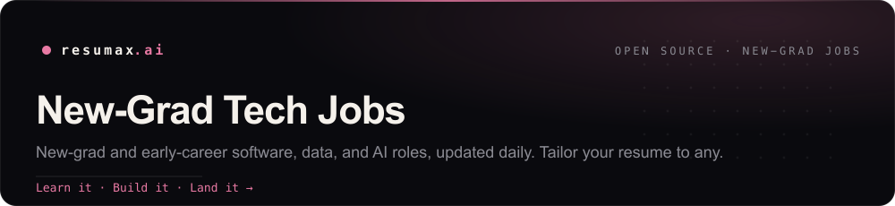

  

# New-Grad Tech Jobs

Open **new-grad** software, data, AI/ML, security, and hardware roles **posted in the last 30 days**, refreshed daily. We filter out senior, staff, and lead postings, dedupe across job boards, and drop anything older than 30 days, so the list stays fresh and actually open. Every role links into [ResuMax](https://resumax.ai/?utm_source=github&utm_medium=repo&utm_campaign=new-grad-tech-jobs&utm_content=intro), where **Atlas**, our AI career copilot, tailors your resume to it and preps you to ace the interview.

  

### Prepare a truthful, role-specific application.

**[Tailor your resume to any role above &rarr;](https://resumax.ai/?utm_source=github&utm_medium=repo&utm_campaign=new-grad-tech-jobs&utm_content=cta-link)**

Atlas compares the posting with your confirmed experience, prepares reviewable resume suggestions, and builds a focused coding, system-design, and behavioral interview plan. It never invents experience or submits an application for you.

**Found a role we're missing or a dead link?** [Open an issue](../../issues/new) and we'll fold it in.

## Open new-grad roles from the last 30 days

**2232** open roles from the last 30 days, newest first. Jump to a category:

**[Software Engineering](#software-engineering)** &nbsp;·&nbsp; 1183 open  
**[Data, AI & ML](#data-ai-and-ml)** &nbsp;·&nbsp; 511 open  
**[Security](#security)** &nbsp;·&nbsp; 80 open  
**[DevOps, Infra & Cloud](#devops-infra-and-cloud)** &nbsp;·&nbsp; 317 open  
**[Mobile](#mobile)** &nbsp;·&nbsp; 36 open  
**[Hardware & Embedded](#hardware-and-embedded)** &nbsp;·&nbsp; 105 open  

🌐 Remote &nbsp;·&nbsp; 🆕 Posted this week

## Software Engineering

| Company | Role | Location | Apply | Tailor | Age |
|---|---|---|:--:|:--:|--:|
| **[Turner & Townsend](https://resumax.ai/companies/turner-and-townsend?utm_source=github&utm_medium=repo&utm_campaign=new-grad-tech-jobs)** 🆕 | SharePoint Developer / Consultant - M365 | London, United Kingdom, gb | [Apply](https://jobs.smartrecruiters.com/turnertownsend/744000152685109) |  | 0d |
| **[Stripe](https://resumax.ai/companies/stripe?utm_source=github&utm_medium=repo&utm_campaign=new-grad-tech-jobs)** 🌐 🆕 | Abuse Research Engineer | US - Remote | [Apply](https://stripe.com/jobs/search?gh_jid=8240322) |  | 0d |
| **[Bet365](https://resumax.ai/companies/bet365?utm_source=github&utm_medium=repo&utm_campaign=new-grad-tech-jobs)** 🆕 | Software Tester, Martech | Manchester, England, gb | [Apply](https://jobs.smartrecruiters.com/bet3651/744000152682419) |  | 0d |
| **[Renesas Electronics](https://resumax.ai/companies/renesas-electronics?utm_source=github&utm_medium=repo&utm_campaign=new-grad-tech-jobs)** 🆕 | Software QA Engineer | Bengaluru, KA, in | [Apply](https://jobs.smartrecruiters.com/renesaselectronics/744000152670510) |  | 0d |
| **[NielsenIQ](https://resumax.ai/companies/nielseniq?utm_source=github&utm_medium=repo&utm_campaign=new-grad-tech-jobs)** 🆕 | Software Engineer (Frontend) | Pune, MH, in | [Apply](https://jobs.smartrecruiters.com/nielseniq/744000152651685) |  | 0d |
| **[The Nielsen Company](https://resumax.ai/companies/the-nielsen-company?utm_source=github&utm_medium=repo&utm_campaign=new-grad-tech-jobs)** 🆕 | Workforce Software consultant II | Hyderabad, in | [Apply](https://jobs.smartrecruiters.com/thenielsencompany/3743990015791355) |  | 0d |
| **[Sopra Steria](https://resumax.ai/companies/sopra-steria?utm_source=github&utm_medium=repo&utm_campaign=new-grad-tech-jobs)** 🆕 | Stage - Développeur/euse Fullstack - Angular Node.js -… | Lyon, Auvergne-Rhône-Alpes, fr | [Apply](https://jobs.smartrecruiters.com/soprasteria1/744000152637128) |  | 0d |
| **[Netcompany](https://resumax.ai/companies/netcompany?utm_source=github&utm_medium=repo&utm_campaign=new-grad-tech-jobs)** 🆕 | Software Developer - Java Experience | Edinburgh, Scotland, gb | [Apply](https://jobs.smartrecruiters.com/netcompany1/744000152630483) |  | 0d |
| **[Iwoca.co.uk](https://resumax.ai/companies/iwoca-co-uk?utm_source=github&utm_medium=repo&utm_campaign=new-grad-tech-jobs)** 🌐 🆕 | Backend Engineer - Acquisition Technology | London | [Apply](https://jobs.ashbyhq.com/iwoca.co.uk/695abfea-1dd0-407f-b6a9-ebceee43ccb2/application) |  | 0d |
| **[Sportradar](https://resumax.ai/companies/sportradar?utm_source=github&utm_medium=repo&utm_campaign=new-grad-tech-jobs)** 🆕 | Software Developer - Go or PHP | Warsaw, pl | [Apply](https://jobs.smartrecruiters.com/sportradar/744000152624331) |  | 0d |
| **[Experian](https://resumax.ai/companies/experian?utm_source=github&utm_medium=repo&utm_campaign=new-grad-tech-jobs)** 🆕 | Junior Software Engineer | Sofia, bg | [Apply](https://jobs.smartrecruiters.com/Experian/744000152622249) |  | 0d |
| **[iCapital](https://resumax.ai/companies/icapital?utm_source=github&utm_medium=repo&utm_campaign=new-grad-tech-jobs)** 🆕 | UiPath - RPA Developer (Python) -  Associate | Lisbon, Portugal | [Apply](https://job-boards.greenhouse.io/icapitalnetwork/jobs/8844044002) |  | 0d |
| **[Tenstorrent](https://resumax.ai/companies/tenstorrent?utm_source=github&utm_medium=repo&utm_campaign=new-grad-tech-jobs)** 🆕 | Forward Deployed Engineer | Tokyo, Japan | [Apply](https://job-boards.greenhouse.io/tenstorrent/jobs/5251871007) |  | 0d |
| **[Wavestone](https://resumax.ai/companies/wavestone?utm_source=github&utm_medium=repo&utm_campaign=new-grad-tech-jobs)** 🆕 | Stage de césure – Business Developer Grand Compte – Bureau de… | Nantes, Pays de la Loire, fr | [Apply](https://jobs.smartrecruiters.com/wavestone1/744000152607559) |  | 0d |
| **[Bosch Group](https://resumax.ai/companies/bosch-group?utm_source=github&utm_medium=repo&utm_campaign=new-grad-tech-jobs)** 🆕 | Backend Entwickler C#/.NET (w/m/div.) | Linz, Oberösterreich, at | [Apply](https://jobs.smartrecruiters.com/boschgroup/744000152602924) |  | 0d |
| **[Necsws](https://resumax.ai/companies/necsws?utm_source=github&utm_medium=repo&utm_campaign=new-grad-tech-jobs)** 🆕 | Software Engineer - Full Stack Developer (Java+React) | Pune, MH, in | [Apply](https://jobs.smartrecruiters.com/necsws/744000152589569) |  | 0d |
| **[Eurofins](https://resumax.ai/companies/eurofins?utm_source=github&utm_medium=repo&utm_campaign=new-grad-tech-jobs)** 🆕 | SOFTWARE ENGINEER | Bengaluru, KA, in | [Apply](https://jobs.smartrecruiters.com/eurofins/744000152589419) |  | 0d |
| **[Clera](https://resumax.ai/companies/clera?utm_source=github&utm_medium=repo&utm_campaign=new-grad-tech-jobs)** 🆕 | Software Engineer | San Francisco | [Apply](https://jobs.ashbyhq.com/clera/fb394591-0d62-4ee8-91c0-cbefe98b9ea5/application) |  | 0d |
| **[Beacon AI](https://resumax.ai/companies/beacon-ai?utm_source=github&utm_medium=repo&utm_campaign=new-grad-tech-jobs)** 🆕 | Software Engineer, Frontend/Web App | San Carlos  - Hybrid | [Apply](https://jobs.ashbyhq.com/beaconai/952e9b77-d6ec-4877-89d5-69462e76a444/application) |  | 0d |
| **[Saalex](https://resumax.ai/companies/saalex?utm_source=github&utm_medium=repo&utm_campaign=new-grad-tech-jobs)** 🆕 | Journeyman Software Developer | Patuxent River, Maryland, United States | [Apply](https://apply.workable.com/j/ABC5ECA0D9/apply) |  | 0d |
| **[Bet365](https://resumax.ai/companies/bet365?utm_source=github&utm_medium=repo&utm_campaign=new-grad-tech-jobs)** 🆕 | Software Tester, Martech | Stoke-on-Trent, England, gb | [Apply](https://jobs.smartrecruiters.com/bet3651/744000152683380) |  | 0d |
| **[Renesas Electronics](https://resumax.ai/companies/renesas-electronics?utm_source=github&utm_medium=repo&utm_campaign=new-grad-tech-jobs)** 🆕 | Junior Application Engineer | Lviv, ua | [Apply](https://jobs.smartrecruiters.com/renesaselectronics/744000152628190) |  | 0d |
| **[Sopra Steria](https://resumax.ai/companies/sopra-steria?utm_source=github&utm_medium=repo&utm_campaign=new-grad-tech-jobs)** 🆕 | Stage Développeur(euse) Full-stack – Défense et Sécurité - Tours | Tours, Centre-Val de Loire, fr | [Apply](https://jobs.smartrecruiters.com/soprasteria1/744000152622808) |  | 0d |
| **[Bosch Group](https://resumax.ai/companies/bosch-group?utm_source=github&utm_medium=repo&utm_campaign=new-grad-tech-jobs)** 🆕 | QA Test Developer | bangalore, in | [Apply](https://jobs.smartrecruiters.com/boschgroup/744000152590698) |  | 0d |
| **[Clera](https://resumax.ai/companies/clera?utm_source=github&utm_medium=repo&utm_campaign=new-grad-tech-jobs)** 🆕 | Founding Engineer | San Francisco | [Apply](https://jobs.ashbyhq.com/clera/dc1cb8aa-bb8c-4602-aef6-22bda028d5c2/application) |  | 0d |
| **[Bet365](https://resumax.ai/companies/bet365?utm_source=github&utm_medium=repo&utm_campaign=new-grad-tech-jobs)** 🆕 | Software Developer, Data Platform | Manchester, England, gb | [Apply](https://jobs.smartrecruiters.com/bet3651/744000152682758) |  | 0d |
| **[Renesas Electronics](https://resumax.ai/companies/renesas-electronics?utm_source=github&utm_medium=repo&utm_campaign=new-grad-tech-jobs)** 🆕 | Software Engineer – Frontend Developer (Angular) | Bangalore, in | [Apply](https://jobs.smartrecruiters.com/renesaselectronics/744000152607589) |  | 0d |
| **[Bet365](https://resumax.ai/companies/bet365?utm_source=github&utm_medium=repo&utm_campaign=new-grad-tech-jobs)** 🆕 | Software Developer, Data Platform | Stoke-on-Trent, England, gb | [Apply](https://jobs.smartrecruiters.com/bet3651/744000152682548) |  | 0d |
| **[Egis Group](https://resumax.ai/companies/egis-group?utm_source=github&utm_medium=repo&utm_campaign=new-grad-tech-jobs)** 🆕 | Design Engineer - Structural | Dubai, Dubai, ae | [Apply](https://jobs.smartrecruiters.com/egisgroup/744000152547394) |  | 0d |
| **[Open AI](https://resumax.ai/companies/open-ai?utm_source=github&utm_medium=repo&utm_campaign=new-grad-tech-jobs)** 🌐 🆕 | Software Engineer, Implicit Signals | San Francisco | [Apply](https://jobs.ashbyhq.com/openai/c7bcdaec-9714-44b0-8ba8-adc824594b54/application) |  | 0d |
| **[Brinc](https://resumax.ai/companies/brinc?utm_source=github&utm_medium=repo&utm_campaign=new-grad-tech-jobs)** 🌐 🆕 | Fullstack Software Engineer, LiveOps | Seattle, WA | [Apply](https://jobs.ashbyhq.com/brinc/c581ceaf-2ffd-4b3c-9e19-1c96d842679a/application) |  | 0d |
| **[Clera](https://resumax.ai/companies/clera?utm_source=github&utm_medium=repo&utm_campaign=new-grad-tech-jobs)** 🆕 | Design Engineer | San Francisco | [Apply](https://jobs.ashbyhq.com/clera/75a37502-4e2f-4f02-8b8a-97d6e9d6568e/application) |  | 1d |
| **[Erg](https://resumax.ai/companies/erg?utm_source=github&utm_medium=repo&utm_campaign=new-grad-tech-jobs)** 🆕 | Power BI Developer | Washington, DC | [Apply](https://jobs.lever.co/erg/b6fd32ca-e15e-4abf-b2fd-8a1e7498ab5a/apply) |  | 1d |
| **[Arista Networks](https://resumax.ai/companies/arista-networks?utm_source=github&utm_medium=repo&utm_campaign=new-grad-tech-jobs)** 🆕 | Software Engineer Graduate 2026/2027 | Dublin, County Dublin, ie | [Apply](https://jobs.smartrecruiters.com/aristanetworks/744000152521250) |  | 1d |
| **[SBT Global, Inc.](https://resumax.ai/companies/sbt-global-inc?utm_source=github&utm_medium=repo&utm_campaign=new-grad-tech-jobs)** 🌐 🆕 | Jr. Front-End Developer(Korean Bilingual) | Plano, TX, us | [Apply](https://jobs.smartrecruiters.com/sbtglobalinc/3743990015776746) |  | 1d |
| **[Smiths Group](https://resumax.ai/companies/smiths-group?utm_source=github&utm_medium=repo&utm_campaign=new-grad-tech-jobs)** 🆕 | Software Test Engineer | Edgewood, MD, us | [Apply](https://jobs.smartrecruiters.com/smithsgroup2/744000152512909) |  | 1d |
| **[Bosch Group](https://resumax.ai/companies/bosch-group?utm_source=github&utm_medium=repo&utm_campaign=new-grad-tech-jobs)** 🆕 | Software Developer | hosur road bangalore, in | [Apply](https://jobs.smartrecruiters.com/boschgroup/744000152511008) |  | 1d |
| **[PlayStation Global](https://resumax.ai/companies/playstation-global?utm_source=github&utm_medium=repo&utm_campaign=new-grad-tech-jobs)** 🆕 | Service Reliability Engineer | Australia, Adelaide | [Apply](https://job-boards.greenhouse.io/sonyinteractiveentertainmentglobal/jobs/6211020004) |  | 1d |
| **[Relativity Space](https://resumax.ai/companies/relativity-space?utm_source=github&utm_medium=repo&utm_campaign=new-grad-tech-jobs)** 🆕 | Software Engineer II (Ground Software) | Long Beach, California, United States | [Apply](https://boards.greenhouse.io/relativity/jobs/8843637002?gh_jid=8843637002) |  | 1d |
| **[AbbVie](https://resumax.ai/companies/abbvie?utm_source=github&utm_medium=repo&utm_campaign=new-grad-tech-jobs)** 🆕 | Scientist II, LNP Platform | Worcester, MA, us | [Apply](https://jobs.smartrecruiters.com/abbvie/3743990015772856) |  | 1d |
| **[Assystem](https://resumax.ai/companies/assystem?utm_source=github&utm_medium=repo&utm_campaign=new-grad-tech-jobs)** 🆕 | Développeur Full Stack H/F | Courbevoie, IDF, fr | [Apply](https://jobs.smartrecruiters.com/assystem/744000152490339) |  | 1d |
| **[Varda Space Industries](https://resumax.ai/companies/varda-space-industries?utm_source=github&utm_medium=repo&utm_campaign=new-grad-tech-jobs)** 🆕 | Spacecraft Build Reliability Engineer II | El Segundo, California, United States | [Apply](https://job-boards.greenhouse.io/vardaspace/jobs/8008318003) |  | 1d |
| **[Intuitive](https://resumax.ai/companies/intuitive?utm_source=github&utm_medium=repo&utm_campaign=new-grad-tech-jobs)** 🆕 | RISE Software Engineer | Sunnyvale, CA, us | [Apply](https://jobs.smartrecruiters.com/intuitive/744000152472854) |  | 1d |
| **[Syncreon Consulting](https://resumax.ai/companies/syncreon-consulting?utm_source=github&utm_medium=repo&utm_campaign=new-grad-tech-jobs)** 🆕 | Vice President, Full Stack Engineer | Pittsburgh, PA, us | [Apply](https://jobs.smartrecruiters.com/syncreonconsulting/744000152470451) |  | 1d |
| **[Accenture Federal Services](https://resumax.ai/companies/accenture-federal-services?utm_source=github&utm_medium=repo&utm_campaign=new-grad-tech-jobs)** 🆕 | Full Stack Software Engineer | Suitland, MD | [Apply](https://boards.greenhouse.io/accenturefederalservices/jobs/4717477006?gh_jid=4717477006) |  | 1d |
| **[Osmo](https://resumax.ai/companies/osmo?utm_source=github&utm_medium=repo&utm_campaign=new-grad-tech-jobs)** 🆕 | Software, TPM | Elizabeth, NJ | [Apply](https://jobs.ashbyhq.com/osmo/64356bd6-0598-40d0-b068-7e7f5b3143f0/application) |  | 1d |
| **[Spotify](https://resumax.ai/companies/spotify?utm_source=github&utm_medium=repo&utm_campaign=new-grad-tech-jobs)** 🆕 | Backend Engineer - Music | New York, NY | [Apply](https://jobs.lever.co/spotify/65d6caca-6d7c-4049-8256-a128e0e7249e/apply) |  | 1d |
| **[Renesas Electronics](https://resumax.ai/companies/renesas-electronics?utm_source=github&utm_medium=repo&utm_campaign=new-grad-tech-jobs)** 🆕 | Associate Reliability Engineer | Palm Bay, Florida, us | [Apply](https://jobs.smartrecruiters.com/renesaselectronics/744000152431002) |  | 1d |
| **[Eurofins](https://resumax.ai/companies/eurofins?utm_source=github&utm_medium=repo&utm_campaign=new-grad-tech-jobs)** 🆕 | Entry Level Application Engineer | Lancaster, PA, us | [Apply](https://jobs.smartrecruiters.com/eurofins/744000152416389) |  | 1d |
| **[Sopra Steria](https://resumax.ai/companies/sopra-steria?utm_source=github&utm_medium=repo&utm_campaign=new-grad-tech-jobs)** 🆕 | Junior Salesforce Developer | Pozzuoli, Campania, it | [Apply](https://jobs.smartrecruiters.com/soprasteria1/744000152408634) |  | 1d |
| **[Uipath](https://resumax.ai/companies/uipath?utm_source=github&utm_medium=repo&utm_campaign=new-grad-tech-jobs)** 🆕 | Software Engineer II | Bangalore - Engineering | [Apply](https://jobs.ashbyhq.com/uipath/4a6e6497-c17e-45d3-b989-985d60a193ff/application) |  | 1d |
| **[Axon](https://resumax.ai/companies/axon?utm_source=github&utm_medium=repo&utm_campaign=new-grad-tech-jobs)** 🆕 | Graduate Software Engineer | Ho Chi Minh City, Ho Chi Minh City, Vietnam | [Apply](https://job-boards.greenhouse.io/axon/jobs/8008025003) |  | 1d |
| **[Jobs for Humanity](https://resumax.ai/companies/jobs-for-humanity?utm_source=github&utm_medium=repo&utm_campaign=new-grad-tech-jobs)** 🆕 | Fullstack Developer (.NET / Reactjs) - 2 positions | Ho Chi Minh City, Ho Chi Minh, vn | [Apply](https://jobs.smartrecruiters.com/jobsforhumanity/744000152383649) |  | 1d |
| **[Necsws](https://resumax.ai/companies/necsws?utm_source=github&utm_medium=repo&utm_campaign=new-grad-tech-jobs)** 🆕 | SSE/ LSE- .Net fullstack + Copilot | Mumbai, MH, in | [Apply](https://jobs.smartrecruiters.com/necsws/744000152365569) |  | 1d |
| **[Elwood Technologies](https://resumax.ai/companies/elwood-technologies?utm_source=github&utm_medium=repo&utm_campaign=new-grad-tech-jobs)** 🆕 | Graduate/Junior Software Engineer | London | [Apply](https://job-boards.greenhouse.io/elwoodtechnologies/jobs/6209718004) |  | 1d |
| **[Bertelsmann-jobs](https://resumax.ai/companies/bertelsmann-jobs?utm_source=github&utm_medium=repo&utm_campaign=new-grad-tech-jobs)** 🆕 | Atlassian Forge Developer | Kuala Lumpur, my | [Apply](https://jobs.smartrecruiters.com/bertelsmann-jobs/744000152351790) |  | 1d |
| **[Trading212](https://resumax.ai/companies/trading212?utm_source=github&utm_medium=repo&utm_campaign=new-grad-tech-jobs)** 🌐 🆕 | Mid Frontend Engineer | Bulgaria | [Apply](https://jobs.ashbyhq.com/trading212/bd9e8f64-77e6-4fc8-93f8-bcd27ac834d3/application) |  | 1d |
| **[ServiceNow](https://resumax.ai/companies/servicenow?utm_source=github&utm_medium=repo&utm_campaign=new-grad-tech-jobs)** 🆕 | Software Engineer | Hyderabad, in | [Apply](https://jobs.smartrecruiters.com/servicenow/744000152325889) |  | 1d |
| **[LinkedIn](https://resumax.ai/companies/linkedin?utm_source=github&utm_medium=repo&utm_campaign=new-grad-tech-jobs)** 🆕 | Software Engineer - Applications | Mountain View, CA, us | [Apply](https://jobs.smartrecruiters.com/linkedin3/744000152324259) |  | 1d |
| **[Field Ai](https://resumax.ai/companies/field-ai?utm_source=github&utm_medium=repo&utm_campaign=new-grad-tech-jobs)** 🆕 | Research / Software Engineer - Humanoid Whole Body Learning | Boston, MA | [Apply](https://jobs.lever.co/field-ai/09def7d8-26bf-451f-a4f2-bd8fd4c5f5cf/apply) |  | 1d |
| **[Stripe](https://resumax.ai/companies/stripe?utm_source=github&utm_medium=repo&utm_campaign=new-grad-tech-jobs)** 🆕 | Full Stack Engineer, Enterprise Engineering | N/A | [Apply](https://stripe.com/jobs/search?gh_jid=8214618) |  | 1d |
| **[OneImaging](https://resumax.ai/companies/oneimaging?utm_source=github&utm_medium=repo&utm_campaign=new-grad-tech-jobs)** 🆕 | Full Stack Associate Software Engineer (UMiami Only) | Miami | [Apply](https://job-boards.greenhouse.io/oneimaging/jobs/4423640009) |  | 1d |
| **[SpaceX](https://resumax.ai/companies/spacex?utm_source=github&utm_medium=repo&utm_campaign=new-grad-tech-jobs)** 🆕 | New Graduate Engineer, Software (Starfall) | Hawthorne, CA | [Apply](https://boards.greenhouse.io/spacex/jobs/8854394002?gh_jid=8854394002) |  | 1d |
| **[Sika AG](https://resumax.ai/companies/sika-ag?utm_source=github&utm_medium=repo&utm_campaign=new-grad-tech-jobs)** 🆕 | Management Trainee – Design Engineering | Suzhou, Jiangsu, cn | [Apply](https://jobs.smartrecruiters.com/sikaag/744000152291569) |  | 1d |
| **[Credence](https://resumax.ai/companies/credence?utm_source=github&utm_medium=repo&utm_campaign=new-grad-tech-jobs)** 🆕 | Software Engineer | Robins Air Force Base, Georgia, United States | [Apply](https://apply.workable.com/j/C4F8026136/apply) |  | 1d |
| **[Fasanara](https://resumax.ai/companies/fasanara?utm_source=github&utm_medium=repo&utm_campaign=new-grad-tech-jobs)** 🆕 | Junior Java Software Developer | London, England, United Kingdom | [Apply](https://apply.workable.com/j/4DA6141E33/apply) |  | 1d |
| **[Focus Group](https://resumax.ai/companies/focus-group?utm_source=github&utm_medium=repo&utm_campaign=new-grad-tech-jobs)** 🆕 | PHP Developer 12-Month FTC | Shoreham-by-Sea, England, United Kingdom | [Apply](https://apply.workable.com/j/64A31D4390/apply) |  | 1d |
| **[InterImage](https://resumax.ai/companies/interimage?utm_source=github&utm_medium=repo&utm_campaign=new-grad-tech-jobs)** 🌐 🆕 | RPA Developer | United States | [Apply](https://apply.workable.com/j/F2999E85BD/apply) |  | 1d |
| **[Nu Quantum Ltd](https://resumax.ai/companies/nu-quantum-ltd?utm_source=github&utm_medium=repo&utm_campaign=new-grad-tech-jobs)** 🆕 | Photonics Design Engineer | Cambridge, England, United Kingdom | [Apply](https://apply.workable.com/j/65B3BEBDCA/apply) |  | 1d |
| **[Oxford Quantum Circuits](https://resumax.ai/companies/oxford-quantum-circuits?utm_source=github&utm_medium=repo&utm_campaign=new-grad-tech-jobs)** 🆕 | Quantum Software Engineer | London, England, United Kingdom | [Apply](https://apply.workable.com/j/93F7657F3F/apply) |  | 1d |
| **[Sigma Defense](https://resumax.ai/companies/sigma-defense?utm_source=github&utm_medium=repo&utm_campaign=new-grad-tech-jobs)** 🆕 | 1564 - Software Engineer II | Ridgecrest, California, United States | [Apply](https://apply.workable.com/j/BC14FB8B57/apply) |  | 1d |
| **[Valsoft Corporation](https://resumax.ai/companies/valsoft-corporation?utm_source=github&utm_medium=repo&utm_campaign=new-grad-tech-jobs)** 🌐 🆕 | Développeur(se) logiciel, imagerie médicale / Software… | Canada | [Apply](https://apply.workable.com/j/ED4A93A970/apply) |  | 1d |
| **[Clera](https://resumax.ai/companies/clera?utm_source=github&utm_medium=repo&utm_campaign=new-grad-tech-jobs)** 🆕 | Founding Engineer | San Francisco | [Apply](https://jobs.ashbyhq.com/clera/aaeb7cd1-b2b8-4c1c-9a41-1c90cac06b01/application) |  | 1d |
| **[Bosch Group](https://resumax.ai/companies/bosch-group?utm_source=github&utm_medium=repo&utm_campaign=new-grad-tech-jobs)** 🆕 | C# & C++ developer | hosur road bangalore, in | [Apply](https://jobs.smartrecruiters.com/boschgroup/744000152510308) |  | 1d |
| **[Assystem](https://resumax.ai/companies/assystem?utm_source=github&utm_medium=repo&utm_campaign=new-grad-tech-jobs)** 🆕 | Electrical Design Engineer | Bengaluru, KA, in | [Apply](https://jobs.smartrecruiters.com/assystem/744000152332249) |  | 1d |
| **[Accenture Federal Services](https://resumax.ai/companies/accenture-federal-services?utm_source=github&utm_medium=repo&utm_campaign=new-grad-tech-jobs)** 🆕 | Software Developer | Washington, DC | [Apply](https://boards.greenhouse.io/accenturefederalservices/jobs/4716667006?gh_jid=4716667006) |  | 1d |
| **[Renesas Electronics](https://resumax.ai/companies/renesas-electronics?utm_source=github&utm_medium=repo&utm_campaign=new-grad-tech-jobs)** 🆕 | Equipment Maintenance Technician– Backend (Final Test) | Bayan Lepas, my | [Apply](https://jobs.smartrecruiters.com/renesaselectronics/744000152289379) |  | 1d |
| **[Eurofins](https://resumax.ai/companies/eurofins?utm_source=github&utm_medium=repo&utm_campaign=new-grad-tech-jobs)** 🆕 | Software Engineer | Bengaluru, KA, in | [Apply](https://jobs.smartrecruiters.com/eurofins/744000152374389) |  | 1d |
| **[Sopra Steria](https://resumax.ai/companies/sopra-steria?utm_source=github&utm_medium=repo&utm_campaign=new-grad-tech-jobs)** 🆕 | Fullstack .NET Developer | Nieuwegein, UT, nl | [Apply](https://jobs.smartrecruiters.com/soprasteria1/744000152379209) |  | 1d |
| **[Necsws](https://resumax.ai/companies/necsws?utm_source=github&utm_medium=repo&utm_campaign=new-grad-tech-jobs)** 🆕 | Frontend Developer - Angular | Mumbai, MH, in | [Apply](https://jobs.smartrecruiters.com/necsws/744000152342390) |  | 1d |
| **[Trading212](https://resumax.ai/companies/trading212?utm_source=github&utm_medium=repo&utm_campaign=new-grad-tech-jobs)** 🌐 🆕 | Mid Backend Engineer | Bulgaria | [Apply](https://jobs.ashbyhq.com/trading212/ab06e0c4-acc1-4ede-862d-1630efeefcd3/application) |  | 1d |
| **[Stripe](https://resumax.ai/companies/stripe?utm_source=github&utm_medium=repo&utm_campaign=new-grad-tech-jobs)** 🆕 | Full Stack Engineer, Enterprise Engineering | N/A | [Apply](https://stripe.com/jobs/search?gh_jid=8214616) |  | 1d |
| **[SpaceX](https://resumax.ai/companies/spacex?utm_source=github&utm_medium=repo&utm_campaign=new-grad-tech-jobs)** 🆕 | Design Reliability Engineer (Crew Starship) | Hawthorne, CA | [Apply](https://boards.greenhouse.io/spacex/jobs/8842018002?gh_jid=8842018002) |  | 1d |
| **[Sigma Defense](https://resumax.ai/companies/sigma-defense?utm_source=github&utm_medium=repo&utm_campaign=new-grad-tech-jobs)** 🆕 | 1710 - Software Engineer II | Huntsville, Alabama, United States | [Apply](https://apply.workable.com/j/65D73A4611/apply) |  | 1d |
| **[Valsoft Corporation](https://resumax.ai/companies/valsoft-corporation?utm_source=github&utm_medium=repo&utm_campaign=new-grad-tech-jobs)** 🆕 | Full Stack Developer - VAS | Beirut, Beirut Governorate, Lebanon | [Apply](https://apply.workable.com/j/E58A00B562/apply) |  | 1d |
| **[Clera](https://resumax.ai/companies/clera?utm_source=github&utm_medium=repo&utm_campaign=new-grad-tech-jobs)** 🌐 🆕 | Founding Engineer | New York | [Apply](https://jobs.ashbyhq.com/clera/ff9d5054-d0cf-457a-8e8a-ad6084cdc8e9/application) |  | 1d |
| **[Bosch Group](https://resumax.ai/companies/bosch-group?utm_source=github&utm_medium=repo&utm_campaign=new-grad-tech-jobs)** 🆕 | C# & C++ developer | hosur road bangalore, in | [Apply](https://jobs.smartrecruiters.com/boschgroup/744000152442368) |  | 1d |
| **[Accenture Federal Services](https://resumax.ai/companies/accenture-federal-services?utm_source=github&utm_medium=repo&utm_campaign=new-grad-tech-jobs)** 🆕 | Jira Developer | Washington, DC | [Apply](https://boards.greenhouse.io/accenturefederalservices/jobs/4717378006?gh_jid=4717378006) |  | 1d |
| **[Sopra Steria](https://resumax.ai/companies/sopra-steria?utm_source=github&utm_medium=repo&utm_campaign=new-grad-tech-jobs)** 🆕 | .NET Developer | Nieuwegein, UT, nl | [Apply](https://jobs.smartrecruiters.com/soprasteria1/744000152379119) |  | 1d |
| **[Trading212](https://resumax.ai/companies/trading212?utm_source=github&utm_medium=repo&utm_campaign=new-grad-tech-jobs)** 🌐 🆕 | Junior Frontend Engineer | Bulgaria | [Apply](https://jobs.ashbyhq.com/trading212/ba789615-ee3c-477b-8fe6-1974c480c2da/application) |  | 1d |
| **[SpaceX](https://resumax.ai/companies/spacex?utm_source=github&utm_medium=repo&utm_campaign=new-grad-tech-jobs)** 🆕 | Design Reliability Engineer (Crew Starship) | Starbase, TX | [Apply](https://boards.greenhouse.io/spacex/jobs/8842004002?gh_jid=8842004002) |  | 1d |
| **[Sigma Defense](https://resumax.ai/companies/sigma-defense?utm_source=github&utm_medium=repo&utm_campaign=new-grad-tech-jobs)** 🆕 | 1760 - Application Developer | Dahlgren, Virginia, United States | [Apply](https://apply.workable.com/j/978BE86C01/apply) |  | 1d |
| **[Valsoft Corporation](https://resumax.ai/companies/valsoft-corporation?utm_source=github&utm_medium=repo&utm_campaign=new-grad-tech-jobs)** 🌐 🆕 | Software Developer (Medical Imaging / PACS) | United States | [Apply](https://apply.workable.com/j/70378EA31E/apply) |  | 1d |
| **[Clera](https://resumax.ai/companies/clera?utm_source=github&utm_medium=repo&utm_campaign=new-grad-tech-jobs)** 🆕 | Founding Engineer | Munich | [Apply](https://jobs.ashbyhq.com/clera/cf99f2d4-2a38-4d2d-b5f7-da4247824a2b/application) |  | 1d |
| **[Bosch Group](https://resumax.ai/companies/bosch-group?utm_source=github&utm_medium=repo&utm_campaign=new-grad-tech-jobs)** 🆕 | ECF注塑机械设计工程师ECF Design Engineer_PS | Changsha, cn | [Apply](https://jobs.smartrecruiters.com/boschgroup/744000152440879) |  | 1d |
| **[Trading212](https://resumax.ai/companies/trading212?utm_source=github&utm_medium=repo&utm_campaign=new-grad-tech-jobs)** 🌐 🆕 | Junior Backend Engineer | Bulgaria | [Apply](https://jobs.ashbyhq.com/trading212/4ece0a7b-c53e-4771-a8fd-ef82495226c1/application) |  | 1d |
| **[Clera](https://resumax.ai/companies/clera?utm_source=github&utm_medium=repo&utm_campaign=new-grad-tech-jobs)** 🌐 🆕 | Founding Engineer | New York | [Apply](https://jobs.ashbyhq.com/clera/578d175e-37ab-4abf-8016-973e82b4dbb3/application) |  | 1d |
| **[Bosch Group](https://resumax.ai/companies/bosch-group?utm_source=github&utm_medium=repo&utm_campaign=new-grad-tech-jobs)** 🆕 | C# & WPF,  Autofac developer | hosur road bangalore, in | [Apply](https://jobs.smartrecruiters.com/boschgroup/744000152438015) |  | 1d |
| **[Bosch Group](https://resumax.ai/companies/bosch-group?utm_source=github&utm_medium=repo&utm_campaign=new-grad-tech-jobs)** 🆕 | Software Developer | hosur road bangalore, in | [Apply](https://jobs.smartrecruiters.com/boschgroup/744000152431390) |  | 1d |
| **[Bosch Group](https://resumax.ai/companies/bosch-group?utm_source=github&utm_medium=repo&utm_campaign=new-grad-tech-jobs)** 🆕 | Software Developer | hosur road bangalore, in | [Apply](https://jobs.smartrecruiters.com/boschgroup/744000152431380) |  | 1d |
| **[Bosch Group](https://resumax.ai/companies/bosch-group?utm_source=github&utm_medium=repo&utm_campaign=new-grad-tech-jobs)** 🆕 | 2026/03: HW Developer (PS-DC Projects) | bengaluru, in | [Apply](https://jobs.smartrecruiters.com/boschgroup/744000152388899) |  | 1d |
| **[Bosch Group](https://resumax.ai/companies/bosch-group?utm_source=github&utm_medium=repo&utm_campaign=new-grad-tech-jobs)** 🆕 | Salesforce Developer | bengaluru, in | [Apply](https://jobs.smartrecruiters.com/boschgroup/744000152363648) |  | 1d |
| **[Bosch Group](https://resumax.ai/companies/bosch-group?utm_source=github&utm_medium=repo&utm_campaign=new-grad-tech-jobs)** 🆕 | Application Software Development Engineer | Manisa, tr | [Apply](https://jobs.smartrecruiters.com/boschgroup/744000152360150) |  | 1d |
| **[Bosch Group](https://resumax.ai/companies/bosch-group?utm_source=github&utm_medium=repo&utm_campaign=new-grad-tech-jobs)** 🆕 | C# & C++ developer | hosur road bangalore, in | [Apply](https://jobs.smartrecruiters.com/boschgroup/744000152327948) |  | 1d |
| **[Woongjin, Inc](https://resumax.ai/companies/woongjin-inc?utm_source=github&utm_medium=repo&utm_campaign=new-grad-tech-jobs)** 🆕 | Jr. Java Developer- Bilingual (Korean/ English) | Plano, TX, us | [Apply](https://jobs.smartrecruiters.com/wjcompany/744000152288559) |  | 1d |
| **[Margo Group](https://resumax.ai/companies/margo-group?utm_source=github&utm_medium=repo&utm_campaign=new-grad-tech-jobs)** 🆕 | Data Platform Product Owner / Business Analyst | Warsaw | [Apply](https://jobs.lever.co/margo-group/227cc1e8-7106-441b-af26-436cbdf9caa8/apply) |  | 1d |
| **[Benchling](https://resumax.ai/companies/benchling?utm_source=github&utm_medium=repo&utm_campaign=new-grad-tech-jobs)** 🌐 🆕 | Software Engineer, Full Stack (Process Execution) | San Francisco, CA | [Apply](https://jobs.ashbyhq.com/benchling/9b850e1f-1ba8-47e3-9057-0562e0739e6f/application) |  | 1d |
| **[Open AI](https://resumax.ai/companies/open-ai?utm_source=github&utm_medium=repo&utm_campaign=new-grad-tech-jobs)** 🌐 🆕 | Software Engineer, Product Velocity | San Francisco | [Apply](https://jobs.ashbyhq.com/openai/9909555b-3dc4-4ba2-859e-43eae7c97a34/application) |  | 1d |
| **[Anduril Industries](https://resumax.ai/companies/anduril-industries?utm_source=github&utm_medium=repo&utm_campaign=new-grad-tech-jobs)** 🆕 | Software Engineer (Unity) | Bellevue, Washington, United States | [Apply](https://boards.greenhouse.io/andurilindustries/jobs/5231763007?gh_jid=5231763007) |  | 1d |
| **[Blend360](https://resumax.ai/companies/blend360?utm_source=github&utm_medium=repo&utm_campaign=new-grad-tech-jobs)** 🌐 🆕 | Full Stack Developer | Columbia, MD, us | [Apply](https://jobs.smartrecruiters.com/blend360/744000152273429) |  | 1d |
| **[City of Philadelphia](https://resumax.ai/companies/city-of-philadelphia?utm_source=github&utm_medium=repo&utm_campaign=new-grad-tech-jobs)** 🆕 | Software Configuration Administrator | Philadelphia, PA, us | [Apply](https://jobs.smartrecruiters.com/cityofphiladelphia/744000152249034) |  | 2d |
| **[Renesas Electronics](https://resumax.ai/companies/renesas-electronics?utm_source=github&utm_medium=repo&utm_campaign=new-grad-tech-jobs)** 🆕 | Application Engineer | Austin, TEXAS, us | [Apply](https://jobs.smartrecruiters.com/renesaselectronics/744000152245189) |  | 2d |
| **[Clera](https://resumax.ai/companies/clera?utm_source=github&utm_medium=repo&utm_campaign=new-grad-tech-jobs)** 🆕 | Founding Full Stack Engineer | San Francisco | [Apply](https://jobs.ashbyhq.com/clera/42a594d1-1640-47cb-a82f-7a6b89559cec/application) |  | 2d |
| **[Hadrian Automation](https://resumax.ai/companies/hadrian-automation?utm_source=github&utm_medium=repo&utm_campaign=new-grad-tech-jobs)** 🆕 | Software Engineer, Identity | Los Angeles, CA | [Apply](https://jobs.ashbyhq.com/hadrian-automation/e2f4b767-6e66-43fc-98bb-e2ebab6e5b9a/application) |  | 2d |
| **[Zello](https://resumax.ai/companies/zello?utm_source=github&utm_medium=repo&utm_campaign=new-grad-tech-jobs)** 🌐 🆕 | Software Engineer, Escalation | Austin, Texas | [Apply](https://jobs.ashbyhq.com/zello/b22b4682-38ff-4ef5-85e4-414ec288619a/application) |  | 2d |
| **[Kitware](https://resumax.ai/companies/kitware?utm_source=github&utm_medium=repo&utm_campaign=new-grad-tech-jobs)** 🆕 | Software Engineer | Arlington, Virginia | [Apply](https://jobs.lever.co/kitware/8aede021-d15f-43e8-af2c-aa4ff198725e/apply) |  | 2d |
| **[Wabtec](https://resumax.ai/companies/wabtec?utm_source=github&utm_medium=repo&utm_campaign=new-grad-tech-jobs)** 🆕 | Software Engineer for Rail IoT Devices  (Passenger Information… | Munich, BA, de | [Apply](https://jobs.smartrecruiters.com/wabtec/3743990015731316) |  | 2d |
| **[Mirage](https://resumax.ai/companies/mirage?utm_source=github&utm_medium=repo&utm_campaign=new-grad-tech-jobs)** 🆕 | Research Engineer, Agentic Systems | Union Square, New York City | [Apply](https://jobs.ashbyhq.com/mirage/6969c030-b1e2-417a-9008-c7e523e38efc/application) |  | 2d |
| **[Ubisoft](https://resumax.ai/companies/ubisoft?utm_source=github&utm_medium=repo&utm_campaign=new-grad-tech-jobs)** 🆕 | Web & Online Programmer Assistant (F/H/NB) – Stage 6 mois – The… | Lyon, Auvergne-Rhône-Alpes, fr | [Apply](https://jobs.smartrecruiters.com/ubisoft2/744000152183679) |  | 2d |
| **[Lyft](https://resumax.ai/companies/lyft?utm_source=github&utm_medium=repo&utm_campaign=new-grad-tech-jobs)** 🆕 | Software Engineer, Driver Earnings | Toronto, Canada | [Apply](https://app.careerpuck.com/job-board/lyft/job/8845937002?gh_jid=8845937002) |  | 2d |
| **[Faculty](https://resumax.ai/companies/faculty?utm_source=github&utm_medium=repo&utm_campaign=new-grad-tech-jobs)** 🌐 🆕 | Full Stack Software Engineer | UK - London | [Apply](https://jobs.ashbyhq.com/faculty/be8d39ac-a346-41b6-b57c-f8fb9b911423/application) |  | 2d |
| **[Experian](https://resumax.ai/companies/experian?utm_source=github&utm_medium=repo&utm_campaign=new-grad-tech-jobs)** 🆕 | Software Engineer (Java) | Sofia, bg | [Apply](https://jobs.smartrecruiters.com/Experian/744000152148503) |  | 2d |
| **[Sia](https://resumax.ai/companies/sia?utm_source=github&utm_medium=repo&utm_campaign=new-grad-tech-jobs)** 🆕 | Forward Deployed Engineer | Mumbai, Maharashtra, in | [Apply](https://jobs.smartrecruiters.com/sia/744000152143640) |  | 2d |
| **[Bosch Group](https://resumax.ai/companies/bosch-group?utm_source=github&utm_medium=repo&utm_campaign=new-grad-tech-jobs)** 🆕 | [EEC] Automotive AUTOSAR Base SW Developer (all levels) | Ho Chi Minh, Tan Binh Ward, vn | [Apply](https://jobs.smartrecruiters.com/boschgroup/744000152141309) |  | 2d |
| **[AccorCorpo](https://resumax.ai/companies/accorcorpo?utm_source=github&utm_medium=repo&utm_campaign=new-grad-tech-jobs)** 🆕 | Business Developer France - Stage (F/H/X) | Paris, IDF, fr | [Apply](https://jobs.smartrecruiters.com/accorcorpo/744000152136285) |  | 2d |
| **[Spotify](https://resumax.ai/companies/spotify?utm_source=github&utm_medium=repo&utm_campaign=new-grad-tech-jobs)** 🆕 | Backend Engineer II - Data Platform | Stockholm | [Apply](https://jobs.lever.co/spotify/186b763a-2a61-4563-8813-ff6b40c9c8a7/apply) |  | 2d |
| **[Version 1](https://resumax.ai/companies/version-1?utm_source=github&utm_medium=repo&utm_campaign=new-grad-tech-jobs)** 🆕 | .Net Developer | London, England, gb | [Apply](https://jobs.smartrecruiters.com/version1/744000152131289) |  | 2d |
| **[Sopra Steria](https://resumax.ai/companies/sopra-steria?utm_source=github&utm_medium=repo&utm_campaign=new-grad-tech-jobs)** 🆕 | Ingénieur développeur fullstack Java/Angular - Services… | Angers, Pays de la Loire, fr | [Apply](https://jobs.smartrecruiters.com/soprasteria1/744000152093538) |  | 2d |
| **[Capco](https://resumax.ai/companies/capco?utm_source=github&utm_medium=repo&utm_campaign=new-grad-tech-jobs)** 🆕 | Java Backend Developer | India - Bengaluru | [Apply](https://job-boards.greenhouse.io/capco/jobs/8131978) |  | 2d |
| **[Tomra](https://resumax.ai/companies/tomra?utm_source=github&utm_medium=repo&utm_campaign=new-grad-tech-jobs)** 🆕 | Application Engineer | Xiamen, 福建省, cn | [Apply](https://jobs.smartrecruiters.com/tomra/744000152075189) |  | 2d |
| **[Egis Group](https://resumax.ai/companies/egis-group?utm_source=github&utm_medium=repo&utm_campaign=new-grad-tech-jobs)** 🆕 | Signalling Design Engineer | Adelaide, SA, au | [Apply](https://jobs.smartrecruiters.com/egisgroup/744000152071539) |  | 2d |
| **[Western Digital](https://resumax.ai/companies/western-digital?utm_source=github&utm_medium=repo&utm_campaign=new-grad-tech-jobs)** 🆕 | Robotics Automation Engineer, Manufacturing Engineering | Kuching, Sarawak, my | [Apply](https://jobs.smartrecruiters.com/westerndigital/744000152066139) |  | 2d |
| **[SpaceX](https://resumax.ai/companies/spacex?utm_source=github&utm_medium=repo&utm_campaign=new-grad-tech-jobs)** 🆕 | Full Stack Software Engineer, Launch Software | Cape Canaveral, FL | [Apply](https://boards.greenhouse.io/spacex/jobs/8849598002?gh_jid=8849598002) |  | 2d |
| **[Credence](https://resumax.ai/companies/credence?utm_source=github&utm_medium=repo&utm_campaign=new-grad-tech-jobs)** 🆕 | Full Stack Developer- U-2 | Warner Robins, Georgia, United States | [Apply](https://apply.workable.com/j/B850417FA1/apply) |  | 2d |
| **[Debenhams Group](https://resumax.ai/companies/debenhams-group?utm_source=github&utm_medium=repo&utm_campaign=new-grad-tech-jobs)** 🆕 | Software Engineer - Integration | Manchester, Manchester, United Kingdom | [Apply](https://apply.workable.com/j/BD89FBA65E/apply) |  | 2d |
| **[UBDS Group](https://resumax.ai/companies/ubds-group?utm_source=github&utm_medium=repo&utm_campaign=new-grad-tech-jobs)** 🆕 | Power Platform Developer | Manchester, England, United Kingdom | [Apply](https://apply.workable.com/j/97C9B4148B/apply) |  | 2d |
| **[Valsoft Corporation](https://resumax.ai/companies/valsoft-corporation?utm_source=github&utm_medium=repo&utm_campaign=new-grad-tech-jobs)** 🆕 | Software Application Support - WSTE | Beirut, Beirut Governorate, Lebanon | [Apply](https://apply.workable.com/j/05737C57A6/apply) |  | 2d |
| **[Anduril Industries](https://resumax.ai/companies/anduril-industries?utm_source=github&utm_medium=repo&utm_campaign=new-grad-tech-jobs)** 🆕 | Automation Test Software Engineer, Manufacturing | Irvine, California, United States | [Apply](https://boards.greenhouse.io/andurilindustries/jobs/5250595007?gh_jid=5250595007) |  | 2d |
| **[Renesas Electronics](https://resumax.ai/companies/renesas-electronics?utm_source=github&utm_medium=repo&utm_campaign=new-grad-tech-jobs)** 🆕 | Physical Design Engineer | Austin, TX, us | [Apply](https://jobs.smartrecruiters.com/renesaselectronics/744000152199829) |  | 2d |
| **[Clera](https://resumax.ai/companies/clera?utm_source=github&utm_medium=repo&utm_campaign=new-grad-tech-jobs)** 🆕 | Forward Deployed Engineer | Berlin | [Apply](https://jobs.ashbyhq.com/clera/32d1a0b7-d94e-472c-8a66-5c4db7822b8c/application) |  | 2d |
| **[Mirage](https://resumax.ai/companies/mirage?utm_source=github&utm_medium=repo&utm_campaign=new-grad-tech-jobs)** 🆕 | Research Engineer, Generative Video | Union Square, New York City | [Apply](https://jobs.ashbyhq.com/mirage/14583d79-d421-4e1f-a2fe-e5a0b3573574/application) |  | 2d |
| **[Sia](https://resumax.ai/companies/sia?utm_source=github&utm_medium=repo&utm_campaign=new-grad-tech-jobs)** 🆕 | Junior Software Engineer | Paris, IDF, fr | [Apply](https://jobs.smartrecruiters.com/sia/744000152117189) |  | 2d |
| **[Bosch Group](https://resumax.ai/companies/bosch-group?utm_source=github&utm_medium=repo&utm_campaign=new-grad-tech-jobs)** 🆕 | IN_RBIC_Sr.Engineer/Asst.Manager_Design Engineer_ Mechanical… | Pune, Maharashtra, in | [Apply](https://jobs.smartrecruiters.com/boschgroup/744000152124768) |  | 2d |
| **[Sopra Steria](https://resumax.ai/companies/sopra-steria?utm_source=github&utm_medium=repo&utm_campaign=new-grad-tech-jobs)** 🆕 | Développeur Fullstack - Services Financiers - Angers | Angers, Pays de la Loire, fr | [Apply](https://jobs.smartrecruiters.com/soprasteria1/744000152093368) |  | 2d |
| **[Tomra](https://resumax.ai/companies/tomra?utm_source=github&utm_medium=repo&utm_campaign=new-grad-tech-jobs)** 🆕 | Application Engineer | Xiamen, 福建省, cn | [Apply](https://jobs.smartrecruiters.com/tomra/744000152074629) |  | 2d |
| **[Anduril Industries](https://resumax.ai/companies/anduril-industries?utm_source=github&utm_medium=repo&utm_campaign=new-grad-tech-jobs)** 🆕 | Space Orbital Software Engineer, Emerging Talent | Costa Mesa, California, United States | [Apply](https://boards.greenhouse.io/andurilindustries/jobs/5236290007?gh_jid=5236290007) |  | 2d |
| **[Clera](https://resumax.ai/companies/clera?utm_source=github&utm_medium=repo&utm_campaign=new-grad-tech-jobs)** 🌐 🆕 | Backend Engineer | remote | [Apply](https://jobs.ashbyhq.com/clera/99303149-578f-4c10-b87c-0e23cfc15d58/application) |  | 2d |
| **[Mirage](https://resumax.ai/companies/mirage?utm_source=github&utm_medium=repo&utm_campaign=new-grad-tech-jobs)** 🆕 | Software Engineer, Backend | Union Square, New York City | [Apply](https://jobs.ashbyhq.com/mirage/3535195f-3da0-462d-a21e-8abf1728a8eb/application) |  | 2d |
| **[Clera](https://resumax.ai/companies/clera?utm_source=github&utm_medium=repo&utm_campaign=new-grad-tech-jobs)** 🆕 | Founding Engineer, Agent Systems | San Francisco | [Apply](https://jobs.ashbyhq.com/clera/17e5eb33-aefc-4030-8370-9023957b2358/application) |  | 2d |
| **[Clera](https://resumax.ai/companies/clera?utm_source=github&utm_medium=repo&utm_campaign=new-grad-tech-jobs)** 🆕 | Founding Engineer | Berlin | [Apply](https://jobs.ashbyhq.com/clera/01ab6f48-ffdc-49fb-9f72-c2b4250bd7a2/application) |  | 3d |

Showing 150 of 1183 Software Engineering roles &middot; <a href="https://resumax.ai/career-market?utm_source=github&utm_medium=repo&utm_campaign=new-grad-tech-jobs">see them all on ResuMax &rarr;</a>

## Data, AI & ML

| Company | Role | Location | Apply | Tailor | Age |
|---|---|---|:--:|:--:|--:|
| **[Voleon](https://resumax.ai/companies/voleon?utm_source=github&utm_medium=repo&utm_campaign=new-grad-tech-jobs)** 🌐 🆕 | Software Engineer, Strategy Research Analytics | Remote, United States | [Apply](https://jobs.ashbyhq.com/voleon/941f1ec0-c9f4-4cea-b629-df12070cf10b/application) |  | 0d |
| **[Sia](https://resumax.ai/companies/sia?utm_source=github&utm_medium=repo&utm_campaign=new-grad-tech-jobs)** 🆕 | Consultant Data Engineer | Brussels, be | [Apply](https://jobs.smartrecruiters.com/sia/744000152680025) |  | 0d |
| **[Entain](https://resumax.ai/companies/entain?utm_source=github&utm_medium=repo&utm_campaign=new-grad-tech-jobs)** 🆕 | Data Engineer | London, England, gb | [Apply](https://jobs.smartrecruiters.com/entain/744000152673649) |  | 0d |
| **[Sopra Steria](https://resumax.ai/companies/sopra-steria?utm_source=github&utm_medium=repo&utm_campaign=new-grad-tech-jobs)** 🆕 | AI & Data Science Leader | Roma, Lazio, it | [Apply](https://jobs.smartrecruiters.com/soprasteria1/744000152660309) |  | 0d |
| **[Ubisoft](https://resumax.ai/companies/ubisoft?utm_source=github&utm_medium=repo&utm_campaign=new-grad-tech-jobs)** 🆕 | Machine Learning Engineer - H/F/NB | Paris, IDF, fr | [Apply](https://jobs.smartrecruiters.com/ubisoft2/744000152646690) |  | 0d |
| **[Experian](https://resumax.ai/companies/experian?utm_source=github&utm_medium=repo&utm_campaign=new-grad-tech-jobs)** 🆕 | Risk Analyst – Data Science & Analytics | Mumbai, Maharashtra, in | [Apply](https://jobs.smartrecruiters.com/Experian/744000152609654) |  | 0d |
| **[Shyftlabs](https://resumax.ai/companies/shyftlabs?utm_source=github&utm_medium=repo&utm_campaign=new-grad-tech-jobs)** 🆕 | Data Scientist | Noida, Uttar Pradesh | [Apply](https://jobs.lever.co/shyftlabs/adfb8dc8-9847-4faa-8d1b-2c291abc7ce2/apply) |  | 0d |
| **[Necsws](https://resumax.ai/companies/necsws?utm_source=github&utm_medium=repo&utm_campaign=new-grad-tech-jobs)** 🌐 🆕 | Data & Analytics Developer - Mat cover | UK, England, gb | [Apply](https://jobs.smartrecruiters.com/necsws/744000152597110) |  | 0d |
| **[Bosch Group](https://resumax.ai/companies/bosch-group?utm_source=github&utm_medium=repo&utm_campaign=new-grad-tech-jobs)** 🆕 | [BGSV/PJ-TE] Edge AI Engineer (ROS 2/Computer Vision/Sensor… | Ho Chi Minh, vn | [Apply](https://jobs.smartrecruiters.com/boschgroup/744000152589299) |  | 0d |
| **[Open AI](https://resumax.ai/companies/open-ai?utm_source=github&utm_medium=repo&utm_campaign=new-grad-tech-jobs)** 🌐 🆕 | Data Scientist, B2B Generalist | San Francisco | [Apply](https://jobs.ashbyhq.com/openai/756d8c20-649a-47f2-8012-553b5f6cb0c5/application) |  | 0d |
| **[Clera](https://resumax.ai/companies/clera?utm_source=github&utm_medium=repo&utm_campaign=new-grad-tech-jobs)** 🆕 | Founding Engineer (Full-Stack/AI) | Munich | [Apply](https://jobs.ashbyhq.com/clera/5dd913b8-5bd9-4f5d-bb30-b7d50cff9e2c/application) |  | 0d |
| **[Sia](https://resumax.ai/companies/sia?utm_source=github&utm_medium=repo&utm_campaign=new-grad-tech-jobs)** 🆕 | Consultant Data Engineer | Antwerp, be | [Apply](https://jobs.smartrecruiters.com/sia/744000152682269) |  | 0d |
| **[Sopra Steria](https://resumax.ai/companies/sopra-steria?utm_source=github&utm_medium=repo&utm_campaign=new-grad-tech-jobs)** 🆕 | Ingénieur(e) Data Scientist confirmé(e) - Industrie - Le… | Le Plessis-Robinson, IDF, fr | [Apply](https://jobs.smartrecruiters.com/soprasteria1/744000152600849) |  | 0d |
| **[Ubisoft](https://resumax.ai/companies/ubisoft?utm_source=github&utm_medium=repo&utm_campaign=new-grad-tech-jobs)** 🆕 | Data Scientist (F/H/NB) | Paris, IDF, fr | [Apply](https://jobs.smartrecruiters.com/ubisoft2/744000152634766) |  | 0d |
| **[Experian](https://resumax.ai/companies/experian?utm_source=github&utm_medium=repo&utm_campaign=new-grad-tech-jobs)** 🆕 | Risk Analyst – Data Science & Analytics | Mumbai, in | [Apply](https://jobs.smartrecruiters.com/Experian/744000152608319) |  | 0d |
| **[Open AI](https://resumax.ai/companies/open-ai?utm_source=github&utm_medium=repo&utm_campaign=new-grad-tech-jobs)** 🆕 | Applied AI Engineer, Codex | Sydney, Australia | [Apply](https://jobs.ashbyhq.com/openai/e1d8b590-8a91-42bb-ba2e-64b99c87e4ac/application) |  | 0d |
| **[Sia](https://resumax.ai/companies/sia?utm_source=github&utm_medium=repo&utm_campaign=new-grad-tech-jobs)** 🆕 | Consultant in Data Science | Antwerp, be | [Apply](https://jobs.smartrecruiters.com/sia/744000152682020) |  | 0d |
| **[Sia](https://resumax.ai/companies/sia?utm_source=github&utm_medium=repo&utm_campaign=new-grad-tech-jobs)** 🆕 | Machine Learning Engineer | Brussel, be | [Apply](https://jobs.smartrecruiters.com/sia/744000152681995) |  | 0d |
| **[Sia](https://resumax.ai/companies/sia?utm_source=github&utm_medium=repo&utm_campaign=new-grad-tech-jobs)** 🆕 | Machine Learning Engineer | Antwerp, be | [Apply](https://jobs.smartrecruiters.com/sia/744000152681480) |  | 0d |
| **[Sia](https://resumax.ai/companies/sia?utm_source=github&utm_medium=repo&utm_campaign=new-grad-tech-jobs)** 🆕 | Consultant in Data Science | Brussels, be | [Apply](https://jobs.smartrecruiters.com/sia/744000152678301) |  | 0d |
| **[Wisecode](https://resumax.ai/companies/wisecode?utm_source=github&utm_medium=repo&utm_campaign=new-grad-tech-jobs)** 🆕 | Software Developer & Data Engineer | United States | [Apply](https://jobs.lever.co/wisecode/390e192c-a84b-4e75-918d-fa2e2b4cdde1/apply) |  | 0d |
| **[ServiceNow](https://resumax.ai/companies/servicenow?utm_source=github&utm_medium=repo&utm_campaign=new-grad-tech-jobs)** 🆕 | Machine Learning Engineer | Santa Clara, CALIFORNIA, us | [Apply](https://jobs.smartrecruiters.com/servicenow/744000152540769) |  | 0d |
| **[Snowflake](https://resumax.ai/companies/snowflake?utm_source=github&utm_medium=repo&utm_campaign=new-grad-tech-jobs)** 🆕 | Frontend Software Engineer– Cortex AI Apps | US-CA-Menlo Park | [Apply](https://jobs.ashbyhq.com/snowflake/b3fab313-f31f-44b6-8c32-222084f93259/application) |  | 0d |
| **[Lyft](https://resumax.ai/companies/lyft?utm_source=github&utm_medium=repo&utm_campaign=new-grad-tech-jobs)** 🆕 | Data Scientist, Decisions - Mapping | Toronto, Canada | [Apply](https://app.careerpuck.com/job-board/lyft/job/8856442002?gh_jid=8856442002) |  | 0d |
| **[Torc Robotics](https://resumax.ai/companies/torc-robotics?utm_source=github&utm_medium=repo&utm_campaign=new-grad-tech-jobs)** 🌐 🆕 | Machine Learning Engineer II - Learned Planning (Reinforcement… | Remote - US, Ann Arbor, MI | [Apply](https://job-boards.greenhouse.io/torcrobotics/jobs/8852888002) |  | 0d |
| **[Mirage](https://resumax.ai/companies/mirage?utm_source=github&utm_medium=repo&utm_campaign=new-grad-tech-jobs)** 🆕 | Data Scientist, Product | Union Square, New York City | [Apply](https://jobs.ashbyhq.com/mirage/52050007-3817-4151-9e68-41ec0dd03e42/application) |  | 0d |
| **[Clera](https://resumax.ai/companies/clera?utm_source=github&utm_medium=repo&utm_campaign=new-grad-tech-jobs)** 🆕 | Data Engineer | Munich | [Apply](https://jobs.ashbyhq.com/clera/76a3c8dd-23ae-4bbf-bed9-38deb284e42f/application) |  | 1d |
| **[Open AI](https://resumax.ai/companies/open-ai?utm_source=github&utm_medium=repo&utm_campaign=new-grad-tech-jobs)** 🌐 🆕 | Applied AI Engineer, Digital Natives | New York City | [Apply](https://jobs.ashbyhq.com/openai/3254f6a7-6353-4a77-beec-f37b832c99ae/application) |  | 1d |
| **[1-800 Contacts](https://resumax.ai/companies/1-800-contacts?utm_source=github&utm_medium=repo&utm_campaign=new-grad-tech-jobs)** 🆕 | AI Design Engineer | Draper, UT (Hybrid) | [Apply](https://job-boards.greenhouse.io/1800contacts/jobs/8240111) |  | 1d |
| **[Jerry. AI](https://resumax.ai/companies/jerry-ai?utm_source=github&utm_medium=repo&utm_campaign=new-grad-tech-jobs)** 🌐 🆕 | Data Scientist | New York, New York | [Apply](https://jobs.ashbyhq.com/jerry.ai/1859e4e3-10f4-4ef0-a244-4a6665f9dbea/application) |  | 1d |
| **[Sopra Steria](https://resumax.ai/companies/sopra-steria?utm_source=github&utm_medium=repo&utm_campaign=new-grad-tech-jobs)** 🆕 | Data Engineer – Cloud & AI Solutions | ASSAGO, Lombardia(MI), it | [Apply](https://jobs.smartrecruiters.com/soprasteria1/744000152475709) |  | 1d |
| **[Pingwind](https://resumax.ai/companies/pingwind?utm_source=github&utm_medium=repo&utm_campaign=new-grad-tech-jobs)** 🌐 🆕 | Data Scientist I | Remote | [Apply](https://jobs.lever.co/pingwind/6929b4ea-eb16-47be-b83d-8ea5a02a7864/apply) |  | 1d |
| **[Accenture Federal Services](https://resumax.ai/companies/accenture-federal-services?utm_source=github&utm_medium=repo&utm_campaign=new-grad-tech-jobs)** 🆕 | AI Cloud Engineer | Hill AFB, UT | [Apply](https://boards.greenhouse.io/accenturefederalservices/jobs/4715690006?gh_jid=4715690006) |  | 1d |
| **[Runlaminar](https://resumax.ai/companies/runlaminar?utm_source=github&utm_medium=repo&utm_campaign=new-grad-tech-jobs)** 🆕 | (Jr) Machine Learning (ML) Developer | Somerville, MA | [Apply](https://jobs.lever.co/runlaminar/827f30da-67cd-4274-91e7-87fb12019a23/apply) |  | 1d |
| **[CapTech Consulting](https://resumax.ai/companies/captech-consulting?utm_source=github&utm_medium=repo&utm_campaign=new-grad-tech-jobs)** 🆕 | AI Developer | Columbus, OH, us | [Apply](https://jobs.smartrecruiters.com/captechconsulting/744000152454782) |  | 1d |
| **[Talan](https://resumax.ai/companies/talan?utm_source=github&utm_medium=repo&utm_campaign=new-grad-tech-jobs)** 🆕 | AI Builder / Data Scientist (Bordeaux) | Bordeaux, Nouvelle-Aquitaine, fr | [Apply](https://jobs.smartrecruiters.com/talan/744000152453774) |  | 1d |
| **[Bosch Group](https://resumax.ai/companies/bosch-group?utm_source=github&utm_medium=repo&utm_campaign=new-grad-tech-jobs)** 🆕 | Data engineer | Budapest, hu | [Apply](https://jobs.smartrecruiters.com/boschgroup/744000152435828) |  | 1d |
| **[Zeta Global](https://resumax.ai/companies/zeta-global?utm_source=github&utm_medium=repo&utm_campaign=new-grad-tech-jobs)** 🆕 | Data Engineer | London, UK | [Apply](https://job-boards.greenhouse.io/zetaglobal/jobs/6210511004) |  | 1d |
| **[Quantcast](https://resumax.ai/companies/quantcast?utm_source=github&utm_medium=repo&utm_campaign=new-grad-tech-jobs)** 🌐 🆕 | Machine Learning Engineer | London | [Apply](https://jobs.ashbyhq.com/quantcast/c7c68a81-188a-463c-96b7-0bdfac6be655/application) |  | 1d |
| **[NielsenIQ](https://resumax.ai/companies/nielseniq?utm_source=github&utm_medium=repo&utm_campaign=new-grad-tech-jobs)** 🆕 | Associate Data Scientist | Ho Chi Minh City, SG, vn | [Apply](https://jobs.smartrecruiters.com/nielseniq/744000152382279) |  | 1d |
| **[Bertelsmann-jobs](https://resumax.ai/companies/bertelsmann-jobs?utm_source=github&utm_medium=repo&utm_campaign=new-grad-tech-jobs)** 🆕 | Junior Data Engineer | Poznań, pl | [Apply](https://jobs.smartrecruiters.com/bertelsmann-jobs/744000152377519) |  | 1d |
| **[Sonarsource](https://resumax.ai/companies/sonarsource?utm_source=github&utm_medium=repo&utm_campaign=new-grad-tech-jobs)** 🆕 | AI Systems Engineer | Geneva | [Apply](https://jobs.lever.co/sonarsource/3cae19c4-144b-41b9-89c1-03203547a8d3/apply) |  | 1d |
| **[Netcompany](https://resumax.ai/companies/netcompany?utm_source=github&utm_medium=repo&utm_campaign=new-grad-tech-jobs)** 🆕 | AI Engineer | Thessaloniki, gr | [Apply](https://jobs.smartrecruiters.com/netcompany1/744000152340471) |  | 1d |
| **[Capco](https://resumax.ai/companies/capco?utm_source=github&utm_medium=repo&utm_campaign=new-grad-tech-jobs)** 🆕 | GCP Data Engineer | India - Bengaluru; India - Chennai ; India - Hyderabad | [Apply](https://job-boards.greenhouse.io/capco/jobs/8203587) |  | 1d |
| **[DV Trading](https://resumax.ai/companies/dv-trading?utm_source=github&utm_medium=repo&utm_campaign=new-grad-tech-jobs)** 🆕 | Data Engineer (DV Equities) | Hong Kong | [Apply](https://job-boards.greenhouse.io/dvtrading/jobs/4738302005) |  | 1d |
| **[Sia](https://resumax.ai/companies/sia?utm_source=github&utm_medium=repo&utm_campaign=new-grad-tech-jobs)** 🆕 | Data Science Consultant | Singapore, sg | [Apply](https://jobs.smartrecruiters.com/sia/744000152320219) |  | 1d |
| **[OneImaging](https://resumax.ai/companies/oneimaging?utm_source=github&utm_medium=repo&utm_campaign=new-grad-tech-jobs)** 🆕 | Associate Data Engineer (UMiami Only) | Miami | [Apply](https://job-boards.greenhouse.io/oneimaging/jobs/4423646009) |  | 1d |
| **[JeffreyM Consulting](https://resumax.ai/companies/jeffreym-consulting?utm_source=github&utm_medium=repo&utm_campaign=new-grad-tech-jobs)** 🆕 | Founding Engineer - AI & Full-Stack | San Francisco, California, United States | [Apply](https://apply.workable.com/j/654276B1D1/apply) |  | 1d |
| **[LEAP Legal Software](https://resumax.ai/companies/leap-legal-software?utm_source=github&utm_medium=repo&utm_campaign=new-grad-tech-jobs)** 🆕 | Software Engineer - AI Legal Risk Systems | Sydney, New South Wales, Australia | [Apply](https://apply.workable.com/j/EB7EA1BB11/apply) |  | 1d |
| **[Oxford Quantum Circuits](https://resumax.ai/companies/oxford-quantum-circuits?utm_source=github&utm_medium=repo&utm_campaign=new-grad-tech-jobs)** 🆕 | Data Engineer | London, England, United Kingdom | [Apply](https://apply.workable.com/j/5821573B68/apply) |  | 1d |
| **[Qode](https://resumax.ai/companies/qode?utm_source=github&utm_medium=repo&utm_campaign=new-grad-tech-jobs)** 🆕 | Investor, Singapore (Software & AI Focus) | Singapore, Singapore, Singapore | [Apply](https://apply.workable.com/j/87360C894A/apply) |  | 1d |
| **[Rebellion](https://resumax.ai/companies/rebellion?utm_source=github&utm_medium=repo&utm_campaign=new-grad-tech-jobs)** 🆕 | Analytics Engineer | Oxford, England, United Kingdom | [Apply](https://apply.workable.com/j/16E47C04EE/apply) |  | 1d |
| **[Snowflake](https://resumax.ai/companies/snowflake?utm_source=github&utm_medium=repo&utm_campaign=new-grad-tech-jobs)** 🆕 | Software Engineer - SnowConvert AI | US-CA-Menlo Park | [Apply](https://jobs.ashbyhq.com/snowflake/2a928b93-a5d4-4285-a92c-032fb389faa2/application) |  | 0d |
| **[Clera](https://resumax.ai/companies/clera?utm_source=github&utm_medium=repo&utm_campaign=new-grad-tech-jobs)** 🆕 | Founding Engineer, NLP Systems & Infrastructure | Munich | [Apply](https://jobs.ashbyhq.com/clera/8ecfc9d8-0e87-42dc-a226-041f12ca2765/application) |  | 1d |
| **[Jerry. AI](https://resumax.ai/companies/jerry-ai?utm_source=github&utm_medium=repo&utm_campaign=new-grad-tech-jobs)** 🌐 🆕 | Data Scientist | Remote | [Apply](https://jobs.ashbyhq.com/jerry.ai/7721c791-bffd-4c46-acae-a64540886565/application) |  | 1d |
| **[Sopra Steria](https://resumax.ai/companies/sopra-steria?utm_source=github&utm_medium=repo&utm_campaign=new-grad-tech-jobs)** 🆕 | Backend Developer mit AI-Fokus (m/w/d) | bundesweit, de | [Apply](https://jobs.smartrecruiters.com/soprasteria1/744000152345190) |  | 1d |
| **[CapTech Consulting](https://resumax.ai/companies/captech-consulting?utm_source=github&utm_medium=repo&utm_campaign=new-grad-tech-jobs)** 🆕 | AI Developer | Atlanta, GA, us | [Apply](https://jobs.smartrecruiters.com/captechconsulting/744000152452697) |  | 1d |
| **[Talan](https://resumax.ai/companies/talan?utm_source=github&utm_medium=repo&utm_campaign=new-grad-tech-jobs)** 🆕 | AI Engineer / Data Scientist (Toulouse) | Toulouse, Occitanie, fr | [Apply](https://jobs.smartrecruiters.com/talan/744000152453139) |  | 1d |
| **[Bosch Group](https://resumax.ai/companies/bosch-group?utm_source=github&utm_medium=repo&utm_campaign=new-grad-tech-jobs)** 🆕 | Data engineer / data analyst gyakornok autóipari érzékelők… | Budapest, hu | [Apply](https://jobs.smartrecruiters.com/boschgroup/744000152368314) |  | 1d |
| **[Sonarsource](https://resumax.ai/companies/sonarsource?utm_source=github&utm_medium=repo&utm_campaign=new-grad-tech-jobs)** 🆕 | AI Systems Engineer (f/m/d) | Bochum | [Apply](https://jobs.lever.co/sonarsource/6ae7c963-dd85-4ee4-a436-092490d1677c/apply) |  | 1d |
| **[Netcompany](https://resumax.ai/companies/netcompany?utm_source=github&utm_medium=repo&utm_campaign=new-grad-tech-jobs)** 🆕 | AI Engineer | Athens, gr | [Apply](https://jobs.smartrecruiters.com/netcompany1/744000152341748) |  | 1d |
| **[Jerry. AI](https://resumax.ai/companies/jerry-ai?utm_source=github&utm_medium=repo&utm_campaign=new-grad-tech-jobs)** 🌐 🆕 | Associate Data Scientist | New York, New York | [Apply](https://jobs.ashbyhq.com/jerry.ai/f621d767-f3aa-4cdb-9b73-816467624c95/application) |  | 1d |
| **[CapTech Consulting](https://resumax.ai/companies/captech-consulting?utm_source=github&utm_medium=repo&utm_campaign=new-grad-tech-jobs)** 🆕 | AI Developer | Charlotte, NC, us | [Apply](https://jobs.smartrecruiters.com/captechconsulting/744000152455329) |  | 1d |
| **[CapTech Consulting](https://resumax.ai/companies/captech-consulting?utm_source=github&utm_medium=repo&utm_campaign=new-grad-tech-jobs)** 🆕 | AI Developer | Philadelphia, PA, us | [Apply](https://jobs.smartrecruiters.com/captechconsulting/744000152454919) |  | 1d |
| **[Pingwind](https://resumax.ai/companies/pingwind?utm_source=github&utm_medium=repo&utm_campaign=new-grad-tech-jobs)** 🌐 🆕 | Data Scientist II | Remote | [Apply](https://jobs.lever.co/pingwind/8bf5dd23-a038-4983-8fbf-7b7be2f50cba/apply) |  | 1d |
| **[EvolutionIQ](https://resumax.ai/companies/evolutioniq?utm_source=github&utm_medium=repo&utm_campaign=new-grad-tech-jobs)** 🆕 | Associate Data Engineer (Python / AI Insurance SaaS) | New York, NY | [Apply](https://job-boards.greenhouse.io/evolutioniq/jobs/6210230004) |  | 1d |
| **[Genmo](https://resumax.ai/companies/genmo?utm_source=github&utm_medium=repo&utm_campaign=new-grad-tech-jobs)** 🆕 | Research Scientist (post-training) | San Francisco HQ | [Apply](https://jobs.ashbyhq.com/genmo/f09286ef-c08d-49c4-8635-c1d952440865/application) |  | 2d |
| **[Meridianlink](https://resumax.ai/companies/meridianlink?utm_source=github&utm_medium=repo&utm_campaign=new-grad-tech-jobs)** 🌐 🆕 | AI Engineer – Trust & Explainability (AI Platform) | US Remote | [Apply](https://jobs.ashbyhq.com/meridianlink/e6f8bdc7-0859-45b9-bbc6-fdacfe402319/application) |  | 2d |
| **[The Nielsen Company](https://resumax.ai/companies/the-nielsen-company?utm_source=github&utm_medium=repo&utm_campaign=new-grad-tech-jobs)** 🌐 🆕 | Forward Deployed Engineer - AI Solutions (Gracenote Division) | Remote, Remote, us | [Apply](https://jobs.smartrecruiters.com/thenielsencompany/3743990015740866) |  | 2d |
| **[SBT Global, Inc.](https://resumax.ai/companies/sbt-global-inc?utm_source=github&utm_medium=repo&utm_campaign=new-grad-tech-jobs)** 🆕 | Jr. AI Developer(Korean Bilingual) | Plano, TX, us | [Apply](https://jobs.smartrecruiters.com/sbtglobalinc/3743990015739987) |  | 2d |
| **[Experian](https://resumax.ai/companies/experian?utm_source=github&utm_medium=repo&utm_campaign=new-grad-tech-jobs)** 🆕 | Analytics Engineer Pleno - CRM | São Paulo, br | [Apply](https://jobs.smartrecruiters.com/Experian/744000152241799) |  | 2d |
| **[Sosi](https://resumax.ai/companies/sosi?utm_source=github&utm_medium=repo&utm_campaign=new-grad-tech-jobs)** 🆕 | AI/ML Engineer | Chantilly, VA, us | [Apply](https://jobs.smartrecruiters.com/sosi1/3743990015738997) |  | 2d |
| **[Clera](https://resumax.ai/companies/clera?utm_source=github&utm_medium=repo&utm_campaign=new-grad-tech-jobs)** 🆕 | Founding Engineer (AI/ML) | San Francisco | [Apply](https://jobs.ashbyhq.com/clera/23074307-3442-471e-89d7-257e1defd979/application) |  | 2d |
| **[Stripe](https://resumax.ai/companies/stripe?utm_source=github&utm_medium=repo&utm_campaign=new-grad-tech-jobs)** 🆕 | Machine Learning Engineer, Growth Platform | San Francisco | [Apply](https://stripe.com/jobs/search?gh_jid=8224915) |  | 2d |
| **[Sia](https://resumax.ai/companies/sia?utm_source=github&utm_medium=repo&utm_campaign=new-grad-tech-jobs)** 🆕 | VIE AI Engineer & Data Scientist Consultant | Melbourne, VIC, au | [Apply](https://jobs.smartrecruiters.com/sia/744000152197099) |  | 2d |
| **[Sika AG](https://resumax.ai/companies/sika-ag?utm_source=github&utm_medium=repo&utm_campaign=new-grad-tech-jobs)** 🆕 | Research Scientist | Madison Heights, MI, us | [Apply](https://jobs.smartrecruiters.com/sikaag/744000152196500) |  | 2d |
| **[Faculty](https://resumax.ai/companies/faculty?utm_source=github&utm_medium=repo&utm_campaign=new-grad-tech-jobs)** 🌐 🆕 | Machine Learning Engineer | UK - London | [Apply](https://jobs.ashbyhq.com/faculty/ac225749-86c6-44cc-aa32-e847fc25c7f9/application) |  | 2d |
| **[Lendable](https://resumax.ai/companies/lendable?utm_source=github&utm_medium=repo&utm_campaign=new-grad-tech-jobs)** 🌐 🆕 | Analytics Engineer (UK Cards) | London | [Apply](https://jobs.ashbyhq.com/lendable/4650e4f3-dd9f-46ef-9a90-c1bd6d6f5312/application) |  | 2d |
| **[Bertelsmann-jobs](https://resumax.ai/companies/bertelsmann-jobs?utm_source=github&utm_medium=repo&utm_campaign=new-grad-tech-jobs)** 🆕 | Developer, Applied AI, Penguin Random House (Open to Remote) | New York, New York (NY), us | [Apply](https://jobs.smartrecruiters.com/bertelsmann-jobs/744000152171049) |  | 2d |
| **[Bosch Group](https://resumax.ai/companies/bosch-group?utm_source=github&utm_medium=repo&utm_campaign=new-grad-tech-jobs)** 🆕 | Generative AI & Agentic AI Solutions Developer (f/m/div.) | Braga, Braga, pt | [Apply](https://jobs.smartrecruiters.com/boschgroup/744000152142709) |  | 2d |
| **[Planet](https://resumax.ai/companies/planet?utm_source=github&utm_medium=repo&utm_campaign=new-grad-tech-jobs)** 🆕 | Data Scientist | Haarlem, Netherlands | [Apply](https://job-boards.greenhouse.io/planetlabs/jobs/8231380) |  | 2d |
| **[Sopra Steria](https://resumax.ai/companies/sopra-steria?utm_source=github&utm_medium=repo&utm_campaign=new-grad-tech-jobs)** 🆕 | Data Engineer | Bergen, Vestland, no | [Apply](https://jobs.smartrecruiters.com/soprasteria1/744000152106769) |  | 2d |
| **[Sgs](https://resumax.ai/companies/sgs?utm_source=github&utm_medium=repo&utm_campaign=new-grad-tech-jobs)** 🌐 🆕 | AI Native Founding Product and Platform Engineer | Hayward, CA, us | [Apply](https://jobs.smartrecruiters.com/sgs/744000152090549) |  | 2d |
| **[AlphaSense](https://resumax.ai/companies/alphasense?utm_source=github&utm_medium=repo&utm_campaign=new-grad-tech-jobs)** 🆕 | Data Engineer | Bengaluru | [Apply](https://job-boards.greenhouse.io/alphasense/jobs/8849715002) |  | 2d |
| **[Renesas Electronics](https://resumax.ai/companies/renesas-electronics?utm_source=github&utm_medium=repo&utm_campaign=new-grad-tech-jobs)** 🆕 | Edge AI / Embedded AI Development Tool Engineer | Kodaira, jp | [Apply](https://jobs.smartrecruiters.com/renesaselectronics/744000152073659) |  | 2d |
| **[Genetec](https://resumax.ai/companies/genetec?utm_source=github&utm_medium=repo&utm_campaign=new-grad-tech-jobs)** 🆕 | Spécialiste apprentissage machine/Machine Learning Specialist -… | Montreal, Quebec, Canada | [Apply](https://apply.workable.com/j/76FD040E79/apply) |  | 2d |
| **[Genmo](https://resumax.ai/companies/genmo?utm_source=github&utm_medium=repo&utm_campaign=new-grad-tech-jobs)** 🆕 | Research Scientist (diffusion) | San Francisco HQ | [Apply](https://jobs.ashbyhq.com/genmo/0f8462cc-c351-41b0-a794-3558c63646e2/application) |  | 2d |
| **[Experian](https://resumax.ai/companies/experian?utm_source=github&utm_medium=repo&utm_campaign=new-grad-tech-jobs)** 🆕 | Analytics Engineer Pleno - CRM | São Paulo, br | [Apply](https://jobs.smartrecruiters.com/Experian/744000152241439) |  | 2d |
| **[Sia](https://resumax.ai/companies/sia?utm_source=github&utm_medium=repo&utm_campaign=new-grad-tech-jobs)** 🆕 | VIE AI Engineer & Data Scientist Consultant | Sydney, NSW, au | [Apply](https://jobs.smartrecruiters.com/sia/744000152196579) |  | 2d |
| **[Faculty](https://resumax.ai/companies/faculty?utm_source=github&utm_medium=repo&utm_campaign=new-grad-tech-jobs)** 🌐 🆕 | Machine Learning Engineer | UK - London | [Apply](https://jobs.ashbyhq.com/faculty/e7ec5a17-5a8a-4056-8e40-d7ee1d84258b/application) |  | 2d |
| **[Bosch Group](https://resumax.ai/companies/bosch-group?utm_source=github&utm_medium=repo&utm_campaign=new-grad-tech-jobs)** 🆕 | [EPM] AI Engineer (Joining Bonus) | Thành phố Hồ Chí Minh, Hồ Chí Minh, vn | [Apply](https://jobs.smartrecruiters.com/boschgroup/744000152068130) |  | 2d |
| **[Planet](https://resumax.ai/companies/planet?utm_source=github&utm_medium=repo&utm_campaign=new-grad-tech-jobs)** 🆕 | Data Scientist | Graz, Austria | [Apply](https://job-boards.greenhouse.io/planetlabs/jobs/8231379) |  | 2d |
| **[Sopra Steria](https://resumax.ai/companies/sopra-steria?utm_source=github&utm_medium=repo&utm_campaign=new-grad-tech-jobs)** 🆕 | AI Engineer | Oslo, no | [Apply](https://jobs.smartrecruiters.com/soprasteria1/744000152101399) |  | 2d |
| **[Sgs](https://resumax.ai/companies/sgs?utm_source=github&utm_medium=repo&utm_campaign=new-grad-tech-jobs)** 🌐 🆕 | AI Native Founding Product and Platform Engineer | Seattle, WA, us | [Apply](https://jobs.smartrecruiters.com/sgs/744000152090349) |  | 2d |
| **[AlphaSense](https://resumax.ai/companies/alphasense?utm_source=github&utm_medium=repo&utm_campaign=new-grad-tech-jobs)** 🆕 | Data Engineer | Delhi | [Apply](https://job-boards.greenhouse.io/alphasense/jobs/8849713002) |  | 2d |
| **[Experian](https://resumax.ai/companies/experian?utm_source=github&utm_medium=repo&utm_campaign=new-grad-tech-jobs)** 🌐 🆕 | Specialist I - Data Engineer (Brazil Based) | São Carlos, SP, br | [Apply](https://jobs.smartrecruiters.com/Experian/744000152191659) |  | 2d |
| **[Sia](https://resumax.ai/companies/sia?utm_source=github&utm_medium=repo&utm_campaign=new-grad-tech-jobs)** 🆕 | Generative AI Engineer | Mumbai, Maharashtra, in | [Apply](https://jobs.smartrecruiters.com/sia/744000152082359) |  | 2d |
| **[Bosch Group](https://resumax.ai/companies/bosch-group?utm_source=github&utm_medium=repo&utm_campaign=new-grad-tech-jobs)** 🆕 | Data Engineer | Changsha, cn | [Apply](https://jobs.smartrecruiters.com/boschgroup/744000152043549) |  | 2d |
| **[Sopra Steria](https://resumax.ai/companies/sopra-steria?utm_source=github&utm_medium=repo&utm_campaign=new-grad-tech-jobs)** 🆕 | Data Engineer | Oslo, no | [Apply](https://jobs.smartrecruiters.com/soprasteria1/744000152100137) |  | 2d |
| **[Sgs](https://resumax.ai/companies/sgs?utm_source=github&utm_medium=repo&utm_campaign=new-grad-tech-jobs)** 🌐 🆕 | AI Native Founding Product and Platform Engineer | Bloomfield, NJ, us | [Apply](https://jobs.smartrecruiters.com/sgs/744000152090169) |  | 2d |
| **[AlphaSense](https://resumax.ai/companies/alphasense?utm_source=github&utm_medium=repo&utm_campaign=new-grad-tech-jobs)** 🆕 | Data Engineer | Pune | [Apply](https://job-boards.greenhouse.io/alphasense/jobs/8849707002) |  | 2d |
| **[Sopra Steria](https://resumax.ai/companies/sopra-steria?utm_source=github&utm_medium=repo&utm_campaign=new-grad-tech-jobs)** 🆕 | Data Science / ML Engineer | Oslo, no | [Apply](https://jobs.smartrecruiters.com/soprasteria1/744000152100869) |  | 2d |
| **[Sgs](https://resumax.ai/companies/sgs?utm_source=github&utm_medium=repo&utm_campaign=new-grad-tech-jobs)** 🆕 | AI Native Founding Product and Platform Engineer | Madrid, MD, es | [Apply](https://jobs.smartrecruiters.com/sgs/744000152089609) |  | 2d |
| **[Clera](https://resumax.ai/companies/clera?utm_source=github&utm_medium=repo&utm_campaign=new-grad-tech-jobs)** 🆕 | AI Engineer | San Francisco | [Apply](https://jobs.ashbyhq.com/clera/95e036a1-4617-481f-8962-e0281ce04abf/application) |  | 3d |
| **[Clera](https://resumax.ai/companies/clera?utm_source=github&utm_medium=repo&utm_campaign=new-grad-tech-jobs)** 🆕 | AI Engineer | Stockholm | [Apply](https://jobs.ashbyhq.com/clera/afdd943b-9943-40e3-95be-fc7c48859bfb/application) |  | 3d |
| **[Clera](https://resumax.ai/companies/clera?utm_source=github&utm_medium=repo&utm_campaign=new-grad-tech-jobs)** 🆕 | AI Engineer (Mid-Level) | San Francisco | [Apply](https://jobs.ashbyhq.com/clera/9b05f1bd-bdfd-48b9-a86d-db610ace499e/application) |  | 3d |
| **[Clera](https://resumax.ai/companies/clera?utm_source=github&utm_medium=repo&utm_campaign=new-grad-tech-jobs)** 🆕 | Data Scientist | Berlin | [Apply](https://jobs.ashbyhq.com/clera/7d898117-72e6-44d2-b6a8-ecec48ae5a3c/application) |  | 4d |
| **[Domino's](https://resumax.ai/companies/domino-s?utm_source=github&utm_medium=repo&utm_campaign=new-grad-tech-jobs)** 🆕 | Data Scientist | Ann Arbor, MI, us | [Apply](https://jobs.smartrecruiters.com/dominos/744000151957024) |  | 4d |
| **[Clera](https://resumax.ai/companies/clera?utm_source=github&utm_medium=repo&utm_campaign=new-grad-tech-jobs)** 🆕 | Software Engineer (Voice AI / Backend) | Berlin | [Apply](https://jobs.ashbyhq.com/clera/f19ab3a2-e902-4b18-9cc5-52786dd91c3c/application) |  | 4d |
| **[Clera](https://resumax.ai/companies/clera?utm_source=github&utm_medium=repo&utm_campaign=new-grad-tech-jobs)** 🆕 | AI Infrastructure / Product Engineer | United States | [Apply](https://jobs.ashbyhq.com/clera/e841b4a0-5b89-4987-9a63-0fd4efd47a31/application) |  | 4d |
| **[SBT Global, Inc.](https://resumax.ai/companies/sbt-global-inc?utm_source=github&utm_medium=repo&utm_campaign=new-grad-tech-jobs)** 🆕 | Azure Cloud Data Engineer(Korean Bilingual) | Irvine, CA, us | [Apply](https://jobs.smartrecruiters.com/sbtglobalinc/3743990015700256) |  | 4d |
| **[City and County of San Francisco](https://resumax.ai/companies/city-and-county-of-san-francisco?utm_source=github&utm_medium=repo&utm_campaign=new-grad-tech-jobs)** 🆕 | Data Analytics Engineer (Snowflake/DBT) (1042) - Controller's… | San Francisco, CA, us | [Apply](https://jobs.smartrecruiters.com/cityandcountyofsanfrancisco1/3743990015696736) |  | 4d |
| **[Quora](https://resumax.ai/companies/quora?utm_source=github&utm_medium=repo&utm_campaign=new-grad-tech-jobs)** 🌐 🆕 | Software Engineer New Grad, Machine Learning Platform - Quora… | Remote - Multiple Locations | [Apply](https://jobs.ashbyhq.com/quora/cf34f80e-fe5c-454d-bc9a-4c59993ffda0/application) |  | 4d |
| **[The Allen Institute for Artificial Intelligence](https://resumax.ai/companies/the-allen-institute-for-artificial-intelligence?utm_source=github&utm_medium=repo&utm_campaign=new-grad-tech-jobs)** 🆕 | Research Scientist, Climate Modeling | Seattle, WA | [Apply](https://job-boards.greenhouse.io/thealleninstitute/jobs/8234335) |  | 4d |
| **[Samsara](https://resumax.ai/companies/samsara?utm_source=github&utm_medium=repo&utm_campaign=new-grad-tech-jobs)** 🌐 🆕 | ML/AI - Supply Chain | Remote - US | [Apply](https://www.samsara.com/company/careers/roles/8232932?gh_jid=8232932) |  | 5d |
| **[Accenture Federal Services](https://resumax.ai/companies/accenture-federal-services?utm_source=github&utm_medium=repo&utm_campaign=new-grad-tech-jobs)** 🆕 | Data Engineer | San Antonio, TX | [Apply](https://boards.greenhouse.io/accenturefederalservices/jobs/4715780006?gh_jid=4715780006) |  | 5d |
| **[Eversana](https://resumax.ai/companies/eversana?utm_source=github&utm_medium=repo&utm_campaign=new-grad-tech-jobs)** 🌐 🆕 | Conversational AI Engineer | Overland Park, KS, us | [Apply](https://jobs.smartrecruiters.com/eversana1/744000151901720) |  | 5d |
| **[Talan](https://resumax.ai/companies/talan?utm_source=github&utm_medium=repo&utm_campaign=new-grad-tech-jobs)** 🆕 | Data Engineer Cloud GCP / AWS (CDI - H/F) | Bordeaux, Nouvelle-Aquitaine, fr | [Apply](https://jobs.smartrecruiters.com/talan/744000151882404) |  | 5d |
| **[Bosch Group](https://resumax.ai/companies/bosch-group?utm_source=github&utm_medium=repo&utm_campaign=new-grad-tech-jobs)** 🆕 | Data Engineer for Connected Services | Cluj-Napoca, Cluj, ro | [Apply](https://jobs.smartrecruiters.com/boschgroup/744000151878029) |  | 5d |
| **[Fairlife](https://resumax.ai/companies/fairlife?utm_source=github&utm_medium=repo&utm_campaign=new-grad-tech-jobs)** 🆕 | Data Scientist | Chicago, Illinois, United States | [Apply](https://job-boards.greenhouse.io/fairlife/jobs/5249251007) |  | 5d |
| **[Sia](https://resumax.ai/companies/sia?utm_source=github&utm_medium=repo&utm_campaign=new-grad-tech-jobs)** 🆕 | Data Science Consultant | Amsterdam, NH, nl | [Apply](https://jobs.smartrecruiters.com/sia/744000151848918) |  | 5d |
| **[Assystem](https://resumax.ai/companies/assystem?utm_source=github&utm_medium=repo&utm_campaign=new-grad-tech-jobs)** 🆕 | Data Engineer - Bureau d'études H/F | Marseille, Provence-Alpes-Côte d'Azur, fr | [Apply](https://jobs.smartrecruiters.com/assystem/744000151836390) |  | 5d |
| **[Sopra Steria](https://resumax.ai/companies/sopra-steria?utm_source=github&utm_medium=repo&utm_campaign=new-grad-tech-jobs)** 🆕 | AI Platform Engineer (m/w/d) | bundesweit, de | [Apply](https://jobs.smartrecruiters.com/soprasteria1/744000151827379) |  | 5d |
| **[Wise](https://resumax.ai/companies/wise?utm_source=github&utm_medium=repo&utm_campaign=new-grad-tech-jobs)** 🆕 | Quantitative Researcher  / Developer (Data Science) - Treasury… | London, gb | [Apply](https://jobs.smartrecruiters.com/wise/744000151826469) |  | 5d |
| **[Bet365](https://resumax.ai/companies/bet365?utm_source=github&utm_medium=repo&utm_campaign=new-grad-tech-jobs)** 🆕 | Data Science Team Leader | Denver, Colorado, us | [Apply](https://jobs.smartrecruiters.com/bet3651/744000151781408) |  | 5d |
| **[Snowflake](https://resumax.ai/companies/snowflake?utm_source=github&utm_medium=repo&utm_campaign=new-grad-tech-jobs)** 🆕 | Cloud Support Engineer, AI/ML (Night Shift) | IN-Pune | [Apply](https://jobs.ashbyhq.com/snowflake/ff8fe152-e6c9-46d1-bdc7-ea414ea9d436/application) |  | 5d |
| **[Smartsheet](https://resumax.ai/companies/smartsheet?utm_source=github&utm_medium=repo&utm_campaign=new-grad-tech-jobs)** 🆕 | AI ML Ops Software Engineer (Bangalore Hybrid) | Bangalore, INDIA | [Apply](https://job-boards.greenhouse.io/smartsheet/jobs/8232492) |  | 5d |
| **[Anduril Industries](https://resumax.ai/companies/anduril-industries?utm_source=github&utm_medium=repo&utm_campaign=new-grad-tech-jobs)** 🆕 | Software Engineer- Machine Learning | Waltham, Massachusetts, United States | [Apply](https://boards.greenhouse.io/andurilindustries/jobs/5248869007?gh_jid=5248869007) |  | 5d |
| **[SpaceX](https://resumax.ai/companies/spacex?utm_source=github&utm_medium=repo&utm_campaign=new-grad-tech-jobs)** 🆕 | Software Engineer (AI Data Engineering) | Hawthorne, CA | [Apply](https://boards.greenhouse.io/spacex/jobs/8843640002?gh_jid=8843640002) |  | 5d |
| **[Oxford Quantum Circuits](https://resumax.ai/companies/oxford-quantum-circuits?utm_source=github&utm_medium=repo&utm_campaign=new-grad-tech-jobs)** 🆕 | Applied Scientist (Computer Vision) | Reading, England, United Kingdom | [Apply](https://apply.workable.com/j/13C46FB545/apply) |  | 5d |
| **[Valsoft Corporation](https://resumax.ai/companies/valsoft-corporation?utm_source=github&utm_medium=repo&utm_campaign=new-grad-tech-jobs)** 🆕 | AI Engineer - JW | Beirut, Beirut Governorate, Lebanon | [Apply](https://apply.workable.com/j/A895F1943D/apply) |  | 5d |
| **[Accenture Federal Services](https://resumax.ai/companies/accenture-federal-services?utm_source=github&utm_medium=repo&utm_campaign=new-grad-tech-jobs)** 🆕 | Oracle Analytics FDI Design / Developer | Washington, DC | [Apply](https://boards.greenhouse.io/accenturefederalservices/jobs/4716547006?gh_jid=4716547006) |  | 5d |
| **[Eversana](https://resumax.ai/companies/eversana?utm_source=github&utm_medium=repo&utm_campaign=new-grad-tech-jobs)** 🌐 🆕 | AI Security Engineer I | Overland Park, KS, us | [Apply](https://jobs.smartrecruiters.com/eversana1/744000151855805) |  | 5d |
| **[Talan](https://resumax.ai/companies/talan?utm_source=github&utm_medium=repo&utm_campaign=new-grad-tech-jobs)** 🆕 | AI Platform Engineer — Plugins & Marketplace | Geneva, GE, ch | [Apply](https://jobs.smartrecruiters.com/talan/744000151870429) |  | 5d |
| **[Sia](https://resumax.ai/companies/sia?utm_source=github&utm_medium=repo&utm_campaign=new-grad-tech-jobs)** 🆕 | Data Science Consultant | Rotterdam, nl | [Apply](https://jobs.smartrecruiters.com/sia/744000151845630) |  | 5d |
| **[Talan](https://resumax.ai/companies/talan?utm_source=github&utm_medium=repo&utm_campaign=new-grad-tech-jobs)** 🆕 | Stage Data Engineer F/H | Lyon, Auvergne-Rhône-Alpes, fr | [Apply](https://jobs.smartrecruiters.com/talan/744000151802099) |  | 5d |
| **[Sia](https://resumax.ai/companies/sia?utm_source=github&utm_medium=repo&utm_campaign=new-grad-tech-jobs)** 🆕 | Data Science Consultant | Maastricht, nl | [Apply](https://jobs.smartrecruiters.com/sia/744000151848839) |  | 5d |
| **[Sia](https://resumax.ai/companies/sia?utm_source=github&utm_medium=repo&utm_campaign=new-grad-tech-jobs)** 🆕 | Machine learning Engineer | Amsterdam, NH, nl | [Apply](https://jobs.smartrecruiters.com/sia/744000151848789) |  | 5d |
| **[Sia](https://resumax.ai/companies/sia?utm_source=github&utm_medium=repo&utm_campaign=new-grad-tech-jobs)** 🆕 | Machine learning Engineer | Rotterdam, nl | [Apply](https://jobs.smartrecruiters.com/sia/744000151846695) |  | 5d |
| **[Sia](https://resumax.ai/companies/sia?utm_source=github&utm_medium=repo&utm_campaign=new-grad-tech-jobs)** 🆕 | Consultant Data Engineer | Maastricht, nl | [Apply](https://jobs.smartrecruiters.com/sia/744000151848519) |  | 5d |
| **[Sia](https://resumax.ai/companies/sia?utm_source=github&utm_medium=repo&utm_campaign=new-grad-tech-jobs)** 🆕 | Machine learning Engineer | Maastricht, nl | [Apply](https://jobs.smartrecruiters.com/sia/744000151848256) |  | 5d |
| **[Sia](https://resumax.ai/companies/sia?utm_source=github&utm_medium=repo&utm_campaign=new-grad-tech-jobs)** 🆕 | Consultant Data Engineer | Amsterdam, nl | [Apply](https://jobs.smartrecruiters.com/sia/744000151848170) |  | 5d |
| **[Sia](https://resumax.ai/companies/sia?utm_source=github&utm_medium=repo&utm_campaign=new-grad-tech-jobs)** 🆕 | Data Engineer Consultant - | Amsterdam, NH, nl | [Apply](https://jobs.smartrecruiters.com/sia/744000151847870) |  | 5d |
| **[Tubi](https://resumax.ai/companies/tubi?utm_source=github&utm_medium=repo&utm_campaign=new-grad-tech-jobs)** 🌐 🆕 | Data Scientist | USA - Remote | [Apply](https://job-boards.greenhouse.io/tubitv/jobs/8232190) |  | 5d |
| **[Llnl](https://resumax.ai/companies/llnl?utm_source=github&utm_medium=repo&utm_campaign=new-grad-tech-jobs)** 🆕 | Computational Biologist (ML) Postdoctoral Researcher | Livermore, CA, us | [Apply](https://jobs.smartrecruiters.com/llnl/3743990015663086) |  | 5d |
| **[Opusclip](https://resumax.ai/companies/opusclip?utm_source=github&utm_medium=repo&utm_campaign=new-grad-tech-jobs)** 🆕 | Data Scientist | Burnaby | [Apply](https://jobs.ashbyhq.com/opusclip/5689889b-c76f-4ba5-8f40-a17493f59ea5/application) |  | 5d |
| **[Iambic Therapeutics](https://resumax.ai/companies/iambic-therapeutics?utm_source=github&utm_medium=repo&utm_campaign=new-grad-tech-jobs)** 🆕 | Research Scientist I / II – High Throughput Chemistry | San Diego HQ | [Apply](https://jobs.ashbyhq.com/iambic-therapeutics/702f22c3-49a3-405e-8760-f0936953e0c6/application) |  | 5d |
| **[Open AI](https://resumax.ai/companies/open-ai?utm_source=github&utm_medium=repo&utm_campaign=new-grad-tech-jobs)** 🌐 🆕 | Machine Learning Engineer, Core Experimentation | Seattle | [Apply](https://jobs.ashbyhq.com/openai/9d4d2727-27f3-4a63-857c-a96466130645/application) |  | 5d |
| **[Clera](https://resumax.ai/companies/clera?utm_source=github&utm_medium=repo&utm_campaign=new-grad-tech-jobs)** 🆕 | Founding Machine Learning Engineer | Munich | [Apply](https://jobs.ashbyhq.com/clera/c0da669c-acf3-4d61-b2e4-5d41ee6da075/application) |  | 6d |
| **[Anaplan](https://resumax.ai/companies/anaplan?utm_source=github&utm_medium=repo&utm_campaign=new-grad-tech-jobs)** 🆕 | AVP, Data, Analytics & AI Engineering | York, United Kingdom | [Apply](https://job-boards.greenhouse.io/anaplan/jobs/8842888002) |  | 6d |

Showing 150 of 511 Data, AI & ML roles &middot; <a href="https://resumax.ai/career-market?utm_source=github&utm_medium=repo&utm_campaign=new-grad-tech-jobs">see them all on ResuMax &rarr;</a>

## Security

| Company | Role | Location | Apply | Tailor | Age |
|---|---|---|:--:|:--:|--:|
| **[Snowflake](https://resumax.ai/companies/snowflake?utm_source=github&utm_medium=repo&utm_campaign=new-grad-tech-jobs)** 🆕 | Cloud Support Engineer — Application Security (Night Shift) | IN-Pune | [Apply](https://jobs.ashbyhq.com/snowflake/92fbaae5-671f-4b4e-bc4e-51dd8c8781f0/application) |  | 0d |
| **[Zello](https://resumax.ai/companies/zello?utm_source=github&utm_medium=repo&utm_campaign=new-grad-tech-jobs)** 🌐 🆕 | Security Engineer- Application & Cloud | Austin, Texas | [Apply](https://jobs.ashbyhq.com/zello/037dea75-a0f4-46ed-b62c-a51fe0147492/application) |  | 0d |
| **[SpaceX](https://resumax.ai/companies/spacex?utm_source=github&utm_medium=repo&utm_campaign=new-grad-tech-jobs)** 🆕 | Security Engineer (OT) | Cape Canaveral, FL | [Apply](https://boards.greenhouse.io/spacex/jobs/8854691002?gh_jid=8854691002) |  | 1d |
| **[Netcompany](https://resumax.ai/companies/netcompany?utm_source=github&utm_medium=repo&utm_campaign=new-grad-tech-jobs)** 🆕 | Purple Security Engineer | Copenhagen, dk | [Apply](https://jobs.smartrecruiters.com/netcompany1/744000152447554) |  | 1d |
| **[Sigma Defense](https://resumax.ai/companies/sigma-defense?utm_source=github&utm_medium=repo&utm_campaign=new-grad-tech-jobs)** 🆕 | 1756 - Cybersecurity Engineer | Rome, New York, United States | [Apply](https://apply.workable.com/j/436BA973BF/apply) |  | 1d |
| **[SpaceX](https://resumax.ai/companies/spacex?utm_source=github&utm_medium=repo&utm_campaign=new-grad-tech-jobs)** 🆕 | Security Engineer (Software) | Redmond, WA | [Apply](https://boards.greenhouse.io/spacex/jobs/8856394002?gh_jid=8856394002) |  | 1d |
| **[SpaceX](https://resumax.ai/companies/spacex?utm_source=github&utm_medium=repo&utm_campaign=new-grad-tech-jobs)** 🆕 | Security Engineer | Redmond, WA | [Apply](https://boards.greenhouse.io/spacex/jobs/8854707002?gh_jid=8854707002) |  | 1d |
| **[SpaceXAI](https://resumax.ai/companies/spacexai?utm_source=github&utm_medium=repo&utm_campaign=new-grad-tech-jobs)** 🆕 | Infrastructure Security Engineer - London | Dublin, Ireland; London, England, United Kingdom | [Apply](https://job-boards.greenhouse.io/xai/jobs/5241280007) |  | 2d |
| **[Patreon](https://resumax.ai/companies/patreon?utm_source=github&utm_medium=repo&utm_campaign=new-grad-tech-jobs)** 🌐 🆕 | Security Engineer | Remote | [Apply](https://jobs.ashbyhq.com/patreon/95a84e99-4405-4cd1-ade4-13c17dc99293/application) |  | 2d |
| **[Notion](https://resumax.ai/companies/notion?utm_source=github&utm_medium=repo&utm_campaign=new-grad-tech-jobs)** 🌐 🆕 | Security Engineer, Detection and Response | Dublin, Ireland | [Apply](https://jobs.ashbyhq.com/notion/fbcaf076-830e-4daf-ad39-1e0e8ce9f89c/application) |  | 2d |
| **[SpaceX](https://resumax.ai/companies/spacex?utm_source=github&utm_medium=repo&utm_campaign=new-grad-tech-jobs)** 🆕 | Security Engineer (Red Team) | Starbase, TX | [Apply](https://boards.greenhouse.io/spacex/jobs/8847094002?gh_jid=8847094002) |  | 4d |
| **[Accenture Federal Services](https://resumax.ai/companies/accenture-federal-services?utm_source=github&utm_medium=repo&utm_campaign=new-grad-tech-jobs)** 🆕 | Information System Security Engineer (ISSE) | Huntsville, AL | [Apply](https://boards.greenhouse.io/accenturefederalservices/jobs/4716108006?gh_jid=4716108006) |  | 4d |
| **[Stripe](https://resumax.ai/companies/stripe?utm_source=github&utm_medium=repo&utm_campaign=new-grad-tech-jobs)** 🌐 🆕 | Offensive Security Engineer | US - Remote | [Apply](https://stripe.com/jobs/search?gh_jid=8233889) |  | 5d |
| **[SpaceX](https://resumax.ai/companies/spacex?utm_source=github&utm_medium=repo&utm_campaign=new-grad-tech-jobs)** 🆕 | Security Engineer (Vulnerability Management) | Starbase, TX | [Apply](https://boards.greenhouse.io/spacex/jobs/8843974002?gh_jid=8843974002) |  | 5d |
| **[Anduril Industries](https://resumax.ai/companies/anduril-industries?utm_source=github&utm_medium=repo&utm_campaign=new-grad-tech-jobs)** 🆕 | Security Software Engineer, Endpoint Security | Boston, Massachusetts, United States | [Apply](https://boards.greenhouse.io/andurilindustries/jobs/5248751007?gh_jid=5248751007) |  | 5d |
| **[Spotify](https://resumax.ai/companies/spotify?utm_source=github&utm_medium=repo&utm_campaign=new-grad-tech-jobs)** 🆕 | Security Engineer - Detection and Response | New York, NY | [Apply](https://jobs.lever.co/spotify/cb29d857-395b-401d-9749-367e666ff870/apply) |  | 6d |
| **[Jobs for Humanity](https://resumax.ai/companies/jobs-for-humanity?utm_source=github&utm_medium=repo&utm_campaign=new-grad-tech-jobs)** 🆕 | Junior Cybersecurity Engineer | Beirut, Beirut Governorate, lb | [Apply](https://jobs.smartrecruiters.com/jobsforhumanity/744000151641432) |  | 6d |
| **[Anduril Industries](https://resumax.ai/companies/anduril-industries?utm_source=github&utm_medium=repo&utm_campaign=new-grad-tech-jobs)** 🆕 | Security Software Engineer, Endpoint Security | Washington, District of Columbia, United States | [Apply](https://boards.greenhouse.io/andurilindustries/jobs/5248750007?gh_jid=5248750007) |  | 5d |
| **[Anduril Industries](https://resumax.ai/companies/anduril-industries?utm_source=github&utm_medium=repo&utm_campaign=new-grad-tech-jobs)** 🆕 | Security Software Engineer, Endpoint Security | Seattle, Washington, United States | [Apply](https://boards.greenhouse.io/andurilindustries/jobs/5248741007?gh_jid=5248741007) |  | 5d |
| **[Ramboll](https://resumax.ai/companies/ramboll?utm_source=github&utm_medium=repo&utm_campaign=new-grad-tech-jobs)** | OT Security Engineer | Warsaw, pl | [Apply](https://jobs.smartrecruiters.com/ramboll3/744000151363065) |  | 7d |
| **[Anduril Industries](https://resumax.ai/companies/anduril-industries?utm_source=github&utm_medium=repo&utm_campaign=new-grad-tech-jobs)** | IT Security Engineer, Space | Chantilly, Virginia, United States | [Apply](https://boards.greenhouse.io/andurilindustries/jobs/5246822007?gh_jid=5246822007) |  | 7d |
| **[Sopra Steria](https://resumax.ai/companies/sopra-steria?utm_source=github&utm_medium=repo&utm_campaign=new-grad-tech-jobs)** | Application Security Engineer | Singapore, sg | [Apply](https://jobs.smartrecruiters.com/soprasteria1/744000151261265) |  | 7d |
| **[Anduril Industries](https://resumax.ai/companies/anduril-industries?utm_source=github&utm_medium=repo&utm_campaign=new-grad-tech-jobs)** | IT Security Engineer, Space | Costa Mesa, California, United States | [Apply](https://boards.greenhouse.io/andurilindustries/jobs/5246717007?gh_jid=5246717007) |  | 7d |
| **[Sopra Steria](https://resumax.ai/companies/sopra-steria?utm_source=github&utm_medium=repo&utm_campaign=new-grad-tech-jobs)** | HK Network Security Engineer (Firewall) | All Cities, hk | [Apply](https://jobs.smartrecruiters.com/soprasteria1/744000151244447) |  | 7d |
| **[General Dynamics Missions System International](https://resumax.ai/companies/general-dynamics-missions-system-international?utm_source=github&utm_medium=repo&utm_campaign=new-grad-tech-jobs)** | Security Engineer (Contractor) | Oakdale, Wales, gb | [Apply](https://jobs.smartrecruiters.com/GDMSI/744000151056189) |  | 8d |
| **[Bertelsmann-jobs](https://resumax.ai/companies/bertelsmann-jobs?utm_source=github&utm_medium=repo&utm_campaign=new-grad-tech-jobs)** | Cyber Security Engineer | Riga, lv | [Apply](https://jobs.smartrecruiters.com/bertelsmann-jobs/744000151050329) |  | 8d |
| **[Entain](https://resumax.ai/companies/entain?utm_source=github&utm_medium=repo&utm_campaign=new-grad-tech-jobs)** | Offensive Security Specialist | Hyderabad, Telangana, in | [Apply](https://jobs.smartrecruiters.com/entain/744000151012229) |  | 8d |
| **[Ramboll](https://resumax.ai/companies/ramboll?utm_source=github&utm_medium=repo&utm_campaign=new-grad-tech-jobs)** | Application Security Specialist | Chennai, in | [Apply](https://jobs.smartrecruiters.com/ramboll3/744000150961540) |  | 8d |
| **[General Dynamics Missions System International](https://resumax.ai/companies/general-dynamics-missions-system-international?utm_source=github&utm_medium=repo&utm_campaign=new-grad-tech-jobs)** | Security Engineer (Contractor) | Oakdale, Wales, gb | [Apply](https://jobs.smartrecruiters.com/GDMSI/744000151055399) |  | 8d |
| **[Entain](https://resumax.ai/companies/entain?utm_source=github&utm_medium=repo&utm_campaign=new-grad-tech-jobs)** | Application Security Specialist | Pune, Maharashtra, in | [Apply](https://jobs.smartrecruiters.com/entain/744000151010922) |  | 8d |
| **[General Dynamics Missions System International](https://resumax.ai/companies/general-dynamics-missions-system-international?utm_source=github&utm_medium=repo&utm_campaign=new-grad-tech-jobs)** | Cybersecurity Engineer (System Engineering) - Multiple level | Calgary, AB, ca | [Apply](https://jobs.smartrecruiters.com/GDMSI/744000150776994) |  | 9d |
| **[Plaid](https://resumax.ai/companies/plaid?utm_source=github&utm_medium=repo&utm_campaign=new-grad-tech-jobs)** 🌐 | Security Engineer - Platform Security | Seattle Office | [Apply](https://jobs.ashbyhq.com/plaid/bc64da24-0699-4611-8e62-49ffafe2a3e9/application) |  | 11d |
| **[Assembledhq](https://resumax.ai/companies/assembledhq?utm_source=github&utm_medium=repo&utm_campaign=new-grad-tech-jobs)** | Security Engineer | New York City, NY | [Apply](https://jobs.ashbyhq.com/assembledhq/493d9c4f-997b-442e-b1d2-776c014abbaa/application) |  | 11d |
| **[Stripe](https://resumax.ai/companies/stripe?utm_source=github&utm_medium=repo&utm_campaign=new-grad-tech-jobs)** | Security Engineer, ACE | Dublin, Ireland | [Apply](https://stripe.com/jobs/search?gh_jid=8174984) |  | 12d |
| **[Cohere](https://resumax.ai/companies/cohere?utm_source=github&utm_medium=repo&utm_campaign=new-grad-tech-jobs)** 🌐 | Software Engineer, Security | Toronto | [Apply](https://jobs.ashbyhq.com/cohere/a10a96b5-f772-466d-9297-f021f78ca9c0/application) |  | 13d |
| **[Everpure](https://resumax.ai/companies/everpure?utm_source=github&utm_medium=repo&utm_campaign=new-grad-tech-jobs)** | Associate Security Engineer | Lehi, Utah | [Apply](https://job-boards.greenhouse.io/purestorage/jobs/8211966) |  | 13d |
| **[Hadrian Automation](https://resumax.ai/companies/hadrian-automation?utm_source=github&utm_medium=repo&utm_campaign=new-grad-tech-jobs)** | Security Engineer, Full Stack | Seattle/Bellevue Area, WA | [Apply](https://jobs.ashbyhq.com/hadrian-automation/2a92e015-66b8-4f1a-b20f-06cd598651c5/application) |  | 13d |
| **[Everpure](https://resumax.ai/companies/everpure?utm_source=github&utm_medium=repo&utm_campaign=new-grad-tech-jobs)** | Associate Security Engineer | Santa Clara, California | [Apply](https://job-boards.greenhouse.io/purestorage/jobs/8211954) |  | 13d |
| **[Captivation Software](https://resumax.ai/companies/captivation-software?utm_source=github&utm_medium=repo&utm_campaign=new-grad-tech-jobs)** | Systems Engineer 3 - Cisco/Juniper/Arista/Windows/Linux/Kubernet… | Annapolis Junction, MD | [Apply](https://job-boards.greenhouse.io/captivation/jobs/5426597008) |  | 13d |
| **[Trm Labs](https://resumax.ai/companies/trm-labs?utm_source=github&utm_medium=repo&utm_campaign=new-grad-tech-jobs)** 🌐 | Forward Deployed Engineer - US National Security | North America | [Apply](https://jobs.ashbyhq.com/trm-labs/e4992057-b59e-4fb3-8f18-a919497d0ba5/application) |  | 14d |
| **[People Culture Talent](https://resumax.ai/companies/people-culture-talent?utm_source=github&utm_medium=repo&utm_campaign=new-grad-tech-jobs)** | Security Engineer | San Francisco, CA | [Apply](https://jobs.ashbyhq.com/people-culture-talent/a2f5e8fe-e25f-4dff-8782-aea9fc9783db/application) |  | 14d |
| **[Theodo](https://resumax.ai/companies/theodo?utm_source=github&utm_medium=repo&utm_campaign=new-grad-tech-jobs)** | Plateform Security Engineer - CDI Paris - Theodo Cloud | Paris | [Apply](https://jobs.lever.co/theodo/652748d8-4fc4-4d59-9b3f-59a651c0dd0b/apply) |  | 14d |
| **[Allen Control Systems](https://resumax.ai/companies/allen-control-systems?utm_source=github&utm_medium=repo&utm_campaign=new-grad-tech-jobs)** | Cybersecurity Engineer | Austin, TX | [Apply](https://jobs.ashbyhq.com/allen-control-systems/87a1ca0c-72bc-4cb7-943d-c58316c69558/application) |  | 14d |
| **[Agile Defense](https://resumax.ai/companies/agile-defense?utm_source=github&utm_medium=repo&utm_campaign=new-grad-tech-jobs)** | Network Security Engineer | Suitland, MD | [Apply](https://jobs.lever.co/agile-defense/c24df8c0-0b79-40e3-ac2e-324e81cd72ec/apply) |  | 15d |
| **[AccorCorpo](https://resumax.ai/companies/accorcorpo?utm_source=github&utm_medium=repo&utm_campaign=new-grad-tech-jobs)** | Digital Workplace Security Engineer (F/M/X) | Issy-les-Moulineaux, IDF, fr | [Apply](https://jobs.smartrecruiters.com/accorcorpo/744000149536899) |  | 15d |
| **[Cohere](https://resumax.ai/companies/cohere?utm_source=github&utm_medium=repo&utm_campaign=new-grad-tech-jobs)** 🌐 | Software Engineer, Security Agents | United States | [Apply](https://jobs.ashbyhq.com/cohere/1b909aeb-1221-476f-88fe-8300a2065975/application) |  | 16d |
| **[Posthog](https://resumax.ai/companies/posthog?utm_source=github&utm_medium=repo&utm_campaign=new-grad-tech-jobs)** 🌐 | Security Engineer | Remote (EMEA) | [Apply](https://jobs.ashbyhq.com/posthog/36d5ce14-851c-450f-879a-45cbb896225e/application) |  | 16d |
| **[SpaceX](https://resumax.ai/companies/spacex?utm_source=github&utm_medium=repo&utm_campaign=new-grad-tech-jobs)** | New Graduate Engineer, Security Software (Starshield) | Washington, DC | [Apply](https://boards.greenhouse.io/spacex/jobs/8802897002?gh_jid=8802897002) |  | 18d |
| **[Accenture Federal Services](https://resumax.ai/companies/accenture-federal-services?utm_source=github&utm_medium=repo&utm_campaign=new-grad-tech-jobs)** | Application Security Engineer | Washington, DC | [Apply](https://boards.greenhouse.io/accenturefederalservices/jobs/4712847006?gh_jid=4712847006) |  | 18d |
| **[Cohere](https://resumax.ai/companies/cohere?utm_source=github&utm_medium=repo&utm_campaign=new-grad-tech-jobs)** 🌐 | Product Security Engineer, North Security | Canada | [Apply](https://jobs.ashbyhq.com/cohere/9b596ab8-0df4-41aa-85da-e07578c082b2/application) |  | 19d |
| **[Sword Group](https://resumax.ai/companies/sword-group?utm_source=github&utm_medium=repo&utm_campaign=new-grad-tech-jobs)** | Cyber Security Engineer | Aberdeen, Scotland, United Kingdom | [Apply](https://apply.workable.com/j/5B2840A567/apply) |  | 19d |
| **[SpaceX](https://resumax.ai/companies/spacex?utm_source=github&utm_medium=repo&utm_campaign=new-grad-tech-jobs)** | New Graduate Engineer, Security Software (Starshield) | Hawthorne, CA | [Apply](https://boards.greenhouse.io/spacex/jobs/8802882002?gh_jid=8802882002) |  | 18d |
| **[SpaceX](https://resumax.ai/companies/spacex?utm_source=github&utm_medium=repo&utm_campaign=new-grad-tech-jobs)** | Security Software Engineer (Starshield) | Washington, DC | [Apply](https://boards.greenhouse.io/spacex/jobs/8795665002?gh_jid=8795665002) |  | 20d |
| **[Anduril Industries](https://resumax.ai/companies/anduril-industries?utm_source=github&utm_medium=repo&utm_campaign=new-grad-tech-jobs)** | Systems Security Engineer | Sydney, New South Wales, Australia | [Apply](https://boards.greenhouse.io/andurilindustries/jobs/5234220007?gh_jid=5234220007) |  | 20d |
| **[Stripe](https://resumax.ai/companies/stripe?utm_source=github&utm_medium=repo&utm_campaign=new-grad-tech-jobs)** 🌐 | Security Engineer | US Remote | [Apply](https://stripe.com/jobs/search?gh_jid=8174965) |  | 20d |
| **[SpaceX](https://resumax.ai/companies/spacex?utm_source=github&utm_medium=repo&utm_campaign=new-grad-tech-jobs)** | Security Software Engineer (Starshield) | Hawthorne, CA | [Apply](https://boards.greenhouse.io/spacex/jobs/8795658002?gh_jid=8795658002) |  | 20d |
| **[Fluidstack](https://resumax.ai/companies/fluidstack?utm_source=github&utm_medium=repo&utm_campaign=new-grad-tech-jobs)** | Security Engineer, Threat Intelligence | New York, NY | [Apply](https://jobs.ashbyhq.com/fluidstack/9068a6c7-6278-4aa3-a968-ffc0e2a2a636/application) |  | 20d |
| **[GitLab](https://resumax.ai/companies/gitlab?utm_source=github&utm_medium=repo&utm_campaign=new-grad-tech-jobs)** 🌐 | Intermediate Security Engineer, Security Incident Response Team… | Remote, Australia | [Apply](https://job-boards.greenhouse.io/gitlab/jobs/8782306002) |  | 21d |
| **[Notion](https://resumax.ai/companies/notion?utm_source=github&utm_medium=repo&utm_campaign=new-grad-tech-jobs)** 🌐 | Security Engineer, Corporate Security | Dublin, Ireland | [Apply](https://jobs.ashbyhq.com/notion/866dc41d-3a50-4957-9a14-df27eae847e8/application) |  | 21d |
| **[Imc](https://resumax.ai/companies/imc?utm_source=github&utm_medium=repo&utm_campaign=new-grad-tech-jobs)** | Information Security Engineer | Mumbai, India | [Apply](https://job-boards.eu.greenhouse.io/imc/jobs/4959853101) |  | 22d |
| **[AJ Bell](https://resumax.ai/companies/aj-bell?utm_source=github&utm_medium=repo&utm_campaign=new-grad-tech-jobs)** | Information Security Engineer | Manchester or London - Hybrid, gb | [Apply](https://jobs.smartrecruiters.com/ajbell1/744000147906349) |  | 23d |
| **[Stripe](https://resumax.ai/companies/stripe?utm_source=github&utm_medium=repo&utm_campaign=new-grad-tech-jobs)** | Forward Deployed Security Engineer | Dublin | [Apply](https://stripe.com/jobs/search?gh_jid=8181003) |  | 24d |
| **[SpaceX](https://resumax.ai/companies/spacex?utm_source=github&utm_medium=repo&utm_campaign=new-grad-tech-jobs)** | IT Security Engineer - Top Secret Clearance | Hawthorne, CA | [Apply](https://boards.greenhouse.io/spacex/jobs/8784792002?gh_jid=8784792002) |  | 25d |
| **[Open AI](https://resumax.ai/companies/open-ai?utm_source=github&utm_medium=repo&utm_campaign=new-grad-tech-jobs)** | Software Engineer, HSM Infrastructure Security, Consumer Devices | San Francisco | [Apply](https://jobs.ashbyhq.com/openai/a14780e7-0316-478c-8e6a-d7629c31c49d/application) |  | 25d |
| **[Mercor](https://resumax.ai/companies/mercor?utm_source=github&utm_medium=repo&utm_campaign=new-grad-tech-jobs)** | Security Engineer, Application Security | San Francisco | [Apply](https://jobs.ashbyhq.com/mercor/cf6fcf5a-6348-4d60-beb3-43333a2c2bb9/application) |  | 25d |
| **[Sopra Steria](https://resumax.ai/companies/sopra-steria?utm_source=github&utm_medium=repo&utm_campaign=new-grad-tech-jobs)** | Linux Security Engineer | Flanders/Brussels, be | [Apply](https://jobs.smartrecruiters.com/soprasteria1/744000147455879) |  | 26d |
| **[Solirius Reply](https://resumax.ai/companies/solirius-reply?utm_source=github&utm_medium=repo&utm_campaign=new-grad-tech-jobs)** | Automation Tester (Front End) - (Security Cleared) | London, England, United Kingdom | [Apply](https://apply.workable.com/j/839ADB0D63/apply) |  | 26d |
| **[iCapital](https://resumax.ai/companies/icapital?utm_source=github&utm_medium=repo&utm_campaign=new-grad-tech-jobs)** | Application Security Engineer - Assistant Vice President | Salt Lake City, Utah, United States | [Apply](https://job-boards.greenhouse.io/icapitalnetwork/jobs/8653759002) |  | 27d |
| **[Kihomac](https://resumax.ai/companies/kihomac?utm_source=github&utm_medium=repo&utm_campaign=new-grad-tech-jobs)** | Cybersecurity Engineer (Contingent) | Aberdeen Proving Ground, Maryland, United States | [Apply](https://apply.workable.com/j/3D39D29E38/apply) |  | 27d |
| **[Accenture Federal Services](https://resumax.ai/companies/accenture-federal-services?utm_source=github&utm_medium=repo&utm_campaign=new-grad-tech-jobs)** | Information System Security Engineer | Colorado Springs, CO | [Apply](https://boards.greenhouse.io/accenturefederalservices/jobs/4688933006?gh_jid=4688933006) |  | 27d |
| **[Supabase](https://resumax.ai/companies/supabase?utm_source=github&utm_medium=repo&utm_campaign=new-grad-tech-jobs)** 🌐 | Platform Security Engineer (AMER/APAC) | Remote, Global | [Apply](https://jobs.ashbyhq.com/supabase/8fa1c7a0-a85c-4562-a1f5-4dd22cadae27/application) |  | 27d |
| **[Renesas Electronics](https://resumax.ai/companies/renesas-electronics?utm_source=github&utm_medium=repo&utm_campaign=new-grad-tech-jobs)** | Linux, OSS, and Security Software Engineer for Industrial… | Kodaira, jp | [Apply](https://jobs.smartrecruiters.com/renesaselectronics/744000146882689) |  | 28d |
| **[Solirius Reply](https://resumax.ai/companies/solirius-reply?utm_source=github&utm_medium=repo&utm_campaign=new-grad-tech-jobs)** | Automation Engineer (Back End) - (Security Cleared) | London, England, United Kingdom | [Apply](https://apply.workable.com/j/AAE044648F/apply) |  | 28d |
| **[AbbVie](https://resumax.ai/companies/abbvie?utm_source=github&utm_medium=repo&utm_campaign=new-grad-tech-jobs)** | Application Security Engineer | North Chicago, IL, us | [Apply](https://jobs.smartrecruiters.com/abbvie/3743990015004236) |  | 28d |
| **[Harvey](https://resumax.ai/companies/harvey?utm_source=github&utm_medium=repo&utm_campaign=new-grad-tech-jobs)** | Software Engineer, Security | San Francisco | [Apply](https://jobs.ashbyhq.com/harvey/d2624850-8dd4-4eb4-b5dc-f386b715a26f/application) |  | 29d |
| **[Sonarsource](https://resumax.ai/companies/sonarsource?utm_source=github&utm_medium=repo&utm_campaign=new-grad-tech-jobs)** | Application Security Engineer | Geneva | [Apply](https://jobs.lever.co/sonarsource/5a8f589d-86fb-4330-9e30-9665114d49a8/apply) |  | 29d |
| **[Sonarsource](https://resumax.ai/companies/sonarsource?utm_source=github&utm_medium=repo&utm_campaign=new-grad-tech-jobs)** | Application Security Engineer | Austin, Texas | [Apply](https://jobs.lever.co/sonarsource/65c2b725-2cda-458d-993a-8cb25a57947d/apply) |  | 29d |
| **[Flexport](https://resumax.ai/companies/flexport?utm_source=github&utm_medium=repo&utm_campaign=new-grad-tech-jobs)** | Security Engineer, Corporate Security | United States | [Apply](https://job-boards.greenhouse.io/flexport/jobs/8166040) |  | 30d |
| **[Avalore, LLC](https://resumax.ai/companies/avalore-llc?utm_source=github&utm_medium=repo&utm_campaign=new-grad-tech-jobs)** | Data Security Engineer | Arlington, Virginia, United States | [Apply](https://apply.workable.com/j/118FD94555/apply) |  | 30d |
| **[Flexport](https://resumax.ai/companies/flexport?utm_source=github&utm_medium=repo&utm_campaign=new-grad-tech-jobs)** | Security Engineer, Corporate Security | San Francisco, California, United States | [Apply](https://job-boards.greenhouse.io/flexport/jobs/8166038) |  | 30d |

## DevOps, Infra & Cloud

| Company | Role | Location | Apply | Tailor | Age |
|---|---|---|:--:|:--:|--:|
| **[Bet365](https://resumax.ai/companies/bet365?utm_source=github&utm_medium=repo&utm_campaign=new-grad-tech-jobs)** 🆕 | Infrastructure Engineer, Systems | Stoke-on-Trent, England, gb | [Apply](https://jobs.smartrecruiters.com/bet3651/744000152679939) |  | 0d |
| **[Sopra Steria](https://resumax.ai/companies/sopra-steria?utm_source=github&utm_medium=repo&utm_campaign=new-grad-tech-jobs)** 🆕 | Ingénieur(e) Commercial(e) - Infrastructure & Cloud -… | Courbevoie, IDF, fr | [Apply](https://jobs.smartrecruiters.com/soprasteria1/744000152672129) |  | 0d |
| **[Zopa](https://resumax.ai/companies/zopa?utm_source=github&utm_medium=repo&utm_campaign=new-grad-tech-jobs)** 🆕 | Database Platform Engineer | London | [Apply](https://jobs.lever.co/zopa/72384686-7e91-4a09-993f-08ca00ddb73b/apply) |  | 0d |
| **[Protolabs](https://resumax.ai/companies/protolabs?utm_source=github&utm_medium=repo&utm_campaign=new-grad-tech-jobs)** 🆕 | DevOps Engineer | Hyderabad | [Apply](https://jobs.lever.co/protolabs/ee507418-6543-4036-be0e-2b3c68a25ae5/apply) |  | 0d |
| **[Assystem](https://resumax.ai/companies/assystem?utm_source=github&utm_medium=repo&utm_campaign=new-grad-tech-jobs)** 🆕 | Chargé d'affaires infrastructures - stage - H/F | Dieppe, Normandy, fr | [Apply](https://jobs.smartrecruiters.com/assystem/744000152615304) |  | 0d |
| **[Databricks](https://resumax.ai/companies/databricks?utm_source=github&utm_medium=repo&utm_campaign=new-grad-tech-jobs)** 🆕 | IT Software Engineer, Infrastructure | Bengaluru, India | [Apply](https://databricks.com/company/careers/open-positions/job?gh_jid=8829029002) |  | 0d |
| **[Focus Group](https://resumax.ai/companies/focus-group?utm_source=github&utm_medium=repo&utm_campaign=new-grad-tech-jobs)** 🆕 | Infrastructure Engineer | Whiteley, England, United Kingdom | [Apply](https://apply.workable.com/j/F04042A5B1/apply) |  | 0d |
| **[Planet Technologies](https://resumax.ai/companies/planet-technologies?utm_source=github&utm_medium=repo&utm_campaign=new-grad-tech-jobs)** 🆕 | Cloud Engineer | Denver, CO | [Apply](https://jobs.lever.co/planettechnologies/6f4a228f-2b58-4e34-861a-ecf047ab44b6/apply) |  | 0d |
| **[Telus Digital](https://resumax.ai/companies/telus-digital?utm_source=github&utm_medium=repo&utm_campaign=new-grad-tech-jobs)** 🌐 🆕 | GCP Cloud Engineer | Remote, Ontario | [Apply](https://jobs.ashbyhq.com/telus-digital/ea45fc5c-4517-40c0-a895-d223ddf8dc6f/application) |  | 0d |
| **[Clera](https://resumax.ai/companies/clera?utm_source=github&utm_medium=repo&utm_campaign=new-grad-tech-jobs)** 🆕 | Founding Cloud Infrastructure Engineer | San Mateo | [Apply](https://jobs.ashbyhq.com/clera/265e1517-44e5-4f36-8b01-f7175a28222e/application) |  | 1d |
| **[mthree Recruiting Portal](https://resumax.ai/companies/mthree-recruiting-portal?utm_source=github&utm_medium=repo&utm_campaign=new-grad-tech-jobs)** 🆕 | Site Reliability Engineer / Production Support Analyst | Salt Lake City, Utah, United States | [Apply](https://job-boards.greenhouse.io/mthreerecruitingportal/jobs/4717465006) |  | 1d |
| **[Experian](https://resumax.ai/companies/experian?utm_source=github&utm_medium=repo&utm_campaign=new-grad-tech-jobs)** 🆕 | Data Migration Platform Engineer | Hyderabad, in | [Apply](https://jobs.smartrecruiters.com/Experian/744000152401794) |  | 1d |
| **[Bet365](https://resumax.ai/companies/bet365?utm_source=github&utm_medium=repo&utm_campaign=new-grad-tech-jobs)** 🆕 | Software Engineer, SRE | Stoke-on-Trent, England, gb | [Apply](https://jobs.smartrecruiters.com/bet3651/744000152364305) |  | 1d |
| **[Astronomer](https://resumax.ai/companies/astronomer?utm_source=github&utm_medium=repo&utm_campaign=new-grad-tech-jobs)** 🌐 🆕 | Customer Reliability Engineer, Infrastructure - Hyderabad, India | Hyderabad | [Apply](https://jobs.ashbyhq.com/astronomer/6670d80f-97fc-4bd0-8e74-ba739c794ca9/application) |  | 1d |
| **[Sgs](https://resumax.ai/companies/sgs?utm_source=github&utm_medium=repo&utm_campaign=new-grad-tech-jobs)** 🆕 | Analyst Programmer (w/ experience in ASP.NET, MSQL, HTML, MS… | Muntinlupa, NCR, ph | [Apply](https://jobs.smartrecruiters.com/sgs/744000152336049) |  | 1d |
| **[LinkedIn](https://resumax.ai/companies/linkedin?utm_source=github&utm_medium=repo&utm_campaign=new-grad-tech-jobs)** 🆕 | Software Engineer, Systems Infrastructure | Bengaluru, KA, in | [Apply](https://jobs.smartrecruiters.com/linkedin3/744000152323519) |  | 1d |
| **[Per Scholas](https://resumax.ai/companies/per-scholas?utm_source=github&utm_medium=repo&utm_campaign=new-grad-tech-jobs)** 🆕 | Critical Infrastructure Learning Specialist | Silver Spring, Maryland, United States | [Apply](https://job-boards.greenhouse.io/perscholashires/jobs/4716799006) |  | 1d |
| **[Sigma Defense](https://resumax.ai/companies/sigma-defense?utm_source=github&utm_medium=repo&utm_campaign=new-grad-tech-jobs)** 🆕 | 1750 - Virtual Desktop Infrastructure Engineer | Rome, New York, United States | [Apply](https://apply.workable.com/j/7348F00696/apply) |  | 1d |
| **[Harvey](https://resumax.ai/companies/harvey?utm_source=github&utm_medium=repo&utm_campaign=new-grad-tech-jobs)** 🌐 🆕 | Technical Recruiter - Infrastructure | San Francisco | [Apply](https://jobs.ashbyhq.com/harvey/3c68bfae-085f-4a23-b5dd-d071ab1ea505/application) |  | 1d |
| **[Blueprint Technologies](https://resumax.ai/companies/blueprint-technologies?utm_source=github&utm_medium=repo&utm_campaign=new-grad-tech-jobs)** 🆕 | Systems Infrastructure  Engineer | Redmond, WA | [Apply](https://job-boards.greenhouse.io/bpcs/jobs/8238553) |  | 1d |
| **[Open AI](https://resumax.ai/companies/open-ai?utm_source=github&utm_medium=repo&utm_campaign=new-grad-tech-jobs)** 🌐 🆕 | Software Engineer, DevOps | San Francisco | [Apply](https://jobs.ashbyhq.com/openai/a5dd77a2-9ab1-4165-98aa-c7bb0260985b/application) |  | 2d |
| **[Northwestern Memorial Healthcare](https://resumax.ai/companies/northwestern-memorial-healthcare?utm_source=github&utm_medium=repo&utm_campaign=new-grad-tech-jobs)** 🆕 | Cloud Engineer | Chicago, IL, us | [Apply](https://jobs.smartrecruiters.com/northwesternmedicine/744000152214149) |  | 2d |
| **[Aecom](https://resumax.ai/companies/aecom?utm_source=github&utm_medium=repo&utm_campaign=new-grad-tech-jobs)** 🆕 | Graduate Project Managers (Infrastructure) - Manchester (2027… | Manchester, England, gb | [Apply](https://jobs.smartrecruiters.com/aecom2/744000152208515) |  | 2d |
| **[Sopra Steria](https://resumax.ai/companies/sopra-steria?utm_source=github&utm_medium=repo&utm_campaign=new-grad-tech-jobs)** 🆕 | Ingénieur(e) Commercial(e) - Infrastructure & Cloud -… | Aix-en-Provence, Provence-Alpes-Côte d'Azur, fr | [Apply](https://jobs.smartrecruiters.com/soprasteria1/744000152205739) |  | 2d |
| **[Wavestone](https://resumax.ai/companies/wavestone?utm_source=github&utm_medium=repo&utm_campaign=new-grad-tech-jobs)** 🆕 | Consultant.e Junior en Transformation Digitale - Cloud Connect… | Paris, Île-de-France, fr | [Apply](https://jobs.smartrecruiters.com/wavestone1/744000152165350) |  | 2d |
| **[Anduril Industries](https://resumax.ai/companies/anduril-industries?utm_source=github&utm_medium=repo&utm_campaign=new-grad-tech-jobs)** 🆕 | Site Reliability Engineer | Waltham, Massachusetts, United States | [Apply](https://boards.greenhouse.io/andurilindustries/jobs/5250110007?gh_jid=5250110007) |  | 2d |
| **[Eurofins](https://resumax.ai/companies/eurofins?utm_source=github&utm_medium=repo&utm_campaign=new-grad-tech-jobs)** 🆕 | Infrastructure Database Engineer | Bengaluru, KA, in | [Apply](https://jobs.smartrecruiters.com/eurofins/744000152123449) |  | 2d |
| **[Sia](https://resumax.ai/companies/sia?utm_source=github&utm_medium=repo&utm_campaign=new-grad-tech-jobs)** 🆕 | DevOps / Platform Engineer | Paris, IDF, fr | [Apply](https://jobs.smartrecruiters.com/sia/744000152116761) |  | 2d |
| **[Thinkahead](https://resumax.ai/companies/thinkahead?utm_source=github&utm_medium=repo&utm_campaign=new-grad-tech-jobs)** 🆕 | Cloud Engineer - Azure | Gurugram, Haryana | [Apply](https://jobs.lever.co/thinkahead/77117feb-61fa-4195-9097-e34663d0eff8/apply) |  | 2d |
| **[Renesas Electronics](https://resumax.ai/companies/renesas-electronics?utm_source=github&utm_medium=repo&utm_campaign=new-grad-tech-jobs)** 🆕 | EDA Infrastructure Engineer (Linux / Server & Storage) | Kodaira, jp | [Apply](https://jobs.smartrecruiters.com/renesaselectronics/744000152074009) |  | 2d |
| **[Valsoft Corporation](https://resumax.ai/companies/valsoft-corporation?utm_source=github&utm_medium=repo&utm_campaign=new-grad-tech-jobs)** 🆕 | DevOps Engineer- QMTC | Beirut, Beirut Governorate, Lebanon | [Apply](https://apply.workable.com/j/AB207CC397/apply) |  | 2d |
| **[Sopra Steria](https://resumax.ai/companies/sopra-steria?utm_source=github&utm_medium=repo&utm_campaign=new-grad-tech-jobs)** 🌐 🆕 | DevOps Engineer | Barcelona, CT, es | [Apply](https://jobs.smartrecruiters.com/soprasteria1/744000152139214) |  | 2d |
| **[Wavestone](https://resumax.ai/companies/wavestone?utm_source=github&utm_medium=repo&utm_campaign=new-grad-tech-jobs)** 🆕 | Consultant.e Junior en Transformation Digitale - Cloud Connect… | Paris, Île-de-France, fr | [Apply](https://jobs.smartrecruiters.com/wavestone1/744000152166924) |  | 2d |
| **[Sopra Steria](https://resumax.ai/companies/sopra-steria?utm_source=github&utm_medium=repo&utm_campaign=new-grad-tech-jobs)** 🆕 | Ingénieur(e) Commercial(e) IT - Infrastructure & Cloud -… | Courbevoie, IDF, fr | [Apply](https://jobs.smartrecruiters.com/soprasteria1/744000152128998) |  | 2d |
| **[SpaceX](https://resumax.ai/companies/spacex?utm_source=github&utm_medium=repo&utm_campaign=new-grad-tech-jobs)** 🆕 | Software Engineer, Manufacturing Infrastructure | Starbase, TX | [Apply](https://boards.greenhouse.io/spacex/jobs/8848613002?gh_jid=8848613002) |  | 4d |
| **[Clera](https://resumax.ai/companies/clera?utm_source=github&utm_medium=repo&utm_campaign=new-grad-tech-jobs)** 🆕 | Platform Engineer (Kubernetes) | San Francisco | [Apply](https://jobs.ashbyhq.com/clera/3847113c-e342-406d-8c30-7a39a8c1cdec/application) |  | 4d |
| **[Govsignals](https://resumax.ai/companies/govsignals?utm_source=github&utm_medium=repo&utm_campaign=new-grad-tech-jobs)** 🌐 🆕 | Platform Engineer | New York | [Apply](https://jobs.ashbyhq.com/govsignals/f23935a4-6748-4e67-90c1-2369fef45e75/application) |  | 4d |
| **[Accenture Federal Services](https://resumax.ai/companies/accenture-federal-services?utm_source=github&utm_medium=repo&utm_campaign=new-grad-tech-jobs)** 🆕 | Cloud DevOps Engineer | Huntsville, AL | [Apply](https://boards.greenhouse.io/accenturefederalservices/jobs/4716350006?gh_jid=4716350006) |  | 4d |
| **[Renesas Electronics](https://resumax.ai/companies/renesas-electronics?utm_source=github&utm_medium=repo&utm_campaign=new-grad-tech-jobs)** 🆕 | Site Reliability Engineer (SRE) | Cambridge, England, gb | [Apply](https://jobs.smartrecruiters.com/renesaselectronics/744000151937580) |  | 4d |
| **[SpaceX](https://resumax.ai/companies/spacex?utm_source=github&utm_medium=repo&utm_campaign=new-grad-tech-jobs)** 🆕 | Construction Technician, Starbase Infrastructure | Starbase, TX | [Apply](https://boards.greenhouse.io/spacex/jobs/8846172002?gh_jid=8846172002) |  | 5d |
| **[Ubisoft](https://resumax.ai/companies/ubisoft?utm_source=github&utm_medium=repo&utm_campaign=new-grad-tech-jobs)** 🆕 | Spécialiste Fiabilité outils et infrastructures - TGQF | Montreal, QC, ca | [Apply](https://jobs.smartrecruiters.com/ubisoft2/744000151912444) |  | 5d |
| **[Eurofins](https://resumax.ai/companies/eurofins?utm_source=github&utm_medium=repo&utm_campaign=new-grad-tech-jobs)** 🆕 | DevOps Engineer | Belo Horizonte, MG, br | [Apply](https://jobs.smartrecruiters.com/eurofins/744000151875353) |  | 5d |
| **[Sopra Steria](https://resumax.ai/companies/sopra-steria?utm_source=github&utm_medium=repo&utm_campaign=new-grad-tech-jobs)** 🆕 | Développeur Java confirmé / DevOps - Colomiers | Colomiers, Occitanie, fr | [Apply](https://jobs.smartrecruiters.com/soprasteria1/744000151863929) |  | 5d |
| **[PlayStation Global](https://resumax.ai/companies/playstation-global?utm_source=github&utm_medium=repo&utm_campaign=new-grad-tech-jobs)** 🆕 | Kubernetes Platform Engineer (Controllers) | Ireland, Dublin | [Apply](https://job-boards.greenhouse.io/sonyinteractiveentertainmentglobal/jobs/6191600004) |  | 5d |
| **[Tomra](https://resumax.ai/companies/tomra?utm_source=github&utm_medium=repo&utm_campaign=new-grad-tech-jobs)** 🆕 | Platform Engineer* | Mülheim-Kärlich, RP, de | [Apply](https://jobs.smartrecruiters.com/tomra/744000151811839) |  | 5d |
| **[Egis Group](https://resumax.ai/companies/egis-group?utm_source=github&utm_medium=repo&utm_campaign=new-grad-tech-jobs)** 🆕 | BIM Designer- Wet Utilities (Infrastructure) | Bengaluru, KA, in | [Apply](https://jobs.smartrecruiters.com/egisgroup/744000151795509) |  | 5d |
| **[Bosch Group](https://resumax.ai/companies/bosch-group?utm_source=github&utm_medium=repo&utm_campaign=new-grad-tech-jobs)** 🆕 | [EAE-BST] DevOps Engineer (Joining Bonus) | Hanoi, vn | [Apply](https://jobs.smartrecruiters.com/boschgroup/744000151755079) |  | 5d |
| **[Open AI](https://resumax.ai/companies/open-ai?utm_source=github&utm_medium=repo&utm_campaign=new-grad-tech-jobs)** 🌐 🆕 | Software Engineer, Search Infrastructure | San Francisco | [Apply](https://jobs.ashbyhq.com/openai/7caed1e8-c6f6-4569-9d45-2d7a7a56a025/application) |  | 5d |
| **[Anduril Industries](https://resumax.ai/companies/anduril-industries?utm_source=github&utm_medium=repo&utm_campaign=new-grad-tech-jobs)** 🆕 | Software Engineer- Infrastructure | Waltham, Massachusetts, United States | [Apply](https://boards.greenhouse.io/andurilindustries/jobs/5248872007?gh_jid=5248872007) |  | 5d |
| **[Accenture Federal Services](https://resumax.ai/companies/accenture-federal-services?utm_source=github&utm_medium=repo&utm_campaign=new-grad-tech-jobs)** 🆕 | Cloud Infrastructure Engineer | Huntsville, AL | [Apply](https://boards.greenhouse.io/accenturefederalservices/jobs/4716269006?gh_jid=4716269006) |  | 4d |
| **[Renesas Electronics](https://resumax.ai/companies/renesas-electronics?utm_source=github&utm_medium=repo&utm_campaign=new-grad-tech-jobs)** 🆕 | Site Reliability Engineer (SRE) | Lisbon, Lisbon, pt | [Apply](https://jobs.smartrecruiters.com/renesaselectronics/744000151937879) |  | 4d |
| **[SpaceX](https://resumax.ai/companies/spacex?utm_source=github&utm_medium=repo&utm_campaign=new-grad-tech-jobs)** 🆕 | Site Reliability Engineer, Kubernetes Platform (Top Secret… | Hawthorne, CA | [Apply](https://boards.greenhouse.io/spacex/jobs/8843951002?gh_jid=8843951002) |  | 5d |
| **[Ubisoft](https://resumax.ai/companies/ubisoft?utm_source=github&utm_medium=repo&utm_campaign=new-grad-tech-jobs)** 🆕 | DevOps Linux - Game Services (W/M/X) | Saint-Mandé, IDF, fr | [Apply](https://jobs.smartrecruiters.com/ubisoft2/744000151844610) |  | 5d |
| **[Eurofins](https://resumax.ai/companies/eurofins?utm_source=github&utm_medium=repo&utm_campaign=new-grad-tech-jobs)** 🆕 | IT Solutions DevOps Engineer | Belo Horizonte, MG, br | [Apply](https://jobs.smartrecruiters.com/eurofins/744000151850701) |  | 5d |
| **[Sopra Steria](https://resumax.ai/companies/sopra-steria?utm_source=github&utm_medium=repo&utm_campaign=new-grad-tech-jobs)** 🆕 | Chef(fe) de Projet Infrastructure - Lyon | Limonest, Auvergne-Rhône-Alpes, fr | [Apply](https://jobs.smartrecruiters.com/soprasteria1/744000151857896) |  | 5d |
| **[Accenture Federal Services](https://resumax.ai/companies/accenture-federal-services?utm_source=github&utm_medium=repo&utm_campaign=new-grad-tech-jobs)** 🆕 | Cloud Infrastructure Engineer | Charlottesville, VA; Springfield, VA | [Apply](https://boards.greenhouse.io/accenturefederalservices/jobs/4716696006?gh_jid=4716696006) |  | 5d |
| **[Renesas Electronics](https://resumax.ai/companies/renesas-electronics?utm_source=github&utm_medium=repo&utm_campaign=new-grad-tech-jobs)** 🆕 | Site Reliability Engineer (SRE) | Katowice, Silesian Voivodeship, pl | [Apply](https://jobs.smartrecruiters.com/renesaselectronics/744000151937839) |  | 4d |
| **[Eurofins](https://resumax.ai/companies/eurofins?utm_source=github&utm_medium=repo&utm_campaign=new-grad-tech-jobs)** 🆕 | IT Infrastructure Service Desk Agent | Coimbatore, TN, in | [Apply](https://jobs.smartrecruiters.com/eurofins/744000151811409) |  | 5d |
| **[Sopra Steria](https://resumax.ai/companies/sopra-steria?utm_source=github&utm_medium=repo&utm_campaign=new-grad-tech-jobs)** 🆕 | Chargé(e) de Recrutement - Infrastructure & Cloud - Lille - CDD | Villeneuve-d'Ascq, Hauts-de-France, fr | [Apply](https://jobs.smartrecruiters.com/soprasteria1/744000151834818) |  | 5d |
| **[Renesas Electronics](https://resumax.ai/companies/renesas-electronics?utm_source=github&utm_medium=repo&utm_campaign=new-grad-tech-jobs)** 🆕 | Site Reliability Engineer (SRE) | Wrocław, Lower Silesian Voivodeship, pl | [Apply](https://jobs.smartrecruiters.com/renesaselectronics/744000151937774) |  | 4d |
| **[Eurofins](https://resumax.ai/companies/eurofins?utm_source=github&utm_medium=repo&utm_campaign=new-grad-tech-jobs)** 🆕 | [IT Delivery Center] DevOps Engineer | Ho Chi Minh City, Ho Chi Minh, vn | [Apply](https://jobs.smartrecruiters.com/eurofins/744000151805996) |  | 5d |
| **[Sopra Steria](https://resumax.ai/companies/sopra-steria?utm_source=github&utm_medium=repo&utm_campaign=new-grad-tech-jobs)** 🆕 | Ingénieur(e) DevOps / Stack ELK - Digital Platform Services -… | Saint-Herblain, Pays de la Loire, fr | [Apply](https://jobs.smartrecruiters.com/soprasteria1/744000151780718) |  | 5d |
| **[Renesas Electronics](https://resumax.ai/companies/renesas-electronics?utm_source=github&utm_medium=repo&utm_campaign=new-grad-tech-jobs)** 🆕 | Site Reliability Engineer (SRE) | Belgrade, rs | [Apply](https://jobs.smartrecruiters.com/renesaselectronics/744000151937400) |  | 4d |
| **[Sopra Steria](https://resumax.ai/companies/sopra-steria?utm_source=github&utm_medium=repo&utm_campaign=new-grad-tech-jobs)** 🆕 | Ingénieur(e) NetDevOps - Digital Platform Services - Nantes | Saint-Herblain, Pays de la Loire, fr | [Apply](https://jobs.smartrecruiters.com/soprasteria1/744000151779695) |  | 5d |
| **[Sopra Steria](https://resumax.ai/companies/sopra-steria?utm_source=github&utm_medium=repo&utm_campaign=new-grad-tech-jobs)** 🆕 | Ingénieur(e) DevOps/SRE - Digital Platform Services - Nantes | Saint-Herblain, Pays de la Loire, fr | [Apply](https://jobs.smartrecruiters.com/soprasteria1/744000151778899) |  | 5d |
| **[Sopra Steria](https://resumax.ai/companies/sopra-steria?utm_source=github&utm_medium=repo&utm_campaign=new-grad-tech-jobs)** 🆕 | Ingénieur(e) DevOps - Infrastructure - Rennes | Cesson-Sévigné, Bretagne, fr | [Apply](https://jobs.smartrecruiters.com/soprasteria1/744000151780518) |  | 5d |
| **[Sopra Steria](https://resumax.ai/companies/sopra-steria?utm_source=github&utm_medium=repo&utm_campaign=new-grad-tech-jobs)** 🆕 | Ingénieur(e) Devops - Infrastructure - Nantes | Saint-Herblain, Pays de la Loire, fr | [Apply](https://jobs.smartrecruiters.com/soprasteria1/744000151779641) |  | 5d |
| **[Sopra Steria](https://resumax.ai/companies/sopra-steria?utm_source=github&utm_medium=repo&utm_campaign=new-grad-tech-jobs)** 🆕 | Architecte infrastructure PKI - Digital Platform Services -… | Saint-Herblain, Pays de la Loire, fr | [Apply](https://jobs.smartrecruiters.com/soprasteria1/744000151779849) |  | 5d |
| **[Accenture Federal Services](https://resumax.ai/companies/accenture-federal-services?utm_source=github&utm_medium=repo&utm_campaign=new-grad-tech-jobs)** 🆕 | Cloud Engineer | Hill AFB, UT | [Apply](https://boards.greenhouse.io/accenturefederalservices/jobs/4716153006?gh_jid=4716153006) |  | 5d |
| **[Bet365](https://resumax.ai/companies/bet365?utm_source=github&utm_medium=repo&utm_campaign=new-grad-tech-jobs)** 🆕 | Cloud Platform Engineer | Denver, Colorado, us | [Apply](https://jobs.smartrecruiters.com/bet3651/744000151692958) |  | 6d |
| **[Treeswift](https://resumax.ai/companies/treeswift?utm_source=github&utm_medium=repo&utm_campaign=new-grad-tech-jobs)** 🆕 | Data Platform Engineer | New York Office | [Apply](https://jobs.ashbyhq.com/treeswift/12f0df75-2829-462e-a458-d6a156524f85/application) |  | 6d |
| **[Anduril Industries](https://resumax.ai/companies/anduril-industries?utm_source=github&utm_medium=repo&utm_campaign=new-grad-tech-jobs)** 🆕 | Software Engineer- Infrastructure | Broomfield, Colorado, United States | [Apply](https://boards.greenhouse.io/andurilindustries/jobs/5124336007?gh_jid=5124336007) |  | 6d |
| **[Clera](https://resumax.ai/companies/clera?utm_source=github&utm_medium=repo&utm_campaign=new-grad-tech-jobs)** 🆕 | Founding Engineer - Infrastructure | San Francisco | [Apply](https://jobs.ashbyhq.com/clera/a2b4bd13-7f38-447c-ab3e-02b4a3ca65e6/application) |  | 6d |
| **[Lendable](https://resumax.ai/companies/lendable?utm_source=github&utm_medium=repo&utm_campaign=new-grad-tech-jobs)** 🌐 🆕 | Platform Engineer | London | [Apply](https://jobs.ashbyhq.com/lendable/04d55696-593b-44ad-bbf5-ec62b773f5c7/application) |  | 6d |
| **[Egis Group](https://resumax.ai/companies/egis-group?utm_source=github&utm_medium=repo&utm_campaign=new-grad-tech-jobs)** 🆕 | Ingénieur Chargé études & travaux Aménagements urbains VRD &… | Montreuil, IDF, fr | [Apply](https://jobs.smartrecruiters.com/egisgroup/744000151651509) |  | 6d |
| **[General Dynamics Missions System International](https://resumax.ai/companies/general-dynamics-missions-system-international?utm_source=github&utm_medium=repo&utm_campaign=new-grad-tech-jobs)** 🆕 | Software Engineering Developer, DevOps | Calgary, AB, ca | [Apply](https://jobs.smartrecruiters.com/GDMSI/744000151607474) |  | 6d |
| **[Encord](https://resumax.ai/companies/encord?utm_source=github&utm_medium=repo&utm_campaign=new-grad-tech-jobs)** 🆕 | DevOps Engineer | New York | [Apply](https://jobs.ashbyhq.com/encord/1845476b-63ac-414d-9eac-74b353cfdd36/application) |  | 6d |
| **[Netcompany](https://resumax.ai/companies/netcompany?utm_source=github&utm_medium=repo&utm_campaign=new-grad-tech-jobs)** 🆕 | Microsoft Infrastructure Specialist | Brussels, Brussels, be | [Apply](https://jobs.smartrecruiters.com/netcompany1/744000151600869) |  | 6d |
| **[Arista Networks](https://resumax.ai/companies/arista-networks?utm_source=github&utm_medium=repo&utm_campaign=new-grad-tech-jobs)** 🌐 🆕 | Golang Engineer - SRE Engineering Productivity | Dublin, County Dublin, ie | [Apply](https://jobs.smartrecruiters.com/aristanetworks/744000151595739) |  | 6d |
| **[Sportradar](https://resumax.ai/companies/sportradar?utm_source=github&utm_medium=repo&utm_campaign=new-grad-tech-jobs)** 🆕 | Platform Engineer (m/f/d) | Ljubljana, si | [Apply](https://jobs.smartrecruiters.com/sportradar/744000151583139) |  | 6d |
| **[Aecom](https://resumax.ai/companies/aecom?utm_source=github&utm_medium=repo&utm_campaign=new-grad-tech-jobs)** 🆕 | Infrastructure Planning Engineer | Singapore, sg | [Apply](https://jobs.smartrecruiters.com/aecom2/744000151570729) |  | 6d |
| **[Bosch Group](https://resumax.ai/companies/bosch-group?utm_source=github&utm_medium=repo&utm_campaign=new-grad-tech-jobs)** 🆕 | [ETA] Junior DevOps Engineer (1-3 years of experience) | Hanoi, vn | [Apply](https://jobs.smartrecruiters.com/boschgroup/744000151526789) |  | 6d |
| **[Credence](https://resumax.ai/companies/credence?utm_source=github&utm_medium=repo&utm_campaign=new-grad-tech-jobs)** 🆕 | Cloud Platform Engineer | McLean, Virginia, United States | [Apply](https://apply.workable.com/j/8AF0D4ACF4/apply) |  | 6d |
| **[Stafford Gray](https://resumax.ai/companies/stafford-gray?utm_source=github&utm_medium=repo&utm_campaign=new-grad-tech-jobs)** 🆕 | GCP Cloud Engineer with Teradata | Lansing, Michigan, United States | [Apply](https://apply.workable.com/j/D6A70DFE8E/apply) |  | 6d |
| **[Egis Group](https://resumax.ai/companies/egis-group?utm_source=github&utm_medium=repo&utm_campaign=new-grad-tech-jobs)** 🆕 | Chef de Projets VRD - Aménagements urbains et infrastructures… | Montreuil, IDF, fr | [Apply](https://jobs.smartrecruiters.com/egisgroup/744000151649562) |  | 6d |
| **[Netcompany](https://resumax.ai/companies/netcompany?utm_source=github&utm_medium=repo&utm_campaign=new-grad-tech-jobs)** 🆕 | Devops Engineer | Brussels, Brussels, be | [Apply](https://jobs.smartrecruiters.com/netcompany1/744000151600190) |  | 6d |
| **[Aecom](https://resumax.ai/companies/aecom?utm_source=github&utm_medium=repo&utm_campaign=new-grad-tech-jobs)** 🆕 | Resident Engineer (Roads and Infrastructure) | Dubai, UAE, ae | [Apply](https://jobs.smartrecruiters.com/aecom2/744000151552139) |  | 6d |
| **[Egis Group](https://resumax.ai/companies/egis-group?utm_source=github&utm_medium=repo&utm_campaign=new-grad-tech-jobs)** 🆕 | Chef de projet infrastructures hydrauliques - plateformes… | Lyon, Auvergne-Rhône-Alpes, fr | [Apply](https://jobs.smartrecruiters.com/egisgroup/744000151556060) |  | 6d |
| **[Aecom](https://resumax.ai/companies/aecom?utm_source=github&utm_medium=repo&utm_campaign=new-grad-tech-jobs)** 🆕 | Project Controls Analyst - Civil Infrastructure | Gurugram, HARYANA, in | [Apply](https://jobs.smartrecruiters.com/aecom2/744000151525039) |  | 6d |
| **[Turner & Townsend](https://resumax.ai/companies/turner-and-townsend?utm_source=github&utm_medium=repo&utm_campaign=new-grad-tech-jobs)** 🆕 | Cost Controller \| Infrastructure | Adelaide, Australia & New Zealand, au | [Apply](https://jobs.smartrecruiters.com/turnertownsend/744000151483309) |  | 6d |
| **[Shield AI](https://resumax.ai/companies/shield-ai?utm_source=github&utm_medium=repo&utm_campaign=new-grad-tech-jobs)** 🆕 | HIL and Infrastructure Lab Technician (R6008) | Washington, D.C. | [Apply](https://jobs.lever.co/shieldai/25f8b230-d836-4fe7-88fa-441d0579f2f5/apply) |  | 6d |
| **[General Dynamics Missions System International](https://resumax.ai/companies/general-dynamics-missions-system-international?utm_source=github&utm_medium=repo&utm_campaign=new-grad-tech-jobs)** | Software Engineering Developer, DevOps | Ottawa, ON, ca | [Apply](https://jobs.smartrecruiters.com/GDMSI/744000151454169) |  | 7d |
| **[SpaceX](https://resumax.ai/companies/spacex?utm_source=github&utm_medium=repo&utm_campaign=new-grad-tech-jobs)** | Project Controls Engineer, Starship Infrastructure | Cape Canaveral, FL | [Apply](https://boards.greenhouse.io/spacex/jobs/8838385002?gh_jid=8838385002) |  | 7d |
| **[Wabtec](https://resumax.ai/companies/wabtec?utm_source=github&utm_medium=repo&utm_campaign=new-grad-tech-jobs)** | DevOps Engineer | Bengaluru, KA, in | [Apply](https://jobs.smartrecruiters.com/wabtec/3743990015599309) |  | 7d |
| **[Encord](https://resumax.ai/companies/encord?utm_source=github&utm_medium=repo&utm_campaign=new-grad-tech-jobs)** | DevOps Engineer | London | [Apply](https://jobs.ashbyhq.com/encord/1fcf1e4b-ec1b-4a65-ba68-8512bd144d2c/application) |  | 7d |
| **[Egis Group](https://resumax.ai/companies/egis-group?utm_source=github&utm_medium=repo&utm_campaign=new-grad-tech-jobs)** | Projeteur VRD (Aménagement urbain - Infrastructure de transport… | Rouen, Normandy, fr | [Apply](https://jobs.smartrecruiters.com/egisgroup/744000151368422) |  | 7d |
| **[Netcompany](https://resumax.ai/companies/netcompany?utm_source=github&utm_medium=repo&utm_campaign=new-grad-tech-jobs)** | Junior Cloud DevOps Engineer (Azure) (f/m) | Warsaw, Masovian Voivodeship, pl | [Apply](https://jobs.smartrecruiters.com/netcompany1/744000151338814) |  | 7d |
| **[Sia](https://resumax.ai/companies/sia?utm_source=github&utm_medium=repo&utm_campaign=new-grad-tech-jobs)** | IT Infrastructure Engineer | Mumbai, Maharashtra, in | [Apply](https://jobs.smartrecruiters.com/sia/744000151312319) |  | 7d |
| **[Sopra Steria](https://resumax.ai/companies/sopra-steria?utm_source=github&utm_medium=repo&utm_campaign=new-grad-tech-jobs)** | Infrastructure - Infrastructure Engineer | Singapore, sg | [Apply](https://jobs.smartrecruiters.com/soprasteria1/744000151253990) |  | 7d |
| **[AlphaHire](https://resumax.ai/companies/alphahire?utm_source=github&utm_medium=repo&utm_campaign=new-grad-tech-jobs)** 🌐 | Infrastructure & Energy Research Specialist (Public Sector) | United States | [Apply](https://apply.workable.com/j/10A85F3CAE/apply) |  | 7d |
| **[Mlabs](https://resumax.ai/companies/mlabs?utm_source=github&utm_medium=repo&utm_campaign=new-grad-tech-jobs)** 🌐 | Site Reliability Engineer | Canada | [Apply](https://apply.workable.com/j/1EF9D36449/apply) |  | 7d |
| **[Valsoft Corporation](https://resumax.ai/companies/valsoft-corporation?utm_source=github&utm_medium=repo&utm_campaign=new-grad-tech-jobs)** | AWS Cloud Infrastructure Engineer - WSTE | Beirut, Beirut Governorate, Lebanon | [Apply](https://apply.workable.com/j/F06348EC44/apply) |  | 7d |
| **[Turner & Townsend](https://resumax.ai/companies/turner-and-townsend?utm_source=github&utm_medium=repo&utm_campaign=new-grad-tech-jobs)** 🆕 | Construction Estimator - Infrastructure (Rail) | Sacramento, California, us | [Apply](https://jobs.smartrecruiters.com/turnertownsend/744000151469159) |  | 6d |
| **[SpaceX](https://resumax.ai/companies/spacex?utm_source=github&utm_medium=repo&utm_campaign=new-grad-tech-jobs)** | Site Reliability Engineer (High Performance Computing) | Hawthorne, CA | [Apply](https://boards.greenhouse.io/spacex/jobs/8831632002?gh_jid=8831632002) |  | 7d |
| **[Egis Group](https://resumax.ai/companies/egis-group?utm_source=github&utm_medium=repo&utm_campaign=new-grad-tech-jobs)** | Ingénieur confirmé MOE Infrastructure Linéaire Routière… | Marseille, Provence-Alpes-Côte d'Azur, fr | [Apply](https://jobs.smartrecruiters.com/egisgroup/744000151362720) |  | 7d |
| **[Egis Group](https://resumax.ai/companies/egis-group?utm_source=github&utm_medium=repo&utm_campaign=new-grad-tech-jobs)** | Projeteur MOE infrastructures urbaines / routières / transports… | Toulouse, Occitanie, fr | [Apply](https://jobs.smartrecruiters.com/egisgroup/744000151343200) |  | 7d |
| **[Egis Group](https://resumax.ai/companies/egis-group?utm_source=github&utm_medium=repo&utm_campaign=new-grad-tech-jobs)** | Ingénieur MOE Infrastructures et Aménagements urbains | Sainte-Marie, [no name], re | [Apply](https://jobs.smartrecruiters.com/egisgroup/744000151339265) |  | 7d |
| **[Accenture Federal Services](https://resumax.ai/companies/accenture-federal-services?utm_source=github&utm_medium=repo&utm_campaign=new-grad-tech-jobs)** | Cloud DevOps Engineer | Los Angeles, CA | [Apply](https://boards.greenhouse.io/accenturefederalservices/jobs/4715587006?gh_jid=4715587006) |  | 8d |
| **[Aecom](https://resumax.ai/companies/aecom?utm_source=github&utm_medium=repo&utm_campaign=new-grad-tech-jobs)** | Site Supervisor - Major Transportation Infrastructure Delivery,… | Dublin, 1 BURLINGTON PLAZA, ie | [Apply](https://jobs.smartrecruiters.com/aecom2/744000151068678) |  | 8d |
| **[Experian](https://resumax.ai/companies/experian?utm_source=github&utm_medium=repo&utm_campaign=new-grad-tech-jobs)** 🌐 | Especialista de SRE I | São Paulo, br | [Apply](https://jobs.smartrecruiters.com/Experian/744000151061270) |  | 8d |
| **[Talan](https://resumax.ai/companies/talan?utm_source=github&utm_medium=repo&utm_campaign=new-grad-tech-jobs)** | Architecte Cloud Infrastructure - H/F | Paris, IDF, fr | [Apply](https://jobs.smartrecruiters.com/talan/744000150959799) |  | 8d |
| **[Sopra Steria](https://resumax.ai/companies/sopra-steria?utm_source=github&utm_medium=repo&utm_campaign=new-grad-tech-jobs)** | DevOps Test engineer | Nieuwegein, UT, nl | [Apply](https://jobs.smartrecruiters.com/soprasteria1/744000150956234) |  | 8d |
| **[Axon](https://resumax.ai/companies/axon?utm_source=github&utm_medium=repo&utm_campaign=new-grad-tech-jobs)** | Graduate Site Reliability Engineer (Australia) | Australia; Melbourne, Victoria, Australia; Sydney, New South Wales, Australia | [Apply](https://job-boards.greenhouse.io/axon/jobs/8001665003) |  | 8d |
| **[Sopra Steria](https://resumax.ai/companies/sopra-steria?utm_source=github&utm_medium=repo&utm_campaign=new-grad-tech-jobs)** | Développeur(se) Python/Devops - Services Financiers - Paris | Paris, fr | [Apply](https://jobs.smartrecruiters.com/soprasteria1/744000150956534) |  | 8d |
| **[SpaceX](https://resumax.ai/companies/spacex?utm_source=github&utm_medium=repo&utm_campaign=new-grad-tech-jobs)** | IT Network Infrastructure Technician | Redmond, WA | [Apply](https://boards.greenhouse.io/spacex/jobs/8827863002?gh_jid=8827863002) |  | 8d |
| **[Harvard University](https://resumax.ai/companies/harvard-university?utm_source=github&utm_medium=repo&utm_campaign=new-grad-tech-jobs)** | Research Infrastructure System Administrator | Boston, MA, us | [Apply](https://jobs.smartrecruiters.com/harvarduniversity/3743990015531346) |  | 9d |
| **[Arize AI](https://resumax.ai/companies/arize-ai?utm_source=github&utm_medium=repo&utm_campaign=new-grad-tech-jobs)** 🌐 | DevOps Support Engineer (Argentina) | Remote (Buenos Aires) | [Apply](https://job-boards.greenhouse.io/arizeai/jobs/6203648004) |  | 9d |
| **[Anduril Industries](https://resumax.ai/companies/anduril-industries?utm_source=github&utm_medium=repo&utm_campaign=new-grad-tech-jobs)** | Robotics Software Engineer, Test Infrastructure (SITL/HITL) | Irvine, California, United States | [Apply](https://boards.greenhouse.io/andurilindustries/jobs/5243954007?gh_jid=5243954007) |  | 9d |
| **[Sopra Steria](https://resumax.ai/companies/sopra-steria?utm_source=github&utm_medium=repo&utm_campaign=new-grad-tech-jobs)** | Ingénieur(e) DevOps - Lyon | Limonest, Auvergne-Rhône-Alpes, fr | [Apply](https://jobs.smartrecruiters.com/soprasteria1/744000150679719) |  | 9d |
| **[Agoda](https://resumax.ai/companies/agoda?utm_source=github&utm_medium=repo&utm_campaign=new-grad-tech-jobs)** | Software Developer, DevOps (Bangkok-based, 10-month Contract) | Bangkok | [Apply](https://job-boards.greenhouse.io/agoda/jobs/8219959) |  | 9d |
| **[Talan](https://resumax.ai/companies/talan?utm_source=github&utm_medium=repo&utm_campaign=new-grad-tech-jobs)** | Développeur .NET / Full Stack & Azure DevOps (H/F) | Paris, IDF, fr | [Apply](https://jobs.smartrecruiters.com/talan/744000150623619) |  | 9d |
| **[Arize AI](https://resumax.ai/companies/arize-ai?utm_source=github&utm_medium=repo&utm_campaign=new-grad-tech-jobs)** 🌐 | DevOps Engineer | Remote (United States) | [Apply](https://job-boards.greenhouse.io/arizeai/jobs/6203635004) |  | 9d |
| **[SpaceX](https://resumax.ai/companies/spacex?utm_source=github&utm_medium=repo&utm_campaign=new-grad-tech-jobs)** | Supervisor, IT Network Infrastructure - 2nd Shift | Starbase, TX | [Apply](https://boards.greenhouse.io/spacex/jobs/8818980002?gh_jid=8818980002) |  | 11d |
| **[Llnl](https://resumax.ai/companies/llnl?utm_source=github&utm_medium=repo&utm_campaign=new-grad-tech-jobs)** | Weapons Infrastructure Project Engineer | Livermore, CA, us | [Apply](https://jobs.smartrecruiters.com/llnl/3743990015393186) |  | 12d |
| **[Impiricus](https://resumax.ai/companies/impiricus?utm_source=github&utm_medium=repo&utm_campaign=new-grad-tech-jobs)** 🌐 | Software Engineer (DevOps) | Atlanta, GA, New York, NY, or Remote, USA | [Apply](https://job-boards.greenhouse.io/impiricus/jobs/5428945008) |  | 12d |
| **[Wavestone](https://resumax.ai/companies/wavestone?utm_source=github&utm_medium=repo&utm_campaign=new-grad-tech-jobs)** | Consultant.e Confirmé.e - Data Platform Engineer (H/F) | Puteaux, IDF, fr | [Apply](https://jobs.smartrecruiters.com/wavestone1/744000150411114) |  | 12d |
| **[Turner & Townsend](https://resumax.ai/companies/turner-and-townsend?utm_source=github&utm_medium=repo&utm_campaign=new-grad-tech-jobs)** | Cost Engineering (Project Controls) - Energy Infrastructure | North East England, gb | [Apply](https://jobs.smartrecruiters.com/turnertownsend/744000150385929) |  | 12d |
| **[Aecom](https://resumax.ai/companies/aecom?utm_source=github&utm_medium=repo&utm_campaign=new-grad-tech-jobs)** | Land Surveyor (Roads, Bridges and Infrastructure) | Dubai, UAE, ae | [Apply](https://jobs.smartrecruiters.com/aecom2/744000150379500) |  | 12d |
| **[Version 1](https://resumax.ai/companies/version-1?utm_source=github&utm_medium=repo&utm_campaign=new-grad-tech-jobs)** | Infrastructure Consultant | Dublin, County Dublin, ie | [Apply](https://jobs.smartrecruiters.com/version1/744000150366289) |  | 12d |
| **[Egis Group](https://resumax.ai/companies/egis-group?utm_source=github&utm_medium=repo&utm_campaign=new-grad-tech-jobs)** | Stage / Alternance 3A - Ingénieur d'Appels d'Offres -… | Lyon, Auvergne-Rhône-Alpes, fr | [Apply](https://jobs.smartrecruiters.com/egisgroup/744000150309575) |  | 12d |
| **[Arista Networks](https://resumax.ai/companies/arista-networks?utm_source=github&utm_medium=repo&utm_campaign=new-grad-tech-jobs)** | Software Developer(SRE) - CloudVision as a Service (CVaaS) | Bengaluru, KA, in | [Apply](https://jobs.smartrecruiters.com/aristanetworks/744000150304670) |  | 12d |
| **[SpaceX](https://resumax.ai/companies/spacex?utm_source=github&utm_medium=repo&utm_campaign=new-grad-tech-jobs)** | Supervisor, IT Network Infrastructure - 1st Shift | Starbase, TX | [Apply](https://boards.greenhouse.io/spacex/jobs/8818961002?gh_jid=8818961002) |  | 11d |
| **[Olsson](https://resumax.ai/companies/olsson?utm_source=github&utm_medium=repo&utm_campaign=new-grad-tech-jobs)** | Network & Infrastructure Leader | Lincoln, NE; Omaha, NE | [Apply](https://job-boards.greenhouse.io/olsson/jobs/5427761008) |  | 12d |
| **[Sika AG](https://resumax.ai/companies/sika-ag?utm_source=github&utm_medium=repo&utm_campaign=new-grad-tech-jobs)** 🌐 | Project Sales Representative-Infrastructure | Houston, TX, us | [Apply](https://jobs.smartrecruiters.com/sikaag/744000150204910) |  | 13d |
| **[Sosi](https://resumax.ai/companies/sosi?utm_source=github&utm_medium=repo&utm_campaign=new-grad-tech-jobs)** 🌐 | DevOps Engineer | Remote, Remote, us | [Apply](https://jobs.smartrecruiters.com/sosi1/3743990015353726) |  | 13d |
| **[Arista Networks](https://resumax.ai/companies/arista-networks?utm_source=github&utm_medium=repo&utm_campaign=new-grad-tech-jobs)** 🌐 | FedRAMP Site Reliability Engineer (FedSRE) - CloudVision | Remote, us | [Apply](https://jobs.smartrecruiters.com/aristanetworks/744000150196345) |  | 13d |
| **[Harvard University](https://resumax.ai/companies/harvard-university?utm_source=github&utm_medium=repo&utm_campaign=new-grad-tech-jobs)** | Enterprise Systems Infrastructure Engineer | Boston, MA, us | [Apply](https://jobs.smartrecruiters.com/harvarduniversity/3743990015348776) |  | 13d |
| **[Xometry](https://resumax.ai/companies/xometry?utm_source=github&utm_medium=repo&utm_campaign=new-grad-tech-jobs)** | Site Reliability Engineer II (SRE) | Denver, CO | [Apply](https://job-boards.greenhouse.io/xometry/jobs/5241088007) |  | 13d |
| **[Renesas Electronics](https://resumax.ai/companies/renesas-electronics?utm_source=github&utm_medium=repo&utm_campaign=new-grad-tech-jobs)** | Cloud DevOps Engineer (AWS, Terraform, K8s, Automation) | Cambridge, England, gb | [Apply](https://jobs.smartrecruiters.com/renesaselectronics/744000150143626) |  | 13d |
| **[Bertelsmann-jobs](https://resumax.ai/companies/bertelsmann-jobs?utm_source=github&utm_medium=repo&utm_campaign=new-grad-tech-jobs)** | Cloud Engineer (m/f/d) | Chiasso, ch | [Apply](https://jobs.smartrecruiters.com/bertelsmann-jobs/744000150087799) |  | 13d |
| **[Captivation Software](https://resumax.ai/companies/captivation-software?utm_source=github&utm_medium=repo&utm_campaign=new-grad-tech-jobs)** | Platform Engineer (Hybrid) - DevOps/Full-Stack | Annapolis Junction, MD | [Apply](https://job-boards.greenhouse.io/captivation/jobs/5426734008) |  | 13d |
| **[SBT Global, Inc.](https://resumax.ai/companies/sbt-global-inc?utm_source=github&utm_medium=repo&utm_campaign=new-grad-tech-jobs)** | Network & IT Infrastructure Administrator - Must Bilingual in… | Los Angeles, CA, us | [Apply](https://jobs.smartrecruiters.com/sbtglobalinc/3743990015328697) |  | 13d |
| **[Xometry](https://resumax.ai/companies/xometry?utm_source=github&utm_medium=repo&utm_campaign=new-grad-tech-jobs)** | Site Reliability Engineer II (SRE) | Lexington, KY | [Apply](https://job-boards.greenhouse.io/xometry/jobs/5241087007) |  | 13d |
| **[Captivation Software](https://resumax.ai/companies/captivation-software?utm_source=github&utm_medium=repo&utm_campaign=new-grad-tech-jobs)** | DevOps Engineer (On-Call/Hybrid) - Linux/AWS/Docker/Terraform/An… | Annapolis Junction, MD | [Apply](https://job-boards.greenhouse.io/captivation/jobs/5426722008) |  | 13d |
| **[SBT Global, Inc.](https://resumax.ai/companies/sbt-global-inc?utm_source=github&utm_medium=repo&utm_campaign=new-grad-tech-jobs)** | Network & IT Infrastructure Administrator | Los Angeles, CA, us | [Apply](https://jobs.smartrecruiters.com/sbtglobalinc/3743990015328676) |  | 13d |
| **[Captivation Software](https://resumax.ai/companies/captivation-software?utm_source=github&utm_medium=repo&utm_campaign=new-grad-tech-jobs)** | Software Engineer 3 - C++/Python/DevOps/Kubernetes/GPU | Annapolis Junction, MD | [Apply](https://job-boards.greenhouse.io/captivation/jobs/5426608008) |  | 13d |
| **[Axon](https://resumax.ai/companies/axon?utm_source=github&utm_medium=repo&utm_campaign=new-grad-tech-jobs)** | Site Reliability Engineer II | Boston, Massachusetts, United States | [Apply](https://job-boards.greenhouse.io/axon/jobs/7997565003) |  | 14d |
| **[SpaceX](https://resumax.ai/companies/spacex?utm_source=github&utm_medium=repo&utm_campaign=new-grad-tech-jobs)** | IT Network Infrastructure Engineer, Data Centers | Starbase, TX | [Apply](https://boards.greenhouse.io/spacex/jobs/8814943002?gh_jid=8814943002) |  | 14d |
| **[Notion](https://resumax.ai/companies/notion?utm_source=github&utm_medium=repo&utm_campaign=new-grad-tech-jobs)** 🌐 | Software Engineer, User Database Infrastructure | San Francisco, California | [Apply](https://jobs.ashbyhq.com/notion/ead663e3-3eb2-4e0e-97e5-86820062dd68/application) |  | 14d |
| **[Accenture Federal Services](https://resumax.ai/companies/accenture-federal-services?utm_source=github&utm_medium=repo&utm_campaign=new-grad-tech-jobs)** | Cloud Platform Engineer | Washington, DC | [Apply](https://boards.greenhouse.io/accenturefederalservices/jobs/4712013006?gh_jid=4712013006) |  | 14d |

Showing 150 of 317 DevOps, Infra & Cloud roles &middot; <a href="https://resumax.ai/career-market?utm_source=github&utm_medium=repo&utm_campaign=new-grad-tech-jobs">see them all on ResuMax &rarr;</a>

## Mobile

| Company | Role | Location | Apply | Tailor | Age |
|---|---|---|:--:|:--:|--:|
| **[Gen Digital](https://resumax.ai/companies/gen-digital?utm_source=github&utm_medium=repo&utm_campaign=new-grad-tech-jobs)** 🌐 🆕 | Mobile Engineer II - MoneyLion | MYS - Kuala Lumpur | [Apply](https://jobs.ashbyhq.com/gen-digital/987e6f07-6268-4d8b-85f6-5fd84d1fac4c/application) |  | 0d |
| **[Stripe](https://resumax.ai/companies/stripe?utm_source=github&utm_medium=repo&utm_campaign=new-grad-tech-jobs)** 🆕 | Android BSP Engineer | Taipei, Taiwan | [Apply](https://stripe.com/jobs/search?gh_jid=8239006) |  | 1d |
| **[Sentilink](https://resumax.ai/companies/sentilink?utm_source=github&utm_medium=repo&utm_campaign=new-grad-tech-jobs)** 🌐 🆕 | Founding Mobile Developer | United States | [Apply](https://jobs.ashbyhq.com/sentilink/f4d310e6-0117-47fa-ac2a-21efc6e3a5d7/application) |  | 1d |
| **[Mirage](https://resumax.ai/companies/mirage?utm_source=github&utm_medium=repo&utm_campaign=new-grad-tech-jobs)** 🆕 | Software Engineer, iOS | Union Square, New York City | [Apply](https://jobs.ashbyhq.com/mirage/30c4b86d-b44c-4f31-87bf-5647a489b37d/application) |  | 2d |
| **[Bertelsmann-jobs](https://resumax.ai/companies/bertelsmann-jobs?utm_source=github&utm_medium=repo&utm_campaign=new-grad-tech-jobs)** 🆕 | Kotlin Developer | Poznań, pl | [Apply](https://jobs.smartrecruiters.com/bertelsmann-jobs/744000152140688) |  | 2d |
| **[SBT Global, Inc.](https://resumax.ai/companies/sbt-global-inc?utm_source=github&utm_medium=repo&utm_campaign=new-grad-tech-jobs)** 🆕 | Software Engineer – Android & iOS Mobile Applications(Korean… | Plano, TX, us | [Apply](https://jobs.smartrecruiters.com/sbtglobalinc/3743990015682396) |  | 5d |
| **[NielsenIQ](https://resumax.ai/companies/nielseniq?utm_source=github&utm_medium=repo&utm_campaign=new-grad-tech-jobs)** 🆕 | Software Engineer (Mobile development: Xamarin, MAUI) | Chennai, TN, in | [Apply](https://jobs.smartrecruiters.com/nielseniq/744000151576150) |  | 6d |
| **[Beacon AI](https://resumax.ai/companies/beacon-ai?utm_source=github&utm_medium=repo&utm_campaign=new-grad-tech-jobs)** 🆕 | Software Engineer, iOS/Mobile | San Carlos  - Hybrid | [Apply](https://jobs.ashbyhq.com/beaconai/57f209e6-d555-4d2f-9cea-82195796acd3/application) |  | 6d |
| **[LinkedIn](https://resumax.ai/companies/linkedin?utm_source=github&utm_medium=repo&utm_campaign=new-grad-tech-jobs)** | Software Engineer - Android | Mountain View, CA, us | [Apply](https://jobs.smartrecruiters.com/linkedin3/744000151439939) |  | 7d |
| **[Asos](https://resumax.ai/companies/asos?utm_source=github&utm_medium=repo&utm_campaign=new-grad-tech-jobs)** | iOS Engineer | London, England, gb | [Apply](https://jobs.smartrecruiters.com/asos/744000151337889) |  | 7d |
| **[Radius Limited](https://resumax.ai/companies/radius-limited?utm_source=github&utm_medium=repo&utm_campaign=new-grad-tech-jobs)** | Graduate Mobile Developer - Flutter | Crewe, England, gb | [Apply](https://jobs.smartrecruiters.com/radiuslimited/744000151114050) |  | 8d |
| **[Bosch Group](https://resumax.ai/companies/bosch-group?utm_source=github&utm_medium=repo&utm_campaign=new-grad-tech-jobs)** | [EMC] Embedded Android Automotive Developer | Ho Chi Minh, vn | [Apply](https://jobs.smartrecruiters.com/boschgroup/744000150928849) |  | 8d |
| **[Starling](https://resumax.ai/companies/starling?utm_source=github&utm_medium=repo&utm_campaign=new-grad-tech-jobs)** | Android Engineer - Engine by Starling | Cardiff, Wales, United Kingdom | [Apply](https://apply.workable.com/j/4A1A00B7C8/apply) |  | 8d |
| **[Bosch Group](https://resumax.ai/companies/bosch-group?utm_source=github&utm_medium=repo&utm_campaign=new-grad-tech-jobs)** | [EJV] Junior Telematics Software Engineer — Embedded Android | Ho Chi Minh, vn | [Apply](https://jobs.smartrecruiters.com/boschgroup/744000150340229) |  | 12d |
| **[PerfectServe](https://resumax.ai/companies/perfectserve?utm_source=github&utm_medium=repo&utm_campaign=new-grad-tech-jobs)** 🌐 | Mobile Developer I - US Remote | Remote | [Apply](https://job-boards.greenhouse.io/perfectserve/jobs/6188374004) |  | 13d |
| **[Captivation Software](https://resumax.ai/companies/captivation-software?utm_source=github&utm_medium=repo&utm_campaign=new-grad-tech-jobs)** | Software Engineer 2 - Python/Kotlin/Java/Terraform/Elasticsearch… | Annapolis Junction, MD | [Apply](https://job-boards.greenhouse.io/captivation/jobs/5426538008) |  | 13d |
| **[Captivation Software](https://resumax.ai/companies/captivation-software?utm_source=github&utm_medium=repo&utm_campaign=new-grad-tech-jobs)** | Software Engineer 1 - Python/Kotlin/Java/Terraform/Elasticsearch… | Annapolis Junction, MD | [Apply](https://job-boards.greenhouse.io/captivation/jobs/5426537008) |  | 13d |
| **[Robinhood](https://resumax.ai/companies/robinhood?utm_source=github&utm_medium=repo&utm_campaign=new-grad-tech-jobs)** | Android Engineer, Social | Menlo Park, CA; New York, NY | [Apply](https://boards.greenhouse.io/robinhood/jobs/8202874?t=gh_src=&gh_jid=8202874) |  | 15d |
| **[Olo](https://resumax.ai/companies/olo?utm_source=github&utm_medium=repo&utm_campaign=new-grad-tech-jobs)** 🌐 | Mobile Software Engineer (Android) - Olo App | Belfast, Northern Ireland, Remote | [Apply](https://jobs.lever.co/olo/0198c715-79ae-47be-a73d-6d4fe4145705/apply) |  | 16d |
| **[Olo](https://resumax.ai/companies/olo?utm_source=github&utm_medium=repo&utm_campaign=new-grad-tech-jobs)** 🌐 | Mobile Software Engineer (iOS) - Olo App | Belfast, Northern Ireland, Remote | [Apply](https://jobs.lever.co/olo/a044d549-a8ed-4b20-8b0f-9ef96bc0d875/apply) |  | 16d |
| **[Open AI](https://resumax.ai/companies/open-ai?utm_source=github&utm_medium=repo&utm_campaign=new-grad-tech-jobs)** 🌐 | Android Engineer, ChatGPT ImageGen | San Francisco | [Apply](https://jobs.ashbyhq.com/openai/b15442c5-8e3c-4370-9abf-4b9c63f56de0/application) |  | 19d |
| **[Accenture Federal Services](https://resumax.ai/companies/accenture-federal-services?utm_source=github&utm_medium=repo&utm_campaign=new-grad-tech-jobs)** | iOS Mobile Developer | Arlington, VA | [Apply](https://boards.greenhouse.io/accenturefederalservices/jobs/4711941006?gh_jid=4711941006) |  | 19d |
| **[Sopra Steria](https://resumax.ai/companies/sopra-steria?utm_source=github&utm_medium=repo&utm_campaign=new-grad-tech-jobs)** | Desarrollador/a IOS | Madrid, MD, es | [Apply](https://jobs.smartrecruiters.com/soprasteria1/744000149003559) |  | 19d |
| **[Sopra Steria](https://resumax.ai/companies/sopra-steria?utm_source=github&utm_medium=repo&utm_campaign=new-grad-tech-jobs)** | Desarrollador/a Android | Madrid, MD, es | [Apply](https://jobs.smartrecruiters.com/soprasteria1/744000149003368) |  | 19d |
| **[Zopa](https://resumax.ai/companies/zopa?utm_source=github&utm_medium=repo&utm_campaign=new-grad-tech-jobs)** | iOS Engineer | London | [Apply](https://jobs.lever.co/zopa/2780e3ac-4dad-4cb5-a1af-fb868913e8cc/apply) |  | 20d |
| **[Airbnb](https://resumax.ai/companies/airbnb?utm_source=github&utm_medium=repo&utm_campaign=new-grad-tech-jobs)** | Mobile Software Engineer, Quality Platform | Brazil | [Apply](https://careers.airbnb.com/positions/8189374?gh_jid=8189374) |  | 20d |
| **[Open AI](https://resumax.ai/companies/open-ai?utm_source=github&utm_medium=repo&utm_campaign=new-grad-tech-jobs)** | Android Engineer, ChatGPT Library Team | Seattle | [Apply](https://jobs.ashbyhq.com/openai/5a1a0c32-0b82-482a-8149-e6b096c3e732/application) |  | 21d |
| **[Capco](https://resumax.ai/companies/capco?utm_source=github&utm_medium=repo&utm_campaign=new-grad-tech-jobs)** | Android Developer with Kotlin and Jetpack - Vadodara | India - Pune | [Apply](https://job-boards.greenhouse.io/capco/jobs/8187929) |  | 21d |
| **[Starling](https://resumax.ai/companies/starling?utm_source=github&utm_medium=repo&utm_campaign=new-grad-tech-jobs)** | iOS Engineer - Engine by Starling | London, England, United Kingdom | [Apply](https://apply.workable.com/j/0A13F0BEE0/apply) |  | 21d |
| **[1password](https://resumax.ai/companies/1password?utm_source=github&utm_medium=repo&utm_campaign=new-grad-tech-jobs)** 🌐 | Developer, Full Stack/iOS | Remote (United States \| Canada) | [Apply](https://jobs.ashbyhq.com/1password/f51cc73a-fde2-4686-b54b-f183cdaedb45/application) |  | 22d |
| **[Sopra Steria](https://resumax.ai/companies/sopra-steria?utm_source=github&utm_medium=repo&utm_campaign=new-grad-tech-jobs)** | Développeur Fullstack Java React.js / React Native - Services… | Paris, IDF, fr | [Apply](https://jobs.smartrecruiters.com/soprasteria1/744000147855686) |  | 23d |
| **[Match Group](https://resumax.ai/companies/match-group?utm_source=github&utm_medium=repo&utm_campaign=new-grad-tech-jobs)** | Software Engineer II, iOS | Palo Alto, California | [Apply](https://jobs.lever.co/matchgroup/e0603181-52e2-490d-846d-400ed090dd02/apply) |  | 27d |
| **[Capco](https://resumax.ai/companies/capco?utm_source=github&utm_medium=repo&utm_campaign=new-grad-tech-jobs)** | Desenvolvedor(a) Front-end - Flutter | Brazil - Sao Paulo | [Apply](https://job-boards.greenhouse.io/capco/jobs/8176938) |  | 27d |
| **[Match Group](https://resumax.ai/companies/match-group?utm_source=github&utm_medium=repo&utm_campaign=new-grad-tech-jobs)** | Software Engineer II, Android | Palo Alto, California | [Apply](https://jobs.lever.co/matchgroup/88463596-e6e6-4cc8-81ee-64ff2d27b1b8/apply) |  | 27d |
| **[Genetec](https://resumax.ai/companies/genetec?utm_source=github&utm_medium=repo&utm_campaign=new-grad-tech-jobs)** | Spécialiste en tests logiciels / Software Test Specialist -… | Montreal, Quebec, Canada | [Apply](https://apply.workable.com/j/F8319FF65B/apply) |  | 29d |
| **[The New York Times](https://resumax.ai/companies/the-new-york-times?utm_source=github&utm_medium=repo&utm_campaign=new-grad-tech-jobs)** | iOS Engineer | New York, NY | [Apply](https://job-boards.greenhouse.io/thenewyorktimes/jobs/4714695005) |  | 30d |

## Hardware & Embedded

| Company | Role | Location | Apply | Tailor | Age |
|---|---|---|:--:|:--:|--:|
| **[Bosch Group](https://resumax.ai/companies/bosch-group?utm_source=github&utm_medium=repo&utm_campaign=new-grad-tech-jobs)** 🆕 | [EBS2] Automotive Embedded Software Engineer (1-3 years of… | Ho Chi Minh city, vn | [Apply](https://jobs.smartrecruiters.com/boschgroup/744000152582897) |  | 0d |
| **[Zoox](https://resumax.ai/companies/zoox?utm_source=github&utm_medium=repo&utm_campaign=new-grad-tech-jobs)** 🆕 | Software Engineer - Embedded Linux Operating Systems | Foster City, CA | [Apply](https://jobs.lever.co/zoox/63307a27-f2b1-43dc-8e78-a2e09d0eba2b/apply) |  | 1d |
| **[Bosch Group](https://resumax.ai/companies/bosch-group?utm_source=github&utm_medium=repo&utm_campaign=new-grad-tech-jobs)** 🆕 | Hardware Design Engineer | bengaluru, in | [Apply](https://jobs.smartrecruiters.com/boschgroup/744000152398558) |  | 1d |
| **[Bosch Group](https://resumax.ai/companies/bosch-group?utm_source=github&utm_medium=repo&utm_campaign=new-grad-tech-jobs)** 🆕 | [ECA] Embedded Software Engineer - Application Software ASW… | Ha Noi, vn | [Apply](https://jobs.smartrecruiters.com/boschgroup/744000152366062) |  | 1d |
| **[Bosch Group](https://resumax.ai/companies/bosch-group?utm_source=github&utm_medium=repo&utm_campaign=new-grad-tech-jobs)** 🆕 | [ETA] AUTOSAR Embedded Software Engineer (2-3 years of… | Ho Chi Minh City, vn | [Apply](https://jobs.smartrecruiters.com/boschgroup/744000152332959) |  | 1d |
| **[Bosch Group](https://resumax.ai/companies/bosch-group?utm_source=github&utm_medium=repo&utm_campaign=new-grad-tech-jobs)** 🆕 | [BGSV] 30 Fresher Embedded Software Engineers (C/C++) - One Day… | Ho Chi Minh, vn | [Apply](https://jobs.smartrecruiters.com/boschgroup/744000152324331) |  | 1d |
| **[Bosch Group](https://resumax.ai/companies/bosch-group?utm_source=github&utm_medium=repo&utm_campaign=new-grad-tech-jobs)** 🆕 | [ETA] Embedded Software Developer - Flash Bootloader | Ho Chi Minh cỉty, vn | [Apply](https://jobs.smartrecruiters.com/boschgroup/744000152322629) |  | 1d |
| **[SpaceX](https://resumax.ai/companies/spacex?utm_source=github&utm_medium=repo&utm_campaign=new-grad-tech-jobs)** 🆕 | Embedded Software Engineer, RF Payloads (Starshield) | Hawthorne, CA | [Apply](https://boards.greenhouse.io/spacex/jobs/8853324002?gh_jid=8853324002) |  | 2d |
| **[Open AI](https://resumax.ai/companies/open-ai?utm_source=github&utm_medium=repo&utm_campaign=new-grad-tech-jobs)** 🌐 🆕 | Data Center Hardware Quality & Reliability Engineer | San Francisco | [Apply](https://jobs.ashbyhq.com/openai/e7594296-a38b-43a1-b4f8-01253a3b7732/application) |  | 2d |
| **[Aescape](https://resumax.ai/companies/aescape?utm_source=github&utm_medium=repo&utm_campaign=new-grad-tech-jobs)** 🆕 | Junior Electrical & Firmware Engineer | NYC/Metro Area | [Apply](https://jobs.ashbyhq.com/aescape/5ab3f804-c547-40e3-b496-53f1d3b5048e/application) |  | 4d |
| **[Skydio](https://resumax.ai/companies/skydio?utm_source=github&utm_medium=repo&utm_campaign=new-grad-tech-jobs)** 🌐 🆕 | Software Engineer - Embedded | San Mateo, California, United States | [Apply](https://jobs.ashbyhq.com/skydio/d415cf2b-616c-459e-9c5f-58a1b2c4a1bb/application) |  | 5d |
| **[Heron Power](https://resumax.ai/companies/heron-power?utm_source=github&utm_medium=repo&utm_campaign=new-grad-tech-jobs)** 🆕 | Hardware Validation Systems Developer | Scotts Valley | [Apply](https://jobs.ashbyhq.com/heron-power/f0fd81d7-2037-47ef-8222-a0755604bfd5/application) |  | 5d |
| **[Bosch Group](https://resumax.ai/companies/bosch-group?utm_source=github&utm_medium=repo&utm_campaign=new-grad-tech-jobs)** 🆕 | [EAE] Embedded System Engineer (Joining Bonus) | Thành phố Hồ Chí Minh, Hồ Chí Minh, vn | [Apply](https://jobs.smartrecruiters.com/boschgroup/744000151754769) |  | 5d |
| **[Bosch Group](https://resumax.ai/companies/bosch-group?utm_source=github&utm_medium=repo&utm_campaign=new-grad-tech-jobs)** 🆕 | [BGSV] 30 Fresher Embedded Software Engineers (C/C++) - One Day… | Ha Noi, vn | [Apply](https://jobs.smartrecruiters.com/boschgroup/744000151754569) |  | 5d |
| **[Bosch Group](https://resumax.ai/companies/bosch-group?utm_source=github&utm_medium=repo&utm_campaign=new-grad-tech-jobs)** 🆕 | [BGSV] 30 Fresher Embedded Software Engineers (C/C++) - One Day… | Ho Chi Minh, vn | [Apply](https://jobs.smartrecruiters.com/boschgroup/744000151754539) |  | 5d |
| **[CesiumAstro](https://resumax.ai/companies/cesiumastro?utm_source=github&utm_medium=repo&utm_campaign=new-grad-tech-jobs)** 🆕 | Embedded Software Engineer I | Westminster, CO | [Apply](https://jobs.lever.co/CesiumAstro/d56f6207-fc5b-421d-904d-4d2e9ff621bf/apply) |  | 6d |
| **[Wabtec](https://resumax.ai/companies/wabtec?utm_source=github&utm_medium=repo&utm_campaign=new-grad-tech-jobs)** 🆕 | Embedded Software Developer (m/w/d) | St. Marienkirchen, Upper Austria, at | [Apply](https://jobs.smartrecruiters.com/wabtec/3743990015637686) |  | 6d |
| **[Bosch Group](https://resumax.ai/companies/bosch-group?utm_source=github&utm_medium=repo&utm_campaign=new-grad-tech-jobs)** 🆕 | [EJV] 3 Embedded Software Developer (Open for Fresh graduate) | Ho Chi Minh city, vn | [Apply](https://jobs.smartrecruiters.com/boschgroup/744000151592479) |  | 6d |
| **[Graphcore](https://resumax.ai/companies/graphcore?utm_source=github&utm_medium=repo&utm_campaign=new-grad-tech-jobs)** 🆕 | Graduate Firmware Engineer | Austin, Texas, United States | [Apply](https://job-boards.greenhouse.io/graphcore/jobs/8841995002) |  | 6d |
| **[CesiumAstro](https://resumax.ai/companies/cesiumastro?utm_source=github&utm_medium=repo&utm_campaign=new-grad-tech-jobs)** 🆕 | Embedded Software Engineer II | Westminster, CO | [Apply](https://jobs.lever.co/CesiumAstro/faaa9fff-1404-4b4c-908b-fe79d2c653fa/apply) |  | 6d |
| **[Bosch Group](https://resumax.ai/companies/bosch-group?utm_source=github&utm_medium=repo&utm_campaign=new-grad-tech-jobs)** 🆕 | [EPC] 3 Embedded Software Engineers (1-3 YoE) | Ho Chi Minh, vn | [Apply](https://jobs.smartrecruiters.com/boschgroup/744000151587865) |  | 6d |
| **[CesiumAstro](https://resumax.ai/companies/cesiumastro?utm_source=github&utm_medium=repo&utm_campaign=new-grad-tech-jobs)** 🆕 | Embedded Software Engineer II | El Segundo, CA | [Apply](https://jobs.lever.co/CesiumAstro/82062dc6-9c65-4efb-9439-089655585bb4/apply) |  | 6d |
| **[Bosch Group](https://resumax.ai/companies/bosch-group?utm_source=github&utm_medium=repo&utm_campaign=new-grad-tech-jobs)** 🆕 | [EMN] Software-Hardware Integration Verification and Validation… | Ho Chi Minh City, vn | [Apply](https://jobs.smartrecruiters.com/boschgroup/744000151588219) |  | 6d |
| **[CesiumAstro](https://resumax.ai/companies/cesiumastro?utm_source=github&utm_medium=repo&utm_campaign=new-grad-tech-jobs)** 🆕 | Embedded Software Engineer II | Westminster, CO | [Apply](https://jobs.lever.co/CesiumAstro/12513ce9-7d92-4821-8d78-c3a9fa045da1/apply) |  | 6d |
| **[Bosch Group](https://resumax.ai/companies/bosch-group?utm_source=github&utm_medium=repo&utm_campaign=new-grad-tech-jobs)** 🆕 | [EHV] Embedded Software Developer - Basic Software BSW (4+… | Ho Chi Minh, vn | [Apply](https://jobs.smartrecruiters.com/boschgroup/744000151565329) |  | 6d |
| **[CesiumAstro](https://resumax.ai/companies/cesiumastro?utm_source=github&utm_medium=repo&utm_campaign=new-grad-tech-jobs)** 🆕 | Embedded Software Engineer II | Austin, TX | [Apply](https://jobs.lever.co/CesiumAstro/b96bc61b-9dbe-4cc3-bcef-41223b7feec5/apply) |  | 6d |
| **[Bosch Group](https://resumax.ai/companies/bosch-group?utm_source=github&utm_medium=repo&utm_campaign=new-grad-tech-jobs)** 🆕 | [ECA] Embedded Software Test Engineer (4+ years of experience… | Ho Chi Minh, vn | [Apply](https://jobs.smartrecruiters.com/boschgroup/744000151564329) |  | 6d |
| **[Bosch Group](https://resumax.ai/companies/bosch-group?utm_source=github&utm_medium=repo&utm_campaign=new-grad-tech-jobs)** 🆕 | [ECA] Embedded Software Developer - Basic Software  BSW (4+… | Ho Chi Minh, vn | [Apply](https://jobs.smartrecruiters.com/boschgroup/744000151562360) |  | 6d |
| **[Bosch Group](https://resumax.ai/companies/bosch-group?utm_source=github&utm_medium=repo&utm_campaign=new-grad-tech-jobs)** 🆕 | [ECA] Embedded Software Engineer - Application Software ASW (4+… | Ho Chi Minh, vn | [Apply](https://jobs.smartrecruiters.com/boschgroup/744000151562259) |  | 6d |
| **[Bosch Group](https://resumax.ai/companies/bosch-group?utm_source=github&utm_medium=repo&utm_campaign=new-grad-tech-jobs)** 🆕 | [EJH] Embedded Software Developer - Sensor Signal Processing… | Ho Chi Minhh, vn | [Apply](https://jobs.smartrecruiters.com/boschgroup/744000151536031) |  | 6d |
| **[Bosch Group](https://resumax.ai/companies/bosch-group?utm_source=github&utm_medium=repo&utm_campaign=new-grad-tech-jobs)** 🆕 | [EHV] Embedded Software Developer - Basic Software (BSW) | Ho Chi Minh, vn | [Apply](https://jobs.smartrecruiters.com/boschgroup/744000151535049) |  | 6d |
| **[Bosch Group](https://resumax.ai/companies/bosch-group?utm_source=github&utm_medium=repo&utm_campaign=new-grad-tech-jobs)** 🆕 | [ECA] Embedded Software Developer - Basic Software (BSW) | Ho Chi Minh, vn | [Apply](https://jobs.smartrecruiters.com/boschgroup/744000151528249) |  | 6d |
| **[Bosch Group](https://resumax.ai/companies/bosch-group?utm_source=github&utm_medium=repo&utm_campaign=new-grad-tech-jobs)** 🆕 | [ECA] Embedded Software Developer - Application Software (ASW) | Ha Noi, vn | [Apply](https://jobs.smartrecruiters.com/boschgroup/744000151528219) |  | 6d |
| **[Bosch Group](https://resumax.ai/companies/bosch-group?utm_source=github&utm_medium=repo&utm_campaign=new-grad-tech-jobs)** 🆕 | [ECA] Embedded Software Developer - Application Software (ASW) | Ho Chi Minh, vn | [Apply](https://jobs.smartrecruiters.com/boschgroup/744000151528029) |  | 6d |
| **[Allen Control Systems](https://resumax.ai/companies/allen-control-systems?utm_source=github&utm_medium=repo&utm_campaign=new-grad-tech-jobs)** 🆕 | Firmware Engineer | Mountain View, CA | [Apply](https://jobs.ashbyhq.com/allen-control-systems/ed69e35a-b3fe-490c-a542-ea43d2d75b3a/application) |  | 6d |
| **[Astranis](https://resumax.ai/companies/astranis?utm_source=github&utm_medium=repo&utm_campaign=new-grad-tech-jobs)** 🆕 | Software Defined Radio Hardware Associate (Winter 2027) | San Francisco | [Apply](https://job-boards.greenhouse.io/astranis/jobs/4715985006) |  | 6d |
| **[Dodmg](https://resumax.ai/companies/dodmg?utm_source=github&utm_medium=repo&utm_campaign=new-grad-tech-jobs)** 🆕 | Embedded Systems Engineer | Calabasas, CA | [Apply](https://jobs.lever.co/dodmg/dcc3761e-ed8a-4c2d-829b-81d111ecc9c9/apply) |  | 6d |
| **[Wabtec](https://resumax.ai/companies/wabtec?utm_source=github&utm_medium=repo&utm_campaign=new-grad-tech-jobs)** | Embedded Software Engineer | Contagem, MG, br | [Apply](https://jobs.smartrecruiters.com/wabtec/3743990015607217) |  | 7d |
| **[Astranis](https://resumax.ai/companies/astranis?utm_source=github&utm_medium=repo&utm_campaign=new-grad-tech-jobs)** 🆕 | Software Defined Radio Hardware Associate (Summer 2027) | San Francisco | [Apply](https://job-boards.greenhouse.io/astranis/jobs/4715983006) |  | 6d |
| **[Dodmg](https://resumax.ai/companies/dodmg?utm_source=github&utm_medium=repo&utm_campaign=new-grad-tech-jobs)** 🆕 | Embedded Systems Engineer | Calabasas, CA | [Apply](https://jobs.lever.co/dodmg/3d33ab31-a4ca-482a-a6d1-a471089c129f/apply) |  | 6d |
| **[Anduril Industries](https://resumax.ai/companies/anduril-industries?utm_source=github&utm_medium=repo&utm_campaign=new-grad-tech-jobs)** | 2027 Early Career Firmware Engineer | Costa Mesa, California, United States | [Apply](https://boards.greenhouse.io/andurilindustries/jobs/5246141007?gh_jid=5246141007) |  | 8d |
| **[Ennoble Care](https://resumax.ai/companies/ennoble-care?utm_source=github&utm_medium=repo&utm_campaign=new-grad-tech-jobs)** | Care Coordinator, Embedded (Westwood, NJ) | Westwood, NJ | [Apply](https://job-boards.greenhouse.io/ennoblecare/jobs/4715559006) |  | 8d |
| **[Bosch Group](https://resumax.ai/companies/bosch-group?utm_source=github&utm_medium=repo&utm_campaign=new-grad-tech-jobs)** | [EMC] NEO Vehicle Autosar Embedded SW Engineer (1 year contract) | Ho Chi Minh, vn | [Apply](https://jobs.smartrecruiters.com/boschgroup/744000150931499) |  | 8d |
| **[Ennoble Care](https://resumax.ai/companies/ennoble-care?utm_source=github&utm_medium=repo&utm_campaign=new-grad-tech-jobs)** | Care Coordinator, Embedded (Hamilton/Florence, NJ) | Hamilton/Florence, NJ | [Apply](https://job-boards.greenhouse.io/ennoblecare/jobs/4715554006) |  | 8d |
| **[Bosch Group](https://resumax.ai/companies/bosch-group?utm_source=github&utm_medium=repo&utm_campaign=new-grad-tech-jobs)** | [EMC] NEO SoC1 Embedded SW Engineer (QnX) | Ho Chi Minh, vn | [Apply](https://jobs.smartrecruiters.com/boschgroup/744000150930879) |  | 8d |
| **[Ennoble Care](https://resumax.ai/companies/ennoble-care?utm_source=github&utm_medium=repo&utm_campaign=new-grad-tech-jobs)** | Care Coordinator, Embedded @ Partnered-Dialysis Clinics | Panama City, FL | [Apply](https://job-boards.greenhouse.io/ennoblecare/jobs/4715469006) |  | 8d |
| **[Everpure](https://resumax.ai/companies/everpure?utm_source=github&utm_medium=repo&utm_campaign=new-grad-tech-jobs)** | Hardware Design Engineer, Systems | Santa Clara, California | [Apply](https://job-boards.greenhouse.io/purestorage/jobs/8180150) |  | 9d |
| **[Bosch Group](https://resumax.ai/companies/bosch-group?utm_source=github&utm_medium=repo&utm_campaign=new-grad-tech-jobs)** | IN_Bosch Rexroth India_Engineer / Executive_Embedded Software… | Bangalore, Karnataka, in | [Apply](https://jobs.smartrecruiters.com/boschgroup/744000150650319) |  | 9d |
| **[Western Digital](https://resumax.ai/companies/western-digital?utm_source=github&utm_medium=repo&utm_campaign=new-grad-tech-jobs)** | Engineer, Software Development Engineering (Embedded) | Petaling Jaya, Selangor, my | [Apply](https://jobs.smartrecruiters.com/westerndigital/744000150594619) |  | 9d |
| **[Oxford Quantum Circuits](https://resumax.ai/companies/oxford-quantum-circuits?utm_source=github&utm_medium=repo&utm_campaign=new-grad-tech-jobs)** | Embedded Software Engineer - Innovation Transfer | Reading, England, United Kingdom | [Apply](https://apply.workable.com/j/56084B061E/apply) |  | 9d |
| **[Qode](https://resumax.ai/companies/qode?utm_source=github&utm_medium=repo&utm_campaign=new-grad-tech-jobs)** 🌐 | Embedded Software Engineer | Ho Chi Minh, Ho Chi Minh, Vietnam | [Apply](https://apply.workable.com/j/7F289413DD/apply) |  | 9d |
| **[Western Digital](https://resumax.ai/companies/western-digital?utm_source=github&utm_medium=repo&utm_campaign=new-grad-tech-jobs)** | Engineer, Software Development Engineering (Embedded) | Petaling Jaya, Selangor, my | [Apply](https://jobs.smartrecruiters.com/westerndigital/744000150594389) |  | 9d |
| **[Western Digital](https://resumax.ai/companies/western-digital?utm_source=github&utm_medium=repo&utm_campaign=new-grad-tech-jobs)** | Engineer, Software Development Engineering (Embedded) | Petaling Jaya, Selangor, my | [Apply](https://jobs.smartrecruiters.com/westerndigital/744000150567865) |  | 9d |
| **[Anduril Industries](https://resumax.ai/companies/anduril-industries?utm_source=github&utm_medium=repo&utm_campaign=new-grad-tech-jobs)** | Firmware Engineer, Manufacturing Test | Atlanta, Georgia, United States | [Apply](https://boards.greenhouse.io/andurilindustries/jobs/5243033007?gh_jid=5243033007) |  | 11d |
| **[Wabtec](https://resumax.ai/companies/wabtec?utm_source=github&utm_medium=repo&utm_campaign=new-grad-tech-jobs)** | Bare Metal Embedded Firmware Engineer (C, Microcontrollers) | Salem, VA, us | [Apply](https://jobs.smartrecruiters.com/wabtec/3743990015393571) |  | 12d |
| **[Anduril Industries](https://resumax.ai/companies/anduril-industries?utm_source=github&utm_medium=repo&utm_campaign=new-grad-tech-jobs)** | Embedded Linux Software Engineer – Robotics Platform (DeviceOS) | Costa Mesa, California, United States | [Apply](https://boards.greenhouse.io/andurilindustries/jobs/5241352007?gh_jid=5241352007) |  | 13d |
| **[Bosch Group](https://resumax.ai/companies/bosch-group?utm_source=github&utm_medium=repo&utm_campaign=new-grad-tech-jobs)** | [BSV-VN] Embedded Software/System Tester | Ho Chi Minh, vn | [Apply](https://jobs.smartrecruiters.com/boschgroup/744000150005709) |  | 13d |
| **[Thorlabs](https://resumax.ai/companies/thorlabs?utm_source=github&utm_medium=repo&utm_campaign=new-grad-tech-jobs)** | Firmware Engineer II | Newton, New Jersey, United States | [Apply](https://apply.workable.com/j/E349BA9F03/apply) |  | 13d |
| **[Captivation Software](https://resumax.ai/companies/captivation-software?utm_source=github&utm_medium=repo&utm_campaign=new-grad-tech-jobs)** | Software Engineer 3 - Python/C/C++/RF/Bash/Hardware | Annapolis Junction, MD | [Apply](https://job-boards.greenhouse.io/captivation/jobs/5426551008) |  | 13d |
| **[Anduril Industries](https://resumax.ai/companies/anduril-industries?utm_source=github&utm_medium=repo&utm_campaign=new-grad-tech-jobs)** | Firmware Engineer, Space Emerging Talent | Costa Mesa, California, United States | [Apply](https://boards.greenhouse.io/andurilindustries/jobs/5239596007?gh_jid=5239596007) |  | 14d |
| **[Str](https://resumax.ai/companies/str?utm_source=github&utm_medium=repo&utm_campaign=new-grad-tech-jobs)** | Undersea Robotics Electrical Engineer | Woburn, MA | [Apply](https://job-boards.greenhouse.io/systemstechnologyresearch/jobs/4713202006) |  | 14d |
| **[Bosch Group](https://resumax.ai/companies/bosch-group?utm_source=github&utm_medium=repo&utm_campaign=new-grad-tech-jobs)** | 2026_Embedded_Application_SW_Developer_COB_EBG2 | coimbatore, in | [Apply](https://jobs.smartrecruiters.com/boschgroup/744000149849174) |  | 14d |
| **[Bosch Group](https://resumax.ai/companies/bosch-group?utm_source=github&utm_medium=repo&utm_campaign=new-grad-tech-jobs)** | 2026_Embedded_Application_SW_Developer_SDV_Ethernet_COB_EGM3 | coimbatore, in | [Apply](https://jobs.smartrecruiters.com/boschgroup/744000149849059) |  | 14d |
| **[SpaceX](https://resumax.ai/companies/spacex?utm_source=github&utm_medium=repo&utm_campaign=new-grad-tech-jobs)** | Physical Design Engineer (Silicon Engineering) | Palo Alto, CA | [Apply](https://boards.greenhouse.io/spacex/jobs/8800800002?gh_jid=8800800002) |  | 19d |
| **[Renesas Electronics](https://resumax.ai/companies/renesas-electronics?utm_source=github&utm_medium=repo&utm_campaign=new-grad-tech-jobs)** | Embedded Software Engineer | Athens, gr | [Apply](https://jobs.smartrecruiters.com/renesaselectronics/744000148971219) |  | 19d |
| **[Bosch Group](https://resumax.ai/companies/bosch-group?utm_source=github&utm_medium=repo&utm_campaign=new-grad-tech-jobs)** | [EMC] Japanese-Speaking Embedded SW Developer (C/C++/Linux)… | Ho Chi Minh, vn | [Apply](https://jobs.smartrecruiters.com/boschgroup/744000148921389) |  | 19d |
| **[Axon](https://resumax.ai/companies/axon?utm_source=github&utm_medium=repo&utm_campaign=new-grad-tech-jobs)** | Firmware Engineer I | Ho Chi Minh City, Ho Chi Minh City, Vietnam | [Apply](https://job-boards.greenhouse.io/axon/jobs/7992162003) |  | 19d |
| **[SpaceX](https://resumax.ai/companies/spacex?utm_source=github&utm_medium=repo&utm_campaign=new-grad-tech-jobs)** | Physical Design Engineer (Silicon Engineering) | Austin, TX | [Apply](https://boards.greenhouse.io/spacex/jobs/8800765002?gh_jid=8800765002) |  | 19d |
| **[SpaceX](https://resumax.ai/companies/spacex?utm_source=github&utm_medium=repo&utm_campaign=new-grad-tech-jobs)** | Physical Design Engineer (Silicon Engineering) | Irvine, CA | [Apply](https://boards.greenhouse.io/spacex/jobs/8795576002?gh_jid=8795576002) |  | 19d |
| **[Observable Space](https://resumax.ai/companies/observable-space?utm_source=github&utm_medium=repo&utm_campaign=new-grad-tech-jobs)** | Embedded Software Engineer | Los Angeles, CA | [Apply](https://jobs.ashbyhq.com/observable-space/27a22ca1-aa64-4ead-9c58-34cc9050ea95/application) |  | 20d |
| **[Bosch Group](https://resumax.ai/companies/bosch-group?utm_source=github&utm_medium=repo&utm_campaign=new-grad-tech-jobs)** | Technical expert - Embedded SW, BMS/Electrification | Guadalajara, Jal., mx | [Apply](https://jobs.smartrecruiters.com/boschgroup/744000148813830) |  | 20d |
| **[Lyft](https://resumax.ai/companies/lyft?utm_source=github&utm_medium=repo&utm_campaign=new-grad-tech-jobs)** | Firmware Engineer, LUS | Montreal, Canada | [Apply](https://app.careerpuck.com/job-board/lyft/job/8790999002?gh_jid=8790999002) |  | 20d |
| **[Bosch Group](https://resumax.ai/companies/bosch-group?utm_source=github&utm_medium=repo&utm_campaign=new-grad-tech-jobs)** | [ECA] Embedded Software Test Engineer | Ho Chi Minh, vn | [Apply](https://jobs.smartrecruiters.com/boschgroup/744000148698561) |  | 20d |
| **[Ennoble Care](https://resumax.ai/companies/ennoble-care?utm_source=github&utm_medium=repo&utm_campaign=new-grad-tech-jobs)** | Care Coordinator, Embedded (Cleveland, OH) | Cleveland, OH | [Apply](https://job-boards.greenhouse.io/ennoblecare/jobs/4712205006) |  | 20d |
| **[ALTEN Technology USA](https://resumax.ai/companies/alten-technology-usa?utm_source=github&utm_medium=repo&utm_campaign=new-grad-tech-jobs)** | Embedded Software Application Engineer | Greensboro, North Carolina, United States | [Apply](https://job-boards.greenhouse.io/altentechnologyusa/jobs/5233722007) |  | 21d |
| **[Lexington Medical, Inc.](https://resumax.ai/companies/lexington-medical-inc?utm_source=github&utm_medium=repo&utm_campaign=new-grad-tech-jobs)** | Embedded Software Engineer | Bedford, MA | [Apply](https://job-boards.greenhouse.io/lexingtonmedical/jobs/5419363008) |  | 21d |
| **[Acronaviation](https://resumax.ai/companies/acronaviation?utm_source=github&utm_medium=repo&utm_campaign=new-grad-tech-jobs)** | Firmware Engineer (Electrical) (Evergreen) | Phoenix, AZ | [Apply](https://jobs.lever.co/acronaviation/faf6f127-9995-4a85-b577-f655fbcb133f/apply) |  | 21d |
| **[Bosch Group](https://resumax.ai/companies/bosch-group?utm_source=github&utm_medium=repo&utm_campaign=new-grad-tech-jobs)** | Automotive High-Speed Hardware Design Engineer | Bengaluru, in | [Apply](https://jobs.smartrecruiters.com/boschgroup/744000148433439) |  | 21d |
| **[Western Digital](https://resumax.ai/companies/western-digital?utm_source=github&utm_medium=repo&utm_campaign=new-grad-tech-jobs)** | Software Development Engineering (Embedded) | Petaling Jaya, Selangor, my | [Apply](https://jobs.smartrecruiters.com/westerndigital/744000148402439) |  | 21d |
| **[Verkada](https://resumax.ai/companies/verkada?utm_source=github&utm_medium=repo&utm_campaign=new-grad-tech-jobs)** | Embedded Software Engineer - Access Control | San Mateo, CA United States | [Apply](https://job-boards.greenhouse.io/verkada/jobs/5233102007) |  | 21d |
| **[Ennoble Care](https://resumax.ai/companies/ennoble-care?utm_source=github&utm_medium=repo&utm_campaign=new-grad-tech-jobs)** | Care Coordinator, Embedded (Cincinnati, OH) | Cincinnati, OH | [Apply](https://job-boards.greenhouse.io/ennoblecare/jobs/4712196006) |  | 20d |
| **[Bosch Group](https://resumax.ai/companies/bosch-group?utm_source=github&utm_medium=repo&utm_campaign=new-grad-tech-jobs)** | Embedded SW engineer - EPT2 | bangalore, in | [Apply](https://jobs.smartrecruiters.com/boschgroup/744000148411659) |  | 21d |
| **[Verkada](https://resumax.ai/companies/verkada?utm_source=github&utm_medium=repo&utm_campaign=new-grad-tech-jobs)** | Embedded UI Engineer | San Mateo, CA United States | [Apply](https://job-boards.greenhouse.io/verkada/jobs/5233101007) |  | 21d |
| **[Bosch Group](https://resumax.ai/companies/bosch-group?utm_source=github&utm_medium=repo&utm_campaign=new-grad-tech-jobs)** | Embedded C++ & PLC Automation Engineer-EPS1 | bangalore, in | [Apply](https://jobs.smartrecruiters.com/boschgroup/744000148239600) |  | 22d |
| **[Bosch Group](https://resumax.ai/companies/bosch-group?utm_source=github&utm_medium=repo&utm_campaign=new-grad-tech-jobs)** | Embedded SW engineer - EPT2 | bangalore, in | [Apply](https://jobs.smartrecruiters.com/boschgroup/744000148197169) |  | 22d |
| **[Bosch Group](https://resumax.ai/companies/bosch-group?utm_source=github&utm_medium=repo&utm_campaign=new-grad-tech-jobs)** | Embedded SW engineer - EPT2 | bangalore, in | [Apply](https://jobs.smartrecruiters.com/boschgroup/744000148197019) |  | 22d |
| **[Bosch Group](https://resumax.ai/companies/bosch-group?utm_source=github&utm_medium=repo&utm_campaign=new-grad-tech-jobs)** | Embedded Software Engineer (m/w/d) | Verl, NRW, de | [Apply](https://jobs.smartrecruiters.com/boschgroup/744000148180519) |  | 22d |
| **[Bosch Group](https://resumax.ai/companies/bosch-group?utm_source=github&utm_medium=repo&utm_campaign=new-grad-tech-jobs)** | [ETA] Fresher Embedded Software Engineer (C focused) | Hanoi, vn | [Apply](https://jobs.smartrecruiters.com/boschgroup/744000148038917) |  | 22d |
| **[Western Digital](https://resumax.ai/companies/western-digital?utm_source=github&utm_medium=repo&utm_campaign=new-grad-tech-jobs)** | Engineer, Software Development Engineering (Embedded) | Petaling Jaya, Selangor, my | [Apply](https://jobs.smartrecruiters.com/westerndigital/744000147895859) |  | 23d |
| **[Western Digital](https://resumax.ai/companies/western-digital?utm_source=github&utm_medium=repo&utm_campaign=new-grad-tech-jobs)** | Engineer, Software Development (Embedded) | Petaling Jaya, Selangor, my | [Apply](https://jobs.smartrecruiters.com/westerndigital/744000147840880) |  | 23d |
| **[SpaceX](https://resumax.ai/companies/spacex?utm_source=github&utm_medium=repo&utm_campaign=new-grad-tech-jobs)** | GNC Engineer - Embedded Controls (Starlink) | Redmond, WA | [Apply](https://boards.greenhouse.io/spacex/jobs/8784235002?gh_jid=8784235002) |  | 26d |
| **[Allen Control Systems](https://resumax.ai/companies/allen-control-systems?utm_source=github&utm_medium=repo&utm_campaign=new-grad-tech-jobs)** | Motor Drive Firmware Engineer-All Levels | Austin, TX | [Apply](https://jobs.ashbyhq.com/allen-control-systems/d238b0a4-7045-49c8-98e9-c1249c01fc60/application) |  | 26d |
| **[Verkada](https://resumax.ai/companies/verkada?utm_source=github&utm_medium=repo&utm_campaign=new-grad-tech-jobs)** | Embedded Engineer - Streaming | San Mateo, CA United States | [Apply](https://job-boards.greenhouse.io/verkada/jobs/5230322007) |  | 27d |
| **[Etched](https://resumax.ai/companies/etched?utm_source=github&utm_medium=repo&utm_campaign=new-grad-tech-jobs)** | Silicon Validation Engineer, Software | San Jose | [Apply](https://jobs.ashbyhq.com/etched/82622c6f-9b8f-44d1-b8fc-2d4634f5abbf/application) |  | 27d |
| **[OnLogic](https://resumax.ai/companies/onlogic?utm_source=github&utm_medium=repo&utm_campaign=new-grad-tech-jobs)** | Firmware Engineer | Cary, North Carolina, United States | [Apply](https://apply.workable.com/j/64F57C0BFF/apply) |  | 27d |
| **[OnLogic](https://resumax.ai/companies/onlogic?utm_source=github&utm_medium=repo&utm_campaign=new-grad-tech-jobs)** | Firmware Engineer, Industrial Solutions | Cary, North Carolina, United States | [Apply](https://apply.workable.com/j/6DAC016590/apply) |  | 27d |
| **[General Dynamics Missions System International](https://resumax.ai/companies/general-dynamics-missions-system-international?utm_source=github&utm_medium=repo&utm_campaign=new-grad-tech-jobs)** | Junior Hardware Engineering Developer, FPGA | Ottawa, ON, ca | [Apply](https://jobs.smartrecruiters.com/GDMSI/744000147039249) |  | 28d |
| **[Ennoble Care](https://resumax.ai/companies/ennoble-care?utm_source=github&utm_medium=repo&utm_campaign=new-grad-tech-jobs)** | Coordinator, Embedded (Wayne, NJ) | Wayne, NJ | [Apply](https://job-boards.greenhouse.io/ennoblecare/jobs/4710034006) |  | 29d |
| **[Zoox](https://resumax.ai/companies/zoox?utm_source=github&utm_medium=repo&utm_campaign=new-grad-tech-jobs)** | Embedded Software Engineer - Drive Systems | Foster City, CA | [Apply](https://jobs.lever.co/zoox/ea3fbfaf-588b-434a-9a5a-c61edc731a40/apply) |  | 29d |
| **[SpaceX](https://resumax.ai/companies/spacex?utm_source=github&utm_medium=repo&utm_campaign=new-grad-tech-jobs)** | Embedded Software Engineer (Starlink) | Bastrop, TX | [Apply](https://boards.greenhouse.io/spacex/jobs/8706480002?gh_jid=8706480002) |  | 30d |
| **[Bosch Group](https://resumax.ai/companies/bosch-group?utm_source=github&utm_medium=repo&utm_campaign=new-grad-tech-jobs)** | Technical Project Coordinator - Embedded Software (f/m/div.) | Braga, Braga, pt | [Apply](https://jobs.smartrecruiters.com/boschgroup/744000146413991) |  | 30d |
| **[CesiumAstro](https://resumax.ai/companies/cesiumastro?utm_source=github&utm_medium=repo&utm_campaign=new-grad-tech-jobs)** | Embedded Software Engineer II - SATCOM | Westminster, CO | [Apply](https://jobs.lever.co/CesiumAstro/78be955f-96c3-4ee5-9ab0-0386bc8aa0d8/apply) |  | 30d |
| **[CesiumAstro](https://resumax.ai/companies/cesiumastro?utm_source=github&utm_medium=repo&utm_campaign=new-grad-tech-jobs)** | Embedded Software Engineer II | Austin, TX | [Apply](https://jobs.lever.co/CesiumAstro/1272dc01-ebbe-49d0-a1d7-2fe32a2aed33/apply) |  | 30d |
| **[CesiumAstro](https://resumax.ai/companies/cesiumastro?utm_source=github&utm_medium=repo&utm_campaign=new-grad-tech-jobs)** | Embedded Software Engineer II | Westminster, CO | [Apply](https://jobs.lever.co/CesiumAstro/52b83227-f294-444b-a1dc-63ed25600f97/apply) |  | 30d |
| **[CesiumAstro](https://resumax.ai/companies/cesiumastro?utm_source=github&utm_medium=repo&utm_campaign=new-grad-tech-jobs)** | Embedded Software Engineer II | El Segundo, CA | [Apply](https://jobs.lever.co/CesiumAstro/f77d0ca2-a711-4297-a364-39eb0d8c6c32/apply) |  | 30d |

---

### Turn a live role into a complete opportunity.

**[ResuMax](https://resumax.ai/?utm_source=github&utm_medium=repo&utm_campaign=new-grad-tech-jobs&utm_content=footer)** connects live tech roles with reviewable resume tailoring, role-specific interview preparation, and application tracking in one career workspace.

**[Get started free &rarr;](https://resumax.ai/?utm_source=github&utm_medium=repo&utm_campaign=new-grad-tech-jobs&utm_content=footer-cta)**

Generated automatically from open postings and refreshed daily. Spot something off? Open an issue or PR.
